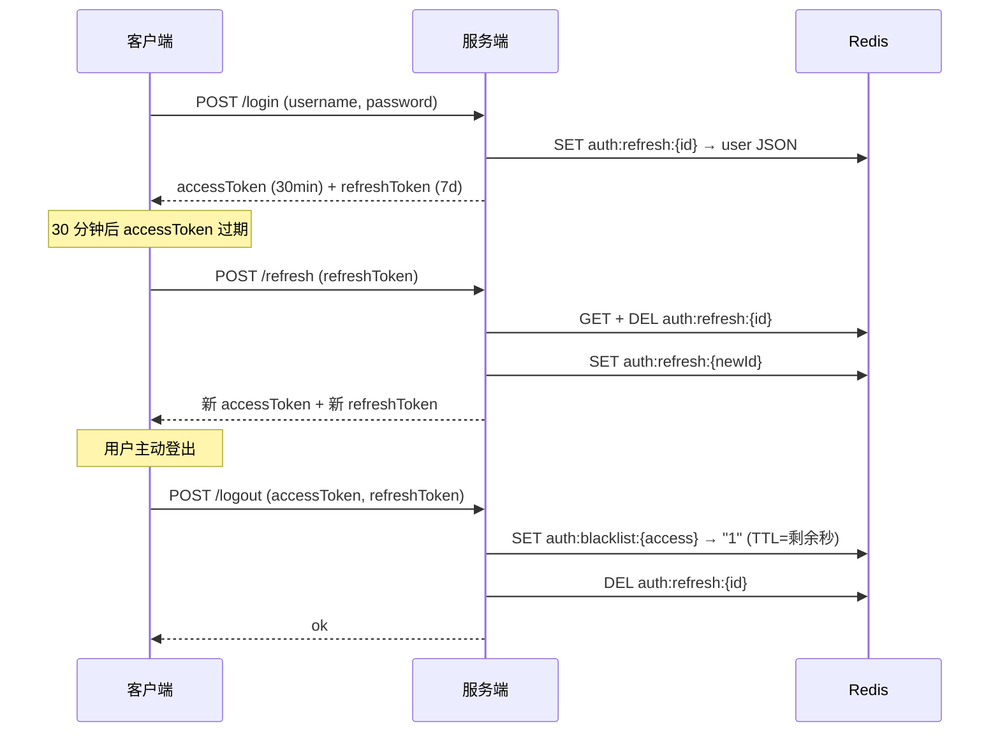

# SpringBoot JWT 刷新与黑名单

> 源码：`/Users/chenwei/Documents/code/java/learn-springboot/15-SpringBoot-jwt-refresh-blacklist`

## 核心思路

在 [[09-SpringBoot-JWT认证]] 基础上，引入 **双 Token 机制**（Access Token + Refresh Token）和 **黑名单**，解决 JWT 无法主动注销的核心痛点。

## 项目结构

```
src/main/java/com/cloud/
├── config/WebMvcConfig.java
├── controller/JwtAuthController.java
├── interceptor/JwtAuthInterceptor.java
├── service/
│   ├── TokenStateService.java              (接口)
│   ├── RedisTokenStateService.java         (Redis 实现)
│   ├── InMemoryTokenStateService.java      (内存实现)
│   └── InMemoryAuthService.java
├── util/JwtTokenService.java
├── model/
│   ├── LoginUser.java
│   └── JwtSession.java
├── common/ApiResult.java
└── exception/
    ├── UnauthenticatedException.java
    └── GlobalExceptionHandler.java
```

## 依赖与配置

| 依赖 | 说明 |
|------|------|
| `spring-boot-starter-web` | Web 框架 |
| `spring-boot-starter-data-redis` | Redis 集成 |
| `jjwt-api / jjwt-impl / jjwt-jackson` 0.11.5 | JWT 库 |

```yaml
server:
  port: 8095

jwt:
  secret: "springboot-jwt-refresh-blacklist-demo-secret-2026"
  access-expire-seconds: 1800       # 30 分钟
  refresh-expire-seconds: 604800    # 7 天

demo:
  token:
    store: redis
    refresh-prefix: "auth:refresh:"
    blacklist-prefix: "auth:blacklist:"
```

## 核心代码解析

### JwtTokenService — 双 Token 生成与解析

```java
@Component
public class JwtTokenService {
    public String generateAccessToken(LoginUser loginUser) {
        return generateToken(loginUser, "access", null, accessExpireSeconds);
    }

    public String generateRefreshToken(LoginUser loginUser, String refreshTokenId) {
        return generateToken(loginUser, "refresh", refreshTokenId, refreshExpireSeconds);
    }

    private String generateToken(LoginUser loginUser, String type, String tokenId, long expireSeconds) {
        return Jwts.builder()
            .claim("username", loginUser.getUsername())
            .claim("displayName", loginUser.getDisplayName())
            .claim("type", type)       // access / refresh
            .setId(tokenId)            // refresh token 的 jti
            .setExpiration(expireAt)
            .signWith(signingKey, SignatureAlgorithm.HS256)
            .compact();
    }
}
```

> [!important] Token 类型区分
> JWT claims 中 `type` 字段区分 access / refresh，**refresh token 不能当 access token 用**，反之亦然。

### TokenStateService — 刷新令牌存储 + 黑名单

```java
public interface TokenStateService {
    void saveRefreshToken(String refreshTokenId, LoginUser loginUser, long ttlSeconds);
    LoginUser getRefreshTokenUser(String refreshTokenId);
    void removeRefreshToken(String refreshTokenId);
    void blacklistAccessToken(String accessToken, long ttlSeconds);
    boolean isAccessTokenBlacklisted(String accessToken);
}
```

### RedisTokenStateService — Redis 实现

```java
// 刷新令牌：auth:refresh:{tokenId} → JSON(userId, displayName)，TTL = refreshExpireSeconds
// 黑名单：auth:blacklist:{accessToken} → "1"，TTL = access 剩余过期时间

public void blacklistAccessToken(String accessToken, long ttlSeconds) {
    redisTemplate.opsForValue().set(blacklistKey(accessToken), "1", ttlSeconds, TimeUnit.SECONDS);
}
```

> [!tip] 黑名单 TTL 优化
> 黑名单 key 的 TTL 设为 access token 剩余有效期，token 过期后黑名单自动清理，不浪费存储。

### JwtAuthInterceptor — 黑名单校验

```java
@Override
public boolean preHandle(HttpServletRequest request, HttpServletResponse response, Object handler) {
    String accessToken = extractBearerToken(request.getHeader("Authorization"));
    if (tokenStateService.isAccessTokenBlacklisted(accessToken)) {
        throw new UnauthenticatedException("token已失效，请重新登录");
    }
    JwtSession session = jwtTokenService.parseAccessToken(accessToken);
    request.setAttribute("loginUser", new LoginUser(session.getUsername(), session.getDisplayName()));
    request.setAttribute("accessToken", accessToken);   // 供 logout 使用
    return true;
}
```

### JwtAuthController — 登录 / 刷新 / 登出

```java
// 登录：签发双 Token
private Map<String, Object> issueTokens(LoginUser loginUser) {
    String refreshTokenId = UUID.randomUUID().toString().replace("-", "");
    String accessToken = jwtTokenService.generateAccessToken(loginUser);
    String refreshToken = jwtTokenService.generateRefreshToken(loginUser, refreshTokenId);
    tokenStateService.saveRefreshToken(refreshTokenId, loginUser, jwtTokenService.getRefreshExpireSeconds());
    // 返回 Bearer accessToken + refreshToken
}

// 刷新：旧 refresh token 一次性使用
@PostMapping("/refresh")
public ApiResult<Map<String, Object>> refresh(@RequestParam String refreshToken) {
    JwtSession session = jwtTokenService.parseRefreshToken(refreshToken);
    LoginUser storedUser = tokenStateService.getRefreshTokenUser(session.getTokenId());
    tokenStateService.removeRefreshToken(session.getTokenId());  // 一次性消费
    return ApiResult.success(issueTokens(storedUser));            // 重新签发
}

// 登出：黑名单 access + 删除 refresh
@PostMapping("/logout")
public ApiResult<String> logout(HttpServletRequest request, @RequestParam(required = false) String refreshToken) {
    // access token → blacklist (TTL = 剩余过期时间)
    // refresh token → remove
}
```

## 双 Token 认证流程



## 初学者学习路线

- 先把这个案例当成“最小可运行样例”，目标是理解 SpringBoot JWT 刷新与黑名单 的主流程。
- 先运行 README 里的启动命令和 curl，再带着现象回到代码里找入口。
- 每读一个类都问三件事：它由谁调用、它依赖谁、它改变了什么状态。
- 认证/上下文类案例要特别关注“在哪里写入、在哪里校验、在哪里清理”。

## 代码导读

下面的代码片段来自案例源码，并额外补了中文教学注释。阅读时先看注释理解职责，再回到完整源码核对细节。

### 接口入口：Controller 如何接收请求

源码位置：`src/main/java/com/cloud/controller/JwtAuthController.java`

Controller 是 HTTP 世界和 Java 代码世界之间的边界：路径、请求参数、返回值都在这里集中出现。

```java
// 文件：com/cloud/controller/JwtAuthController.java
// 学习重点：Controller 是 HTTP 世界和 Java 代码世界之间的边界：路径、请求参数、返回值都在这里集中出现。
// @RestController 表示这个类的返回值会直接写到 HTTP 响应体里，常用于 JSON API。
@RestController
// 类级别路径是这一组接口的共同前缀。
@RequestMapping("/api/jwt")
public class JwtAuthController {

    private final InMemoryAuthService authService;
    private final JwtTokenService jwtTokenService;
    private final TokenStateService tokenStateService;

    public JwtAuthController(InMemoryAuthService authService,
                             JwtTokenService jwtTokenService,
                             TokenStateService tokenStateService) {
        this.authService = authService;
        this.jwtTokenService = jwtTokenService;
        this.tokenStateService = tokenStateService;
    }

    // 方法级别映射说明具体 HTTP 动词和子路径。
    @PostMapping("/login")
    public ApiResult<Map<String, Object>> login(@RequestParam String username,
                                                 @RequestParam String password) {
        try {
            LoginUser loginUser = authService.authenticate(username, password);
            return ApiResult.success(issueTokens(loginUser));
        } catch (IllegalArgumentException ex) {
            throw new UnauthenticatedException(ex.getMessage());
        }
    }

    // 方法级别映射说明具体 HTTP 动词和子路径。
    @PostMapping("/refresh")
    public ApiResult<Map<String, Object>> refresh(@RequestParam String refreshToken) {
        JwtSession refreshSession = jwtTokenService.parseRefreshToken(refreshToken);

        LoginUser storedUser = tokenStateService.getRefreshTokenUser(refreshSession.getTokenId());
        if (storedUser == null) {
            throw new UnauthenticatedException("refresh token已失效，请重新登录");
        }
        if (!refreshSession.getUsername().equals(storedUser.getUsername())) {
            tokenStateService.removeRefreshToken(refreshSession.getTokenId());
            throw new UnauthenticatedException("refresh token无效");
        }

        tokenStateService.removeRefreshToken(refreshSession.getTokenId());
        return ApiResult.success(issueTokens(storedUser));
    }

    // 方法级别映射说明具体 HTTP 动词和子路径。
    @GetMapping("/me")
    public ApiResult<LoginUser> me(HttpServletRequest request) {
        Object value = request.getAttribute(JwtAuthInterceptor.LOGIN_USER_ATTRIBUTE);
        if (value instanceof LoginUser loginUser) {
            return ApiResult.success(loginUser);
        }
        throw new UnauthenticatedException("未登录");
    }

    // 方法级别映射说明具体 HTTP 动词和子路径。
    @PostMapping("/logout")
    public ApiResult<String> logout(HttpServletRequest request,
                                    @RequestParam(required = false) String refreshToken) {
        Object accessTokenObj = request.getAttribute(JwtAuthInterceptor.ACCESS_TOKEN_ATTRIBUTE);
        if (accessTokenObj instanceof String accessToken) {
            JwtSession accessSession = jwtTokenService.parseAccessToken(accessToken);
            long ttlSeconds = jwtTokenService.getRemainingSeconds(accessSession.getExpireAtEpochSecond());
            tokenStateService.blacklistAccessToken(accessToken, ttlSeconds);
        }

        if (refreshToken != null && !refreshToken.isBlank()) {
            try {
                JwtSession refreshSession = jwtTokenService.parseRefreshToken(refreshToken);
                tokenStateService.removeRefreshToken(refreshSession.getTokenId());
            } catch (UnauthenticatedException ignored) {
                // refresh token 本身已失效时无需额外处理
            }
        }

        return ApiResult.success("ok");
    }

    // 方法级别映射说明具体 HTTP 动词和子路径。
    @GetMapping("/public")
    public ApiResult<String> publicApi() {
        return ApiResult.success("这是一个无需登录即可访问的公共接口");
    }

    private Map<String, Object> issueTokens(LoginUser loginUser) {
        String refreshTokenId = UUID.randomUUID().toString().replace("-", "");
        String accessToken = jwtTokenService.generateAccessToken(loginUser);
        String refreshToken = jwtTokenService.generateRefreshToken(loginUser, refreshTokenId);

        tokenStateService.saveRefreshToken(
                refreshTokenId,
                loginUser,
                jwtTokenService.getRefreshExpireSeconds()
        );

        Map<String, Object> data = new LinkedHashMap<>();
        data.put("tokenType", "Bearer");
        data.put("accessToken", accessToken);
        data.put("refreshToken", refreshToken);
        data.put("accessExpireSeconds", jwtTokenService.getAccessExpireSeconds());
        data.put("refreshExpireSeconds", jwtTokenService.getRefreshExpireSeconds());
        data.put("user", loginUser);
        return data;
    }
}
```

关键点拆解：

- 先把 README 里的 curl 路径和这里的 `@RequestMapping` / `@GetMapping` / `@PostMapping` 对上。
- Controller 不应该堆复杂业务逻辑；看到它调用 Service，就说明职责分层是清楚的。
- 读完代码后，回到“生产差距”检查：安全、异常、监控、容量、测试是否都补齐。

### 业务核心：Service 如何组织规则

源码位置：`src/main/java/com/cloud/service/InMemoryTokenStateService.java`

Service 承载业务规则，初学者要重点看它如何校验输入、调用依赖、返回结果。

```java
// 文件：com/cloud/service/InMemoryTokenStateService.java
// 学习重点：Service 承载业务规则，初学者要重点看它如何校验输入、调用依赖、返回结果。
// @Service 表示这是业务层 Bean，会被 Spring 自动扫描并注入。
@Service
// 通过配置开关控制这个 Bean 或配置类是否生效。
@ConditionalOnProperty(name = "demo.token.store", havingValue = "memory")
public class InMemoryTokenStateService implements TokenStateService {

    private final Map<String, RefreshEntry> refreshStore = new ConcurrentHashMap<>();
    private final Map<String, Long> blacklistStore = new ConcurrentHashMap<>();

    @Override
    public void saveRefreshToken(String refreshTokenId, LoginUser loginUser, long ttlSeconds) {
        if (refreshTokenId == null || refreshTokenId.isBlank() || loginUser == null) {
            return;
        }
        long expireAt = Instant.now().getEpochSecond() + ttlSeconds;
        refreshStore.put(refreshTokenId, new RefreshEntry(loginUser, expireAt));
    }

    @Override
    public LoginUser getRefreshTokenUser(String refreshTokenId) {
        if (refreshTokenId == null || refreshTokenId.isBlank()) {
            return null;
        }
        RefreshEntry entry = refreshStore.get(refreshTokenId);
        if (entry == null) {
            return null;
        }
        if (Instant.now().getEpochSecond() > entry.expireAtEpochSecond()) {
            refreshStore.remove(refreshTokenId);
            return null;
        }
        return entry.loginUser();
    }

    @Override
    public void removeRefreshToken(String refreshTokenId) {
        if (refreshTokenId == null || refreshTokenId.isBlank()) {
            return;
        }
        refreshStore.remove(refreshTokenId);
    }

    @Override
    public void blacklistAccessToken(String accessToken, long ttlSeconds) {
        if (accessToken == null || accessToken.isBlank() || ttlSeconds <= 0) {
            return;
        }
        long expireAt = Instant.now().getEpochSecond() + ttlSeconds;
        blacklistStore.put(accessToken, expireAt);
    }

    @Override
    public boolean isAccessTokenBlacklisted(String accessToken) {
        if (accessToken == null || accessToken.isBlank()) {
            return false;
        }
        Long expireAt = blacklistStore.get(accessToken);
        if (expireAt == null) {
            return false;
        }
        if (Instant.now().getEpochSecond() > expireAt) {
            blacklistStore.remove(accessToken);
            return false;
        }
        return true;
    }

    private record RefreshEntry(LoginUser loginUser, long expireAtEpochSecond) {
    }
}
```

关键点拆解：

- Service 的 public 方法通常就是一个用例，例如创建、查询、刷新、投递、同步。
- 先看输入校验，再看调用了哪些依赖，最后看返回对象。
- 读完代码后，回到“生产差距”检查：安全、异常、监控、容量、测试是否都补齐。

### 业务核心：Service 如何组织规则

源码位置：`src/main/java/com/cloud/service/RedisTokenStateService.java`

Service 承载业务规则，初学者要重点看它如何校验输入、调用依赖、返回结果。

```java
// 文件：com/cloud/service/RedisTokenStateService.java
// 学习重点：Service 承载业务规则，初学者要重点看它如何校验输入、调用依赖、返回结果。
// @Service 表示这是业务层 Bean，会被 Spring 自动扫描并注入。
@Service
// 通过配置开关控制这个 Bean 或配置类是否生效。
@ConditionalOnProperty(name = "demo.token.store", havingValue = "redis", matchIfMissing = true)
public class RedisTokenStateService implements TokenStateService {

    private final StringRedisTemplate redisTemplate;
    private final ObjectMapper objectMapper;
    private final String refreshPrefix;
    private final String blacklistPrefix;

    public RedisTokenStateService(StringRedisTemplate redisTemplate,
                                  ObjectMapper objectMapper,
                                  @Value("${demo.token.refresh-prefix:auth:refresh:}") String refreshPrefix,
                                  @Value("${demo.token.blacklist-prefix:auth:blacklist:}") String blacklistPrefix) {
        this.redisTemplate = redisTemplate;
        this.objectMapper = objectMapper;
        this.refreshPrefix = refreshPrefix;
        this.blacklistPrefix = blacklistPrefix;
    }

    @Override
    public void saveRefreshToken(String refreshTokenId, LoginUser loginUser, long ttlSeconds) {
        if (refreshTokenId == null || refreshTokenId.isBlank() || loginUser == null || ttlSeconds <= 0) {
            return;
        }
        try {
            Map<String, String> payload = new LinkedHashMap<>();
            payload.put("username", loginUser.getUsername());
            payload.put("displayName", loginUser.getDisplayName());
            redisTemplate.opsForValue().set(
                    refreshKey(refreshTokenId),
                    objectMapper.writeValueAsString(payload),
                    ttlSeconds,
                    TimeUnit.SECONDS
            );
        } catch (Exception ex) {
            throw new IllegalStateException("refresh token存储失败", ex);
        }
    }

    @Override
    public LoginUser getRefreshTokenUser(String refreshTokenId) {
        if (refreshTokenId == null || refreshTokenId.isBlank()) {
            return null;
        }
        String value = redisTemplate.opsForValue().get(refreshKey(refreshTokenId));
        if (value == null || value.isBlank()) {
            return null;
        }
        try {
            JsonNode jsonNode = objectMapper.readTree(value);
            String username = jsonNode.path("username").asText(null);
            String displayName = jsonNode.path("displayName").asText(null);
            if (username == null || displayName == null) {
                removeRefreshToken(refreshTokenId);
                return null;
            }
            return new LoginUser(username, displayName);
        } catch (Exception ex) {
            removeRefreshToken(refreshTokenId);
            return null;
        }
    }

    @Override
    public void removeRefreshToken(String refreshTokenId) {
        if (refreshTokenId == null || refreshTokenId.isBlank()) {
            return;
        }
        redisTemplate.delete(refreshKey(refreshTokenId));
    }

    @Override
    public void blacklistAccessToken(String accessToken, long ttlSeconds) {
        if (accessToken == null || accessToken.isBlank() || ttlSeconds <= 0) {
            return;
        }
        redisTemplate.opsForValue().set(
                blacklistKey(accessToken),
                "1",
                ttlSeconds,
                TimeUnit.SECONDS
        );
    }

    @Override
    public boolean isAccessTokenBlacklisted(String accessToken) {
        if (accessToken == null || accessToken.isBlank()) {
            return false;
        }
        String value = redisTemplate.opsForValue().get(blacklistKey(accessToken));
        return value != null;
    }

    private String refreshKey(String refreshTokenId) {
        return refreshPrefix + refreshTokenId;
    }

    private String blacklistKey(String accessToken) {
        return blacklistPrefix + accessToken;
    }
}
```

关键点拆解：

- Service 的 public 方法通常就是一个用例，例如创建、查询、刷新、投递、同步。
- 先看输入校验，再看调用了哪些依赖，最后看返回对象。
- 读完代码后，回到“生产差距”检查：安全、异常、监控、容量、测试是否都补齐。

### 业务核心：Service 如何组织规则

源码位置：`src/main/java/com/cloud/service/TokenStateService.java`

Service 承载业务规则，初学者要重点看它如何校验输入、调用依赖、返回结果。

```java
// 文件：com/cloud/service/TokenStateService.java
// 学习重点：Service 承载业务规则，初学者要重点看它如何校验输入、调用依赖、返回结果。
public interface TokenStateService {

    void saveRefreshToken(String refreshTokenId, LoginUser loginUser, long ttlSeconds);

    LoginUser getRefreshTokenUser(String refreshTokenId);

    void removeRefreshToken(String refreshTokenId);

    void blacklistAccessToken(String accessToken, long ttlSeconds);

    boolean isAccessTokenBlacklisted(String accessToken);
}
```

关键点拆解：

- Service 的 public 方法通常就是一个用例，例如创建、查询、刷新、投递、同步。
- 先看输入校验，再看调用了哪些依赖，最后看返回对象。
- 读完代码后，回到“生产差距”检查：安全、异常、监控、容量、测试是否都补齐。

## 运行时调用链

- 从 README 的接口或测试名称开始，先定位入口类。
- 找 Controller、Runner、Listener 或 AutoConfiguration 作为第一阅读点。
- 沿着构造器注入的依赖继续进入 Service、Repository 或扩展点类。

## 初学者常见误区

- 只把接口跑通，却没有回到代码理解 Controller、Service、Repository 的分工。
- 把内存 Map、模拟客户端、固定配置当成生产实现。
- 只看 happy path，忽略参数错误、外部系统失败、并发和重复请求。

## API 接口

| 方法 | 路径 | 需登录 | 说明 |
|------|------|--------|------|
| POST | `/api/jwt/login` | 否 | 登录，签发双 Token |
| POST | `/api/jwt/refresh` | 否 | 刷新 Token（一次性） |
| GET | `/api/jwt/me` | 是 | 当前用户 |
| POST | `/api/jwt/logout` | 是 | 登出（黑名单 + 删除 refresh） |
| GET | `/api/jwt/public` | 否 | 公开接口 |

## 生产差距

这个示例适合帮助初学者理解 JWT 刷新与黑名单 的核心机制，但生产项目不能只停留在“能跑通”。真实落地时至少要补齐：统一鉴权、参数边界校验、异常响应、结构化日志、监控指标、自动化测试、配置隔离和容量评估。

如果模块涉及数据库、缓存、消息、网关、认证或外部服务，还要进一步考虑连接池、超时、重试、幂等、事务边界、数据一致性和故障告警。学习时可以先记住主流程，再用这些生产差距反向检查自己是否真正理解了案例。

## 要点总结

1. **双 Token 机制**：Access Token 短期（30min），Refresh Token 长期（7d），减少用户重新登录频率
2. **Refresh Token 一次性消费**：刷新后旧 token 立即删除，防止重放攻击
3. **黑名单方案**：登出时将 access token 加入黑名单（TTL = 剩余有效期），弥补 JWT 无法主动注销的缺陷
4. **Token 类型校验**：`type: access/refresh`，防止用 refresh token 调业务接口
5. **Redis Key 设计**：`auth:refresh:{id}` + `auth:blacklist:{token}`，prefix 可配置
