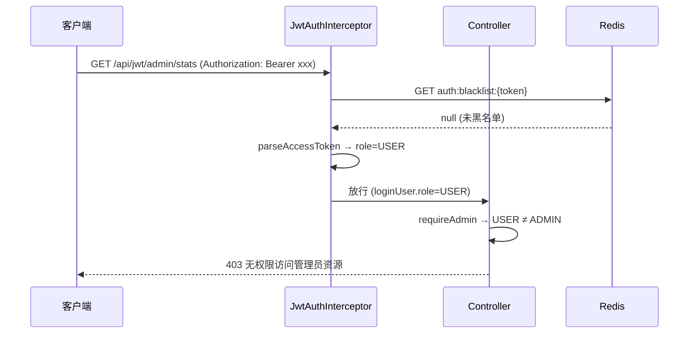

# SpringBoot JWT RBAC 权限控制

> 源码：`/Users/chenwei/Documents/code/java/learn-springboot/16-SpringBoot-jwt-rbac-authz`

## 核心思路

在 [[15-SpringBoot-JWT刷新与黑名单]] 的双 Token 机制上，JWT claims 新增 `role` 字段，实现基于角色的访问控制（RBAC）。拦截器负责**认证**，Controller 层负责**授权**。

## 项目结构

```
src/main/java/com/cloud/
├── config/WebMvcConfig.java
├── controller/JwtAuthController.java       (含角色校验)
├── interceptor/JwtAuthInterceptor.java     (仅认证)
├── service/
│   ├── TokenStateService.java
│   ├── RedisTokenStateService.java
│   ├── InMemoryTokenStateService.java
│   └── InMemoryAuthService.java            (admin/USER 双角色)
├── util/JwtTokenService.java               (role claim)
├── model/
│   ├── LoginUser.java                      (新增 role 字段)
│   └── JwtSession.java                     (新增 role 字段)
├── common/ApiResult.java
└── exception/
    ├── UnauthenticatedException.java       (401)
    ├── ForbiddenException.java             (403)
    └── GlobalExceptionHandler.java
```

## 依赖与配置

| 依赖 | 说明 |
|------|------|
| `spring-boot-starter-web` | Web 框架 |
| `spring-boot-starter-data-redis` | Redis 集成 |
| `jjwt` 0.11.5 | JWT 库 |

```yaml
server:
  port: 8096

jwt:
  secret: "springboot-jwt-rbac-authz-demo-secret-2026"
  access-expire-seconds: 1800
  refresh-expire-seconds: 604800

demo:
  token:
    store: redis
    refresh-prefix: "auth:refresh:"
    blacklist-prefix: "auth:blacklist:"
```

## 核心代码解析

### LoginUser — 新增 role 字段

```java
public class LoginUser {
    private final String username;
    private final String displayName;
    private final String role;        // ADMIN / USER
}
```

### JwtTokenService — JWT 携带 role

```java
return Jwts.builder()
    .claim("username", loginUser.getUsername())
    .claim("displayName", loginUser.getDisplayName())
    .claim("role", loginUser.getRole())       // 新增
    .claim("type", type)
    .setId(tokenId)
    .setExpiration(expireAt)
    .signWith(signingKey, SignatureAlgorithm.HS256)
    .compact();
```

### InMemoryAuthService — 双角色用户

```java
private final Map<String, String> passwords = Map.of("admin", "123456", "user", "123456");
private final Map<String, String> roles = Map.of("admin", "ADMIN", "user", "USER");
```

### JwtAuthInterceptor — 认证（不含授权）

```java
JwtSession session = jwtTokenService.parseAccessToken(accessToken);
request.setAttribute("loginUser",
    new LoginUser(session.getUsername(), session.getDisplayName(), session.getRole()));
```

> [!important] 认证与授权分离
> 拦截器只做 Token 解析和黑名单检查，角色校验交给 Controller。好处是权限逻辑更灵活，可精确到方法级别。

### JwtAuthController — 角色校验

```java
@GetMapping("/user/profile")
public ApiResult<Map<String, Object>> userProfile(HttpServletRequest request) {
    LoginUser loginUser = requiredLoginUser(request);
    requireUserOrAdmin(loginUser);   // USER 或 ADMIN
    // ...
}

@GetMapping("/admin/stats")
public ApiResult<Map<String, Object>> adminStats(HttpServletRequest request) {
    LoginUser loginUser = requiredLoginUser(request);
    requireAdmin(loginUser);         // 仅 ADMIN
    // ...
}

private void requireAdmin(LoginUser loginUser) {
    if (!"ADMIN".equals(loginUser.getRole())) {
        throw new ForbiddenException("无权限访问管理员资源");
    }
}
```

### ForbiddenException + GlobalExceptionHandler

```java
public class ForbiddenException extends RuntimeException { ... }

@ExceptionHandler(ForbiddenException.class)
@ResponseStatus(HttpStatus.FORBIDDEN)
public ApiResult<Void> handleForbiddenException(ForbiddenException ex) {
    return ApiResult.fail(403, ex.getMessage());
}
```

## RBAC 认证授权流程



## 角色与接口权限表

| 接口 | ADMIN | USER | 未登录 |
|------|-------|------|--------|
| `/api/jwt/public` | 可访问 | 可访问 | 可访问 |
| `/api/jwt/login` | 可访问 | 可访问 | 可访问 |
| `/api/jwt/refresh` | 可访问 | 可访问 | 可访问 |
| `/api/jwt/me` | 可访问 | 可访问 | 需登录 |
| `/api/jwt/user/profile` | 可访问 | 可访问 | 需登录 |
| `/api/jwt/admin/stats` | 可访问 | 403 | 需登录 |
| `/api/jwt/logout` | 可访问 | 可访问 | 需登录 |

## API 接口

| 方法 | 路径 | 需登录 | 角色 | 说明 |
|------|------|--------|------|------|
| POST | `/api/jwt/login` | 否 | - | 登录，签发双 Token |
| POST | `/api/jwt/refresh` | 否 | - | 刷新 Token |
| GET | `/api/jwt/me` | 是 | USER/ADMIN | 当前用户 |
| GET | `/api/jwt/user/profile` | 是 | USER/ADMIN | 用户中心 |
| GET | `/api/jwt/admin/stats` | 是 | ADMIN | 管理员统计 |
| POST | `/api/jwt/logout` | 是 | USER/ADMIN | 登出 |
| GET | `/api/jwt/public` | 否 | - | 公开接口 |

## 要点总结

1. **JWT claims 携带 role**：角色信息嵌入 Token，无需每次查库，但角色变更需等 Token 刷新后生效
2. **认证与授权分离**：拦截器做认证，Controller 做授权，职责清晰
3. **ForbiddenException (403)**：与 UnauthenticatedException (401) 区分，前者"已登录但无权限"，后者"未登录"
4. **与 [[15-SpringBoot-JWT刷新与黑名单]] 的演进**：在双 Token 基础上新增 role 字段和授权逻辑
5. **生产建议**：角色变更时应将旧 access token 加入黑名单，强制重新登录
