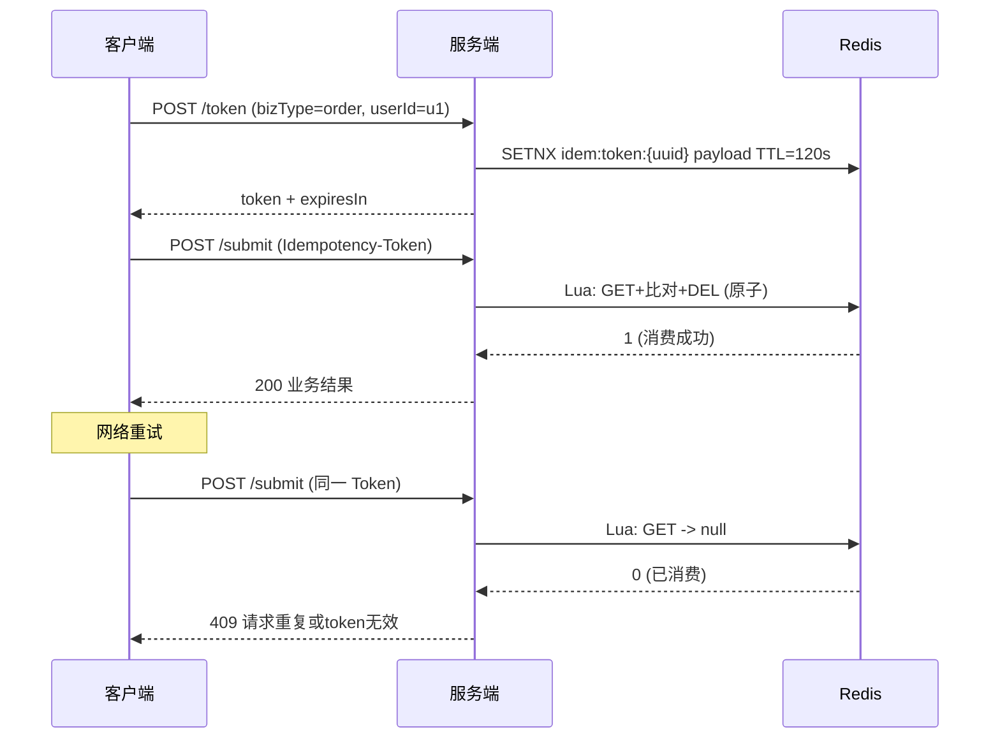

# SpringBoot 接口幂等性

> 源码：`/Users/chenwei/Documents/code/java/learn-springboot/18-SpringBoot-idempotency`

## 核心思路

基于 **Token 机制**实现接口幂等性：客户端先获取幂等 Token，提交时携带 Token，服务端**原子消费**该 Token，重复请求因 Token 已被消费而被拒绝。

## 项目结构

```
src/main/java/com/cloud/
├── controller/IdempotencyDemoController.java
├── service/
│   ├── IdempotencyTokenService.java           (接口)
│   ├── RedisIdempotencyTokenService.java      (Redis + Lua)
│   └── InMemoryIdempotencyTokenService.java   (内存)
├── exception/
│   ├── IdempotencyException.java
│   └── GlobalExceptionHandler.java
└── common/ApiResult.java
```

## 依赖与配置

| 依赖 | 说明 |
|------|------|
| `spring-boot-starter-web` | Web 框架 |
| `spring-boot-starter-data-redis` | Redis 集成 |

```yaml
server:
  port: 8098

demo:
  idempotency:
    store: redis
    redis-prefix: "idem:token:"
```

## 核心代码解析

### IdempotencyTokenService 接口

```java
public interface IdempotencyTokenService {
    String createToken(String bizType, String userId, long ttlSeconds);
    boolean consumeToken(String token, String bizType, String userId);
}
```

### RedisIdempotencyTokenService — Redis + Lua 原子消费

```java
public String createToken(String bizType, String userId, long ttlSeconds) {
    String payload = bizType + ":" + userId;
    for (int i = 0; i < 3; i++) {
        String token = UUID.randomUUID().toString().replace("-", "");
        Boolean ok = redisTemplate.opsForValue()
            .setIfAbsent(key(token), payload, ttlSeconds, TimeUnit.SECONDS);
        if (Boolean.TRUE.equals(ok)) return token;
    }
    throw new IllegalStateException("生成幂等token失败");
}
```

Lua 脚本消费 Token（原子操作）：

```lua
local val = redis.call('GET', KEYS[1])
if not val then return 0 end
if val ~= ARGV[1] then return 0 end
redis.call('DEL', KEYS[1])
return 1
```

> [!important] 为什么用 Lua 脚本？
> GET + DEL 非原子操作，并发场景下可能出现两个请求都通过了 GET 检查。Lua 脚本在 Redis 中原子执行，保证 Token 只被消费一次。

> [!tip] Token 生成冲突处理
> `setIfAbsent` (SETNX) 保证 key 唯一，UUID 冲突概率极低但仍做 3 次重试。

### InMemoryIdempotencyTokenService — 内存实现

```java
public boolean consumeToken(String token, String bizType, String userId) {
    TokenMeta meta = tokenStore.get(token);
    if (meta == null) return false;
    // 检查过期 + bizType/userId 匹配
    return tokenStore.remove(token, meta);   // ConcurrentHashMap.remove(key, value) 原子
}
```

### IdempotencyDemoController — 业务接口

```java
@PostMapping("/token")
public ApiResult<Map<String, Object>> token(@RequestParam String bizType,
                                             @RequestParam String userId) {
    String token = tokenService.createToken(bizType, userId, 120);
}

@PostMapping("/submit")
public ApiResult<Map<String, Object>> submit(
        @RequestHeader("Idempotency-Token") String token,
        @RequestParam String bizType, @RequestParam String userId) {
    boolean consumed = tokenService.consumeToken(token, bizType, userId);
    if (!consumed) throw new IdempotencyException("请求重复或token无效");
}
```

## 幂等性流程



## Redis vs InMemory 实现

| 维度 | Redis | InMemory |
|------|-------|----------|
| 原子性 | Lua 脚本 | `ConcurrentHashMap.remove(k,v)` |
| 分布式 | 支持 | 不支持 |
| TTL 管理 | Redis 原生 | 手动检查 expireAt |
| 适用场景 | 生产 | 测试 |

## 初学者学习路线

- 先把这个案例当成“最小可运行样例”，目标是理解 SpringBoot 接口幂等性 的主流程。
- 先运行 README 里的启动命令和 curl，再带着现象回到代码里找入口。
- 每读一个类都问三件事：它由谁调用、它依赖谁、它改变了什么状态。

## 代码导读

下面的代码片段来自案例源码，并额外补了中文教学注释。阅读时先看注释理解职责，再回到完整源码核对细节。

### 业务核心：Service 如何组织规则

源码位置：`src/main/java/com/cloud/service/IdempotencyTokenService.java`

Service 承载业务规则，初学者要重点看它如何校验输入、调用依赖、返回结果。

```java
// 文件：com/cloud/service/IdempotencyTokenService.java
// 学习重点：Service 承载业务规则，初学者要重点看它如何校验输入、调用依赖、返回结果。
public interface IdempotencyTokenService {

    String createToken(String bizType, String userId, long ttlSeconds);

    boolean consumeToken(String token, String bizType, String userId);
}
```

关键点拆解：

- Service 的 public 方法通常就是一个用例，例如创建、查询、刷新、投递、同步。
- 先看输入校验，再看调用了哪些依赖，最后看返回对象。
- 读完代码后，回到“生产差距”检查：安全、异常、监控、容量、测试是否都补齐。

### 业务核心：Service 如何组织规则

源码位置：`src/main/java/com/cloud/service/InMemoryIdempotencyTokenService.java`

Service 承载业务规则，初学者要重点看它如何校验输入、调用依赖、返回结果。

```java
// 文件：com/cloud/service/InMemoryIdempotencyTokenService.java
// 学习重点：Service 承载业务规则，初学者要重点看它如何校验输入、调用依赖、返回结果。
// @Service 表示这是业务层 Bean，会被 Spring 自动扫描并注入。
@Service
// 通过配置开关控制这个 Bean 或配置类是否生效。
@ConditionalOnProperty(name = "demo.idempotency.store", havingValue = "memory")
public class InMemoryIdempotencyTokenService implements IdempotencyTokenService {

    private final Map<String, TokenMeta> tokenStore = new ConcurrentHashMap<>();

    @Override
    public String createToken(String bizType, String userId, long ttlSeconds) {
        validateArgs(bizType, userId, ttlSeconds);

        String token = UUID.randomUUID().toString().replace("-", "");
        long expireAtEpochSecond = Instant.now().getEpochSecond() + ttlSeconds;
        tokenStore.put(token, new TokenMeta(bizType, userId, expireAtEpochSecond));
        return token;
    }

    @Override
    public boolean consumeToken(String token, String bizType, String userId) {
        validateConsumeArgs(token, bizType, userId);

        TokenMeta meta = tokenStore.get(token);
        if (meta == null) {
            return false;
        }

        long now = Instant.now().getEpochSecond();
        if (now >= meta.expireAtEpochSecond) {
            tokenStore.remove(token, meta);
            return false;
        }

        if (!meta.bizType.equals(bizType) || !meta.userId.equals(userId)) {
            return false;
        }

        return tokenStore.remove(token, meta);
    }

    private void validateArgs(String bizType, String userId, long ttlSeconds) {
        if (bizType == null || bizType.isBlank() || userId == null || userId.isBlank()) {
            throw new IllegalArgumentException("bizType和userId不能为空");
        }
        if (ttlSeconds <= 0) {
            throw new IllegalArgumentException("ttlSeconds必须大于0");
        }
    }

    private void validateConsumeArgs(String token, String bizType, String userId) {
        if (token == null || token.isBlank()) {
            throw new IllegalArgumentException("Idempotency-Token不能为空");
        }
        if (bizType == null || bizType.isBlank() || userId == null || userId.isBlank()) {
            throw new IllegalArgumentException("bizType和userId不能为空");
        }
    }

    private static class TokenMeta {
        private final String bizType;
        private final String userId;
        private final long expireAtEpochSecond;

        private TokenMeta(String bizType, String userId, long expireAtEpochSecond) {
            this.bizType = bizType;
            this.userId = userId;
            this.expireAtEpochSecond = expireAtEpochSecond;
        }
    }
}
```

关键点拆解：

- Service 的 public 方法通常就是一个用例，例如创建、查询、刷新、投递、同步。
- 先看输入校验，再看调用了哪些依赖，最后看返回对象。
- 读完代码后，回到“生产差距”检查：安全、异常、监控、容量、测试是否都补齐。

### 业务核心：Service 如何组织规则

源码位置：`src/main/java/com/cloud/service/RedisIdempotencyTokenService.java`

Service 承载业务规则，初学者要重点看它如何校验输入、调用依赖、返回结果。

```java
// 文件：com/cloud/service/RedisIdempotencyTokenService.java
// 学习重点：Service 承载业务规则，初学者要重点看它如何校验输入、调用依赖、返回结果。
// @Service 表示这是业务层 Bean，会被 Spring 自动扫描并注入。
@Service
// 通过配置开关控制这个 Bean 或配置类是否生效。
@ConditionalOnProperty(name = "demo.idempotency.store", havingValue = "redis", matchIfMissing = true)
public class RedisIdempotencyTokenService implements IdempotencyTokenService {

    private static final DefaultRedisScript<Long> CONSUME_SCRIPT = new DefaultRedisScript<>(
            "local val = redis.call('GET', KEYS[1]);" +
                    "if not val then return 0; end;" +
                    "if val ~= ARGV[1] then return 0; end;" +
                    "redis.call('DEL', KEYS[1]);" +
                    "return 1;",
            Long.class
    );

    private final StringRedisTemplate redisTemplate;
    private final String prefix;

    public RedisIdempotencyTokenService(StringRedisTemplate redisTemplate,
                                        @Value("${demo.idempotency.redis-prefix:idem:token:}") String prefix) {
        this.redisTemplate = redisTemplate;
        this.prefix = prefix;
    }

    @Override
    public String createToken(String bizType, String userId, long ttlSeconds) {
        validateArgs(bizType, userId, ttlSeconds);

        String payload = payload(bizType, userId);
        for (int i = 0; i < 3; i++) {
            String token = UUID.randomUUID().toString().replace("-", "");
            String key = redisKey(token);
            Boolean ok = redisTemplate.opsForValue().setIfAbsent(key, payload, ttlSeconds, TimeUnit.SECONDS);
            if (Boolean.TRUE.equals(ok)) {
                return token;
            }
        }
        throw new IllegalStateException("生成幂等token失败");
    }

    @Override
    public boolean consumeToken(String token, String bizType, String userId) {
        validateConsumeArgs(token, bizType, userId);

        String key = redisKey(token);
        Long result = redisTemplate.execute(CONSUME_SCRIPT, Collections.singletonList(key), payload(bizType, userId));
        return result != null && result == 1L;
    }

    private String redisKey(String token) {
        return prefix + token;
    }

    private String payload(String bizType, String userId) {
        return bizType + ":" + userId;
    }

    private void validateArgs(String bizType, String userId, long ttlSeconds) {
        if (bizType == null || bizType.isBlank() || userId == null || userId.isBlank()) {
            throw new IllegalArgumentException("bizType和userId不能为空");
        }
        if (ttlSeconds <= 0) {
            throw new IllegalArgumentException("ttlSeconds必须大于0");
        }
    }

    private void validateConsumeArgs(String token, String bizType, String userId) {
        if (token == null || token.isBlank()) {
            throw new IllegalArgumentException("Idempotency-Token不能为空");
        }
        if (bizType == null || bizType.isBlank() || userId == null || userId.isBlank()) {
            throw new IllegalArgumentException("bizType和userId不能为空");
        }
    }
}
```

关键点拆解：

- Service 的 public 方法通常就是一个用例，例如创建、查询、刷新、投递、同步。
- 先看输入校验，再看调用了哪些依赖，最后看返回对象。
- 读完代码后，回到“生产差距”检查：安全、异常、监控、容量、测试是否都补齐。

### 接口入口：Controller 如何接收请求

源码位置：`src/main/java/com/cloud/controller/IdempotencyDemoController.java`

Controller 是 HTTP 世界和 Java 代码世界之间的边界：路径、请求参数、返回值都在这里集中出现。

```java
// 文件：com/cloud/controller/IdempotencyDemoController.java
// 学习重点：Controller 是 HTTP 世界和 Java 代码世界之间的边界：路径、请求参数、返回值都在这里集中出现。
// @RestController 表示这个类的返回值会直接写到 HTTP 响应体里，常用于 JSON API。
@RestController
// 类级别路径是这一组接口的共同前缀。
@RequestMapping("/api/idempotency")
public class IdempotencyDemoController {

    private static final long TOKEN_TTL_SECONDS = 120;

    private final IdempotencyTokenService tokenService;

    // 构造器注入：依赖从 Spring 容器传入，代码更容易测试，也避免隐藏依赖。
    public IdempotencyDemoController(IdempotencyTokenService tokenService) {
        this.tokenService = tokenService;
    }

    // 方法级别映射说明具体 HTTP 动词和子路径。
    @PostMapping("/token")
    public ApiResult<Map<String, Object>> token(@RequestParam String bizType,
                                                 @RequestParam String userId) {
        String token = tokenService.createToken(bizType, userId, TOKEN_TTL_SECONDS);

        Map<String, Object> data = new LinkedHashMap<>();
        data.put("token", token);
        data.put("bizType", bizType);
        data.put("userId", userId);
        data.put("expiresIn", TOKEN_TTL_SECONDS);
        return ApiResult.success(data);
    }

    // 方法级别映射说明具体 HTTP 动词和子路径。
    @PostMapping("/submit")
    public ApiResult<Map<String, Object>> submit(@RequestHeader("Idempotency-Token") String token,
                                                  @RequestParam String bizType,
                                                  @RequestParam String userId) {
        boolean consumed = tokenService.consumeToken(token, bizType, userId);
        if (!consumed) {
            throw new IdempotencyException("请求重复或token无效");
        }

        Map<String, Object> data = new LinkedHashMap<>();
        data.put("orderNo", "ORD-" + System.currentTimeMillis());
        data.put("status", "CREATED");
        return ApiResult.success(data);
    }
}
```

关键点拆解：

- 先把 README 里的 curl 路径和这里的 `@RequestMapping` / `@GetMapping` / `@PostMapping` 对上。
- Controller 不应该堆复杂业务逻辑；看到它调用 Service，就说明职责分层是清楚的。
- 读完代码后，回到“生产差距”检查：安全、异常、监控、容量、测试是否都补齐。

## 运行时调用链

- 从 README 的接口或测试名称开始，先定位入口类。
- 找 Controller、Runner、Listener 或 AutoConfiguration 作为第一阅读点。
- 沿着构造器注入的依赖继续进入 Service、Repository 或扩展点类。

## 初学者常见误区

- 只把接口跑通，却没有回到代码理解 Controller、Service、Repository 的分工。
- 把内存 Map、模拟客户端、固定配置当成生产实现。
- 只看 happy path，忽略参数错误、外部系统失败、并发和重复请求。
- 忽略幂等、重试、超时和补偿，导致失败后状态不一致。

## API 接口

| 方法 | 路径 | 说明 |
|------|------|------|
| POST | `/api/idempotency/token` | 获取幂等 Token |
| POST | `/api/idempotency/submit` | 提交业务（需 `Idempotency-Token` Header） |

## 幂等性常见方案对比

| 方案 | 原理 | 优点 | 缺点 |
|------|------|------|------|
| **Token 机制** | 先取 Token，提交时消费 | 简单通用 | 多一次请求 |
| 数据库唯一索引 | 业务字段唯一约束 | 强一致 | 依赖数据库 |
| 状态机 | 订单状态流转控制 | 语义明确 | 仅限状态类 |
| 乐观锁 | version 字段 | 并发友好 | 需改表结构 |

## 生产差距

这个示例适合帮助初学者理解 接口幂等性 的核心机制，但生产项目不能只停留在“能跑通”。真实落地时至少要补齐：统一鉴权、参数边界校验、异常响应、结构化日志、监控指标、自动化测试、配置隔离和容量评估。

如果模块涉及数据库、缓存、消息、网关、认证或外部服务，还要进一步考虑连接池、超时、重试、幂等、事务边界、数据一致性和故障告警。学习时可以先记住主流程，再用这些生产差距反向检查自己是否真正理解了案例。

## 要点总结

1. **Token 机制**：先获取、后消费、消费即失效，保证同一请求只执行一次
2. **Lua 脚本保证原子性**：GET + 比对 + DEL 在 Redis 中原子执行，杜绝并发重复消费
3. **Token 绑定业务**：payload 包含 bizType + userId，防止 Token 被跨业务滥用
4. **HTTP 状态码 409 Conflict**：幂等校验失败返回 409，与 400/401 区分
5. **与 [[18-SpringBoot-接口幂等性]] 的关系**：本模块是 Token 幂等方案的完整实现
