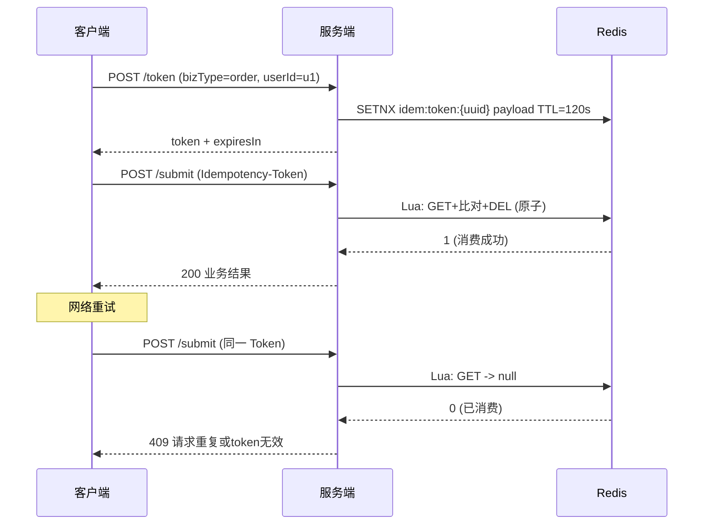

# SpringBoot 接口幂等性

> 源码：`/Users/chenwei/Documents/code/java/learn-springboot/18-SpringBoot-idempotency`

## 核心思路

基于 **Token 机制**实现接口幂等性：客户端先获取幂等 Token，提交时携带 Token，服务端**原子消费**该 Token，重复请求因 Token 已被消费而被拒绝。

## 项目结构

```
src/main/java/com/cloud/
├── controller/IdempotencyDemoController.java
├── service/
│   ├── IdempotencyTokenService.java           (接口)
│   ├── RedisIdempotencyTokenService.java      (Redis + Lua)
│   └── InMemoryIdempotencyTokenService.java   (内存)
├── exception/
│   ├── IdempotencyException.java
│   └── GlobalExceptionHandler.java
└── common/ApiResult.java
```

## 依赖与配置

| 依赖 | 说明 |
|------|------|
| `spring-boot-starter-web` | Web 框架 |
| `spring-boot-starter-data-redis` | Redis 集成 |

```yaml
server:
  port: 8098

demo:
  idempotency:
    store: redis
    redis-prefix: "idem:token:"
```

## 核心代码解析

### IdempotencyTokenService 接口

```java
public interface IdempotencyTokenService {
    String createToken(String bizType, String userId, long ttlSeconds);
    boolean consumeToken(String token, String bizType, String userId);
}
```

### RedisIdempotencyTokenService — Redis + Lua 原子消费

```java
public String createToken(String bizType, String userId, long ttlSeconds) {
    String payload = bizType + ":" + userId;
    for (int i = 0; i < 3; i++) {
        String token = UUID.randomUUID().toString().replace("-", "");
        Boolean ok = redisTemplate.opsForValue()
            .setIfAbsent(key(token), payload, ttlSeconds, TimeUnit.SECONDS);
        if (Boolean.TRUE.equals(ok)) return token;
    }
    throw new IllegalStateException("生成幂等token失败");
}
```

Lua 脚本消费 Token（原子操作）：

```lua
local val = redis.call('GET', KEYS[1])
if not val then return 0 end
if val ~= ARGV[1] then return 0 end
redis.call('DEL', KEYS[1])
return 1
```

> [!important] 为什么用 Lua 脚本？
> GET + DEL 非原子操作，并发场景下可能出现两个请求都通过了 GET 检查。Lua 脚本在 Redis 中原子执行，保证 Token 只被消费一次。

> [!tip] Token 生成冲突处理
> `setIfAbsent` (SETNX) 保证 key 唯一，UUID 冲突概率极低但仍做 3 次重试。

### InMemoryIdempotencyTokenService — 内存实现

```java
public boolean consumeToken(String token, String bizType, String userId) {
    TokenMeta meta = tokenStore.get(token);
    if (meta == null) return false;
    // 检查过期 + bizType/userId 匹配
    return tokenStore.remove(token, meta);   // ConcurrentHashMap.remove(key, value) 原子
}
```

### IdempotencyDemoController — 业务接口

```java
@PostMapping("/token")
public ApiResult<Map<String, Object>> token(@RequestParam String bizType,
                                             @RequestParam String userId) {
    String token = tokenService.createToken(bizType, userId, 120);
}

@PostMapping("/submit")
public ApiResult<Map<String, Object>> submit(
        @RequestHeader("Idempotency-Token") String token,
        @RequestParam String bizType, @RequestParam String userId) {
    boolean consumed = tokenService.consumeToken(token, bizType, userId);
    if (!consumed) throw new IdempotencyException("请求重复或token无效");
}
```

## 幂等性流程



## Redis vs InMemory 实现

| 维度 | Redis | InMemory |
|------|-------|----------|
| 原子性 | Lua 脚本 | `ConcurrentHashMap.remove(k,v)` |
| 分布式 | 支持 | 不支持 |
| TTL 管理 | Redis 原生 | 手动检查 expireAt |
| 适用场景 | 生产 | 测试 |

## API 接口

| 方法 | 路径 | 说明 |
|------|------|------|
| POST | `/api/idempotency/token` | 获取幂等 Token |
| POST | `/api/idempotency/submit` | 提交业务（需 `Idempotency-Token` Header） |

## 幂等性常见方案对比

| 方案 | 原理 | 优点 | 缺点 |
|------|------|------|------|
| **Token 机制** | 先取 Token，提交时消费 | 简单通用 | 多一次请求 |
| 数据库唯一索引 | 业务字段唯一约束 | 强一致 | 依赖数据库 |
| 状态机 | 订单状态流转控制 | 语义明确 | 仅限状态类 |
| 乐观锁 | version 字段 | 并发友好 | 需改表结构 |

## 要点总结

1. **Token 机制**：先获取、后消费、消费即失效，保证同一请求只执行一次
2. **Lua 脚本保证原子性**：GET + 比对 + DEL 在 Redis 中原子执行，杜绝并发重复消费
3. **Token 绑定业务**：payload 包含 bizType + userId，防止 Token 被跨业务滥用
4. **HTTP 状态码 409 Conflict**：幂等校验失败返回 409，与 400/401 区分
5. **与 [[18-SpringBoot-接口幂等性]] 的关系**：本模块是 Token 幂等方案的完整实现
