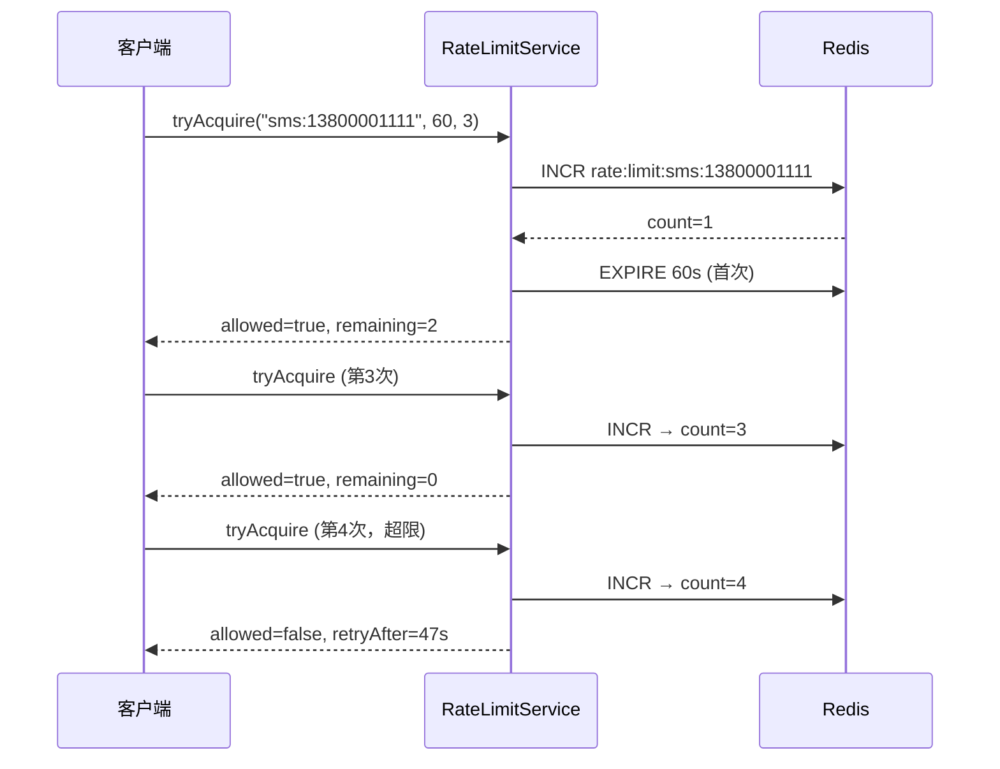

# SpringBoot 接口限流

> 源码：`/Users/chenwei/Documents/code/java/learn-springboot/19-SpringBoot-rate-limit`

## 核心思路

基于**固定窗口计数器**实现接口限流，支持 Redis（生产）和 InMemory（测试）两种存储。通过 key + 窗口时长 + 最大请求数三个参数控制访问频率。

## 项目结构

```
src/main/java/com/cloud/
├── controller/RateLimitDemoController.java
├── service/
│   ├── RateLimitService.java              (接口)
│   ├── RedisRateLimitService.java         (Redis 实现)
│   ├── InMemoryRateLimitService.java      (内存实现)
│   └── RateLimitResult.java              (结果 record)
├── exception/
│   ├── RateLimitExceededException.java
│   └── GlobalExceptionHandler.java
└── common/ApiResult.java
```

## 依赖与配置

| 依赖 | 说明 |
|------|------|
| `spring-boot-starter-web` | Web 框架 |
| `spring-boot-starter-data-redis` | Redis 集成 |

```yaml
server:
  port: 8097

demo:
  rate-limit:
    store: redis
    redis-prefix: "rate:limit:"
```

## 核心代码解析

### RateLimitService 接口

```java
public interface RateLimitService {
    RateLimitResult tryAcquire(String key, long windowSeconds, long maxRequests);
}
```

### RateLimitResult — 限流结果

```java
public record RateLimitResult(boolean allowed, long remaining, long retryAfterSeconds) {}
```

### RedisRateLimitService — 固定窗口计数器

```java
@Override
public RateLimitResult tryAcquire(String key, long windowSeconds, long maxRequests) {
    String redisKey = prefix + key;
    Long count = redisTemplate.opsForValue().increment(redisKey);  // 计数 +1

    if (count == 1L) {
        redisTemplate.expire(redisKey, windowSeconds, TimeUnit.SECONDS);  // 首次设置窗口
    }

    Long ttl = redisTemplate.getExpire(redisKey, TimeUnit.SECONDS);
    long retryAfter = ttl == null || ttl < 0 ? windowSeconds : ttl;

    if (count > maxRequests) {
        return new RateLimitResult(false, 0, retryAfter);   // 超限
    }
    return new RateLimitResult(true, maxRequests - count, retryAfter);  // 放行
}
```

> [!warning] 固定窗口的临界问题
> 在窗口切换时刻（如 0:59 → 1:00），可能出现瞬间 2 倍流量。生产环境建议使用滑动窗口或令牌桶。

### InMemoryRateLimitService — 内存实现

```java
@Override
public synchronized RateLimitResult tryAcquire(String key, long windowSeconds, long maxRequests) {
    Counter counter = counters.get(key);
    if (counter == null || now >= counter.expireAtEpochSecond) {
        counter = new Counter(0, now + windowSeconds);   // 窗口过期则重置
    }
    if (counter.count >= maxRequests) {
        return new RateLimitResult(false, 0, retryAfter);
    }
    counter.count++;
    return new RateLimitResult(true, maxRequests - counter.count, retryAfter);
}
```

### RateLimitDemoController — 限流业务

```java
@PostMapping("/send-code")
public ApiResult<Map<String, Object>> sendCode(@RequestParam String mobile) {
    RateLimitResult result = rateLimitService.tryAcquire("sms:" + mobile, 60, 3);
    ensureAllowed(result, "短信发送过于频繁");
    // ... 发送短信
}

@PostMapping("/comment")
public ApiResult<Map<String, Object>> comment(@RequestParam String articleId,
                                               @RequestParam String userId) {
    RateLimitResult result = rateLimitService.tryAcquire(
        "comment:" + articleId + ":" + userId, 60, 5);
    ensureAllowed(result, "评论过于频繁");
}
```

## 限流流程



## 常见限流算法对比

| 算法 | 原理 | 优点 | 缺点 |
|------|------|------|------|
| **固定窗口** | 按时间窗口计数 | 实现简单 | 临界突增 |
| 滑动窗口 | 细粒度时间片 | 平滑 | 实现复杂 |
| 令牌桶 | 固定速率补充令牌 | 允许突发 | 需维护令牌数 |
| 漏桶 | 固定速率流出 | 流量均匀 | 不允许突发 |

## API 接口

| 方法 | 路径 | 限流规则 | 说明 |
|------|------|----------|------|
| GET | `/api/rate-limit/public` | 无 | 公开接口 |
| POST | `/api/rate-limit/send-code` | 60s/手机号/3次 | 短信验证码 |
| POST | `/api/rate-limit/comment` | 60s/文章+用户/5次 | 评论 |

## 要点总结

1. **固定窗口计数器**：最简单的限流算法，`INCR` + `EXPIRE` 即可实现
2. **Redis INCR 原子性**：单线程模型保证计数准确，无需 Lua
3. **限流 key 设计**：`业务:维度`（如 `sms:手机号`、`comment:文章:用户`），粒度可灵活控制
4. **HTTP 429 Too Many Requests**：限流异常专用状态码，返回 `retryAfterSeconds` 告知客户端
5. **临界问题**：固定窗口在窗口边界可能出现 2 倍流量，生产建议滑动窗口或令牌桶
