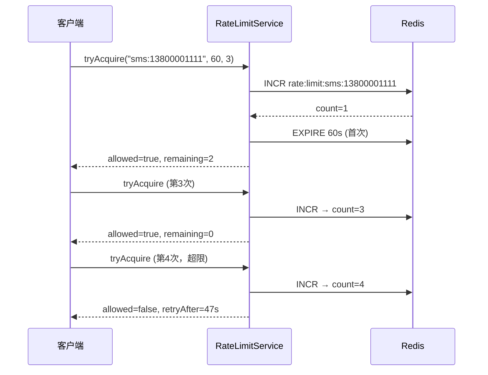

# SpringBoot 接口限流

> 源码：`/Users/chenwei/Documents/code/java/learn-springboot/19-SpringBoot-rate-limit`

## 核心思路

基于**固定窗口计数器**实现接口限流，支持 Redis（生产）和 InMemory（测试）两种存储。通过 key + 窗口时长 + 最大请求数三个参数控制访问频率。

## 项目结构

```
src/main/java/com/cloud/
├── controller/RateLimitDemoController.java
├── service/
│   ├── RateLimitService.java              (接口)
│   ├── RedisRateLimitService.java         (Redis 实现)
│   ├── InMemoryRateLimitService.java      (内存实现)
│   └── RateLimitResult.java              (结果 record)
├── exception/
│   ├── RateLimitExceededException.java
│   └── GlobalExceptionHandler.java
└── common/ApiResult.java
```

## 依赖与配置

| 依赖 | 说明 |
|------|------|
| `spring-boot-starter-web` | Web 框架 |
| `spring-boot-starter-data-redis` | Redis 集成 |

```yaml
server:
  port: 8097

demo:
  rate-limit:
    store: redis
    redis-prefix: "rate:limit:"
```

## 核心代码解析

### RateLimitService 接口

```java
public interface RateLimitService {
    RateLimitResult tryAcquire(String key, long windowSeconds, long maxRequests);
}
```

### RateLimitResult — 限流结果

```java
public record RateLimitResult(boolean allowed, long remaining, long retryAfterSeconds) {}
```

### RedisRateLimitService — 固定窗口计数器

```java
@Override
public RateLimitResult tryAcquire(String key, long windowSeconds, long maxRequests) {
    String redisKey = prefix + key;
    Long count = redisTemplate.opsForValue().increment(redisKey);  // 计数 +1

    if (count == 1L) {
        redisTemplate.expire(redisKey, windowSeconds, TimeUnit.SECONDS);  // 首次设置窗口
    }

    Long ttl = redisTemplate.getExpire(redisKey, TimeUnit.SECONDS);
    long retryAfter = ttl == null || ttl < 0 ? windowSeconds : ttl;

    if (count > maxRequests) {
        return new RateLimitResult(false, 0, retryAfter);   // 超限
    }
    return new RateLimitResult(true, maxRequests - count, retryAfter);  // 放行
}
```

> [!warning] 固定窗口的临界问题
> 在窗口切换时刻（如 0:59 → 1:00），可能出现瞬间 2 倍流量。生产环境建议使用滑动窗口或令牌桶。

### InMemoryRateLimitService — 内存实现

```java
@Override
public synchronized RateLimitResult tryAcquire(String key, long windowSeconds, long maxRequests) {
    Counter counter = counters.get(key);
    if (counter == null || now >= counter.expireAtEpochSecond) {
        counter = new Counter(0, now + windowSeconds);   // 窗口过期则重置
    }
    if (counter.count >= maxRequests) {
        return new RateLimitResult(false, 0, retryAfter);
    }
    counter.count++;
    return new RateLimitResult(true, maxRequests - counter.count, retryAfter);
}
```

### RateLimitDemoController — 限流业务

```java
@PostMapping("/send-code")
public ApiResult<Map<String, Object>> sendCode(@RequestParam String mobile) {
    RateLimitResult result = rateLimitService.tryAcquire("sms:" + mobile, 60, 3);
    ensureAllowed(result, "短信发送过于频繁");
    // ... 发送短信
}

@PostMapping("/comment")
public ApiResult<Map<String, Object>> comment(@RequestParam String articleId,
                                               @RequestParam String userId) {
    RateLimitResult result = rateLimitService.tryAcquire(
        "comment:" + articleId + ":" + userId, 60, 5);
    ensureAllowed(result, "评论过于频繁");
}
```

## 限流流程



## 常见限流算法对比

| 算法 | 原理 | 优点 | 缺点 |
|------|------|------|------|
| **固定窗口** | 按时间窗口计数 | 实现简单 | 临界突增 |
| 滑动窗口 | 细粒度时间片 | 平滑 | 实现复杂 |
| 令牌桶 | 固定速率补充令牌 | 允许突发 | 需维护令牌数 |
| 漏桶 | 固定速率流出 | 流量均匀 | 不允许突发 |

## 初学者学习路线

- 先把这个案例当成“最小可运行样例”，目标是理解 SpringBoot 接口限流 的主流程。
- 先运行 README 里的启动命令和 curl，再带着现象回到代码里找入口。
- 每读一个类都问三件事：它由谁调用、它依赖谁、它改变了什么状态。

## 代码导读

下面的代码片段来自案例源码，并额外补了中文教学注释。阅读时先看注释理解职责，再回到完整源码核对细节。

### 接口入口：Controller 如何接收请求

源码位置：`src/main/java/com/cloud/controller/RateLimitDemoController.java`

Controller 是 HTTP 世界和 Java 代码世界之间的边界：路径、请求参数、返回值都在这里集中出现。

```java
// 文件：com/cloud/controller/RateLimitDemoController.java
// 学习重点：Controller 是 HTTP 世界和 Java 代码世界之间的边界：路径、请求参数、返回值都在这里集中出现。
// @RestController 表示这个类的返回值会直接写到 HTTP 响应体里，常用于 JSON API。
@RestController
// 类级别路径是这一组接口的共同前缀。
@RequestMapping("/api/rate-limit")
public class RateLimitDemoController {

    private final RateLimitService rateLimitService;

    // 构造器注入：依赖从 Spring 容器传入，代码更容易测试，也避免隐藏依赖。
    public RateLimitDemoController(RateLimitService rateLimitService) {
        this.rateLimitService = rateLimitService;
    }

    // 方法级别映射说明具体 HTTP 动词和子路径。
    @GetMapping("/public")
    public ApiResult<String> publicApi() {
        return ApiResult.success("这是一个不做限流的公共接口");
    }

    // 方法级别映射说明具体 HTTP 动词和子路径。
    @PostMapping("/send-code")
    public ApiResult<Map<String, Object>> sendCode(@RequestParam String mobile) {
        RateLimitResult result = rateLimitService.tryAcquire("sms:" + mobile, 60, 3);
        ensureAllowed(result, "短信发送过于频繁");

        Map<String, Object> data = new LinkedHashMap<>();
        data.put("mobile", mobile);
        data.put("remaining", result.remaining());
        data.put("windowSeconds", result.retryAfterSeconds());
        return ApiResult.success(data);
    }

    // 方法级别映射说明具体 HTTP 动词和子路径。
    @PostMapping("/comment")
    public ApiResult<Map<String, Object>> comment(@RequestParam String articleId,
                                                   @RequestParam String userId) {
        String key = "comment:" + articleId + ":" + userId;
        RateLimitResult result = rateLimitService.tryAcquire(key, 60, 5);
        ensureAllowed(result, "评论过于频繁");

        Map<String, Object> data = new LinkedHashMap<>();
        data.put("articleId", articleId);
        data.put("userId", userId);
        data.put("remaining", result.remaining());
        return ApiResult.success(data);
    }

    private void ensureAllowed(RateLimitResult result, String message) {
        if (result.allowed()) {
            return;
        }
        throw new RateLimitExceededException(message + "，请" + result.retryAfterSeconds() + "秒后重试");
    }
}
```

关键点拆解：

- 先把 README 里的 curl 路径和这里的 `@RequestMapping` / `@GetMapping` / `@PostMapping` 对上。
- Controller 不应该堆复杂业务逻辑；看到它调用 Service，就说明职责分层是清楚的。
- 读完代码后，回到“生产差距”检查：安全、异常、监控、容量、测试是否都补齐。

### 业务核心：Service 如何组织规则

源码位置：`src/main/java/com/cloud/service/InMemoryRateLimitService.java`

Service 承载业务规则，初学者要重点看它如何校验输入、调用依赖、返回结果。

```java
// 文件：com/cloud/service/InMemoryRateLimitService.java
// 学习重点：Service 承载业务规则，初学者要重点看它如何校验输入、调用依赖、返回结果。
// @Service 表示这是业务层 Bean，会被 Spring 自动扫描并注入。
@Service
// 通过配置开关控制这个 Bean 或配置类是否生效。
@ConditionalOnProperty(name = "demo.rate-limit.store", havingValue = "memory")
public class InMemoryRateLimitService implements RateLimitService {

    private final Map<String, Counter> counters = new ConcurrentHashMap<>();

    @Override
    public synchronized RateLimitResult tryAcquire(String key, long windowSeconds, long maxRequests) {
        validateArgs(key, windowSeconds, maxRequests);

        long now = Instant.now().getEpochSecond();
        Counter counter = counters.get(key);
        if (counter == null || now >= counter.expireAtEpochSecond) {
            counter = new Counter(0, now + windowSeconds);
        }

        if (counter.count >= maxRequests) {
            long retryAfter = Math.max(counter.expireAtEpochSecond - now, 0L);
            counters.put(key, counter);
            return new RateLimitResult(false, 0, retryAfter);
        }

        counter.count++;
        counters.put(key, counter);

        long remaining = Math.max(maxRequests - counter.count, 0L);
        long retryAfter = Math.max(counter.expireAtEpochSecond - now, 0L);
        return new RateLimitResult(true, remaining, retryAfter);
    }

    private void validateArgs(String key, long windowSeconds, long maxRequests) {
        if (key == null || key.isBlank()) {
            throw new IllegalArgumentException("限流key不能为空");
        }
        if (windowSeconds <= 0 || maxRequests <= 0) {
            throw new IllegalArgumentException("限流参数非法");
        }
    }

    private static class Counter {
        private long count;
        private final long expireAtEpochSecond;

        private Counter(long count, long expireAtEpochSecond) {
            this.count = count;
            this.expireAtEpochSecond = expireAtEpochSecond;
        }
    }
}
```

关键点拆解：

- Service 的 public 方法通常就是一个用例，例如创建、查询、刷新、投递、同步。
- 先看输入校验，再看调用了哪些依赖，最后看返回对象。
- 读完代码后，回到“生产差距”检查：安全、异常、监控、容量、测试是否都补齐。

### 业务核心：Service 如何组织规则

源码位置：`src/main/java/com/cloud/service/RateLimitService.java`

Service 承载业务规则，初学者要重点看它如何校验输入、调用依赖、返回结果。

```java
// 文件：com/cloud/service/RateLimitService.java
// 学习重点：Service 承载业务规则，初学者要重点看它如何校验输入、调用依赖、返回结果。
public interface RateLimitService {

    RateLimitResult tryAcquire(String key, long windowSeconds, long maxRequests);
}
```

关键点拆解：

- Service 的 public 方法通常就是一个用例，例如创建、查询、刷新、投递、同步。
- 先看输入校验，再看调用了哪些依赖，最后看返回对象。
- 读完代码后，回到“生产差距”检查：安全、异常、监控、容量、测试是否都补齐。

### 业务核心：Service 如何组织规则

源码位置：`src/main/java/com/cloud/service/RedisRateLimitService.java`

Service 承载业务规则，初学者要重点看它如何校验输入、调用依赖、返回结果。

```java
// 文件：com/cloud/service/RedisRateLimitService.java
// 学习重点：Service 承载业务规则，初学者要重点看它如何校验输入、调用依赖、返回结果。
// @Service 表示这是业务层 Bean，会被 Spring 自动扫描并注入。
@Service
// 通过配置开关控制这个 Bean 或配置类是否生效。
@ConditionalOnProperty(name = "demo.rate-limit.store", havingValue = "redis", matchIfMissing = true)
public class RedisRateLimitService implements RateLimitService {

    private final StringRedisTemplate redisTemplate;
    private final String prefix;

    public RedisRateLimitService(StringRedisTemplate redisTemplate,
                                 @Value("${demo.rate-limit.redis-prefix:rate:limit:}") String prefix) {
        this.redisTemplate = redisTemplate;
        this.prefix = prefix;
    }

    @Override
    public RateLimitResult tryAcquire(String key, long windowSeconds, long maxRequests) {
        validateArgs(key, windowSeconds, maxRequests);

        String redisKey = prefix + key;
        Long count = redisTemplate.opsForValue().increment(redisKey);
        if (count == null) {
            throw new IllegalStateException("限流计数失败");
        }

        if (count == 1L) {
            redisTemplate.expire(redisKey, windowSeconds, TimeUnit.SECONDS);
        }

        Long ttl = redisTemplate.getExpire(redisKey, TimeUnit.SECONDS);
        long retryAfter = ttl == null || ttl < 0 ? windowSeconds : ttl;

        if (count > maxRequests) {
            return new RateLimitResult(false, 0, retryAfter);
        }

        long remaining = Math.max(maxRequests - count, 0L);
        return new RateLimitResult(true, remaining, retryAfter);
    }

    private void validateArgs(String key, long windowSeconds, long maxRequests) {
        if (key == null || key.isBlank()) {
            throw new IllegalArgumentException("限流key不能为空");
        }
        if (windowSeconds <= 0 || maxRequests <= 0) {
            throw new IllegalArgumentException("限流参数非法");
        }
    }
}
```

关键点拆解：

- Service 的 public 方法通常就是一个用例，例如创建、查询、刷新、投递、同步。
- 先看输入校验，再看调用了哪些依赖，最后看返回对象。
- 读完代码后，回到“生产差距”检查：安全、异常、监控、容量、测试是否都补齐。

## 运行时调用链

- 从 README 的接口或测试名称开始，先定位入口类。
- 找 Controller、Runner、Listener 或 AutoConfiguration 作为第一阅读点。
- 沿着构造器注入的依赖继续进入 Service、Repository 或扩展点类。

## 初学者常见误区

- 只把接口跑通，却没有回到代码理解 Controller、Service、Repository 的分工。
- 把内存 Map、模拟客户端、固定配置当成生产实现。
- 只看 happy path，忽略参数错误、外部系统失败、并发和重复请求。

## API 接口

| 方法 | 路径 | 限流规则 | 说明 |
|------|------|----------|------|
| GET | `/api/rate-limit/public` | 无 | 公开接口 |
| POST | `/api/rate-limit/send-code` | 60s/手机号/3次 | 短信验证码 |
| POST | `/api/rate-limit/comment` | 60s/文章+用户/5次 | 评论 |

## 生产差距

这个示例适合帮助初学者理解 接口限流 的核心机制，但生产项目不能只停留在“能跑通”。真实落地时至少要补齐：统一鉴权、参数边界校验、异常响应、结构化日志、监控指标、自动化测试、配置隔离和容量评估。

如果模块涉及数据库、缓存、消息、网关、认证或外部服务，还要进一步考虑连接池、超时、重试、幂等、事务边界、数据一致性和故障告警。学习时可以先记住主流程，再用这些生产差距反向检查自己是否真正理解了案例。

## 要点总结

1. **固定窗口计数器**：最简单的限流算法，`INCR` + `EXPIRE` 即可实现
2. **Redis INCR 原子性**：单线程模型保证计数准确，无需 Lua
3. **限流 key 设计**：`业务:维度`（如 `sms:手机号`、`comment:文章:用户`），粒度可灵活控制
4. **HTTP 429 Too Many Requests**：限流异常专用状态码，返回 `retryAfterSeconds` 告知客户端
5. **临界问题**：固定窗口在窗口边界可能出现 2 倍流量，生产建议滑动窗口或令牌桶
