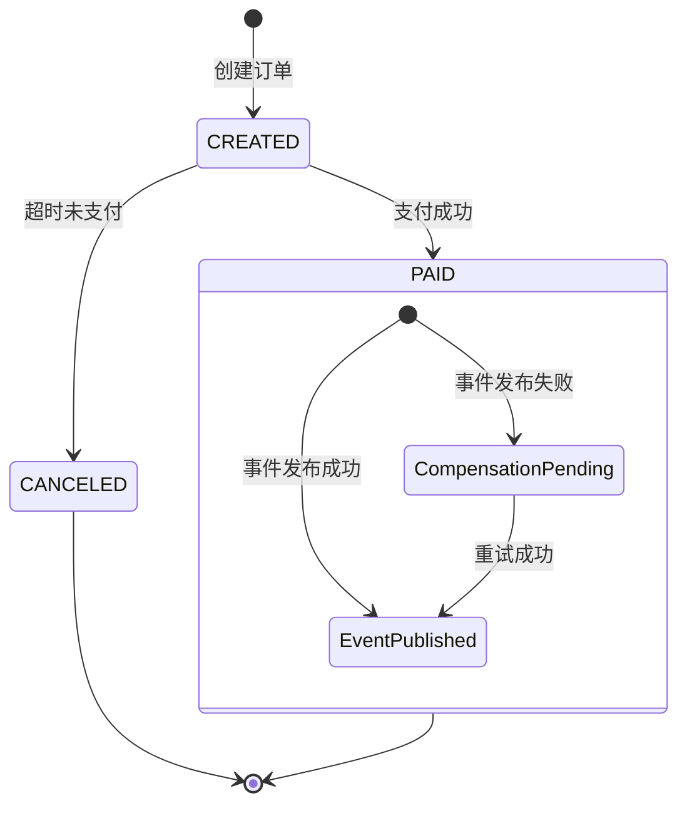

# SpringBoot 订单创建与支付

> 源码：`/Users/chenwei/Documents/code/java/learn-springboot/20-SpringBoot-order-create-pay`

## 核心思路

实现订单生命周期管理：创建 → 支付 → 超时取消，并引入**补偿机制**处理支付成功后事件发布失败的场景。通过 `@Scheduled` 定时任务自动取消超时未支付订单。

## 项目结构

```
src/main/java/com/cloud/
├── controller/OrderController.java
├── service/
│   ├── OrderService.java                 (核心业务)
│   ├── CompensationService.java          (补偿事件管理)
│   ├── OrderEventPublisher.java          (事件发布接口)
│   └── LoggingOrderEventPublisher.java   (日志实现)
├── model/
│   ├── Order.java
│   ├── OrderStatus.java
│   └── CompensationEvent.java
├── common/ApiResult.java
└── exception/GlobalExceptionHandler.java
```

## 依赖与配置

| 依赖 | 说明 |
|------|------|
| `spring-boot-starter-web` | Web 框架 |

```yaml
server:
  port: 8100

demo:
  order:
    pay-timeout-seconds: 30
    timeout-check-interval-ms: 5000
```

## 核心代码解析

### OrderStatus — 订单状态枚举

```
CREATED → PAID
CREATED → CANCELED (超时)
```

### OrderService — 核心业务

```java
public synchronized Order createOrder(String userId, BigDecimal amount) {
    Order order = new Order();
    order.setOrderNo(generateOrderNo(now));
    order.setStatus(OrderStatus.CREATED);
    order.setExpireAt(now.plus(payTimeout));     // 设置过期时间
    orders.put(order.getOrderNo(), order);
    return order;
}

public synchronized PayOrderResult payOrder(String orderNo, String paymentNo) {
    Order order = getOrder(orderNo);
    // 状态检查：已支付 → 幂等返回；已取消 → 抛异常
    // 超时检查：超时 → 取消并抛异常
    order.setStatus(OrderStatus.PAID);
    order.setPaymentNo(paymentNo);

    try {
        orderEventPublisher.publishOrderPaid(orderNo);   // 发布事件
    } catch (Exception ex) {
        compensationService.recordOrderPaidEvent(orderNo, paymentNo);  // 补偿
        compensationPending = true;
    }
    return new PayOrderResult(order, compensationPending);
}

@Scheduled(fixedDelayString = "${demo.order.timeout-check-interval-ms:5000}")
public void scheduledCancelTimeoutOrders() {
    cancelTimeoutOrders();   // 定时扫描超时订单
}
```

> [!important] 补偿机制
> 支付成功后，如果事件发布失败（如下游服务不可用），将事件记录到 `CompensationService`，后续可手动/定时重试，保证最终一致性。

### CompensationService — 补偿事件管理

```java
public void recordOrderPaidEvent(String orderNo, String paymentNo) {
    CompensationEvent event = new CompensationEvent(eventId, "order.paid", orderNo, paymentNo, now);
    pendingEvents.put(orderNo, event);
}

public int retry(OrderEventPublisher publisher) {
    for (CompensationEvent event : snapshot) {
        try {
            publisher.publishOrderPaid(event.getOrderNo());
            pendingEvents.remove(event.getOrderNo());
            success++;
        } catch (Exception ex) {
            event.increaseRetryCount();
            event.setLastError(ex.getMessage());
        }
    }
}
```

## 订单生命周期



## 初学者学习路线

- 先把这个案例当成“最小可运行样例”，目标是理解 SpringBoot 订单创建与支付 的主流程。
- 先运行 README 里的启动命令和 curl，再带着现象回到代码里找入口。
- 每读一个类都问三件事：它由谁调用、它依赖谁、它改变了什么状态。

## 代码导读

下面的代码片段来自案例源码，并额外补了中文教学注释。阅读时先看注释理解职责，再回到完整源码核对细节。

### 接口入口：Controller 如何接收请求

源码位置：`src/main/java/com/cloud/controller/OrderController.java`

Controller 是 HTTP 世界和 Java 代码世界之间的边界：路径、请求参数、返回值都在这里集中出现。

```java
// 文件：com/cloud/controller/OrderController.java
// 学习重点：Controller 是 HTTP 世界和 Java 代码世界之间的边界：路径、请求参数、返回值都在这里集中出现。
// @RestController 表示这个类的返回值会直接写到 HTTP 响应体里，常用于 JSON API。
@RestController
// 类级别路径是这一组接口的共同前缀。
@RequestMapping("/api/order")
public class OrderController {

    private final OrderService orderService;

    // 构造器注入：依赖从 Spring 容器传入，代码更容易测试，也避免隐藏依赖。
    public OrderController(OrderService orderService) {
        this.orderService = orderService;
    }

    // 方法级别映射说明具体 HTTP 动词和子路径。
    @PostMapping("/create")
    public ApiResult<Map<String, Object>> create(@RequestParam String userId,
                                                 @RequestParam BigDecimal amount) {
        Order order = orderService.createOrder(userId, amount);
        return ApiResult.success(toOrderData(order));
    }

    // 方法级别映射说明具体 HTTP 动词和子路径。
    @PostMapping("/pay")
    public ApiResult<Map<String, Object>> pay(@RequestParam String orderNo,
                                              @RequestParam String paymentNo) {
        OrderService.PayOrderResult result = orderService.payOrder(orderNo, paymentNo);

        Map<String, Object> data = toOrderData(result.order());
        data.put("compensationPending", result.compensationPending());
        return ApiResult.success(data);
    }

    // 方法级别映射说明具体 HTTP 动词和子路径。
    @GetMapping("/{orderNo}")
    public ApiResult<Map<String, Object>> get(@PathVariable String orderNo) {
        Order order = orderService.getOrder(orderNo);
        return ApiResult.success(toOrderData(order));
    }

    // 方法级别映射说明具体 HTTP 动词和子路径。
    @PostMapping("/maintenance/timeout-cancel")
    public ApiResult<Map<String, Object>> timeoutCancel() {
        int canceledCount = orderService.cancelTimeoutOrders();
        Map<String, Object> data = new LinkedHashMap<>();
        data.put("canceledCount", canceledCount);
        return ApiResult.success(data);
    }

    // 方法级别映射说明具体 HTTP 动词和子路径。
    @PostMapping("/maintenance/compensation/retry")
    public ApiResult<Map<String, Object>> retryCompensation() {
        int successCount = orderService.retryCompensationEvents();
        Map<String, Object> data = new LinkedHashMap<>();
        data.put("successCount", successCount);
        data.put("pendingCount", orderService.getPendingCompensationCount());
        return ApiResult.success(data);
    }

    // 方法级别映射说明具体 HTTP 动词和子路径。
    @GetMapping("/maintenance/compensation/pending")
    public ApiResult<Map<String, Object>> pendingCompensation() {
        List<CompensationEvent> events = orderService.listPendingCompensationEvents();
        Map<String, Object> data = new LinkedHashMap<>();
        data.put("count", events.size());
        data.put("events", events);
        return ApiResult.success(data);
    }

    private Map<String, Object> toOrderData(Order order) {
        Map<String, Object> data = new LinkedHashMap<>();
        data.put("orderNo", order.getOrderNo());
        data.put("userId", order.getUserId());
        data.put("amount", order.getAmount());
        data.put("status", order.getStatus().name());
        data.put("createdAt", order.getCreatedAt());
        data.put("expireAt", order.getExpireAt());
        data.put("paidAt", order.getPaidAt());
        data.put("paymentNo", order.getPaymentNo());
        data.put("canceledAt", order.getCanceledAt());
        data.put("cancelReason", order.getCancelReason());
        return data;
    }
}
```

关键点拆解：

- 先把 README 里的 curl 路径和这里的 `@RequestMapping` / `@GetMapping` / `@PostMapping` 对上。
- Controller 不应该堆复杂业务逻辑；看到它调用 Service，就说明职责分层是清楚的。
- 读完代码后，回到“生产差距”检查：安全、异常、监控、容量、测试是否都补齐。

### 业务核心：Service 如何组织规则

源码位置：`src/main/java/com/cloud/service/CompensationService.java`

Service 承载业务规则，初学者要重点看它如何校验输入、调用依赖、返回结果。

```java
// 文件：com/cloud/service/CompensationService.java
// 学习重点：Service 承载业务规则，初学者要重点看它如何校验输入、调用依赖、返回结果。
// @Service 表示这是业务层 Bean，会被 Spring 自动扫描并注入。
@Service
public class CompensationService {

    private final Clock clock;
    private final Map<String, CompensationEvent> pendingEvents = new ConcurrentHashMap<>();

    // 构造器注入：依赖从 Spring 容器传入，代码更容易测试，也避免隐藏依赖。
    public CompensationService() {
        this(Clock.systemDefaultZone());
    }

    CompensationService(Clock clock) {
        this.clock = clock;
    }

    public void recordOrderPaidEvent(String orderNo, String paymentNo) {
        String eventId = "EVT-" + UUID.randomUUID().toString().replace("-", "");
        CompensationEvent event = new CompensationEvent(
                eventId,
                "order.paid",
                orderNo,
                paymentNo,
                Instant.now(clock)
        );
        pendingEvents.put(orderNo, event);
    }

    public int retry(OrderEventPublisher publisher) {
        List<CompensationEvent> snapshot = new ArrayList<>(pendingEvents.values());
        int success = 0;
        for (CompensationEvent event : snapshot) {
            try {
                publisher.publishOrderPaid(event.getOrderNo());
                pendingEvents.remove(event.getOrderNo());
                success++;
            } catch (Exception ex) {
                event.increaseRetryCount();
                event.setLastError(ex.getMessage());
            }
        }
        return success;
    }

    public int pendingCount() {
        return pendingEvents.size();
    }

    public boolean hasPending(String orderNo) {
        return pendingEvents.containsKey(orderNo);
    }

    public List<CompensationEvent> listPendingEvents() {
        List<CompensationEvent> events = new ArrayList<>(pendingEvents.values());
        events.sort(Comparator.comparing(CompensationEvent::getCreatedAt));
        return events;
    }
}
```

关键点拆解：

- Service 的 public 方法通常就是一个用例，例如创建、查询、刷新、投递、同步。
- 先看输入校验，再看调用了哪些依赖，最后看返回对象。
- 读完代码后，回到“生产差距”检查：安全、异常、监控、容量、测试是否都补齐。

### 业务核心：Service 如何组织规则

源码位置：`src/main/java/com/cloud/service/OrderService.java`

Service 承载业务规则，初学者要重点看它如何校验输入、调用依赖、返回结果。

```java
// 文件：com/cloud/service/OrderService.java
// 学习重点：Service 承载业务规则，初学者要重点看它如何校验输入、调用依赖、返回结果。
// @Service 表示这是业务层 Bean，会被 Spring 自动扫描并注入。
@Service
public class OrderService {

    private final Map<String, Order> orders = new ConcurrentHashMap<>();
    private final AtomicLong sequence = new AtomicLong(1000);
    private final OrderEventPublisher orderEventPublisher;
    private final CompensationService compensationService;
    private final Clock clock;
    private final Duration payTimeout;

    @Autowired
    public OrderService(OrderEventPublisher orderEventPublisher,
                        CompensationService compensationService,
                        @Value("${demo.order.pay-timeout-seconds:30}") long payTimeoutSeconds) {
        this(orderEventPublisher, compensationService, Clock.systemDefaultZone(), Duration.ofSeconds(payTimeoutSeconds));
    }

    OrderService(OrderEventPublisher orderEventPublisher,
                 CompensationService compensationService,
                 Clock clock,
                 Duration payTimeout) {
        this.orderEventPublisher = orderEventPublisher;
        this.compensationService = compensationService;
        this.clock = clock;
        this.payTimeout = payTimeout;
    }

    public synchronized Order createOrder(String userId, BigDecimal amount) {
        if (userId == null || userId.isBlank()) {
            throw new IllegalArgumentException("userId不能为空");
        }
        if (amount == null || amount.compareTo(BigDecimal.ZERO) <= 0) {
            throw new IllegalArgumentException("amount必须大于0");
        }

        Instant now = Instant.now(clock);
        Order order = new Order();
        order.setOrderNo(generateOrderNo(now));
        order.setUserId(userId);
        order.setAmount(amount);
        order.setStatus(OrderStatus.CREATED);
        order.setCreatedAt(now);
        order.setExpireAt(now.plus(payTimeout));
        orders.put(order.getOrderNo(), order);
        return order;
    }

    public synchronized PayOrderResult payOrder(String orderNo, String paymentNo) {
        if (paymentNo == null || paymentNo.isBlank()) {
            throw new IllegalArgumentException("paymentNo不能为空");
        }

        Order order = getOrder(orderNo);
        if (order.getStatus() == OrderStatus.PAID) {
            return new PayOrderResult(order, compensationService.hasPending(orderNo));
        }
        if (order.getStatus() == OrderStatus.CANCELED) {
            throw new IllegalStateException("订单已取消，不能支付");
        }

        if (isTimeout(order, Instant.now(clock))) {
            cancelByTimeout(order);
            throw new IllegalStateException("订单已超时取消，不能支付");
        }

        order.setStatus(OrderStatus.PAID);
        order.setPaidAt(Instant.now(clock));
        order.setPaymentNo(paymentNo);

        boolean compensationPending = false;
        try {
            orderEventPublisher.publishOrderPaid(orderNo);
        } catch (Exception ex) {
            compensationService.recordOrderPaidEvent(orderNo, paymentNo);
            compensationPending = true;
        }
        return new PayOrderResult(order, compensationPending);
    }

    public synchronized int cancelTimeoutOrders() {
        Instant now = Instant.now(clock);
        int canceledCount = 0;
        for (Order order : orders.values()) {
            if (order.getStatus() != OrderStatus.CREATED) {
                continue;
            }
            if (!isTimeout(order, now)) {
                continue;
            }
            cancelByTimeout(order);
            canceledCount++;
        }
        return canceledCount;
    }

    @Scheduled(fixedDelayString = "${demo.order.timeout-check-interval-ms:5000}")
    public void scheduledCancelTimeoutOrders() {
        cancelTimeoutOrders();
    }

    public synchronized int retryCompensationEvents() {
        return compensationService.retry(orderEventPublisher);
    }

    public synchronized int getPendingCompensationCount() {
    // ... 省略其余辅助代码，完整实现以源码为准。
}
```

关键点拆解：

- Service 的 public 方法通常就是一个用例，例如创建、查询、刷新、投递、同步。
- 先看输入校验，再看调用了哪些依赖，最后看返回对象。
- 读完代码后，回到“生产差距”检查：安全、异常、监控、容量、测试是否都补齐。

### 关键类：GlobalExceptionHandler

源码位置：`src/main/java/com/cloud/exception/GlobalExceptionHandler.java`

这是案例链路中的关键类，读它可以把 README 的概念落到具体代码。

```java
// 文件：com/cloud/exception/GlobalExceptionHandler.java
// 学习重点：这是案例链路中的关键类，读它可以把 README 的概念落到具体代码。
// @RestController 表示这个类的返回值会直接写到 HTTP 响应体里，常用于 JSON API。
@RestControllerAdvice
public class GlobalExceptionHandler {
    private static final Logger log = LoggerFactory.getLogger(GlobalExceptionHandler.class);

    @ExceptionHandler(MissingServletRequestParameterException.class)
    @ResponseStatus(HttpStatus.BAD_REQUEST)
    public ApiResult<Void> handleMissingServletRequestParameterException(
            MissingServletRequestParameterException ex) {
        return ApiResult.fail(400, "缺少请求参数: " + ex.getParameterName());
    }

    @ExceptionHandler(IllegalArgumentException.class)
    @ResponseStatus(HttpStatus.BAD_REQUEST)
    public ApiResult<Void> handleIllegalArgumentException(IllegalArgumentException ex) {
        return ApiResult.fail(400, ex.getMessage());
    }

    @ExceptionHandler(IllegalStateException.class)
    @ResponseStatus(HttpStatus.CONFLICT)
    public ApiResult<Void> handleIllegalStateException(IllegalStateException ex) {
        return ApiResult.fail(409, ex.getMessage());
    }

    @ExceptionHandler(Exception.class)
    @ResponseStatus(HttpStatus.INTERNAL_SERVER_ERROR)
    public ApiResult<Void> handleException(Exception ex) {
        log.error("Unhandled exception", ex);
        return ApiResult.fail(500, "系统异常，请稍后重试");
    }
}
```

关键点拆解：

- 先看这个类暴露了哪些 public 方法，再看它依赖了哪些对象。
- 读完代码后，回到“生产差距”检查：安全、异常、监控、容量、测试是否都补齐。

## 运行时调用链

- 从 README 的接口或测试名称开始，先定位入口类。
- 找 Controller、Runner、Listener 或 AutoConfiguration 作为第一阅读点。
- 沿着构造器注入的依赖继续进入 Service、Repository 或扩展点类。

## 初学者常见误区

- 只把接口跑通，却没有回到代码理解 Controller、Service、Repository 的分工。
- 把内存 Map、模拟客户端、固定配置当成生产实现。
- 只看 happy path，忽略参数错误、外部系统失败、并发和重复请求。

## API 接口

| 方法 | 路径 | 说明 |
|------|------|------|
| POST | `/api/order/create` | 创建订单 |
| POST | `/api/order/pay` | 支付订单 |
| GET | `/api/order/{orderNo}` | 查询订单 |
| POST | `/api/order/maintenance/timeout-cancel` | 手动触发超时取消 |
| POST | `/api/order/maintenance/compensation/retry` | 重试补偿事件 |
| GET | `/api/order/maintenance/compensation/pending` | 查询待补偿事件 |

## 生产差距

这个示例适合帮助初学者理解 订单创建与支付 的核心机制，但生产项目不能只停留在“能跑通”。真实落地时至少要补齐：统一鉴权、参数边界校验、异常响应、结构化日志、监控指标、自动化测试、配置隔离和容量评估。

如果模块涉及数据库、缓存、消息、网关、认证或外部服务，还要进一步考虑连接池、超时、重试、幂等、事务边界、数据一致性和故障告警。学习时可以先记住主流程，再用这些生产差距反向检查自己是否真正理解了案例。

## 要点总结

1. **订单超时取消**：`@Scheduled` 定时扫描，将超时未支付的 CREATED 订单标记为 CANCELED
2. **支付幂等**：已支付的订单再次支付直接返回结果，不重复扣款
3. **补偿机制**：支付成功但事件发布失败时，记录补偿事件，支持手动重试，保证最终一致性
4. **Clock 注入**：`OrderService` 接受 `Clock` 参数，便于测试时控制时间
5. **synchronized**：内存存储下用 synchronized 保证并发安全，生产环境应使用数据库事务
