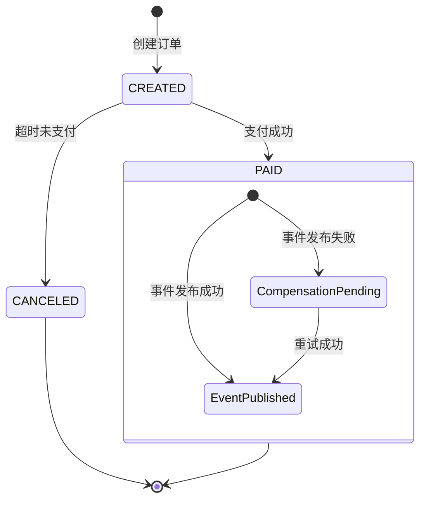

# SpringBoot 订单创建与支付

> 源码：`/Users/chenwei/Documents/code/java/learn-springboot/20-SpringBoot-order-create-pay`

## 核心思路

实现订单生命周期管理：创建 → 支付 → 超时取消，并引入**补偿机制**处理支付成功后事件发布失败的场景。通过 `@Scheduled` 定时任务自动取消超时未支付订单。

## 项目结构

```
src/main/java/com/cloud/
├── controller/OrderController.java
├── service/
│   ├── OrderService.java                 (核心业务)
│   ├── CompensationService.java          (补偿事件管理)
│   ├── OrderEventPublisher.java          (事件发布接口)
│   └── LoggingOrderEventPublisher.java   (日志实现)
├── model/
│   ├── Order.java
│   ├── OrderStatus.java
│   └── CompensationEvent.java
├── common/ApiResult.java
└── exception/GlobalExceptionHandler.java
```

## 依赖与配置

| 依赖 | 说明 |
|------|------|
| `spring-boot-starter-web` | Web 框架 |

```yaml
server:
  port: 8100

demo:
  order:
    pay-timeout-seconds: 30
    timeout-check-interval-ms: 5000
```

## 核心代码解析

### OrderStatus — 订单状态枚举

```
CREATED → PAID
CREATED → CANCELED (超时)
```

### OrderService — 核心业务

```java
public synchronized Order createOrder(String userId, BigDecimal amount) {
    Order order = new Order();
    order.setOrderNo(generateOrderNo(now));
    order.setStatus(OrderStatus.CREATED);
    order.setExpireAt(now.plus(payTimeout));     // 设置过期时间
    orders.put(order.getOrderNo(), order);
    return order;
}

public synchronized PayOrderResult payOrder(String orderNo, String paymentNo) {
    Order order = getOrder(orderNo);
    // 状态检查：已支付 → 幂等返回；已取消 → 抛异常
    // 超时检查：超时 → 取消并抛异常
    order.setStatus(OrderStatus.PAID);
    order.setPaymentNo(paymentNo);

    try {
        orderEventPublisher.publishOrderPaid(orderNo);   // 发布事件
    } catch (Exception ex) {
        compensationService.recordOrderPaidEvent(orderNo, paymentNo);  // 补偿
        compensationPending = true;
    }
    return new PayOrderResult(order, compensationPending);
}

@Scheduled(fixedDelayString = "${demo.order.timeout-check-interval-ms:5000}")
public void scheduledCancelTimeoutOrders() {
    cancelTimeoutOrders();   // 定时扫描超时订单
}
```

> [!important] 补偿机制
> 支付成功后，如果事件发布失败（如下游服务不可用），将事件记录到 `CompensationService`，后续可手动/定时重试，保证最终一致性。

### CompensationService — 补偿事件管理

```java
public void recordOrderPaidEvent(String orderNo, String paymentNo) {
    CompensationEvent event = new CompensationEvent(eventId, "order.paid", orderNo, paymentNo, now);
    pendingEvents.put(orderNo, event);
}

public int retry(OrderEventPublisher publisher) {
    for (CompensationEvent event : snapshot) {
        try {
            publisher.publishOrderPaid(event.getOrderNo());
            pendingEvents.remove(event.getOrderNo());
            success++;
        } catch (Exception ex) {
            event.increaseRetryCount();
            event.setLastError(ex.getMessage());
        }
    }
}
```

## 订单生命周期



## API 接口

| 方法 | 路径 | 说明 |
|------|------|------|
| POST | `/api/order/create` | 创建订单 |
| POST | `/api/order/pay` | 支付订单 |
| GET | `/api/order/{orderNo}` | 查询订单 |
| POST | `/api/order/maintenance/timeout-cancel` | 手动触发超时取消 |
| POST | `/api/order/maintenance/compensation/retry` | 重试补偿事件 |
| GET | `/api/order/maintenance/compensation/pending` | 查询待补偿事件 |

## 要点总结

1. **订单超时取消**：`@Scheduled` 定时扫描，将超时未支付的 CREATED 订单标记为 CANCELED
2. **支付幂等**：已支付的订单再次支付直接返回结果，不重复扣款
3. **补偿机制**：支付成功但事件发布失败时，记录补偿事件，支持手动重试，保证最终一致性
4. **Clock 注入**：`OrderService` 接受 `Clock` 参数，便于测试时控制时间
5. **synchronized**：内存存储下用 synchronized 保证并发安全，生产环境应使用数据库事务
