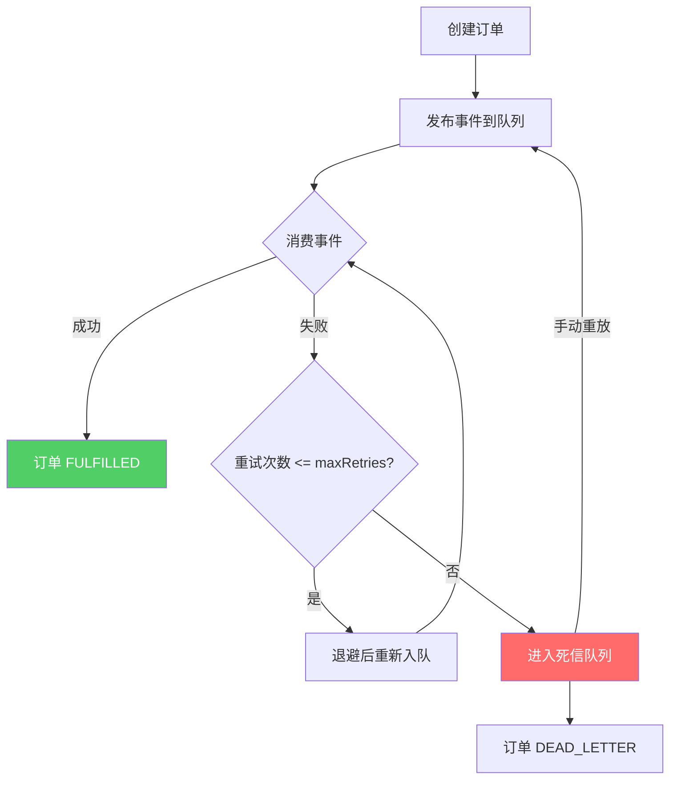

# SpringBoot 消息队列事件驱动

> 源码：`/Users/chenwei/Documents/code/java/learn-springboot/21-SpringBoot-mq-event-driven`

## 核心思路

基于内存 `PriorityQueue` 模拟消息队列，实现事件驱动架构中的**重试退避**、**死信队列**和**消息重放**三大核心模式。展示从"同步调用"到"异步事件驱动"的架构演进。

## 项目结构

```
src/main/java/com/cloud/
├── controller/MqEventDemoController.java
├── service/
│   ├── EventDrivenOrderService.java       (事件驱动订单)
│   ├── EventQueueService.java             (消息队列模拟)
│   └── EventConsumerService.java          (消费者 + 定时消费)
├── model/
│   ├── EventMessage.java                  (消息体)
│   ├── DemoOrder.java
│   ├── DemoOrderStatus.java
│   └── DeadLetterEvent.java
├── common/ApiResult.java
└── exception/GlobalExceptionHandler.java
```

## 依赖与配置

| 依赖 | 说明 |
|------|------|
| `spring-boot-starter-web` | Web 框架 |

```yaml
server:
  port: 8101

demo:
  mq:
    max-retries: 3
    retry-backoff-ms: 1000
    consumer-interval-ms: 1000
    auto-consume-enabled: true
```

## 核心代码解析

### DemoOrderStatus — 订单状态

```
CREATED → EVENT_PUBLISHED → FULFILLED
                              ↓ (重试耗尽)
                           DEAD_LETTER
```

### EventMessage — 消息模型

```java
public class EventMessage implements Comparable<EventMessage> {
    private final String eventId;
    private final String eventType;      // ORDER_CREATED
    private final String orderNo;
    private final int failTimes;         // 模拟失败次数
    private final int retryCount;        // 当前重试次数
    private final Instant nextVisibleAt; // 下次可见时间（延迟消费）
    private final long sequence;         // 顺序号

    public int compareTo(EventMessage other) {
        int cmp = this.nextVisibleAt.compareTo(other.nextVisibleAt);
        return cmp != 0 ? cmp : Long.compare(this.sequence, other.sequence);
    }
}
```

> [!tip] PriorityQueue + nextVisibleAt
> 按下次可见时间排序，实现延迟消费效果，模拟 MQ 的延迟队列。

### EventQueueService — 队列核心

```java
public synchronized String publishOrderCreated(String orderNo, int failTimes) {
    EventMessage message = new EventMessage(eventId, "ORDER_CREATED", orderNo,
        failTimes, 0, now, now, sequence);
    queue.offer(message);
    return eventId;
}

public synchronized EventMessage pollVisibleMessage() {
    EventMessage first = queue.peek();
    if (first == null || first.getNextVisibleAt().isAfter(now)) return null;
    return queue.poll();
}

public synchronized RetryDecision handleConsumeFailure(EventMessage message, String reason) {
    int nextRetryCount = message.getRetryCount() + 1;
    if (nextRetryCount > maxRetries) {
        deadLetterMap.put(message.getEventId(), deadLetterEvent);  // 进入死信
        return new RetryDecision(false, nextRetryCount);
    }
    Instant visibleAt = now.plus(retryBackoff.multipliedBy(nextRetryCount));  // 退避策略
    queue.offer(message.withRetry(nextRetryCount, visibleAt, sequence));
    return new RetryDecision(true, nextRetryCount);
}

public synchronized boolean requeueDeadLetter(String eventId, int failTimes) {
    DeadLetterEvent deadLetterEvent = deadLetterMap.remove(eventId);
    EventMessage replay = new EventMessage(..., 0, now, now, sequence);  // 重置重试计数
    queue.offer(replay);
    return true;
}
```

### EventConsumerService — 消费者

```java
@Scheduled(fixedDelayString = "${demo.mq.consumer-interval-ms:1000}")
public void scheduledPump() {
    if (!autoConsumeEnabled) return;
    pump(20);
}

public synchronized PumpResult pump(int maxMessages) {
    for (int i = 0; i < maxMessages; i++) {
        EventMessage message = eventQueueService.pollVisibleMessage();
        if (message == null) break;
        try {
            consume(message);   // 失败次数内抛异常模拟
            processed++;
        } catch (RuntimeException ex) {
            RetryDecision decision = eventQueueService.handleConsumeFailure(message, ex.getMessage());
            if (decision.requeued()) retried++;
            else { deadLettered++; orderService.markDeadLetter(...); }
        }
    }
}
```

## 事件驱动流程



## 初学者学习路线

- 先把这个案例当成“最小可运行样例”，目标是理解 SpringBoot 消息队列事件驱动 的主流程。
- 先运行 README 里的启动命令和 curl，再带着现象回到代码里找入口。
- 每读一个类都问三件事：它由谁调用、它依赖谁、它改变了什么状态。

## 代码导读

下面的代码片段来自案例源码，并额外补了中文教学注释。阅读时先看注释理解职责，再回到完整源码核对细节。

### 接口入口：Controller 如何接收请求

源码位置：`src/main/java/com/cloud/controller/MqEventDemoController.java`

Controller 是 HTTP 世界和 Java 代码世界之间的边界：路径、请求参数、返回值都在这里集中出现。

```java
// 文件：com/cloud/controller/MqEventDemoController.java
// 学习重点：Controller 是 HTTP 世界和 Java 代码世界之间的边界：路径、请求参数、返回值都在这里集中出现。
// @RestController 表示这个类的返回值会直接写到 HTTP 响应体里，常用于 JSON API。
@RestController
// 类级别路径是这一组接口的共同前缀。
@RequestMapping("/api/mq")
public class MqEventDemoController {

    private final EventDrivenOrderService orderService;
    private final EventConsumerService consumerService;
    private final EventQueueService queueService;

    public MqEventDemoController(EventDrivenOrderService orderService,
                                 EventConsumerService consumerService,
                                 EventQueueService queueService) {
        this.orderService = orderService;
        this.consumerService = consumerService;
        this.queueService = queueService;
    }

    // 方法级别映射说明具体 HTTP 动词和子路径。
    @GetMapping
    public ApiResult<Map<String, Object>> moduleInfo() {
        Map<String, Object> data = new LinkedHashMap<>();
        data.put("module", "21-SpringBoot-mq-event-driven");
        data.put("desc", "事件驱动、重试、死信、重放演示");
        data.put("queueSize", queueService.queueSize());
        data.put("deadLetterSize", queueService.deadLetterCount());
        return ApiResult.success(data);
    }

    // 方法级别映射说明具体 HTTP 动词和子路径。
    @PostMapping("/order/create")
    public ApiResult<Map<String, Object>> createOrder(@RequestParam String userId,
                                                       @RequestParam BigDecimal amount,
                                                       @RequestParam(defaultValue = "0") int failTimes) {
        EventDrivenOrderService.CreateOrderResult result = orderService.createOrder(userId, amount, failTimes);

        Map<String, Object> data = new LinkedHashMap<>();
        data.put("eventId", result.eventId());
        data.put("order", result.order());
        data.put("queueSize", queueService.queueSize());
        return ApiResult.success(data);
    }

    // 方法级别映射说明具体 HTTP 动词和子路径。
    @GetMapping("/order/{orderNo}")
    public ApiResult<DemoOrder> getOrder(@PathVariable String orderNo) {
        return ApiResult.success(orderService.getOrder(orderNo));
    }

    // 方法级别映射说明具体 HTTP 动词和子路径。
    @PostMapping("/consumer/pump")
    public ApiResult<EventConsumerService.PumpResult> pump(@RequestParam(defaultValue = "20") int maxMessages) {
        return ApiResult.success(consumerService.pump(maxMessages));
    }

    // 方法级别映射说明具体 HTTP 动词和子路径。
    @GetMapping("/consumer/metrics")
    public ApiResult<EventConsumerService.Metrics> metrics() {
        return ApiResult.success(consumerService.metrics());
    }

    // 方法级别映射说明具体 HTTP 动词和子路径。
    @GetMapping("/dead-letter")
    public ApiResult<Map<String, Object>> deadLetters() {
        List<DeadLetterEvent> events = queueService.listDeadLetters();
        Map<String, Object> data = new LinkedHashMap<>();
        data.put("count", events.size());
        data.put("events", events);
        return ApiResult.success(data);
    }

    // 方法级别映射说明具体 HTTP 动词和子路径。
    @PostMapping("/dead-letter/requeue")
    public ApiResult<Map<String, Object>> requeueDeadLetter(@RequestParam String eventId,
                                                             @RequestParam(defaultValue = "0") int failTimes) {
        boolean requeued = queueService.requeueDeadLetter(eventId, failTimes);
        if (!requeued) {
            throw new IllegalArgumentException("死信事件不存在: " + eventId);
        }

        Map<String, Object> data = new LinkedHashMap<>();
        data.put("eventId", eventId);
        data.put("requeued", true);
        data.put("queueSize", queueService.queueSize());
        return ApiResult.success(data);
    }
}
```

关键点拆解：

- 先把 README 里的 curl 路径和这里的 `@RequestMapping` / `@GetMapping` / `@PostMapping` 对上。
- Controller 不应该堆复杂业务逻辑；看到它调用 Service，就说明职责分层是清楚的。
- 读完代码后，回到“生产差距”检查：安全、异常、监控、容量、测试是否都补齐。

### 业务核心：Service 如何组织规则

源码位置：`src/main/java/com/cloud/service/EventConsumerService.java`

Service 承载业务规则，初学者要重点看它如何校验输入、调用依赖、返回结果。

```java
// 文件：com/cloud/service/EventConsumerService.java
// 学习重点：Service 承载业务规则，初学者要重点看它如何校验输入、调用依赖、返回结果。
// @Service 表示这是业务层 Bean，会被 Spring 自动扫描并注入。
@Service
public class EventConsumerService {

    private final EventQueueService eventQueueService;
    private final EventDrivenOrderService orderService;
    private final boolean autoConsumeEnabled;

    @Autowired
    public EventConsumerService(EventQueueService eventQueueService,
                                EventDrivenOrderService orderService,
                                @Value("${demo.mq.auto-consume-enabled:true}") boolean autoConsumeEnabled) {
        this.eventQueueService = eventQueueService;
        this.orderService = orderService;
        this.autoConsumeEnabled = autoConsumeEnabled;
    }

    EventConsumerService(EventQueueService eventQueueService,
                         EventDrivenOrderService orderService) {
        this(eventQueueService, orderService, false);
    }

    public synchronized PumpResult pump(int maxMessages) {
        if (maxMessages <= 0) {
            throw new IllegalArgumentException("maxMessages必须大于0");
        }

        int processed = 0;
        int retried = 0;
        int deadLettered = 0;

        for (int i = 0; i < maxMessages; i++) {
            EventMessage message = eventQueueService.pollVisibleMessage();
            if (message == null) {
                break;
            }

            try {
                consume(message);
                processed++;
            } catch (RuntimeException ex) {
                EventQueueService.RetryDecision decision = eventQueueService.handleConsumeFailure(message, ex.getMessage());
                if (decision.requeued()) {
                    retried++;
                } else {
                    deadLettered++;
                    orderService.markDeadLetter(message.getOrderNo(), message.getEventId(), ex.getMessage());
                }
            }
        }

        return new PumpResult(processed, retried, deadLettered, eventQueueService.queueSize(), eventQueueService.deadLetterCount());
    }

    public Metrics metrics() {
        return new Metrics(eventQueueService.queueSize(), eventQueueService.deadLetterCount());
    }

    @Scheduled(fixedDelayString = "${demo.mq.consumer-interval-ms:1000}")
    public void scheduledPump() {
        if (!autoConsumeEnabled) {
            return;
        }
        pump(20);
    }

    private void consume(EventMessage message) {
        int attempt = message.getRetryCount() + 1;
        if (attempt <= message.getFailTimes()) {
            throw new IllegalStateException("mock consume fail at attempt " + attempt);
        }
        orderService.markFulfilled(message.getOrderNo(), message.getEventId());
    }

    public record PumpResult(int processed,
                             int retried,
                             int deadLettered,
                             int queueSize,
                             int deadLetterSize) {
    }

    public record Metrics(int queueSize, int deadLetterSize) {
    }
}
```

关键点拆解：

- Service 的 public 方法通常就是一个用例，例如创建、查询、刷新、投递、同步。
- 先看输入校验，再看调用了哪些依赖，最后看返回对象。
- 读完代码后，回到“生产差距”检查：安全、异常、监控、容量、测试是否都补齐。

### 业务核心：Service 如何组织规则

源码位置：`src/main/java/com/cloud/service/EventDrivenOrderService.java`

Service 承载业务规则，初学者要重点看它如何校验输入、调用依赖、返回结果。

```java
// 文件：com/cloud/service/EventDrivenOrderService.java
// 学习重点：Service 承载业务规则，初学者要重点看它如何校验输入、调用依赖、返回结果。
// @Service 表示这是业务层 Bean，会被 Spring 自动扫描并注入。
@Service
public class EventDrivenOrderService {

    private final Map<String, DemoOrder> orderStore = new ConcurrentHashMap<>();
    private final AtomicLong sequence = new AtomicLong(1000);

    private final EventQueueService eventQueueService;
    private final Clock clock;

    @Autowired
    // 构造器注入：依赖从 Spring 容器传入，代码更容易测试，也避免隐藏依赖。
    public EventDrivenOrderService(EventQueueService eventQueueService) {
        this(eventQueueService, Clock.systemUTC());
    }

    EventDrivenOrderService(EventQueueService eventQueueService, Clock clock) {
        this.eventQueueService = eventQueueService;
        this.clock = clock;
    }

    public synchronized CreateOrderResult createOrder(String userId, BigDecimal amount, int failTimes) {
        if (userId == null || userId.isBlank()) {
            throw new IllegalArgumentException("userId不能为空");
        }
        if (amount == null || amount.compareTo(BigDecimal.ZERO) <= 0) {
            throw new IllegalArgumentException("amount必须大于0");
        }
        if (failTimes < 0) {
            throw new IllegalArgumentException("failTimes不能小于0");
        }

        Instant now = Instant.now(clock);
        DemoOrder order = new DemoOrder();
        order.setOrderNo("MQORD" + now.toEpochMilli() + sequence.getAndIncrement());
        order.setUserId(userId);
        order.setAmount(amount);
        order.setCreatedAt(now);
        order.setStatus(DemoOrderStatus.CREATED);

        orderStore.put(order.getOrderNo(), order);

        String eventId = eventQueueService.publishOrderCreated(order.getOrderNo(), failTimes);
        order.setLastEventId(eventId);
        order.setStatus(DemoOrderStatus.EVENT_PUBLISHED);

        return new CreateOrderResult(order, eventId);
    }

    public synchronized DemoOrder getOrder(String orderNo) {
        if (orderNo == null || orderNo.isBlank()) {
            throw new IllegalArgumentException("orderNo不能为空");
        }
        DemoOrder order = orderStore.get(orderNo);
        if (order == null) {
            throw new IllegalArgumentException("订单不存在: " + orderNo);
        }
        return order;
    }

    public synchronized void markFulfilled(String orderNo, String eventId) {
        DemoOrder order = getOrder(orderNo);
        order.setStatus(DemoOrderStatus.FULFILLED);
        order.setLastEventId(eventId);
        order.setLastError(null);
        order.setFulfilledAt(Instant.now(clock));
    }

    public synchronized void markDeadLetter(String orderNo, String eventId, String reason) {
        DemoOrder order = getOrder(orderNo);
        order.setStatus(DemoOrderStatus.DEAD_LETTER);
        order.setLastEventId(eventId);
        order.setLastError(reason);
    }

    public record CreateOrderResult(DemoOrder order, String eventId) {
    }
}
```

关键点拆解：

- Service 的 public 方法通常就是一个用例，例如创建、查询、刷新、投递、同步。
- 先看输入校验，再看调用了哪些依赖，最后看返回对象。
- 读完代码后，回到“生产差距”检查：安全、异常、监控、容量、测试是否都补齐。

### 业务核心：Service 如何组织规则

源码位置：`src/main/java/com/cloud/service/EventQueueService.java`

Service 承载业务规则，初学者要重点看它如何校验输入、调用依赖、返回结果。

```java
// 文件：com/cloud/service/EventQueueService.java
// 学习重点：Service 承载业务规则，初学者要重点看它如何校验输入、调用依赖、返回结果。
// @Service 表示这是业务层 Bean，会被 Spring 自动扫描并注入。
@Service
public class EventQueueService {

    private final PriorityQueue<EventMessage> queue = new PriorityQueue<>();
    private final Map<String, DeadLetterEvent> deadLetterMap = new LinkedHashMap<>();
    private final AtomicLong sequence = new AtomicLong(1000);

    private final int maxRetries;
    private final Duration retryBackoff;
    private final Clock clock;

    @Autowired
    public EventQueueService(@Value("${demo.mq.max-retries:3}") int maxRetries,
                             @Value("${demo.mq.retry-backoff-ms:1000}") long retryBackoffMs) {
        this(maxRetries, Duration.ofMillis(retryBackoffMs), Clock.systemUTC());
    }

    EventQueueService(int maxRetries, Duration retryBackoff, Clock clock) {
        if (maxRetries < 0) {
            throw new IllegalArgumentException("maxRetries不能小于0");
        }
        this.maxRetries = maxRetries;
        this.retryBackoff = retryBackoff == null ? Duration.ZERO : retryBackoff;
        this.clock = clock;
    }

    public synchronized String publishOrderCreated(String orderNo, int failTimes) {
        if (orderNo == null || orderNo.isBlank()) {
            throw new IllegalArgumentException("orderNo不能为空");
        }
        if (failTimes < 0) {
            throw new IllegalArgumentException("failTimes不能小于0");
        }

        Instant now = Instant.now(clock);
        String eventId = "EVT" + now.toEpochMilli() + sequence.getAndIncrement();

        EventMessage message = new EventMessage(
                eventId,
                "ORDER_CREATED",
                orderNo,
                failTimes,
                0,
                now,
                now,
                sequence.getAndIncrement()
        );
        queue.offer(message);
        return eventId;
    }

    public synchronized EventMessage pollVisibleMessage() {
        EventMessage first = queue.peek();
        if (first == null) {
            return null;
        }
        if (first.getNextVisibleAt().isAfter(Instant.now(clock))) {
            return null;
        }
        return queue.poll();
    }

    public synchronized RetryDecision handleConsumeFailure(EventMessage message, String reason) {
        int nextRetryCount = message.getRetryCount() + 1;
        if (nextRetryCount > maxRetries) {
            DeadLetterEvent deadLetterEvent = new DeadLetterEvent(
                    message.getEventId(),
                    message.getEventType(),
                    message.getOrderNo(),
                    message.getFailTimes(),
                    nextRetryCount,
                    reason,
                    Instant.now(clock)
            );
            deadLetterMap.put(message.getEventId(), deadLetterEvent);
            return new RetryDecision(false, nextRetryCount);
        }

        Instant visibleAt = Instant.now(clock).plus(retryBackoff.multipliedBy(Math.max(1, nextRetryCount)));
        queue.offer(message.withRetry(nextRetryCount, visibleAt, sequence.getAndIncrement()));
        return new RetryDecision(true, nextRetryCount);
    }

    public synchronized boolean requeueDeadLetter(String eventId, int failTimes) {
        DeadLetterEvent deadLetterEvent = deadLetterMap.remove(eventId);
        if (deadLetterEvent == null) {
            return false;
        }

        Instant now = Instant.now(clock);
        EventMessage replay = new EventMessage(
                deadLetterEvent.getEventId(),
                deadLetterEvent.getEventType(),
                deadLetterEvent.getOrderNo(),
                Math.max(failTimes, 0),
                0,
                now,
                now,
                sequence.getAndIncrement()
        );
        queue.offer(replay);
        return true;
    }

    public synchronized List<DeadLetterEvent> listDeadLetters() {
    // ... 省略其余辅助代码，完整实现以源码为准。
}
```

关键点拆解：

- Service 的 public 方法通常就是一个用例，例如创建、查询、刷新、投递、同步。
- 先看输入校验，再看调用了哪些依赖，最后看返回对象。
- 读完代码后，回到“生产差距”检查：安全、异常、监控、容量、测试是否都补齐。

## 运行时调用链

- 从 README 的接口或测试名称开始，先定位入口类。
- 找 Controller、Runner、Listener 或 AutoConfiguration 作为第一阅读点。
- 沿着构造器注入的依赖继续进入 Service、Repository 或扩展点类。

## 初学者常见误区

- 只把接口跑通，却没有回到代码理解 Controller、Service、Repository 的分工。
- 把内存 Map、模拟客户端、固定配置当成生产实现。
- 只看 happy path，忽略参数错误、外部系统失败、并发和重复请求。

## API 接口

| 方法 | 路径 | 说明 |
|------|------|------|
| GET | `/api/mq` | 模块信息 |
| POST | `/api/mq/order/create` | 创建订单（failTimes 模拟失败） |
| GET | `/api/mq/order/{orderNo}` | 查询订单 |
| POST | `/api/mq/consumer/pump` | 手动消费消息 |
| GET | `/api/mq/consumer/metrics` | 消费指标 |
| GET | `/api/mq/dead-letter` | 查询死信 |
| POST | `/api/mq/dead-letter/requeue` | 死信重放 |

## 生产差距

这个示例适合帮助初学者理解 消息队列事件驱动 的核心机制，但生产项目不能只停留在“能跑通”。真实落地时至少要补齐：统一鉴权、参数边界校验、异常响应、结构化日志、监控指标、自动化测试、配置隔离和容量评估。

如果模块涉及数据库、缓存、消息、网关、认证或外部服务，还要进一步考虑连接池、超时、重试、幂等、事务边界、数据一致性和故障告警。学习时可以先记住主流程，再用这些生产差距反向检查自己是否真正理解了案例。

## 要点总结

1. **事件驱动**：订单创建后发布事件，消费者异步处理，解耦业务模块
2. **重试退避**：失败后延迟重试，`retryBackoff * retryCount` 指数退避，避免雪崩
3. **死信队列**：超过最大重试次数的消息进入死信，不丢失，可人工介入
4. **消息重放**：死信可重新入队（重置 retryCount），模拟 MQ 的 requeue 机制
5. **PriorityQueue 模拟**：通过 `nextVisibleAt` 排序实现延迟消费，生产环境用 RocketMQ/RabbitMQ 延迟队列
6. **与 [[20-SpringBoot-订单创建与支付]] 的演进**：从同步补偿 → 异步事件驱动，架构更健壮
