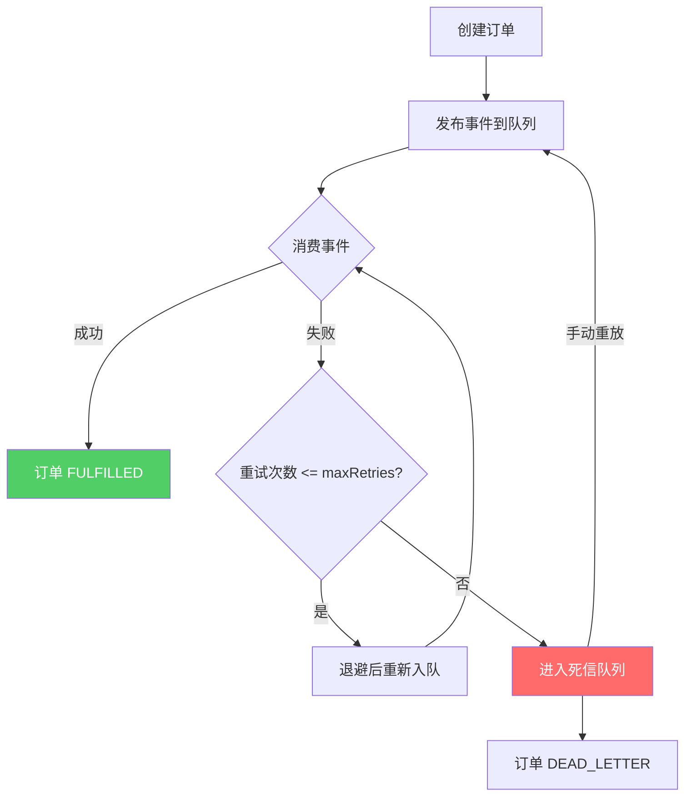

# SpringBoot 消息队列事件驱动

> 源码：`/Users/chenwei/Documents/code/java/learn-springboot/21-SpringBoot-mq-event-driven`

## 核心思路

基于内存 `PriorityQueue` 模拟消息队列，实现事件驱动架构中的**重试退避**、**死信队列**和**消息重放**三大核心模式。展示从"同步调用"到"异步事件驱动"的架构演进。

## 项目结构

```
src/main/java/com/cloud/
├── controller/MqEventDemoController.java
├── service/
│   ├── EventDrivenOrderService.java       (事件驱动订单)
│   ├── EventQueueService.java             (消息队列模拟)
│   └── EventConsumerService.java          (消费者 + 定时消费)
├── model/
│   ├── EventMessage.java                  (消息体)
│   ├── DemoOrder.java
│   ├── DemoOrderStatus.java
│   └── DeadLetterEvent.java
├── common/ApiResult.java
└── exception/GlobalExceptionHandler.java
```

## 依赖与配置

| 依赖 | 说明 |
|------|------|
| `spring-boot-starter-web` | Web 框架 |

```yaml
server:
  port: 8101

demo:
  mq:
    max-retries: 3
    retry-backoff-ms: 1000
    consumer-interval-ms: 1000
    auto-consume-enabled: true
```

## 核心代码解析

### DemoOrderStatus — 订单状态

```
CREATED → EVENT_PUBLISHED → FULFILLED
                              ↓ (重试耗尽)
                           DEAD_LETTER
```

### EventMessage — 消息模型

```java
public class EventMessage implements Comparable<EventMessage> {
    private final String eventId;
    private final String eventType;      // ORDER_CREATED
    private final String orderNo;
    private final int failTimes;         // 模拟失败次数
    private final int retryCount;        // 当前重试次数
    private final Instant nextVisibleAt; // 下次可见时间（延迟消费）
    private final long sequence;         // 顺序号

    public int compareTo(EventMessage other) {
        int cmp = this.nextVisibleAt.compareTo(other.nextVisibleAt);
        return cmp != 0 ? cmp : Long.compare(this.sequence, other.sequence);
    }
}
```

> [!tip] PriorityQueue + nextVisibleAt
> 按下次可见时间排序，实现延迟消费效果，模拟 MQ 的延迟队列。

### EventQueueService — 队列核心

```java
public synchronized String publishOrderCreated(String orderNo, int failTimes) {
    EventMessage message = new EventMessage(eventId, "ORDER_CREATED", orderNo,
        failTimes, 0, now, now, sequence);
    queue.offer(message);
    return eventId;
}

public synchronized EventMessage pollVisibleMessage() {
    EventMessage first = queue.peek();
    if (first == null || first.getNextVisibleAt().isAfter(now)) return null;
    return queue.poll();
}

public synchronized RetryDecision handleConsumeFailure(EventMessage message, String reason) {
    int nextRetryCount = message.getRetryCount() + 1;
    if (nextRetryCount > maxRetries) {
        deadLetterMap.put(message.getEventId(), deadLetterEvent);  // 进入死信
        return new RetryDecision(false, nextRetryCount);
    }
    Instant visibleAt = now.plus(retryBackoff.multipliedBy(nextRetryCount));  // 退避策略
    queue.offer(message.withRetry(nextRetryCount, visibleAt, sequence));
    return new RetryDecision(true, nextRetryCount);
}

public synchronized boolean requeueDeadLetter(String eventId, int failTimes) {
    DeadLetterEvent deadLetterEvent = deadLetterMap.remove(eventId);
    EventMessage replay = new EventMessage(..., 0, now, now, sequence);  // 重置重试计数
    queue.offer(replay);
    return true;
}
```

### EventConsumerService — 消费者

```java
@Scheduled(fixedDelayString = "${demo.mq.consumer-interval-ms:1000}")
public void scheduledPump() {
    if (!autoConsumeEnabled) return;
    pump(20);
}

public synchronized PumpResult pump(int maxMessages) {
    for (int i = 0; i < maxMessages; i++) {
        EventMessage message = eventQueueService.pollVisibleMessage();
        if (message == null) break;
        try {
            consume(message);   // 失败次数内抛异常模拟
            processed++;
        } catch (RuntimeException ex) {
            RetryDecision decision = eventQueueService.handleConsumeFailure(message, ex.getMessage());
            if (decision.requeued()) retried++;
            else { deadLettered++; orderService.markDeadLetter(...); }
        }
    }
}
```

## 事件驱动流程



## API 接口

| 方法 | 路径 | 说明 |
|------|------|------|
| GET | `/api/mq` | 模块信息 |
| POST | `/api/mq/order/create` | 创建订单（failTimes 模拟失败） |
| GET | `/api/mq/order/{orderNo}` | 查询订单 |
| POST | `/api/mq/consumer/pump` | 手动消费消息 |
| GET | `/api/mq/consumer/metrics` | 消费指标 |
| GET | `/api/mq/dead-letter` | 查询死信 |
| POST | `/api/mq/dead-letter/requeue` | 死信重放 |

## 要点总结

1. **事件驱动**：订单创建后发布事件，消费者异步处理，解耦业务模块
2. **重试退避**：失败后延迟重试，`retryBackoff * retryCount` 指数退避，避免雪崩
3. **死信队列**：超过最大重试次数的消息进入死信，不丢失，可人工介入
4. **消息重放**：死信可重新入队（重置 retryCount），模拟 MQ 的 requeue 机制
5. **PriorityQueue 模拟**：通过 `nextVisibleAt` 排序实现延迟消费，生产环境用 RocketMQ/RabbitMQ 延迟队列
6. **与 [[20-SpringBoot-订单创建与支付]] 的演进**：从同步补偿 → 异步事件驱动，架构更健壮
