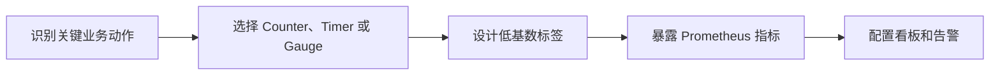

# SpringBoot 可观测性与业务指标

> 源码：`/Users/chenwei/Documents/code/java/learn-springboot/23-SpringBoot-observability-metrics`

## 核心思路

本模块演示 [[SpringBoot]] 应用中的指标可观测最小闭环：业务接口改变运行状态，[[Micrometer]] 注册业务指标，[[Spring Boot Actuator]] 暴露指标端点，[[Prometheus]] 通过 `/actuator/prometheus` 抓取指标。

## 项目结构

```text
src/main/java/com/cloud/
├── controller/ObservabilityDemoController.java  (业务演示接口)
├── service/
│   ├── BusinessMetricsService.java              (指标注册与记录)
│   └── InMemoryWorkQueueService.java            (内存待处理队列)
├── common/ApiResult.java
└── exception/GlobalExceptionHandler.java
```

## 依赖与配置

| 配置 | 说明 |
|------|------|
| `management.endpoints.web.exposure.include` | 暴露 `health`、`info`、`metrics`、`prometheus` |
| `management.endpoint.prometheus.enabled` | 启用 Prometheus 端点 |
| `management.prometheus.metrics.export.enabled` | 开启 Prometheus 指标导出 |
| `management.metrics.tags.application` | 给所有指标追加应用维度标签 |

```yaml
server:
  port: 8103

management:
  endpoints:
    web:
      exposure:
        include: health,info,metrics,prometheus
  endpoint:
    prometheus:
      enabled: true
  prometheus:
    metrics:
      export:
        enabled: true
```

## 指标模型

| 指标 | 类型 | 含义 |
|------|------|------|
| `demo_order_created_total` | `Counter` | 创建订单总数，只增不减 |
| `demo_order_processed_total{result="success"}` | `Counter` | 处理成功订单总数 |
| `demo_order_processed_total{result="failed"}` | `Counter` | 处理失败订单总数 |
| `demo_order_process_duration_ms` | `Timer` | 订单处理耗时分布 |
| `demo_order_pending_count` | `Gauge` | 当前待处理订单数量 |

## 核心代码解析

### BusinessMetricsService — 注册和记录指标

```java
this.orderCreatedCounter = Counter.builder("demo_order_created_total")
        .description("Total count of created demo orders")
        .register(meterRegistry);

this.processedSuccessCounter = Counter.builder("demo_order_processed_total")
        .tag("result", "success")
        .register(meterRegistry);

this.processDurationTimer = Timer.builder("demo_order_process_duration_ms")
        .register(meterRegistry);

Gauge.builder("demo_order_pending_count", workQueueService, InMemoryWorkQueueService::pendingCount)
        .register(meterRegistry);
```

> [!important] 指标类型选择
> 事件累计值用 `Counter`，耗时分布用 `Timer`，当前状态值用 `Gauge`。不要用一个指标类型表达所有业务含义。

### 指标记录流程

```java
public MetricsSnapshot createOrders(int count) {
    workQueueService.addOrders(count);
    orderCreatedCounter.increment(count);
    return snapshot();
}

public MetricsSnapshot processOne(boolean success, long durationMs) {
    boolean taken = workQueueService.takeOne();
    if (!taken) throw new IllegalStateException("暂无待处理订单");

    processDurationTimer.record(Duration.ofMillis(durationMs));
    if (success) {
        processedSuccessCounter.increment();
    } else {
        processedFailedCounter.increment();
    }
    return snapshot();
}
```

业务状态变化与指标记录放在同一个服务方法里，保证指标能反映真实业务动作。

## 指标基数控制

本模块只给处理结果增加 `result=success|failed` 标签，避免把 `orderId`、`userId` 这类高基数字段放进指标标签。

| 标签设计 | 是否推荐 | 原因 |
|----------|----------|------|
| `result=success|failed` | 推荐 | 取值有限，便于聚合 |
| `userId=1001` | 不推荐 | 用户数越多时间序列越多 |
| `orderId=xxx` | 不推荐 | 每个订单生成新时间序列 |

> [!warning] 高基数标签
> Prometheus 的存储成本与时间序列数量强相关，高基数标签会让指标系统快速膨胀。

## 初学者学习路线

- 先把这个案例当成“最小可运行样例”，目标是理解 SpringBoot 可观测性与业务指标 的主流程。
- 先运行 README 里的启动命令和 curl，再带着现象回到代码里找入口。
- 每读一个类都问三件事：它由谁调用、它依赖谁、它改变了什么状态。

## 代码导读

下面的代码片段来自案例源码，并额外补了中文教学注释。阅读时先看注释理解职责，再回到完整源码核对细节。

### 接口入口：Controller 如何接收请求

源码位置：`src/main/java/com/cloud/controller/ObservabilityDemoController.java`

Controller 是 HTTP 世界和 Java 代码世界之间的边界：路径、请求参数、返回值都在这里集中出现。

```java
// 文件：com/cloud/controller/ObservabilityDemoController.java
// 学习重点：Controller 是 HTTP 世界和 Java 代码世界之间的边界：路径、请求参数、返回值都在这里集中出现。
// @RestController 表示这个类的返回值会直接写到 HTTP 响应体里，常用于 JSON API。
@RestController
// 类级别路径是这一组接口的共同前缀。
@RequestMapping("/api/observability")
public class ObservabilityDemoController {

    private final BusinessMetricsService metricsService;

    // 构造器注入：依赖从 Spring 容器传入，代码更容易测试，也避免隐藏依赖。
    public ObservabilityDemoController(BusinessMetricsService metricsService) {
        this.metricsService = metricsService;
    }

    // 方法级别映射说明具体 HTTP 动词和子路径。
    @GetMapping
    public ApiResult<Map<String, Object>> moduleInfo() {
        Map<String, Object> data = new LinkedHashMap<>();
        data.put("module", "23-SpringBoot-observability-metrics");
        data.put("desc", "Micrometer + Prometheus 指标观测演示");
        data.put("snapshot", metricsService.snapshot());
        return ApiResult.success(data);
    }

    // 方法级别映射说明具体 HTTP 动词和子路径。
    @PostMapping("/orders/create")
    public ApiResult<BusinessMetricsService.MetricsSnapshot> createOrders(@RequestParam(defaultValue = "1") int count) {
        return ApiResult.success(metricsService.createOrders(count));
    }

    // 方法级别映射说明具体 HTTP 动词和子路径。
    @PostMapping("/orders/process")
    public ApiResult<BusinessMetricsService.MetricsSnapshot> processOrder(@RequestParam(defaultValue = "true") boolean success,
                                                                           @RequestParam(defaultValue = "100") long durationMs) {
        return ApiResult.success(metricsService.processOne(success, durationMs));
    }

    // 方法级别映射说明具体 HTTP 动词和子路径。
    @GetMapping("/metrics/snapshot")
    public ApiResult<BusinessMetricsService.MetricsSnapshot> metricsSnapshot() {
        return ApiResult.success(metricsService.snapshot());
    }
}
```

关键点拆解：

- 先把 README 里的 curl 路径和这里的 `@RequestMapping` / `@GetMapping` / `@PostMapping` 对上。
- Controller 不应该堆复杂业务逻辑；看到它调用 Service，就说明职责分层是清楚的。
- 读完代码后，回到“生产差距”检查：安全、异常、监控、容量、测试是否都补齐。

### 业务核心：Service 如何组织规则

源码位置：`src/main/java/com/cloud/service/BusinessMetricsService.java`

Service 承载业务规则，初学者要重点看它如何校验输入、调用依赖、返回结果。

```java
// 文件：com/cloud/service/BusinessMetricsService.java
// 学习重点：Service 承载业务规则，初学者要重点看它如何校验输入、调用依赖、返回结果。
// @Service 表示这是业务层 Bean，会被 Spring 自动扫描并注入。
@Service
public class BusinessMetricsService {

    private final InMemoryWorkQueueService workQueueService;
    private final Counter orderCreatedCounter;
    private final Counter processedSuccessCounter;
    private final Counter processedFailedCounter;
    private final Timer processDurationTimer;

    public BusinessMetricsService(MeterRegistry meterRegistry,
                                  InMemoryWorkQueueService workQueueService) {
        this.workQueueService = workQueueService;
        this.orderCreatedCounter = Counter.builder("demo_order_created_total")
                .description("Total count of created demo orders")
                .register(meterRegistry);
        this.processedSuccessCounter = Counter.builder("demo_order_processed_total")
                .description("Total count of processed demo orders")
                .tag("result", "success")
                .register(meterRegistry);
        this.processedFailedCounter = Counter.builder("demo_order_processed_total")
                .description("Total count of processed demo orders")
                .tag("result", "failed")
                .register(meterRegistry);
        this.processDurationTimer = Timer.builder("demo_order_process_duration_ms")
                .description("Demo order process duration")
                .register(meterRegistry);

        Gauge.builder("demo_order_pending_count", workQueueService, InMemoryWorkQueueService::pendingCount)
                .description("Current pending demo orders")
                .register(meterRegistry);
    }

    public MetricsSnapshot createOrders(int count) {
        workQueueService.addOrders(count);
        orderCreatedCounter.increment(count);
        return snapshot();
    }

    public MetricsSnapshot processOne(boolean success, long durationMs) {
        if (durationMs < 0) {
            throw new IllegalArgumentException("durationMs不能小于0");
        }
        boolean taken = workQueueService.takeOne();
        if (!taken) {
            throw new IllegalStateException("暂无待处理订单");
        }

        processDurationTimer.record(Duration.ofMillis(durationMs));
        if (success) {
            processedSuccessCounter.increment();
        } else {
            processedFailedCounter.increment();
        }
        return snapshot();
    }

    public MetricsSnapshot snapshot() {
        return new MetricsSnapshot(
                orderCreatedCounter.count(),
                processedSuccessCounter.count(),
                processedFailedCounter.count(),
                workQueueService.pendingCount(),
                processDurationTimer.count(),
                processDurationTimer.totalTime(TimeUnit.MILLISECONDS),
                processDurationTimer.max(TimeUnit.MILLISECONDS)
        );
    }

    public record MetricsSnapshot(double createdTotal,
                                  double processedSuccessTotal,
                                  double processedFailedTotal,
                                  int pendingCount,
                                  long processCount,
                                  double processTotalMs,
                                  double processMaxMs) {
    }
}
```

关键点拆解：

- Service 的 public 方法通常就是一个用例，例如创建、查询、刷新、投递、同步。
- 先看输入校验，再看调用了哪些依赖，最后看返回对象。
- 读完代码后，回到“生产差距”检查：安全、异常、监控、容量、测试是否都补齐。

### 业务核心：Service 如何组织规则

源码位置：`src/main/java/com/cloud/service/InMemoryWorkQueueService.java`

Service 承载业务规则，初学者要重点看它如何校验输入、调用依赖、返回结果。

```java
// 文件：com/cloud/service/InMemoryWorkQueueService.java
// 学习重点：Service 承载业务规则，初学者要重点看它如何校验输入、调用依赖、返回结果。
// @Service 表示这是业务层 Bean，会被 Spring 自动扫描并注入。
@Service
public class InMemoryWorkQueueService {

    private final AtomicInteger pendingCount = new AtomicInteger();

    public void addOrders(int count) {
        if (count <= 0) {
            throw new IllegalArgumentException("count必须大于0");
        }
        pendingCount.addAndGet(count);
    }

    public boolean takeOne() {
        while (true) {
            int current = pendingCount.get();
            if (current <= 0) {
                return false;
            }
            if (pendingCount.compareAndSet(current, current - 1)) {
                return true;
            }
        }
    }

    public int pendingCount() {
        return pendingCount.get();
    }
}
```

关键点拆解：

- Service 的 public 方法通常就是一个用例，例如创建、查询、刷新、投递、同步。
- 先看输入校验，再看调用了哪些依赖，最后看返回对象。
- 读完代码后，回到“生产差距”检查：安全、异常、监控、容量、测试是否都补齐。

### 关键类：GlobalExceptionHandler

源码位置：`src/main/java/com/cloud/exception/GlobalExceptionHandler.java`

这是案例链路中的关键类，读它可以把 README 的概念落到具体代码。

```java
// 文件：com/cloud/exception/GlobalExceptionHandler.java
// 学习重点：这是案例链路中的关键类，读它可以把 README 的概念落到具体代码。
// @RestController 表示这个类的返回值会直接写到 HTTP 响应体里，常用于 JSON API。
@RestControllerAdvice
public class GlobalExceptionHandler {

    private static final Logger log = LoggerFactory.getLogger(GlobalExceptionHandler.class);

    @ExceptionHandler(MissingServletRequestParameterException.class)
    @ResponseStatus(HttpStatus.BAD_REQUEST)
    public ApiResult<Void> handleMissingServletRequestParameterException(MissingServletRequestParameterException ex) {
        return ApiResult.fail(400, "缺少请求参数: " + ex.getParameterName());
    }

    @ExceptionHandler(IllegalArgumentException.class)
    @ResponseStatus(HttpStatus.BAD_REQUEST)
    public ApiResult<Void> handleIllegalArgumentException(IllegalArgumentException ex) {
        return ApiResult.fail(400, ex.getMessage());
    }

    @ExceptionHandler(IllegalStateException.class)
    @ResponseStatus(HttpStatus.CONFLICT)
    public ApiResult<Void> handleIllegalStateException(IllegalStateException ex) {
        return ApiResult.fail(409, ex.getMessage());
    }

    @ExceptionHandler(Exception.class)
    @ResponseStatus(HttpStatus.INTERNAL_SERVER_ERROR)
    public ApiResult<Void> handleException(Exception ex) {
        log.error("Unhandled exception", ex);
        return ApiResult.fail(500, "系统异常，请稍后重试");
    }
}
```

关键点拆解：

- 先看这个类暴露了哪些 public 方法，再看它依赖了哪些对象。
- 读完代码后，回到“生产差距”检查：安全、异常、监控、容量、测试是否都补齐。

## 运行时调用链

- 从 README 的接口或测试名称开始，先定位入口类。
- 找 Controller、Runner、Listener 或 AutoConfiguration 作为第一阅读点。
- 沿着构造器注入的依赖继续进入 Service、Repository 或扩展点类。

## 初学者常见误区

- 只把接口跑通，却没有回到代码理解 Controller、Service、Repository 的分工。
- 把内存 Map、模拟客户端、固定配置当成生产实现。
- 只看 happy path，忽略参数错误、外部系统失败、并发和重复请求。

## API 接口

| 方法 | 路径 | 说明 |
|------|------|------|
| GET | `/api/observability` | 模块信息与当前快照 |
| POST | `/api/observability/orders/create?count=1` | 创建待处理订单 |
| POST | `/api/observability/orders/process?success=true&durationMs=120` | 处理一个订单 |
| GET | `/api/observability/metrics/snapshot` | 查看业务指标快照 |
| GET | `/actuator/metrics` | Actuator 指标索引 |
| GET | `/actuator/prometheus` | Prometheus 文本指标 |

## 调用验证

```bash
mvn -pl 23-SpringBoot-observability-metrics spring-boot:run

curl -X POST "http://localhost:8103/api/observability/orders/create?count=2"
curl -X POST "http://localhost:8103/api/observability/orders/process?success=true&durationMs=120"
curl -X POST "http://localhost:8103/api/observability/orders/process?success=false&durationMs=80"
curl "http://localhost:8103/actuator/prometheus" | grep demo_order
```

## 生产差距

这个示例适合帮助初学者理解 可观测性与业务指标 的核心机制，但生产项目不能只停留在“能跑通”。真实落地时至少要补齐：统一鉴权、参数边界校验、异常响应、结构化日志、监控指标、自动化测试、配置隔离和容量评估。

如果模块涉及数据库、缓存、消息、网关、认证或外部服务，还要进一步考虑连接池、超时、重试、幂等、事务边界、数据一致性和故障告警。学习时可以先记住主流程，再用这些生产差距反向检查自己是否真正理解了案例。

## 要点总结

1. [[Micrometer]] 负责统一指标 API，底层可对接 Prometheus 等监控系统
2. [[Spring Boot Actuator]] 提供 `/actuator/metrics` 与 `/actuator/prometheus` 等管理端点
3. 业务指标要围绕关键动作建模：创建量、成功量、失败量、积压量、耗时
4. 指标标签必须控制基数，只保留稳定、低基数、可聚合的维度
5. `Counter`、`Timer`、`Gauge` 分别对应累计事件、耗时分布、当前状态

## 实践流程



## 实践检查清单

- 指标是否对应用户可感知或业务关键动作。
- 标签是否低基数、稳定且可聚合。
- Timer 是否覆盖关键接口和下游调用耗时。
- Gauge 是否能反映当前积压、库存或队列状态。
- 指标是否接入告警和复盘，而不是只暴露端点。

## 案例

订单处理系统可以记录待处理订单 Gauge、处理成功/失败 Counter、处理耗时 Timer。告警应关注失败率和积压，而不只是服务是否存活。

## 常见误区

- 把 userId、orderId 放进指标标签，造成高基数爆炸。
- 只记录技术指标，不记录业务漏斗和失败状态。
- 指标无看板无告警，故障时没人看。
