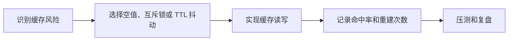

# SpringBoot 缓存治理模式

> 源码：`/Users/chenwei/Documents/code/java/learn-springboot/24-SpringBoot-cache-patterns`

## 核心思路

本模块演示缓存治理中的四类典型问题：[[缓存穿透]]、[[缓存击穿]]、[[缓存雪崩]]、[[热点 Key]]。示例用内存 Map 模拟缓存，但治理模式同样适用于 [[Redis]]。

## 项目结构

```text
src/main/java/com/cloud/
├── controller/CachePatternsController.java
├── service/
│   ├── CachePatternsService.java     (缓存治理核心)
│   └── InMemoryProductStore.java     (模拟数据库)
├── model/
│   ├── Product.java
│   ├── CachedProduct.java            (缓存包装对象)
│   └── CacheMetrics.java             (缓存指标)
├── common/ApiResult.java
└── exception/GlobalExceptionHandler.java
```

## 四类缓存问题

| 问题 | 现象 | 本模块方案 |
|------|------|------------|
| [[缓存穿透]] | 查询不存在数据，缓存永远 miss，请求持续打到数据库 | 存在性判断 + 空值缓存 |
| [[缓存击穿]] | 热点 key 过期瞬间，大量请求同时重建缓存 | 互斥锁 + 双重检查 |
| [[缓存雪崩]] | 大量 key 同时过期，数据库压力陡增 | TTL 抖动 |
| [[热点 Key]] | 单个高频 key 访问量极大，重建成本高 | 逻辑过期 + 异步刷新 |

## 关键配置

```yaml
demo:
  cache:
    base-ttl-seconds: 30
    ttl-jitter-seconds: 10
    null-ttl-seconds: 10
    hot-logical-expire-seconds: 30
    lock-wait-ms: 50
```

| 配置 | 说明 |
|------|------|
| `base-ttl-seconds` | 普通缓存基础 TTL |
| `ttl-jitter-seconds` | TTL 随机抖动秒数 |
| `null-ttl-seconds` | 空值缓存 TTL |
| `hot-logical-expire-seconds` | 热点 key 逻辑过期时间 |
| `lock-wait-ms` | 缓存重建锁等待时间 |

## 核心代码解析

### 普通查询：缓存穿透 + 击穿防护

```java
public Optional<Product> getProduct(Long id) {
    CacheReadResult cached = readCache(id, now, true);
    if (cached.hit()) {
        return cached.product();
    }

    metrics.incCacheMiss();
    if (!productStore.exists(id)) {
        cacheNullValue(id, now);
        return Optional.empty();
    }
    return loadWithMutex(id, false);
}
```

查询不存在商品时写入短 TTL 的空值缓存，避免同一个不存在 ID 反复打到数据库。

### 互斥重建：防止缓存击穿

```java
ReentrantLock lock = rebuildLocks.computeIfAbsent(id, key -> new ReentrantLock());
if (!lock.tryLock()) {
    metrics.incBreakdownLockWait();
    sleepSafely(lockWaitMs);
    CacheReadResult retryRead = readCache(id, System.currentTimeMillis(), true);
    if (retryRead.hit()) {
        return retryRead.product();
    }
    lock.lock();
}
```

> [!important] 双重检查
> 线程拿锁后再次读缓存，避免前一个线程已经完成重建后，后续线程重复查询数据库。

### TTL 抖动：缓解缓存雪崩

```java
private static long withJitter(long base, long jitter) {
    long random = ThreadLocalRandom.current().nextLong(jitter + 1);
    return Math.max(1, base + random);
}
```

普通缓存过期时间不是固定值，而是 `base + random(0, jitter)`，让 key 的过期点分散开。

### 热点 Key：逻辑过期 + 异步刷新

```java
if (cached.isLogicalExpired(now)) {
    triggerHotRefresh(id);
}
return Optional.of(cached.getProduct());
```

热点 key 逻辑过期后，当前请求仍返回旧值，同时触发后台线程刷新缓存。这是 [[Stale-While-Revalidate]] 思路。

```java
private void triggerHotRefresh(Long id) {
    if (!hotRefreshInProgress.add(id)) {
        return;
    }
    refreshExecutor.submit(() -> {
        try {
            Optional<Product> refreshed = loadFromStore(id);
            if (refreshed.isPresent()) {
                cacheHotValue(id, refreshed.get(), now);
            }
        } finally {
            hotRefreshInProgress.remove(id);
        }
    });
}
```

`hotRefreshInProgress` 保证同一热点 key 同一时间只有一个刷新任务。

## 初学者学习路线

- 先把这个案例当成“最小可运行样例”，目标是理解 SpringBoot 缓存治理模式 的主流程。
- 先运行 README 里的启动命令和 curl，再带着现象回到代码里找入口。
- 每读一个类都问三件事：它由谁调用、它依赖谁、它改变了什么状态。

## 代码导读

下面的代码片段来自案例源码，并额外补了中文教学注释。阅读时先看注释理解职责，再回到完整源码核对细节。

### 接口入口：Controller 如何接收请求

源码位置：`src/main/java/com/cloud/controller/CachePatternsController.java`

Controller 是 HTTP 世界和 Java 代码世界之间的边界：路径、请求参数、返回值都在这里集中出现。

```java
// 文件：com/cloud/controller/CachePatternsController.java
// 学习重点：Controller 是 HTTP 世界和 Java 代码世界之间的边界：路径、请求参数、返回值都在这里集中出现。
// @RestController 表示这个类的返回值会直接写到 HTTP 响应体里，常用于 JSON API。
@RestController
// 类级别路径是这一组接口的共同前缀。
@RequestMapping("/api/cache-patterns")
public class CachePatternsController {

    private final CachePatternsService cachePatternsService;

    // 构造器注入：依赖从 Spring 容器传入，代码更容易测试，也避免隐藏依赖。
    public CachePatternsController(CachePatternsService cachePatternsService) {
        this.cachePatternsService = cachePatternsService;
    }

    // 方法级别映射说明具体 HTTP 动词和子路径。
    @GetMapping
    public ApiResult<Map<String, Object>> moduleInfo() {
        Map<String, Object> info = new LinkedHashMap<>();
        info.put("module", "24-SpringBoot-cache-patterns");
        info.put("desc", "缓存穿透/击穿/雪崩与热点 key 逻辑过期演示");
        info.put("metrics", cachePatternsService.metrics().toMap());
        return ApiResult.success(info);
    }

    // 方法级别映射说明具体 HTTP 动词和子路径。
    @GetMapping("/product/{id}")
    public ResponseEntity<ApiResult<Product>> getProduct(@PathVariable Long id) {
        Optional<Product> product = cachePatternsService.getProduct(id);
        if (product.isEmpty()) {
            return ResponseEntity.status(404).body(ApiResult.fail(404, "商品不存在"));
        }
        return ResponseEntity.ok(ApiResult.success(product.get()));
    }

    // 方法级别映射说明具体 HTTP 动词和子路径。
    @GetMapping("/hot/{id}")
    public ResponseEntity<ApiResult<Product>> getHotProduct(@PathVariable Long id) {
        Optional<Product> product = cachePatternsService.getHotProduct(id);
        if (product.isEmpty()) {
            return ResponseEntity.status(404).body(ApiResult.fail(404, "商品不存在"));
        }
        return ResponseEntity.ok(ApiResult.success(product.get()));
    }

    // 方法级别映射说明具体 HTTP 动词和子路径。
    @PostMapping("/hot/{id}/mark")
    public ApiResult<Map<String, Object>> markHotKey(@PathVariable Long id) {
        cachePatternsService.markHotKey(id);
        Map<String, Object> data = new LinkedHashMap<>();
        data.put("hotKeyId", id);
        data.put("marked", true);
        return ApiResult.success(data);
    }

    // 方法级别映射说明具体 HTTP 动词和子路径。
    @DeleteMapping("/cache")
    public ApiResult<Map<String, Object>> clearCache() {
        cachePatternsService.clearCache();
        Map<String, Object> data = new LinkedHashMap<>();
        data.put("cleared", true);
        return ApiResult.success(data);
    }

    // 方法级别映射说明具体 HTTP 动词和子路径。
    @GetMapping("/metrics")
    public ApiResult<Map<String, Long>> metrics() {
        return ApiResult.success(cachePatternsService.metrics().toMap());
    }
}
```

关键点拆解：

- 先把 README 里的 curl 路径和这里的 `@RequestMapping` / `@GetMapping` / `@PostMapping` 对上。
- Controller 不应该堆复杂业务逻辑；看到它调用 Service，就说明职责分层是清楚的。
- 读完代码后，回到“生产差距”检查：安全、异常、监控、容量、测试是否都补齐。

### 业务核心：Service 如何组织规则

源码位置：`src/main/java/com/cloud/service/CachePatternsService.java`

Service 承载业务规则，初学者要重点看它如何校验输入、调用依赖、返回结果。

```java
// 文件：com/cloud/service/CachePatternsService.java
// 学习重点：Service 承载业务规则，初学者要重点看它如何校验输入、调用依赖、返回结果。
// @Service 表示这是业务层 Bean，会被 Spring 自动扫描并注入。
@Service
public class CachePatternsService {

    private final InMemoryProductStore productStore;
    private final long baseTtlSeconds;
    private final long ttlJitterSeconds;
    private final long nullTtlSeconds;
    private final long hotLogicalExpireSeconds;
    private final long lockWaitMs;

    private final ConcurrentMap<Long, CachedProduct> cache = new ConcurrentHashMap<>();
    private final ConcurrentMap<Long, ReentrantLock> rebuildLocks = new ConcurrentHashMap<>();
    private final Set<Long> hotKeys = ConcurrentHashMap.newKeySet();
    private final Set<Long> hotRefreshInProgress = ConcurrentHashMap.newKeySet();
    private final ExecutorService refreshExecutor = Executors.newFixedThreadPool(2);

    private final CacheMetrics metrics = new CacheMetrics();

    public CachePatternsService(InMemoryProductStore productStore,
                                @Value("${demo.cache.base-ttl-seconds:30}") long baseTtlSeconds,
                                @Value("${demo.cache.ttl-jitter-seconds:10}") long ttlJitterSeconds,
                                @Value("${demo.cache.null-ttl-seconds:10}") long nullTtlSeconds,
                                @Value("${demo.cache.hot-logical-expire-seconds:30}") long hotLogicalExpireSeconds,
                                @Value("${demo.cache.lock-wait-ms:50}") long lockWaitMs) {
        this.productStore = productStore;
        this.baseTtlSeconds = baseTtlSeconds;
        this.ttlJitterSeconds = ttlJitterSeconds;
        this.nullTtlSeconds = nullTtlSeconds;
        this.hotLogicalExpireSeconds = hotLogicalExpireSeconds;
        this.lockWaitMs = lockWaitMs;
    }

    public Optional<Product> getProduct(Long id) {
        validateId(id);
        long now = System.currentTimeMillis();
        CacheReadResult cached = readCache(id, now, true);
        if (cached.hit()) {
            return cached.product();
        }

        metrics.incCacheMiss();
        if (!productStore.exists(id)) {
            cacheNullValue(id, now);
            return Optional.empty();
        }
        return loadWithMutex(id, false);
    }

    public Optional<Product> getHotProduct(Long id) {
        validateId(id);
        if (!hotKeys.contains(id)) {
            return getProduct(id);
        }
        long now = System.currentTimeMillis();
        CachedProduct cached = cache.get(id);
        if (cached == null || cached.isExpired(now)) {
            metrics.incCacheMiss();
            return loadWithMutex(id, true);
        }

        metrics.incCacheHit();
        if (cached.isNullValue()) {
            metrics.incNullCacheHit();
            return Optional.empty();
        }

        if (cached.isLogicalExpired(now)) {
            triggerHotRefresh(id);
        }
        return Optional.of(cached.getProduct());
    }

    public void markHotKey(Long id) {
        validateId(id);
        hotKeys.add(id);
    }

    public CacheMetrics metrics() {
        return metrics;
    }

    public void clearCache() {
        cache.clear();
        hotRefreshInProgress.clear();
    }

    @PreDestroy
    public void shutdown() {
        refreshExecutor.shutdownNow();
    }

    private Optional<Product> loadWithMutex(Long id, boolean hotMode) {
        ReentrantLock lock = rebuildLocks.computeIfAbsent(id, key -> new ReentrantLock());
        if (!lock.tryLock()) {
            metrics.incBreakdownLockWait();
            sleepSafely(lockWaitMs);
            CacheReadResult retryRead = readCache(id, System.currentTimeMillis(), true);
            if (retryRead.hit()) {
                return retryRead.product();
            }
            lock.lock();
        }

        try {
            CacheReadResult doubleCheck = readCache(id, System.currentTimeMillis(), true);
    // ... 省略其余辅助代码，完整实现以源码为准。
}
```

关键点拆解：

- Service 的 public 方法通常就是一个用例，例如创建、查询、刷新、投递、同步。
- 先看输入校验，再看调用了哪些依赖，最后看返回对象。
- 读完代码后，回到“生产差距”检查：安全、异常、监控、容量、测试是否都补齐。

### 关键类：GlobalExceptionHandler

源码位置：`src/main/java/com/cloud/exception/GlobalExceptionHandler.java`

这是案例链路中的关键类，读它可以把 README 的概念落到具体代码。

```java
// 文件：com/cloud/exception/GlobalExceptionHandler.java
// 学习重点：这是案例链路中的关键类，读它可以把 README 的概念落到具体代码。
// @RestController 表示这个类的返回值会直接写到 HTTP 响应体里，常用于 JSON API。
@RestControllerAdvice
public class GlobalExceptionHandler {

    private static final Logger log = LoggerFactory.getLogger(GlobalExceptionHandler.class);

    @ExceptionHandler(IllegalArgumentException.class)
    @ResponseStatus(HttpStatus.BAD_REQUEST)
    public ApiResult<Void> handleIllegalArgumentException(IllegalArgumentException ex) {
        return ApiResult.fail(400, ex.getMessage());
    }

    @ExceptionHandler(Exception.class)
    @ResponseStatus(HttpStatus.INTERNAL_SERVER_ERROR)
    public ApiResult<Void> handleException(Exception ex) {
        log.error("Unhandled exception", ex);
        return ApiResult.fail(500, "系统异常，请稍后重试");
    }
}
```

关键点拆解：

- 先看这个类暴露了哪些 public 方法，再看它依赖了哪些对象。
- 读完代码后，回到“生产差距”检查：安全、异常、监控、容量、测试是否都补齐。

### 关键类：CachedProduct

源码位置：`src/main/java/com/cloud/model/CachedProduct.java`

这是案例链路中的关键类，读它可以把 README 的概念落到具体代码。

```java
// 文件：com/cloud/model/CachedProduct.java
// 学习重点：这是案例链路中的关键类，读它可以把 README 的概念落到具体代码。
public class CachedProduct {

    private final Product product;
    private final boolean nullValue;
    private final long expireAtMillis;
    private final long logicalExpireAtMillis;

    // 构造器注入：依赖从 Spring 容器传入，代码更容易测试，也避免隐藏依赖。
    public CachedProduct(Product product, boolean nullValue, long expireAtMillis, long logicalExpireAtMillis) {
        this.product = product;
        this.nullValue = nullValue;
        this.expireAtMillis = expireAtMillis;
        this.logicalExpireAtMillis = logicalExpireAtMillis;
    }

    public Product getProduct() {
        return product;
    }

    public boolean isNullValue() {
        return nullValue;
    }

    public boolean isExpired(long nowMillis) {
        return nowMillis >= expireAtMillis;
    }

    public boolean isLogicalExpired(long nowMillis) {
        return logicalExpireAtMillis > 0 && nowMillis >= logicalExpireAtMillis;
    }
}
```

关键点拆解：

- 先看这个类暴露了哪些 public 方法，再看它依赖了哪些对象。
- 读完代码后，回到“生产差距”检查：安全、异常、监控、容量、测试是否都补齐。

## 运行时调用链

- 从 README 的接口或测试名称开始，先定位入口类。
- 找 Controller、Runner、Listener 或 AutoConfiguration 作为第一阅读点。
- 沿着构造器注入的依赖继续进入 Service、Repository 或扩展点类。

## 初学者常见误区

- 只把接口跑通，却没有回到代码理解 Controller、Service、Repository 的分工。
- 把内存 Map、模拟客户端、固定配置当成生产实现。
- 只看 happy path，忽略参数错误、外部系统失败、并发和重复请求。

## API 接口

| 方法 | 路径 | 说明 |
|------|------|------|
| GET | `/api/cache-patterns` | 模块信息 |
| GET | `/api/cache-patterns/product/{id}` | 普通缓存查询 |
| GET | `/api/cache-patterns/hot/{id}` | 热点 key 查询 |
| POST | `/api/cache-patterns/hot/{id}/mark` | 标记热点 key |
| DELETE | `/api/cache-patterns/cache` | 清空缓存 |
| GET | `/api/cache-patterns/metrics` | 查看缓存指标 |

## 调用验证

```bash
mvn -pl 24-SpringBoot-cache-patterns spring-boot:run

curl "http://localhost:8104/api/cache-patterns/product/1"
curl "http://localhost:8104/api/cache-patterns/product/99999"
curl -X POST "http://localhost:8104/api/cache-patterns/hot/2/mark"
curl "http://localhost:8104/api/cache-patterns/hot/2"
curl "http://localhost:8104/api/cache-patterns/metrics"
```

## 生产差距

这个示例适合帮助初学者理解 缓存治理模式 的核心机制，但生产项目不能只停留在“能跑通”。真实落地时至少要补齐：统一鉴权、参数边界校验、异常响应、结构化日志、监控指标、自动化测试、配置隔离和容量评估。

如果模块涉及数据库、缓存、消息、网关、认证或外部服务，还要进一步考虑连接池、超时、重试、幂等、事务边界、数据一致性和故障告警。学习时可以先记住主流程，再用这些生产差距反向检查自己是否真正理解了案例。

## 要点总结

1. [[缓存穿透]] 用空值缓存或布隆过滤器降低无效查询压力
2. [[缓存击穿]] 用互斥锁让同一个 key 只有一个线程重建缓存
3. [[缓存雪崩]] 用 TTL 抖动让大量 key 的过期时间分散
4. [[热点 Key]] 用逻辑过期和异步刷新优先保证读请求稳定
5. 空值缓存 TTL 要短，避免数据库刚写入新数据后长时间读不到

## 实践流程



## 实践检查清单

- 是否区分穿透、击穿、雪崩和热点 Key。
- 空值缓存是否设置短 TTL。
- 缓存重建是否有互斥和超时保护。
- 热点 Key 是否支持逻辑过期和异步刷新。
- 是否监控命中率、重建耗时和下游数据库压力。

## 案例

商品详情页遇到热点商品时，可以返回逻辑未过期的旧缓存，同时后台异步刷新。用户看到的是稍旧但可用的数据，数据库也不会被瞬时流量击穿。

## 常见误区

- 所有 Key 使用相同 TTL，导致集中失效。
- 缓存未命中时所有请求同时查数据库。
- 空值缓存 TTL 太长，新数据写入后仍长期查不到。
