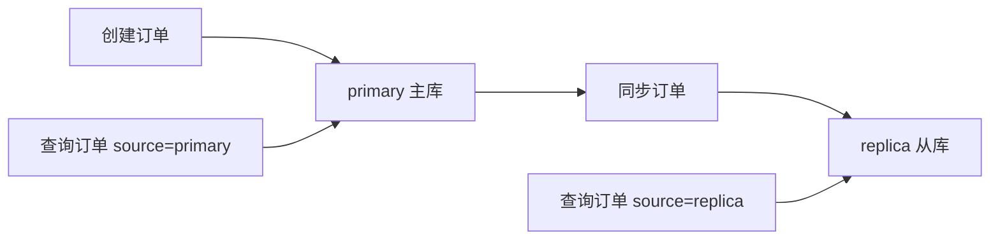

# SpringBoot 多数据源与事务边界

> 源码：`/Users/chenwei/Documents/code/java/learn-springboot/25-SpringBoot-multi-datasource-tx`

## 核心思路

本模块演示 [[SpringBoot]] 多数据源场景下的事务边界：主库写入、从库读取、手动同步、主库本地事务回滚，以及跨库操作失败时的非原子性。

## 项目结构

```text
src/main/java/com/cloud/
├── config/DataSourceConfig.java             (双数据源与事务管理器)
├── controller/MultiDataSourceController.java
├── repository/
│   ├── PrimaryOrderRepository.java          (主库订单访问)
│   └── ReplicaOrderRepository.java          (从库订单访问)
├── service/MultiDataSourceService.java      (事务边界演示)
├── model/OrderRecord.java
├── common/ApiResult.java
└── exception/GlobalExceptionHandler.java
```

## 多数据源配置

```yaml
demo:
  datasource:
    primary:
      url: jdbc:h2:mem:primarydb;MODE=MySQL;DB_CLOSE_DELAY=-1;DB_CLOSE_ON_EXIT=FALSE
      username: sa
      driver-class-name: org.h2.Driver
    replica:
      url: jdbc:h2:mem:replicadb;MODE=MySQL;DB_CLOSE_DELAY=-1;DB_CLOSE_ON_EXIT=FALSE
      username: sa
      driver-class-name: org.h2.Driver
```

示例使用两个 [[H2]] 内存库模拟主库和从库。

## 核心代码解析

### DataSourceConfig — 双数据源 Bean

```java
@Bean(name = "primaryDataSource")
@Primary
public DataSource primaryDataSource(...) { ... }

@Bean(name = "replicaDataSource")
public DataSource replicaDataSource(...) { ... }

@Bean(name = "primaryJdbcTemplate")
@Primary
public JdbcTemplate primaryJdbcTemplate(...) { ... }

@Bean(name = "replicaJdbcTemplate")
public JdbcTemplate replicaJdbcTemplate(...) { ... }
```

`@Primary` 标记默认数据源，`@Qualifier` 精确注入指定数据源，避免 Bean 歧义。

### 双事务管理器

```java
@Bean(name = "primaryTxManager")
@Primary
public PlatformTransactionManager primaryTxManager(...) {
    return new DataSourceTransactionManager(dataSource);
}

@Bean(name = "replicaTxManager")
public PlatformTransactionManager replicaTxManager(...) {
    return new DataSourceTransactionManager(dataSource);
}
```

每个数据源对应自己的本地事务管理器。这里不是分布式事务，不能自动保证跨库原子性。

### TransactionTemplate — 显式选择事务边界

```java
this.primaryTxTemplate = new TransactionTemplate(primaryTxManager);
this.replicaTxTemplate = new TransactionTemplate(replicaTxManager);
```

`TransactionTemplate` 让代码明确表达当前操作使用哪个事务管理器。

## 业务流程

### 写主库

```java
public long createOrder(Long userId, BigDecimal amount) {
    Long orderId = primaryTxTemplate.execute(status ->
            primaryOrderRepository.insert(userId, amount, "CREATED"));
    if (orderId == null) {
        throw new IllegalStateException("主库创建订单失败");
    }
    return orderId;
}
```

订单创建只进入主库事务。

### 从库同步

```java
public void syncToReplica(Long orderId) {
    replicaTxTemplate.executeWithoutResult(status -> {
        OrderRecord order = requireOrderFromPrimary(orderId);
        replicaOrderRepository.upsert(order);
    });
}
```

同步动作读取主库，再写入从库事务。它与主库创建事务不是同一个事务。

### 主库本地事务回滚

```java
primaryTxTemplate.executeWithoutResult(status -> {
    primaryOrderRepository.insert(userId, amount, "CREATED");
    throw new IllegalStateException("模拟主库本地事务失败，触发回滚");
});
```

同一个事务内抛出运行时异常，主库插入会回滚。

### 跨库边界非原子

```java
public CrossDsBoundaryResult demoCrossDsBoundary(Long userId, BigDecimal amount) {
    long orderId = createOrder(userId, amount);
    try {
        syncToReplicaAndFail(orderId);
    } catch (IllegalStateException ex) {
        replicaFailed = true;
    }
    boolean primaryCommitted = getOrder(orderId, "primary").isPresent();
    boolean replicaCommitted = getOrder(orderId, "replica").isPresent();
    return new CrossDsBoundaryResult(orderId, primaryCommitted, replicaCommitted, replicaFailed);
}
```

`createOrder` 已经提交主库事务，后续从库事务失败只能回滚从库，不能自动撤销主库提交。

> [!warning] 跨库事务边界
> 多个 `DataSourceTransactionManager` 只管理各自数据源的本地事务。没有 [[分布式事务]] 或补偿机制时，跨库操作可能出现部分成功。

## 读写分离模型



写请求进入主库，读请求可指定从主库或从库读取。同步前从库可能查不到最新数据，这是读写分离的常见一致性窗口。

## 初学者学习路线

- 先把这个案例当成“最小可运行样例”，目标是理解 SpringBoot 多数据源与事务边界 的主流程。
- 先运行 README 里的启动命令和 curl，再带着现象回到代码里找入口。
- 每读一个类都问三件事：它由谁调用、它依赖谁、它改变了什么状态。

## 代码导读

下面的代码片段来自案例源码，并额外补了中文教学注释。阅读时先看注释理解职责，再回到完整源码核对细节。

### 接口入口：Controller 如何接收请求

源码位置：`src/main/java/com/cloud/controller/MultiDataSourceController.java`

Controller 是 HTTP 世界和 Java 代码世界之间的边界：路径、请求参数、返回值都在这里集中出现。

```java
// 文件：com/cloud/controller/MultiDataSourceController.java
// 学习重点：Controller 是 HTTP 世界和 Java 代码世界之间的边界：路径、请求参数、返回值都在这里集中出现。
// @RestController 表示这个类的返回值会直接写到 HTTP 响应体里，常用于 JSON API。
@RestController
// 类级别路径是这一组接口的共同前缀。
@RequestMapping("/api/multi-ds")
public class MultiDataSourceController {

    private final MultiDataSourceService multiDataSourceService;

    // 构造器注入：依赖从 Spring 容器传入，代码更容易测试，也避免隐藏依赖。
    public MultiDataSourceController(MultiDataSourceService multiDataSourceService) {
        this.multiDataSourceService = multiDataSourceService;
    }

    // 方法级别映射说明具体 HTTP 动词和子路径。
    @GetMapping
    public ApiResult<Map<String, Object>> moduleInfo() {
        Map<String, Object> data = new LinkedHashMap<>();
        data.put("module", "25-SpringBoot-multi-datasource-tx");
        data.put("desc", "多数据源事务边界与读写分离演示");
        data.put("primaryOrderCount", multiDataSourceService.countPrimaryOrders());
        return ApiResult.success(data);
    }

    // 方法级别映射说明具体 HTTP 动词和子路径。
    @PostMapping("/orders")
    public ApiResult<Map<String, Object>> createOrder(@RequestParam Long userId,
                                                       @RequestParam BigDecimal amount) {
        long orderId = multiDataSourceService.createOrder(userId, amount);
        Map<String, Object> data = new LinkedHashMap<>();
        data.put("orderId", orderId);
        return ApiResult.success(data);
    }

    // 方法级别映射说明具体 HTTP 动词和子路径。
    @GetMapping("/orders/{id}")
    public ResponseEntity<ApiResult<OrderRecord>> getOrder(@PathVariable("id") Long id,
                                                            @RequestParam(defaultValue = "primary") String source) {
        Optional<OrderRecord> order = multiDataSourceService.getOrder(id, source);
        if (order.isEmpty()) {
            return ResponseEntity.status(404).body(ApiResult.fail(404, "订单不存在"));
        }
        return ResponseEntity.ok(ApiResult.success(order.get()));
    }

    // 方法级别映射说明具体 HTTP 动词和子路径。
    @PostMapping("/orders/{id}/sync")
    public ApiResult<Map<String, Object>> syncToReplica(@PathVariable("id") Long id) {
        multiDataSourceService.syncToReplica(id);
        Map<String, Object> data = new LinkedHashMap<>();
        data.put("orderId", id);
        data.put("synced", true);
        return ApiResult.success(data);
    }

    // 方法级别映射说明具体 HTTP 动词和子路径。
    @PostMapping("/demo/local-tx-rollback")
    public ApiResult<Map<String, Object>> demoLocalRollback(@RequestParam Long userId,
                                                             @RequestParam BigDecimal amount) {
        multiDataSourceService.demoLocalTxRollback(userId, amount);
        Map<String, Object> data = new LinkedHashMap<>();
        data.put("rolledBack", true);
        return ApiResult.success(data);
    }

    // 方法级别映射说明具体 HTTP 动词和子路径。
    @PostMapping("/demo/cross-ds-boundary")
    public ApiResult<MultiDataSourceService.CrossDsBoundaryResult> demoCrossDsBoundary(@RequestParam Long userId,
                                                                                         @RequestParam BigDecimal amount) {
        return ApiResult.success(multiDataSourceService.demoCrossDsBoundary(userId, amount));
    }
}
```

关键点拆解：

- 先把 README 里的 curl 路径和这里的 `@RequestMapping` / `@GetMapping` / `@PostMapping` 对上。
- Controller 不应该堆复杂业务逻辑；看到它调用 Service，就说明职责分层是清楚的。
- 读完代码后，回到“生产差距”检查：安全、异常、监控、容量、测试是否都补齐。

### 业务核心：Service 如何组织规则

源码位置：`src/main/java/com/cloud/service/MultiDataSourceService.java`

Service 承载业务规则，初学者要重点看它如何校验输入、调用依赖、返回结果。

```java
// 文件：com/cloud/service/MultiDataSourceService.java
// 学习重点：Service 承载业务规则，初学者要重点看它如何校验输入、调用依赖、返回结果。
// @Service 表示这是业务层 Bean，会被 Spring 自动扫描并注入。
@Service
public class MultiDataSourceService {

    private final PrimaryOrderRepository primaryOrderRepository;
    private final ReplicaOrderRepository replicaOrderRepository;
    private final TransactionTemplate primaryTxTemplate;
    private final TransactionTemplate replicaTxTemplate;

    public MultiDataSourceService(PrimaryOrderRepository primaryOrderRepository,
                                  ReplicaOrderRepository replicaOrderRepository,
                                  @Qualifier("primaryTxManager") PlatformTransactionManager primaryTxManager,
                                  @Qualifier("replicaTxManager") PlatformTransactionManager replicaTxManager) {
        this.primaryOrderRepository = primaryOrderRepository;
        this.replicaOrderRepository = replicaOrderRepository;
        this.primaryTxTemplate = new TransactionTemplate(primaryTxManager);
        this.replicaTxTemplate = new TransactionTemplate(replicaTxManager);
    }

    public long createOrder(Long userId, BigDecimal amount) {
        validateCreateArgs(userId, amount);
        Long orderId = primaryTxTemplate.execute(status ->
                primaryOrderRepository.insert(userId, amount, "CREATED"));
        if (orderId == null) {
            throw new IllegalStateException("主库创建订单失败");
        }
        return orderId;
    }

    public Optional<OrderRecord> getOrder(Long orderId, String source) {
        validateOrderId(orderId);
        String normalized = normalizeSource(source);
        if ("primary".equals(normalized)) {
            return primaryOrderRepository.findById(orderId);
        }
        return replicaOrderRepository.findById(orderId);
    }

    public void syncToReplica(Long orderId) {
        validateOrderId(orderId);
        replicaTxTemplate.executeWithoutResult(status -> {
            OrderRecord order = requireOrderFromPrimary(orderId);
            replicaOrderRepository.upsert(order);
        });
    }

    public void demoLocalTxRollback(Long userId, BigDecimal amount) {
        validateCreateArgs(userId, amount);
        primaryTxTemplate.executeWithoutResult(status -> {
            primaryOrderRepository.insert(userId, amount, "CREATED");
            throw new IllegalStateException("模拟主库本地事务失败，触发回滚");
        });
    }

    public CrossDsBoundaryResult demoCrossDsBoundary(Long userId, BigDecimal amount) {
        long orderId = createOrder(userId, amount);
        boolean replicaFailed = false;
        try {
            syncToReplicaAndFail(orderId);
        } catch (IllegalStateException ex) {
            replicaFailed = true;
        }
        boolean primaryCommitted = getOrder(orderId, "primary").isPresent();
        boolean replicaCommitted = getOrder(orderId, "replica").isPresent();
        return new CrossDsBoundaryResult(orderId, primaryCommitted, replicaCommitted, replicaFailed);
    }

    public int countPrimaryOrders() {
        return primaryOrderRepository.count();
    }

    public void clearAll() {
        primaryOrderRepository.deleteAll();
        replicaOrderRepository.deleteAll();
    }

    private void syncToReplicaAndFail(Long orderId) {
        replicaTxTemplate.executeWithoutResult(status -> {
            OrderRecord order = requireOrderFromPrimary(orderId);
            replicaOrderRepository.upsert(order);
            throw new IllegalStateException("模拟从库同步失败，触发从库回滚");
        });
    }

    private OrderRecord requireOrderFromPrimary(Long orderId) {
        return primaryOrderRepository.findById(orderId)
                .orElseThrow(() -> new IllegalArgumentException("主库不存在订单: " + orderId));
    }

    private static String normalizeSource(String source) {
        if (source == null || source.isBlank()) {
            throw new IllegalArgumentException("source必须是primary或replica");
        }
        String normalized = source.toLowerCase(Locale.ROOT);
        if (!"primary".equals(normalized) && !"replica".equals(normalized)) {
            throw new IllegalArgumentException("source必须是primary或replica");
        }
        return normalized;
    }

    private static void validateOrderId(Long orderId) {
        if (orderId == null || orderId <= 0) {
            throw new IllegalArgumentException("orderId必须大于0");
        }
    }

    // ... 省略其余辅助代码，完整实现以源码为准。
}
```

关键点拆解：

- Service 的 public 方法通常就是一个用例，例如创建、查询、刷新、投递、同步。
- 先看输入校验，再看调用了哪些依赖，最后看返回对象。
- 读完代码后，回到“生产差距”检查：安全、异常、监控、容量、测试是否都补齐。

### 配置类：Spring 如何注册基础设施

源码位置：`src/main/java/com/cloud/config/DataSourceConfig.java`

配置类负责把基础设施对象注册到 Spring 容器，后续请求或启动流程才会用到它们。

```java
// 文件：com/cloud/config/DataSourceConfig.java
// 学习重点：配置类负责把基础设施对象注册到 Spring 容器，后续请求或启动流程才会用到它们。
// @Configuration 表示这里会声明或注册 Spring 基础设施。
@Configuration
@EnableTransactionManagement
public class DataSourceConfig {

    // @Bean 的返回对象会进入 Spring 容器，之后可以被其他类注入使用。
    @Bean(name = "primaryDataSourceProperties")
    @Primary
    // 把 application.yml/properties 中同前缀的配置绑定到这个对象。
    @ConfigurationProperties(prefix = "demo.datasource.primary")
    public DataSourceProperties primaryDataSourceProperties() {
        return new DataSourceProperties();
    }

    // @Bean 的返回对象会进入 Spring 容器，之后可以被其他类注入使用。
    @Bean(name = "primaryDataSource")
    @Primary
    public DataSource primaryDataSource(@Qualifier("primaryDataSourceProperties") DataSourceProperties properties) {
        return properties.initializeDataSourceBuilder().build();
    }

    // @Bean 的返回对象会进入 Spring 容器，之后可以被其他类注入使用。
    @Bean(name = "replicaDataSourceProperties")
    // 把 application.yml/properties 中同前缀的配置绑定到这个对象。
    @ConfigurationProperties(prefix = "demo.datasource.replica")
    public DataSourceProperties replicaDataSourceProperties() {
        return new DataSourceProperties();
    }

    // @Bean 的返回对象会进入 Spring 容器，之后可以被其他类注入使用。
    @Bean(name = "replicaDataSource")
    public DataSource replicaDataSource(@Qualifier("replicaDataSourceProperties") DataSourceProperties properties) {
        return properties.initializeDataSourceBuilder().build();
    }

    // @Bean 的返回对象会进入 Spring 容器，之后可以被其他类注入使用。
    @Bean(name = "primaryJdbcTemplate")
    @Primary
    public JdbcTemplate primaryJdbcTemplate(@Qualifier("primaryDataSource") DataSource dataSource) {
        return new JdbcTemplate(dataSource);
    }

    // @Bean 的返回对象会进入 Spring 容器，之后可以被其他类注入使用。
    @Bean(name = "replicaJdbcTemplate")
    public JdbcTemplate replicaJdbcTemplate(@Qualifier("replicaDataSource") DataSource dataSource) {
        return new JdbcTemplate(dataSource);
    }

    // @Bean 的返回对象会进入 Spring 容器，之后可以被其他类注入使用。
    @Bean(name = "primaryTxManager")
    @Primary
    public PlatformTransactionManager primaryTxManager(@Qualifier("primaryDataSource") DataSource dataSource) {
        return new DataSourceTransactionManager(dataSource);
    }

    // @Bean 的返回对象会进入 Spring 容器，之后可以被其他类注入使用。
    @Bean(name = "replicaTxManager")
    public PlatformTransactionManager replicaTxManager(@Qualifier("replicaDataSource") DataSource dataSource) {
        return new DataSourceTransactionManager(dataSource);
    }
}
```

关键点拆解：

- 配置类的重点不是业务规则，而是“把谁注册到容器、在什么条件下注册”。
- 读完代码后，回到“生产差距”检查：安全、异常、监控、容量、测试是否都补齐。

### 数据访问：示例如何保存和查询数据

源码位置：`src/main/java/com/cloud/repository/PrimaryOrderRepository.java`

Repository 隐藏存储细节，让 Service 不必关心数据怎么存。

```java
// 文件：com/cloud/repository/PrimaryOrderRepository.java
// 学习重点：Repository 隐藏存储细节，让 Service 不必关心数据怎么存。
// @Repository 表示数据访问层 Bean，真实项目通常连接数据库或外部存储。
@Repository
public class PrimaryOrderRepository {

    private final JdbcTemplate jdbcTemplate;

    public PrimaryOrderRepository(@Qualifier("primaryJdbcTemplate") JdbcTemplate jdbcTemplate) {
        this.jdbcTemplate = jdbcTemplate;
    }

    @PostConstruct
    public void initSchema() {
        jdbcTemplate.execute("""
                CREATE TABLE IF NOT EXISTS orders (
                    id BIGINT AUTO_INCREMENT PRIMARY KEY,
                    user_id BIGINT NOT NULL,
                    amount DECIMAL(10, 2) NOT NULL,
                    status VARCHAR(20) NOT NULL,
                    create_time TIMESTAMP NOT NULL
                )
                """);
    }

    public long insert(Long userId, BigDecimal amount, String status) {
        KeyHolder keyHolder = new GeneratedKeyHolder();
        jdbcTemplate.update(connection -> {
            PreparedStatement ps = connection.prepareStatement(
                    "INSERT INTO orders (user_id, amount, status, create_time) VALUES (?, ?, ?, ?)",
                    Statement.RETURN_GENERATED_KEYS
            );
            ps.setLong(1, userId);
            ps.setBigDecimal(2, amount);
            ps.setString(3, status);
            ps.setObject(4, LocalDateTime.now());
            return ps;
        }, keyHolder);
        Number key = keyHolder.getKey();
        if (key == null) {
            throw new IllegalStateException("主库插入订单失败，未返回主键");
        }
        return key.longValue();
    }

    public Optional<OrderRecord> findById(Long id) {
        List<OrderRecord> rows = jdbcTemplate.query(
                "SELECT id, user_id, amount, status, create_time FROM orders WHERE id = ?",
                (rs, rowNum) -> new OrderRecord(
                        rs.getLong("id"),
                        rs.getLong("user_id"),
                        rs.getBigDecimal("amount"),
                        rs.getString("status"),
                        rs.getTimestamp("create_time").toLocalDateTime()
                ),
                id
        );
        return rows.stream().findFirst();
    }

    public int count() {
        Integer value = jdbcTemplate.queryForObject("SELECT COUNT(1) FROM orders", Integer.class);
        return value == null ? 0 : value;
    }

    public void deleteAll() {
        jdbcTemplate.update("DELETE FROM orders");
    }
}
```

关键点拆解：

- 示例里的 Repository 多半是内存实现；真实项目要替换成数据库、缓存或外部服务。
- 读完代码后，回到“生产差距”检查：安全、异常、监控、容量、测试是否都补齐。

## 运行时调用链

1. DataSourceConfig：启动时注册配置、Bean 或扩展点
2. MultiDataSourceController：接收 HTTP 请求并转换成 Java 方法调用
3. MultiDataSourceService：执行案例的核心业务规则
4. PrimaryOrderRepository：保存或查询示例数据

## 初学者常见误区

- 只把接口跑通，却没有回到代码理解 Controller、Service、Repository 的分工。
- 把内存 Map、模拟客户端、固定配置当成生产实现。
- 只看 happy path，忽略参数错误、外部系统失败、并发和重复请求。

## API 接口

| 方法 | 路径 | 说明 |
|------|------|------|
| GET | `/api/multi-ds` | 模块信息 |
| POST | `/api/multi-ds/orders?userId=2001&amount=66.00` | 写入主库订单 |
| GET | `/api/multi-ds/orders/{id}?source=primary` | 从主库读取订单 |
| GET | `/api/multi-ds/orders/{id}?source=replica` | 从从库读取订单 |
| POST | `/api/multi-ds/orders/{id}/sync` | 同步订单到从库 |
| POST | `/api/multi-ds/demo/local-tx-rollback` | 演示主库本地事务回滚 |
| POST | `/api/multi-ds/demo/cross-ds-boundary` | 演示跨库非原子边界 |

## 调用验证

```bash
mvn -pl 25-SpringBoot-multi-datasource-tx spring-boot:run

curl -X POST "http://localhost:8105/api/multi-ds/orders?userId=2001&amount=66.00"
curl "http://localhost:8105/api/multi-ds/orders/1?source=primary"
curl "http://localhost:8105/api/multi-ds/orders/1?source=replica"
curl -X POST "http://localhost:8105/api/multi-ds/orders/1/sync"
curl "http://localhost:8105/api/multi-ds/orders/1?source=replica"
```

## 生产差距

这个示例适合帮助初学者理解 多数据源与事务边界 的核心机制，但生产项目不能只停留在“能跑通”。真实落地时至少要补齐：统一鉴权、参数边界校验、异常响应、结构化日志、监控指标、自动化测试、配置隔离和容量评估。

如果模块涉及数据库、缓存、消息、网关、认证或外部服务，还要进一步考虑连接池、超时、重试、幂等、事务边界、数据一致性和故障告警。学习时可以先记住主流程，再用这些生产差距反向检查自己是否真正理解了案例。

## 要点总结

1. 多数据源需要为每个数据源分别定义 `DataSource`、`JdbcTemplate` 和事务管理器
2. `@Primary` 负责默认选择，`@Qualifier` 负责精确注入
3. `TransactionTemplate` 可以显式控制某段代码使用哪个事务管理器
4. 本地事务只保证单个数据源内的原子性，跨库操作默认不是原子事务
5. 读写分离存在同步延迟，业务要能接受短时间的主从不一致
