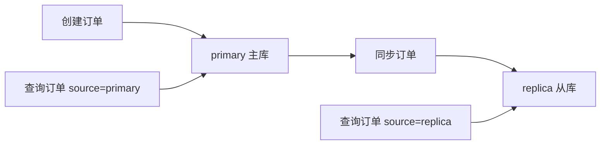

# SpringBoot 多数据源与事务边界

> 源码：`/Users/chenwei/Documents/code/java/learn-springboot/25-SpringBoot-multi-datasource-tx`

## 核心思路

本模块演示 [[SpringBoot]] 多数据源场景下的事务边界：主库写入、从库读取、手动同步、主库本地事务回滚，以及跨库操作失败时的非原子性。

## 项目结构

```text
src/main/java/com/cloud/
├── config/DataSourceConfig.java             (双数据源与事务管理器)
├── controller/MultiDataSourceController.java
├── repository/
│   ├── PrimaryOrderRepository.java          (主库订单访问)
│   └── ReplicaOrderRepository.java          (从库订单访问)
├── service/MultiDataSourceService.java      (事务边界演示)
├── model/OrderRecord.java
├── common/ApiResult.java
└── exception/GlobalExceptionHandler.java
```

## 多数据源配置

```yaml
demo:
  datasource:
    primary:
      url: jdbc:h2:mem:primarydb;MODE=MySQL;DB_CLOSE_DELAY=-1;DB_CLOSE_ON_EXIT=FALSE
      username: sa
      driver-class-name: org.h2.Driver
    replica:
      url: jdbc:h2:mem:replicadb;MODE=MySQL;DB_CLOSE_DELAY=-1;DB_CLOSE_ON_EXIT=FALSE
      username: sa
      driver-class-name: org.h2.Driver
```

示例使用两个 [[H2]] 内存库模拟主库和从库。

## 核心代码解析

### DataSourceConfig — 双数据源 Bean

```java
@Bean(name = "primaryDataSource")
@Primary
public DataSource primaryDataSource(...) { ... }

@Bean(name = "replicaDataSource")
public DataSource replicaDataSource(...) { ... }

@Bean(name = "primaryJdbcTemplate")
@Primary
public JdbcTemplate primaryJdbcTemplate(...) { ... }

@Bean(name = "replicaJdbcTemplate")
public JdbcTemplate replicaJdbcTemplate(...) { ... }
```

`@Primary` 标记默认数据源，`@Qualifier` 精确注入指定数据源，避免 Bean 歧义。

### 双事务管理器

```java
@Bean(name = "primaryTxManager")
@Primary
public PlatformTransactionManager primaryTxManager(...) {
    return new DataSourceTransactionManager(dataSource);
}

@Bean(name = "replicaTxManager")
public PlatformTransactionManager replicaTxManager(...) {
    return new DataSourceTransactionManager(dataSource);
}
```

每个数据源对应自己的本地事务管理器。这里不是分布式事务，不能自动保证跨库原子性。

### TransactionTemplate — 显式选择事务边界

```java
this.primaryTxTemplate = new TransactionTemplate(primaryTxManager);
this.replicaTxTemplate = new TransactionTemplate(replicaTxManager);
```

`TransactionTemplate` 让代码明确表达当前操作使用哪个事务管理器。

## 业务流程

### 写主库

```java
public long createOrder(Long userId, BigDecimal amount) {
    Long orderId = primaryTxTemplate.execute(status ->
            primaryOrderRepository.insert(userId, amount, "CREATED"));
    if (orderId == null) {
        throw new IllegalStateException("主库创建订单失败");
    }
    return orderId;
}
```

订单创建只进入主库事务。

### 从库同步

```java
public void syncToReplica(Long orderId) {
    replicaTxTemplate.executeWithoutResult(status -> {
        OrderRecord order = requireOrderFromPrimary(orderId);
        replicaOrderRepository.upsert(order);
    });
}
```

同步动作读取主库，再写入从库事务。它与主库创建事务不是同一个事务。

### 主库本地事务回滚

```java
primaryTxTemplate.executeWithoutResult(status -> {
    primaryOrderRepository.insert(userId, amount, "CREATED");
    throw new IllegalStateException("模拟主库本地事务失败，触发回滚");
});
```

同一个事务内抛出运行时异常，主库插入会回滚。

### 跨库边界非原子

```java
public CrossDsBoundaryResult demoCrossDsBoundary(Long userId, BigDecimal amount) {
    long orderId = createOrder(userId, amount);
    try {
        syncToReplicaAndFail(orderId);
    } catch (IllegalStateException ex) {
        replicaFailed = true;
    }
    boolean primaryCommitted = getOrder(orderId, "primary").isPresent();
    boolean replicaCommitted = getOrder(orderId, "replica").isPresent();
    return new CrossDsBoundaryResult(orderId, primaryCommitted, replicaCommitted, replicaFailed);
}
```

`createOrder` 已经提交主库事务，后续从库事务失败只能回滚从库，不能自动撤销主库提交。

> [!warning] 跨库事务边界
> 多个 `DataSourceTransactionManager` 只管理各自数据源的本地事务。没有 [[分布式事务]] 或补偿机制时，跨库操作可能出现部分成功。

## 读写分离模型



写请求进入主库，读请求可指定从主库或从库读取。同步前从库可能查不到最新数据，这是读写分离的常见一致性窗口。

## API 接口

| 方法 | 路径 | 说明 |
|------|------|------|
| GET | `/api/multi-ds` | 模块信息 |
| POST | `/api/multi-ds/orders?userId=2001&amount=66.00` | 写入主库订单 |
| GET | `/api/multi-ds/orders/{id}?source=primary` | 从主库读取订单 |
| GET | `/api/multi-ds/orders/{id}?source=replica` | 从从库读取订单 |
| POST | `/api/multi-ds/orders/{id}/sync` | 同步订单到从库 |
| POST | `/api/multi-ds/demo/local-tx-rollback` | 演示主库本地事务回滚 |
| POST | `/api/multi-ds/demo/cross-ds-boundary` | 演示跨库非原子边界 |

## 调用验证

```bash
mvn -pl 25-SpringBoot-multi-datasource-tx spring-boot:run

curl -X POST "http://localhost:8105/api/multi-ds/orders?userId=2001&amount=66.00"
curl "http://localhost:8105/api/multi-ds/orders/1?source=primary"
curl "http://localhost:8105/api/multi-ds/orders/1?source=replica"
curl -X POST "http://localhost:8105/api/multi-ds/orders/1/sync"
curl "http://localhost:8105/api/multi-ds/orders/1?source=replica"
```

## 要点总结

1. 多数据源需要为每个数据源分别定义 `DataSource`、`JdbcTemplate` 和事务管理器
2. `@Primary` 负责默认选择，`@Qualifier` 负责精确注入
3. `TransactionTemplate` 可以显式控制某段代码使用哪个事务管理器
4. 本地事务只保证单个数据源内的原子性，跨库操作默认不是原子事务
5. 读写分离存在同步延迟，业务要能接受短时间的主从不一致
