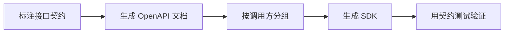

# SpringBoot OpenAPI 与客户端 SDK

> 源码：`/Users/chenwei/Documents/code/java/learn-springboot/26-SpringBoot-openapi-client-sdk`

## 核心思路

本模块演示用 [[OpenAPI]] 自动生成接口文档，并通过 `GroupedOpenApi` 将公共接口与管理接口分组，最后基于 OpenAPI 规范生成 Java 或 TypeScript 客户端 SDK。

## 项目结构

```text
src/main/java/com/cloud/
├── config/OpenApiConfig.java              (OpenAPI 元信息与分组)
├── controller/OpenApiDemoController.java  (public/admin 演示接口)
├── service/
│   ├── InMemoryProductCatalogService.java (商品目录)
│   └── SdkGenerationService.java          (SDK 命令生成)
├── model/
│   ├── ProductDto.java
│   └── SdkCommand.java
├── common/ApiResult.java
└── exception/GlobalExceptionHandler.java
```

## 依赖与能力

| 能力 | 说明 |
|------|------|
| OpenAPI 文档自动暴露 | 通过 springdoc 生成 `/v3/api-docs` |
| Swagger UI | 通过 `/swagger-ui/index.html` 浏览接口 |
| 接口分组 | `public` 与 `admin` 分别生成规范 |
| SDK 生成 | 使用 `openapi-generator-cli` 输出不同语言客户端 |

## OpenAPI 配置

```java
@Bean
public OpenAPI openAPI() {
    return new OpenAPI()
            .info(new Info()
                    .title("OpenAPI Client SDK Demo")
                    .description("OpenAPI 分组与 SDK 生成命令演示模块")
                    .version("v1.0.0"));
}
```

`OpenAPI` Bean 用来定义文档标题、描述和版本，是接口文档的全局元信息。

## 接口分组

```java
@Bean
public GroupedOpenApi publicApi() {
    return GroupedOpenApi.builder()
            .group("public")
            .pathsToMatch("/api/openapi/public/**")
            .build();
}

@Bean
public GroupedOpenApi adminApi() {
    return GroupedOpenApi.builder()
            .group("admin")
            .pathsToMatch("/api/openapi/admin/**")
            .build();
}
```

分组后会生成独立文档：

| 分组 | 文档地址 | 适用对象 |
|------|----------|----------|
| 全量 | `/v3/api-docs` | 内部查看所有接口 |
| public | `/v3/api-docs/public` | 对外开放接口 |
| admin | `/v3/api-docs/admin` | 后台管理接口 |

> [!important] 分组价值
> SDK 生成时通常不希望把内部管理接口暴露给外部客户端，按路径分组可以让不同调用方拿到不同 API 契约。

## SDK 生成命令

```java
String publicSpec = baseUrl + "/v3/api-docs/public";
String adminSpec = baseUrl + "/v3/api-docs/admin";

commands.add(new SdkCommand(
        "java",
        publicSpec,
        "./sdk/java-public",
        "openapi-generator-cli generate -i " + publicSpec + " -g java -o ./sdk/java-public"
));
commands.add(new SdkCommand(
        "typescript-axios",
        adminSpec,
        "./sdk/ts-admin",
        "openapi-generator-cli generate -i " + adminSpec + " -g typescript-axios -o ./sdk/ts-admin"
));
```

SDK 生成的核心输入是 OpenAPI JSON 地址，输出语言由 `-g` 参数决定。

```bash
openapi-generator-cli generate -i http://localhost:8106/v3/api-docs/public -g java -o ./sdk/java-public
openapi-generator-cli generate -i http://localhost:8106/v3/api-docs/admin -g typescript-axios -o ./sdk/ts-admin
```

## API 接口

| 方法 | 路径 | 说明 |
|------|------|------|
| GET | `/api/openapi` | 模块信息 |
| GET | `/api/openapi/public/products/{id}` | public 商品查询 |
| GET | `/api/openapi/admin/products` | admin 商品列表 |
| POST | `/api/openapi/admin/products` | admin 新增商品 |
| GET | `/api/openapi/sdk/commands` | 查看 SDK 生成命令 |

## 调用验证

```bash
mvn -pl 26-SpringBoot-openapi-client-sdk spring-boot:run

curl "http://localhost:8106/api/openapi"
curl "http://localhost:8106/api/openapi/public/products/1"
curl -X POST "http://localhost:8106/api/openapi/admin/products?id=9&name=Camera&price=3999.00"
curl "http://localhost:8106/v3/api-docs/public"
```

## 要点总结

1. [[OpenAPI]] 是接口契约，既能生成文档，也能生成客户端代码
2. `GroupedOpenApi` 可以按路径拆分 public/admin 等不同 API 视图
3. SDK 生成应基于分组后的 API 文档，避免把内部接口暴露给外部调用方
4. `serverUrl` 生成命令前要规范化，避免尾部 `/` 造成路径重复
5. 文档地址、Swagger UI、SDK 命令构成接口交付闭环

## 实践流程



## 实践检查清单

- 接口 DTO、错误码、分页和认证信息是否完整出现在文档中。
- public、admin、internal 是否按权限边界分组。
- SDK 生成是否纳入 CI，避免手工漂移。
- 破坏性字段变更是否有版本策略。
- 文档示例是否能真实调用通过。

## 案例

对外开放商品查询接口时，只生成 public SDK；后台商品管理接口放在 admin 分组，避免外部调用方误拿到管理接口契约。

## 常见误区

- 文档只展示接口路径，不描述错误响应和认证方式。
- 内部接口混进外部 SDK。
- 后端接口改了，客户端 SDK 没同步更新。
