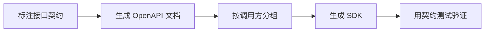

# SpringBoot OpenAPI 与客户端 SDK

> 源码：`/Users/chenwei/Documents/code/java/learn-springboot/26-SpringBoot-openapi-client-sdk`

## 核心思路

本模块演示用 [[OpenAPI]] 自动生成接口文档，并通过 `GroupedOpenApi` 将公共接口与管理接口分组，最后基于 OpenAPI 规范生成 Java 或 TypeScript 客户端 SDK。

## 项目结构

```text
src/main/java/com/cloud/
├── config/OpenApiConfig.java              (OpenAPI 元信息与分组)
├── controller/OpenApiDemoController.java  (public/admin 演示接口)
├── service/
│   ├── InMemoryProductCatalogService.java (商品目录)
│   └── SdkGenerationService.java          (SDK 命令生成)
├── model/
│   ├── ProductDto.java
│   └── SdkCommand.java
├── common/ApiResult.java
└── exception/GlobalExceptionHandler.java
```

## 依赖与能力

| 能力 | 说明 |
|------|------|
| OpenAPI 文档自动暴露 | 通过 springdoc 生成 `/v3/api-docs` |
| Swagger UI | 通过 `/swagger-ui/index.html` 浏览接口 |
| 接口分组 | `public` 与 `admin` 分别生成规范 |
| SDK 生成 | 使用 `openapi-generator-cli` 输出不同语言客户端 |

## OpenAPI 配置

```java
@Bean
public OpenAPI openAPI() {
    return new OpenAPI()
            .info(new Info()
                    .title("OpenAPI Client SDK Demo")
                    .description("OpenAPI 分组与 SDK 生成命令演示模块")
                    .version("v1.0.0"));
}
```

`OpenAPI` Bean 用来定义文档标题、描述和版本，是接口文档的全局元信息。

## 接口分组

```java
@Bean
public GroupedOpenApi publicApi() {
    return GroupedOpenApi.builder()
            .group("public")
            .pathsToMatch("/api/openapi/public/**")
            .build();
}

@Bean
public GroupedOpenApi adminApi() {
    return GroupedOpenApi.builder()
            .group("admin")
            .pathsToMatch("/api/openapi/admin/**")
            .build();
}
```

分组后会生成独立文档：

| 分组 | 文档地址 | 适用对象 |
|------|----------|----------|
| 全量 | `/v3/api-docs` | 内部查看所有接口 |
| public | `/v3/api-docs/public` | 对外开放接口 |
| admin | `/v3/api-docs/admin` | 后台管理接口 |

> [!important] 分组价值
> SDK 生成时通常不希望把内部管理接口暴露给外部客户端，按路径分组可以让不同调用方拿到不同 API 契约。

## SDK 生成命令

```java
String publicSpec = baseUrl + "/v3/api-docs/public";
String adminSpec = baseUrl + "/v3/api-docs/admin";

commands.add(new SdkCommand(
        "java",
        publicSpec,
        "./sdk/java-public",
        "openapi-generator-cli generate -i " + publicSpec + " -g java -o ./sdk/java-public"
));
commands.add(new SdkCommand(
        "typescript-axios",
        adminSpec,
        "./sdk/ts-admin",
        "openapi-generator-cli generate -i " + adminSpec + " -g typescript-axios -o ./sdk/ts-admin"
));
```

SDK 生成的核心输入是 OpenAPI JSON 地址，输出语言由 `-g` 参数决定。

```bash
openapi-generator-cli generate -i http://localhost:8106/v3/api-docs/public -g java -o ./sdk/java-public
openapi-generator-cli generate -i http://localhost:8106/v3/api-docs/admin -g typescript-axios -o ./sdk/ts-admin
```

## 初学者学习路线

- 先把这个案例当成“最小可运行样例”，目标是理解 SpringBoot OpenAPI 与客户端 SDK 的主流程。
- 先运行 README 里的启动命令和 curl，再带着现象回到代码里找入口。
- 每读一个类都问三件事：它由谁调用、它依赖谁、它改变了什么状态。

## 代码导读

下面的代码片段来自案例源码，并额外补了中文教学注释。阅读时先看注释理解职责，再回到完整源码核对细节。

### 接口入口：Controller 如何接收请求

源码位置：`src/main/java/com/cloud/controller/OpenApiDemoController.java`

Controller 是 HTTP 世界和 Java 代码世界之间的边界：路径、请求参数、返回值都在这里集中出现。

```java
// 文件：com/cloud/controller/OpenApiDemoController.java
// 学习重点：Controller 是 HTTP 世界和 Java 代码世界之间的边界：路径、请求参数、返回值都在这里集中出现。
// @RestController 表示这个类的返回值会直接写到 HTTP 响应体里，常用于 JSON API。
@RestController
// 类级别路径是这一组接口的共同前缀。
@RequestMapping("/api/openapi")
public class OpenApiDemoController {

    private final InMemoryProductCatalogService catalogService;
    private final SdkGenerationService sdkGenerationService;

    public OpenApiDemoController(InMemoryProductCatalogService catalogService,
                                 SdkGenerationService sdkGenerationService) {
        this.catalogService = catalogService;
        this.sdkGenerationService = sdkGenerationService;
    }

    @Operation(summary = "模块信息与文档入口")
    // 方法级别映射说明具体 HTTP 动词和子路径。
    @GetMapping
    public ApiResult<Map<String, Object>> moduleInfo() {
        Map<String, Object> data = new LinkedHashMap<>();
        data.put("module", "26-SpringBoot-openapi-client-sdk");
        data.put("desc", "OpenAPI 文档分组与 SDK 生成命令演示");
        data.put("publicApiDocUrl", "/v3/api-docs/public");
        data.put("adminApiDocUrl", "/v3/api-docs/admin");
        data.put("swaggerUiUrl", "/swagger-ui/index.html");
        data.put("sdkCommands", sdkGenerationService.buildCommands(null));
        return ApiResult.success(data);
    }

    @Tag(name = "Public API")
    @Operation(summary = "公开商品查询")
    // 方法级别映射说明具体 HTTP 动词和子路径。
    @GetMapping("/public/products/{id}")
    public ResponseEntity<ApiResult<ProductDto>> getPublicProduct(@PathVariable Long id) {
        Optional<ProductDto> product = catalogService.getById(id);
        if (product.isEmpty()) {
            return ResponseEntity.status(404).body(ApiResult.fail(404, "商品不存在"));
        }
        return ResponseEntity.ok(ApiResult.success(product.get()));
    }

    @Tag(name = "Admin API")
    @Operation(summary = "管理侧商品列表")
    // 方法级别映射说明具体 HTTP 动词和子路径。
    @GetMapping("/admin/products")
    public ApiResult<Object> listAdminProducts() {
        return ApiResult.success(catalogService.listAll());
    }

    @Tag(name = "Admin API")
    @Operation(summary = "管理侧新增商品")
    // 方法级别映射说明具体 HTTP 动词和子路径。
    @PostMapping("/admin/products")
    public ApiResult<ProductDto> createAdminProduct(@RequestParam Long id,
                                                    @RequestParam String name,
                                                    @RequestParam BigDecimal price) {
        if (id <= 0) {
            throw new IllegalArgumentException("id必须大于0");
        }
        if (name == null || name.isBlank()) {
            throw new IllegalArgumentException("name不能为空");
        }
        if (price == null || price.signum() <= 0) {
            throw new IllegalArgumentException("price必须大于0");
        }
        // save 表示状态发生变化，学习时要追踪保存前做了哪些校验。
        return ApiResult.success(catalogService.save(id, name, price));
    }

    @Operation(summary = "SDK 生成命令")
    // 方法级别映射说明具体 HTTP 动词和子路径。
    @GetMapping("/sdk/commands")
    public ApiResult<Object> sdkCommands(@RequestParam(required = false) String serverUrl) {
        return ApiResult.success(sdkGenerationService.buildCommands(serverUrl));
    }
}
```

关键点拆解：

- 先把 README 里的 curl 路径和这里的 `@RequestMapping` / `@GetMapping` / `@PostMapping` 对上。
- Controller 不应该堆复杂业务逻辑；看到它调用 Service，就说明职责分层是清楚的。
- 读完代码后，回到“生产差距”检查：安全、异常、监控、容量、测试是否都补齐。

### 业务核心：Service 如何组织规则

源码位置：`src/main/java/com/cloud/service/InMemoryProductCatalogService.java`

Service 承载业务规则，初学者要重点看它如何校验输入、调用依赖、返回结果。

```java
// 文件：com/cloud/service/InMemoryProductCatalogService.java
// 学习重点：Service 承载业务规则，初学者要重点看它如何校验输入、调用依赖、返回结果。
// @Service 表示这是业务层 Bean，会被 Spring 自动扫描并注入。
@Service
public class InMemoryProductCatalogService {

    private final ConcurrentMap<Long, ProductDto> products = new ConcurrentHashMap<>();

    // 构造器注入：依赖从 Spring 容器传入，代码更容易测试，也避免隐藏依赖。
    public InMemoryProductCatalogService() {
        products.put(1L, new ProductDto(1L, "iPhone 15", new BigDecimal("5999.00")));
        products.put(2L, new ProductDto(2L, "MacBook Air", new BigDecimal("8999.00")));
    }

    public Optional<ProductDto> getById(Long id) {
        return Optional.ofNullable(products.get(id));
    }

    public List<ProductDto> listAll() {
        return new ArrayList<>(products.values());
    }

    public ProductDto save(Long id, String name, BigDecimal price) {
        ProductDto product = new ProductDto(id, name, price);
        products.put(id, product);
        return product;
    }
}
```

关键点拆解：

- Service 的 public 方法通常就是一个用例，例如创建、查询、刷新、投递、同步。
- 先看输入校验，再看调用了哪些依赖，最后看返回对象。
- 读完代码后，回到“生产差距”检查：安全、异常、监控、容量、测试是否都补齐。

### 业务核心：Service 如何组织规则

源码位置：`src/main/java/com/cloud/service/SdkGenerationService.java`

Service 承载业务规则，初学者要重点看它如何校验输入、调用依赖、返回结果。

```java
// 文件：com/cloud/service/SdkGenerationService.java
// 学习重点：Service 承载业务规则，初学者要重点看它如何校验输入、调用依赖、返回结果。
// @Service 表示这是业务层 Bean，会被 Spring 自动扫描并注入。
@Service
public class SdkGenerationService {

    public List<SdkCommand> buildCommands(String serverUrl) {
        String baseUrl = normalizeServerUrl(serverUrl);
        String publicSpec = baseUrl + "/v3/api-docs/public";
        String adminSpec = baseUrl + "/v3/api-docs/admin";

        List<SdkCommand> commands = new ArrayList<>();
        commands.add(new SdkCommand(
                "java",
                publicSpec,
                "./sdk/java-public",
                "openapi-generator-cli generate -i " + publicSpec + " -g java -o ./sdk/java-public"
        ));
        commands.add(new SdkCommand(
                "typescript-axios",
                adminSpec,
                "./sdk/ts-admin",
                "openapi-generator-cli generate -i " + adminSpec + " -g typescript-axios -o ./sdk/ts-admin"
        ));
        return commands;
    }

    private static String normalizeServerUrl(String serverUrl) {
        String defaultUrl = "http://localhost:8106";
        if (serverUrl == null || serverUrl.isBlank()) {
            return defaultUrl;
        }
        String normalized = serverUrl.trim();
        return normalized.endsWith("/") ? normalized.substring(0, normalized.length() - 1) : normalized;
    }
}
```

关键点拆解：

- Service 的 public 方法通常就是一个用例，例如创建、查询、刷新、投递、同步。
- 先看输入校验，再看调用了哪些依赖，最后看返回对象。
- 读完代码后，回到“生产差距”检查：安全、异常、监控、容量、测试是否都补齐。

### 配置类：Spring 如何注册基础设施

源码位置：`src/main/java/com/cloud/config/OpenApiConfig.java`

配置类负责把基础设施对象注册到 Spring 容器，后续请求或启动流程才会用到它们。

```java
// 文件：com/cloud/config/OpenApiConfig.java
// 学习重点：配置类负责把基础设施对象注册到 Spring 容器，后续请求或启动流程才会用到它们。
// @Configuration 表示这里会声明或注册 Spring 基础设施。
@Configuration
public class OpenApiConfig {

    // @Bean 的返回对象会进入 Spring 容器，之后可以被其他类注入使用。
    @Bean
    public OpenAPI openAPI() {
        return new OpenAPI()
                .info(new Info()
                        .title("OpenAPI Client SDK Demo")
                        .description("OpenAPI 分组与 SDK 生成命令演示模块")
                        .version("v1.0.0"));
    }

    // @Bean 的返回对象会进入 Spring 容器，之后可以被其他类注入使用。
    @Bean
    public GroupedOpenApi publicApi() {
        return GroupedOpenApi.builder()
                .group("public")
                .pathsToMatch("/api/openapi/public/**")
                .build();
    }

    // @Bean 的返回对象会进入 Spring 容器，之后可以被其他类注入使用。
    @Bean
    public GroupedOpenApi adminApi() {
        return GroupedOpenApi.builder()
                .group("admin")
                .pathsToMatch("/api/openapi/admin/**")
                .build();
    }
}
```

关键点拆解：

- 配置类的重点不是业务规则，而是“把谁注册到容器、在什么条件下注册”。
- 读完代码后，回到“生产差距”检查：安全、异常、监控、容量、测试是否都补齐。

## 运行时调用链

1. OpenApiConfig：启动时注册配置、Bean 或扩展点
2. OpenApiDemoController：接收 HTTP 请求并转换成 Java 方法调用
3. InMemoryProductCatalogService：执行案例的核心业务规则

## 初学者常见误区

- 只把接口跑通，却没有回到代码理解 Controller、Service、Repository 的分工。
- 把内存 Map、模拟客户端、固定配置当成生产实现。
- 只看 happy path，忽略参数错误、外部系统失败、并发和重复请求。

## API 接口

| 方法 | 路径 | 说明 |
|------|------|------|
| GET | `/api/openapi` | 模块信息 |
| GET | `/api/openapi/public/products/{id}` | public 商品查询 |
| GET | `/api/openapi/admin/products` | admin 商品列表 |
| POST | `/api/openapi/admin/products` | admin 新增商品 |
| GET | `/api/openapi/sdk/commands` | 查看 SDK 生成命令 |

## 调用验证

```bash
mvn -pl 26-SpringBoot-openapi-client-sdk spring-boot:run

curl "http://localhost:8106/api/openapi"
curl "http://localhost:8106/api/openapi/public/products/1"
curl -X POST "http://localhost:8106/api/openapi/admin/products?id=9&name=Camera&price=3999.00"
curl "http://localhost:8106/v3/api-docs/public"
```

## 生产差距

这个示例适合帮助初学者理解 OpenAPI 与客户端 SDK 的核心机制，但生产项目不能只停留在“能跑通”。真实落地时至少要补齐：统一鉴权、参数边界校验、异常响应、结构化日志、监控指标、自动化测试、配置隔离和容量评估。

如果模块涉及数据库、缓存、消息、网关、认证或外部服务，还要进一步考虑连接池、超时、重试、幂等、事务边界、数据一致性和故障告警。学习时可以先记住主流程，再用这些生产差距反向检查自己是否真正理解了案例。

## 要点总结

1. [[OpenAPI]] 是接口契约，既能生成文档，也能生成客户端代码
2. `GroupedOpenApi` 可以按路径拆分 public/admin 等不同 API 视图
3. SDK 生成应基于分组后的 API 文档，避免把内部接口暴露给外部调用方
4. `serverUrl` 生成命令前要规范化，避免尾部 `/` 造成路径重复
5. 文档地址、Swagger UI、SDK 命令构成接口交付闭环

## 实践流程



## 实践检查清单

- 接口 DTO、错误码、分页和认证信息是否完整出现在文档中。
- public、admin、internal 是否按权限边界分组。
- SDK 生成是否纳入 CI，避免手工漂移。
- 破坏性字段变更是否有版本策略。
- 文档示例是否能真实调用通过。

## 案例

对外开放商品查询接口时，只生成 public SDK；后台商品管理接口放在 admin 分组，避免外部调用方误拿到管理接口契约。

## 常见误区

- 文档只展示接口路径，不描述错误响应和认证方式。
- 内部接口混进外部 SDK。
- 后端接口改了，客户端 SDK 没同步更新。
