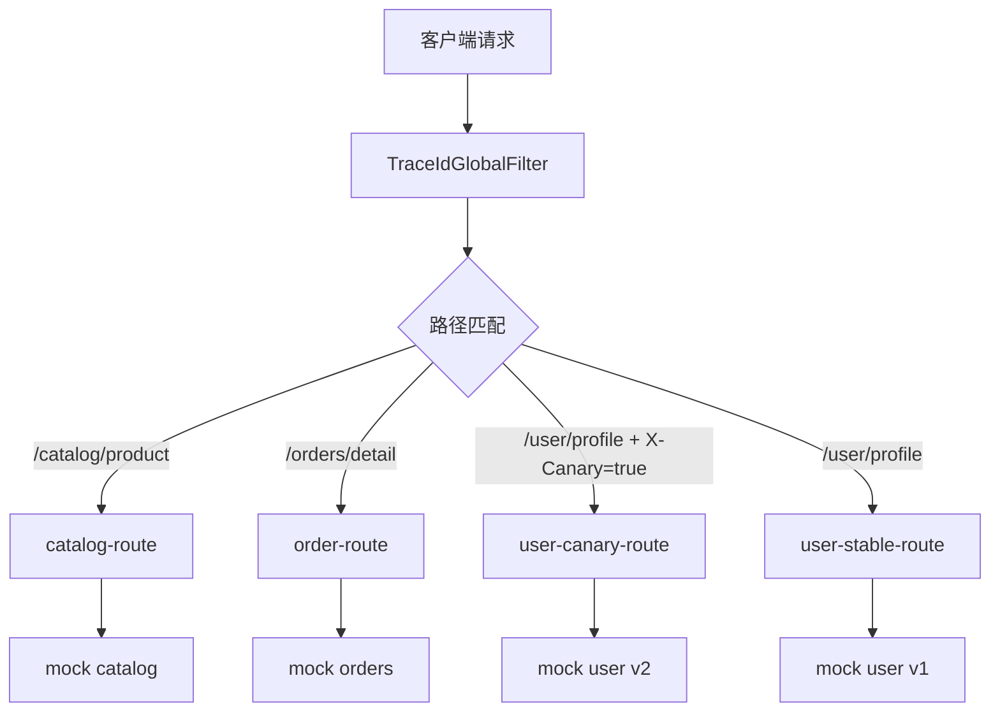

# SpringBoot Gateway 路由

> 源码：`/Users/chenwei/Documents/code/java/learn-springboot/27-SpringBoot-gateway-routing`

## 核心思路

本模块演示 [[Spring Cloud Gateway]] 的最小可运行能力：按路径路由到不同后端、按请求头做灰度路由、通过全局过滤器生成和透传 TraceId。

## 项目结构

```text
src/main/java/com/cloud/
├── config/GatewayRoutesConfig.java          (路由规则)
├── filter/TraceIdGlobalFilter.java          (TraceId 全局过滤器)
├── controller/GatewayDemoController.java    (模块说明与路由列表)
├── controller/mock/
│   ├── MockCatalogController.java
│   ├── MockOrderController.java
│   └── MockUserProfileController.java
├── service/InMemoryDemoDataService.java
├── model/
│   ├── CatalogProduct.java
│   └── OrderSnapshot.java
├── common/ApiResult.java
└── exception/GlobalExceptionHandler.java
```

## 路由规则

```java
@Bean
public RouteLocator customRouteLocator(RouteLocatorBuilder builder) {
    return builder.routes()
            .route("catalog-route", r -> r.path("/api/gateway/catalog/product")
                    .filters(f -> f.addRequestHeader("X-Gateway-Route", "catalog-route"))
                    .uri("forward:/mock/catalog/product"))
            .route("order-route", r -> r.path("/api/gateway/orders/detail")
                    .filters(f -> f.addRequestHeader("X-Gateway-Route", "order-route"))
                    .uri("forward:/mock/orders/detail"))
            .build();
}
```

每条路由包含三个核心部分：

| 部分 | 示例 | 说明 |
|------|------|------|
| Predicate | `path(...)`、`header(...)` | 判断请求是否命中路由 |
| Filter | `addRequestHeader(...)` | 转发前改写请求 |
| URI | `forward:/mock/...` | 目标地址，本模块转发到本地 mock 接口 |

## 灰度路由

```java
.route("user-canary-route", r -> r.path("/api/gateway/user/profile")
        .and()
        .header("X-Canary", "true")
        .filters(f -> f.addRequestHeader("X-Gateway-Route", "user-canary-route"))
        .uri("forward:/mock/user/v2/profile"))
.route("user-stable-route", r -> r.path("/api/gateway/user/profile")
        .filters(f -> f.addRequestHeader("X-Gateway-Route", "user-stable-route"))
        .uri("forward:/mock/user/v1/profile"))
```

`X-Canary: true` 命中 v2 用户资料接口；没有该请求头时走 v1 稳定接口。

> [!important] 路由顺序
> 灰度路由要放在稳定路由之前，否则稳定路由先匹配路径后，带 `X-Canary` 的请求也可能无法进入灰度分支。

## TraceId 全局过滤器

```java
public Mono<Void> filter(ServerWebExchange exchange, GatewayFilterChain chain) {
    String incomingTraceId = exchange.getRequest().getHeaders().getFirst(TRACE_ID_HEADER);
    String traceId = (incomingTraceId == null || incomingTraceId.isBlank())
            ? UUID.randomUUID().toString().replace("-", "")
            : incomingTraceId;

    ServerHttpRequest request = exchange.getRequest().mutate()
            .headers(headers -> headers.set(TRACE_ID_HEADER, traceId))
            .build();

    ServerWebExchange mutatedExchange = exchange.mutate().request(request).build();
    mutatedExchange.getResponse().beforeCommit(() -> {
        mutatedExchange.getResponse().getHeaders().set(TRACE_ID_HEADER, traceId);
        return Mono.empty();
    });

    return chain.filter(mutatedExchange);
}
```

过滤器规则：

1. 请求已带 `X-Trace-Id` 时沿用
2. 请求未带时生成新的 TraceId
3. 转发请求头和响应头都写入同一个 TraceId
4. `getOrder()` 返回 `Ordered.HIGHEST_PRECEDENCE`，让 TraceId 尽早进入链路

## 路由流程



## API 接口

| 方法 | 路径 | 说明 |
|------|------|------|
| GET | `/api/gateway` | 模块说明 |
| GET | `/api/gateway/routes` | 路由规则列表 |
| GET | `/api/gateway/catalog/product?id={id}` | 商品查询，经网关转发 |
| GET | `/api/gateway/orders/detail?id={id}` | 订单查询，经网关转发 |
| GET | `/api/gateway/user/profile` | 用户资料，支持灰度路由 |

## 调用验证

```bash
mvn -pl 27-SpringBoot-gateway-routing spring-boot:run

curl "http://localhost:8107/api/gateway/catalog/product?id=1"
curl -H "X-Trace-Id: trace-fixed-001" "http://localhost:8107/api/gateway/orders/detail?id=1001"
curl -H "X-Canary: true" "http://localhost:8107/api/gateway/user/profile"
curl "http://localhost:8107/api/gateway/user/profile"
```

## 要点总结

1. [[Spring Cloud Gateway]] 路由由 Predicate、Filter、URI 三部分组成
2. Header Predicate 可以实现简单灰度路由
3. GlobalFilter 适合处理 TraceId、鉴权、限流等所有路由共用逻辑
4. TraceId 要同时写入请求和响应，便于客户端和服务端日志关联
5. 路由顺序会影响匹配结果，精确或灰度规则应放在兜底规则前面
