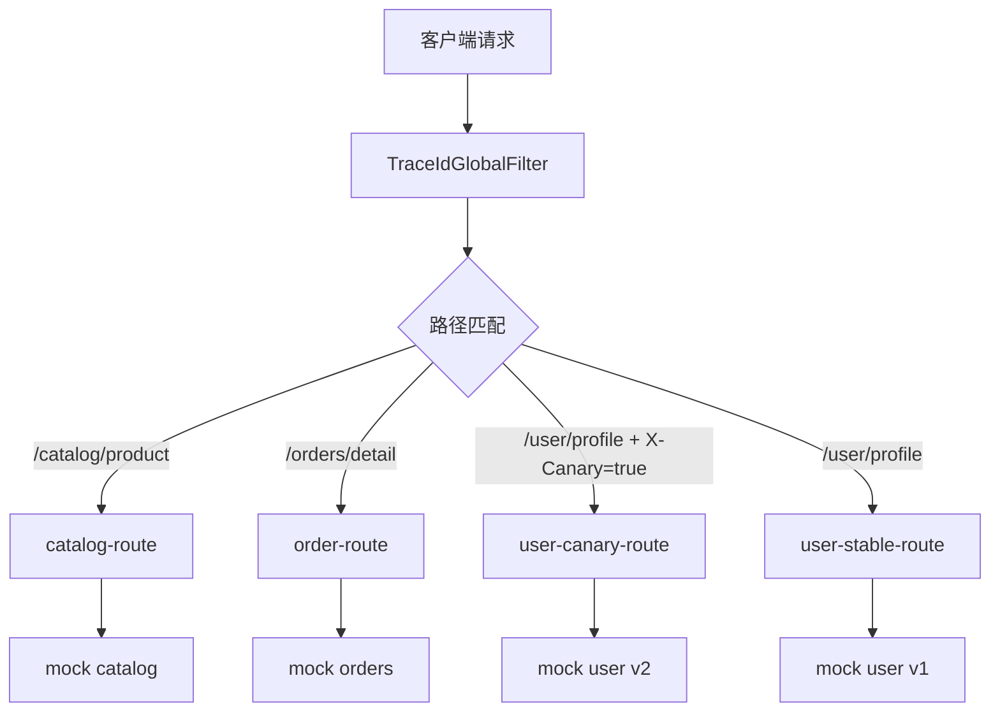

# SpringBoot Gateway 路由

> 源码：`/Users/chenwei/Documents/code/java/learn-springboot/27-SpringBoot-gateway-routing`

## 核心思路

本模块演示 [[Spring Cloud Gateway]] 的最小可运行能力：按路径路由到不同后端、按请求头做灰度路由、通过全局过滤器生成和透传 TraceId。

## 项目结构

```text
src/main/java/com/cloud/
├── config/GatewayRoutesConfig.java          (路由规则)
├── filter/TraceIdGlobalFilter.java          (TraceId 全局过滤器)
├── controller/GatewayDemoController.java    (模块说明与路由列表)
├── controller/mock/
│   ├── MockCatalogController.java
│   ├── MockOrderController.java
│   └── MockUserProfileController.java
├── service/InMemoryDemoDataService.java
├── model/
│   ├── CatalogProduct.java
│   └── OrderSnapshot.java
├── common/ApiResult.java
└── exception/GlobalExceptionHandler.java
```

## 路由规则

```java
@Bean
public RouteLocator customRouteLocator(RouteLocatorBuilder builder) {
    return builder.routes()
            .route("catalog-route", r -> r.path("/api/gateway/catalog/product")
                    .filters(f -> f.addRequestHeader("X-Gateway-Route", "catalog-route"))
                    .uri("forward:/mock/catalog/product"))
            .route("order-route", r -> r.path("/api/gateway/orders/detail")
                    .filters(f -> f.addRequestHeader("X-Gateway-Route", "order-route"))
                    .uri("forward:/mock/orders/detail"))
            .build();
}
```

每条路由包含三个核心部分：

| 部分 | 示例 | 说明 |
|------|------|------|
| Predicate | `path(...)`、`header(...)` | 判断请求是否命中路由 |
| Filter | `addRequestHeader(...)` | 转发前改写请求 |
| URI | `forward:/mock/...` | 目标地址，本模块转发到本地 mock 接口 |

## 灰度路由

```java
.route("user-canary-route", r -> r.path("/api/gateway/user/profile")
        .and()
        .header("X-Canary", "true")
        .filters(f -> f.addRequestHeader("X-Gateway-Route", "user-canary-route"))
        .uri("forward:/mock/user/v2/profile"))
.route("user-stable-route", r -> r.path("/api/gateway/user/profile")
        .filters(f -> f.addRequestHeader("X-Gateway-Route", "user-stable-route"))
        .uri("forward:/mock/user/v1/profile"))
```

`X-Canary: true` 命中 v2 用户资料接口；没有该请求头时走 v1 稳定接口。

> [!important] 路由顺序
> 灰度路由要放在稳定路由之前，否则稳定路由先匹配路径后，带 `X-Canary` 的请求也可能无法进入灰度分支。

## TraceId 全局过滤器

```java
public Mono<Void> filter(ServerWebExchange exchange, GatewayFilterChain chain) {
    String incomingTraceId = exchange.getRequest().getHeaders().getFirst(TRACE_ID_HEADER);
    String traceId = (incomingTraceId == null || incomingTraceId.isBlank())
            ? UUID.randomUUID().toString().replace("-", "")
            : incomingTraceId;

    ServerHttpRequest request = exchange.getRequest().mutate()
            .headers(headers -> headers.set(TRACE_ID_HEADER, traceId))
            .build();

    ServerWebExchange mutatedExchange = exchange.mutate().request(request).build();
    mutatedExchange.getResponse().beforeCommit(() -> {
        mutatedExchange.getResponse().getHeaders().set(TRACE_ID_HEADER, traceId);
        return Mono.empty();
    });

    return chain.filter(mutatedExchange);
}
```

过滤器规则：

1. 请求已带 `X-Trace-Id` 时沿用
2. 请求未带时生成新的 TraceId
3. 转发请求头和响应头都写入同一个 TraceId
4. `getOrder()` 返回 `Ordered.HIGHEST_PRECEDENCE`，让 TraceId 尽早进入链路

## 路由流程



## 初学者学习路线

- 先把这个案例当成“最小可运行样例”，目标是理解 SpringBoot Gateway 路由 的主流程。
- 先运行 README 里的启动命令和 curl，再带着现象回到代码里找入口。
- 每读一个类都问三件事：它由谁调用、它依赖谁、它改变了什么状态。

## 代码导读

下面的代码片段来自案例源码，并额外补了中文教学注释。阅读时先看注释理解职责，再回到完整源码核对细节。

### 接口入口：Controller 如何接收请求

源码位置：`src/main/java/com/cloud/controller/GatewayDemoController.java`

Controller 是 HTTP 世界和 Java 代码世界之间的边界：路径、请求参数、返回值都在这里集中出现。

```java
// 文件：com/cloud/controller/GatewayDemoController.java
// 学习重点：Controller 是 HTTP 世界和 Java 代码世界之间的边界：路径、请求参数、返回值都在这里集中出现。
// @RestController 表示这个类的返回值会直接写到 HTTP 响应体里，常用于 JSON API。
@RestController
// 类级别路径是这一组接口的共同前缀。
@RequestMapping("/api/gateway")
public class GatewayDemoController {

    // 方法级别映射说明具体 HTTP 动词和子路径。
    @GetMapping
    public ApiResult<Map<String, Object>> moduleInfo() {
        Map<String, Object> data = new LinkedHashMap<>();
        data.put("module", "27-SpringBoot-gateway-routing");
        data.put("desc", "Spring Cloud Gateway 路由转发、灰度路由与 TraceId 透传演示");
        data.put("routes", List.of(
                "GET /api/gateway/catalog/product?id={id}",
                "GET /api/gateway/orders/detail?id={id}",
                "GET /api/gateway/user/profile (X-Canary=true 命中 v2)",
                "GET /api/gateway/routes"
        ));
        return ApiResult.success(data);
    }

    // 方法级别映射说明具体 HTTP 动词和子路径。
    @GetMapping("/routes")
    public ApiResult<List<Map<String, String>>> routeRules() {
        return ApiResult.success(List.of(
                route("catalog-route", "/api/gateway/catalog/product", "/mock/catalog/product"),
                route("order-route", "/api/gateway/orders/detail", "/mock/orders/detail"),
                route("user-canary-route", "/api/gateway/user/profile + X-Canary=true", "/mock/user/v2/profile"),
                route("user-stable-route", "/api/gateway/user/profile", "/mock/user/v1/profile")
        ));
    }

    private Map<String, String> route(String id, String incomingPath, String targetPath) {
        Map<String, String> rule = new LinkedHashMap<>();
        rule.put("id", id);
        rule.put("incomingPath", incomingPath);
        rule.put("targetPath", targetPath);
        return rule;
    }
}
```

关键点拆解：

- 先把 README 里的 curl 路径和这里的 `@RequestMapping` / `@GetMapping` / `@PostMapping` 对上。
- Controller 不应该堆复杂业务逻辑；看到它调用 Service，就说明职责分层是清楚的。
- 读完代码后，回到“生产差距”检查：安全、异常、监控、容量、测试是否都补齐。

### 接口入口：Controller 如何接收请求

源码位置：`src/main/java/com/cloud/controller/mock/MockCatalogController.java`

Controller 是 HTTP 世界和 Java 代码世界之间的边界：路径、请求参数、返回值都在这里集中出现。

```java
// 文件：com/cloud/controller/mock/MockCatalogController.java
// 学习重点：Controller 是 HTTP 世界和 Java 代码世界之间的边界：路径、请求参数、返回值都在这里集中出现。
// @RestController 表示这个类的返回值会直接写到 HTTP 响应体里，常用于 JSON API。
@RestController
// 类级别路径是这一组接口的共同前缀。
@RequestMapping("/mock/catalog")
public class MockCatalogController {

    private final InMemoryDemoDataService dataService;

    // 构造器注入：依赖从 Spring 容器传入，代码更容易测试，也避免隐藏依赖。
    public MockCatalogController(InMemoryDemoDataService dataService) {
        this.dataService = dataService;
    }

    // 方法级别映射说明具体 HTTP 动词和子路径。
    @GetMapping("/product")
    public ResponseEntity<ApiResult<Map<String, Object>>> getProduct(@RequestParam Long id,
                                                                      @RequestHeader("X-Trace-Id") String traceId,
                                                                      @RequestHeader(value = "X-Gateway-Route", required = false) String routeId) {
        Optional<CatalogProduct> product = dataService.findProduct(id);
        if (product.isEmpty()) {
            return ResponseEntity.status(HttpStatus.NOT_FOUND)
                    .body(ApiResult.fail(404, "商品不存在"));
        }

        Map<String, Object> data = new LinkedHashMap<>();
        data.put("traceId", traceId);
        data.put("routeId", routeId);
        data.put("product", product.get());
        return ResponseEntity.ok(ApiResult.success(data));
    }
}
```

关键点拆解：

- 先把 README 里的 curl 路径和这里的 `@RequestMapping` / `@GetMapping` / `@PostMapping` 对上。
- Controller 不应该堆复杂业务逻辑；看到它调用 Service，就说明职责分层是清楚的。
- 读完代码后，回到“生产差距”检查：安全、异常、监控、容量、测试是否都补齐。

### 接口入口：Controller 如何接收请求

源码位置：`src/main/java/com/cloud/controller/mock/MockOrderController.java`

Controller 是 HTTP 世界和 Java 代码世界之间的边界：路径、请求参数、返回值都在这里集中出现。

```java
// 文件：com/cloud/controller/mock/MockOrderController.java
// 学习重点：Controller 是 HTTP 世界和 Java 代码世界之间的边界：路径、请求参数、返回值都在这里集中出现。
// @RestController 表示这个类的返回值会直接写到 HTTP 响应体里，常用于 JSON API。
@RestController
// 类级别路径是这一组接口的共同前缀。
@RequestMapping("/mock/orders")
public class MockOrderController {

    private final InMemoryDemoDataService dataService;

    // 构造器注入：依赖从 Spring 容器传入，代码更容易测试，也避免隐藏依赖。
    public MockOrderController(InMemoryDemoDataService dataService) {
        this.dataService = dataService;
    }

    // 方法级别映射说明具体 HTTP 动词和子路径。
    @GetMapping("/detail")
    public ResponseEntity<ApiResult<Map<String, Object>>> getOrder(@RequestParam Long id,
                                                                    @RequestHeader("X-Trace-Id") String traceId,
                                                                    @RequestHeader(value = "X-Gateway-Route", required = false) String routeId) {
        Optional<OrderSnapshot> order = dataService.findOrder(id);
        if (order.isEmpty()) {
            return ResponseEntity.status(HttpStatus.NOT_FOUND)
                    .body(ApiResult.fail(404, "订单不存在"));
        }

        Map<String, Object> data = new LinkedHashMap<>();
        data.put("traceId", traceId);
        data.put("routeId", routeId);
        data.put("order", order.get());
        return ResponseEntity.ok(ApiResult.success(data));
    }
}
```

关键点拆解：

- 先把 README 里的 curl 路径和这里的 `@RequestMapping` / `@GetMapping` / `@PostMapping` 对上。
- Controller 不应该堆复杂业务逻辑；看到它调用 Service，就说明职责分层是清楚的。
- 读完代码后，回到“生产差距”检查：安全、异常、监控、容量、测试是否都补齐。

### 接口入口：Controller 如何接收请求

源码位置：`src/main/java/com/cloud/controller/mock/MockUserProfileController.java`

Controller 是 HTTP 世界和 Java 代码世界之间的边界：路径、请求参数、返回值都在这里集中出现。

```java
// 文件：com/cloud/controller/mock/MockUserProfileController.java
// 学习重点：Controller 是 HTTP 世界和 Java 代码世界之间的边界：路径、请求参数、返回值都在这里集中出现。
// @RestController 表示这个类的返回值会直接写到 HTTP 响应体里，常用于 JSON API。
@RestController
// 类级别路径是这一组接口的共同前缀。
@RequestMapping("/mock/user")
public class MockUserProfileController {

    // 方法级别映射说明具体 HTTP 动词和子路径。
    @GetMapping("/v1/profile")
    public ApiResult<Map<String, Object>> profileV1(@RequestHeader("X-Trace-Id") String traceId,
                                                     @RequestHeader(value = "X-Gateway-Route", required = false) String routeId) {
        Map<String, Object> data = new LinkedHashMap<>();
        data.put("traceId", traceId);
        data.put("routeId", routeId);
        data.put("version", "v1");
        data.put("nickname", "demo-user");
        data.put("features", "basic-profile");
        return ApiResult.success(data);
    }

    // 方法级别映射说明具体 HTTP 动词和子路径。
    @GetMapping("/v2/profile")
    public ApiResult<Map<String, Object>> profileV2(@RequestHeader("X-Trace-Id") String traceId,
                                                     @RequestHeader(value = "X-Gateway-Route", required = false) String routeId) {
        Map<String, Object> data = new LinkedHashMap<>();
        data.put("traceId", traceId);
        data.put("routeId", routeId);
        data.put("version", "v2");
        data.put("nickname", "demo-user");
        data.put("features", "basic-profile,recommendation-label");
        return ApiResult.success(data);
    }
}
```

关键点拆解：

- 先把 README 里的 curl 路径和这里的 `@RequestMapping` / `@GetMapping` / `@PostMapping` 对上。
- Controller 不应该堆复杂业务逻辑；看到它调用 Service，就说明职责分层是清楚的。
- 读完代码后，回到“生产差距”检查：安全、异常、监控、容量、测试是否都补齐。

## 运行时调用链

- 从 README 的接口或测试名称开始，先定位入口类。
- 找 Controller、Runner、Listener 或 AutoConfiguration 作为第一阅读点。
- 沿着构造器注入的依赖继续进入 Service、Repository 或扩展点类。

## 初学者常见误区

- 只把接口跑通，却没有回到代码理解 Controller、Service、Repository 的分工。
- 把内存 Map、模拟客户端、固定配置当成生产实现。
- 只看 happy path，忽略参数错误、外部系统失败、并发和重复请求。

## API 接口

| 方法 | 路径 | 说明 |
|------|------|------|
| GET | `/api/gateway` | 模块说明 |
| GET | `/api/gateway/routes` | 路由规则列表 |
| GET | `/api/gateway/catalog/product?id={id}` | 商品查询，经网关转发 |
| GET | `/api/gateway/orders/detail?id={id}` | 订单查询，经网关转发 |
| GET | `/api/gateway/user/profile` | 用户资料，支持灰度路由 |

## 调用验证

```bash
mvn -pl 27-SpringBoot-gateway-routing spring-boot:run

curl "http://localhost:8107/api/gateway/catalog/product?id=1"
curl -H "X-Trace-Id: trace-fixed-001" "http://localhost:8107/api/gateway/orders/detail?id=1001"
curl -H "X-Canary: true" "http://localhost:8107/api/gateway/user/profile"
curl "http://localhost:8107/api/gateway/user/profile"
```

## 生产差距

这个示例适合帮助初学者理解 Gateway 路由 的核心机制，但生产项目不能只停留在“能跑通”。真实落地时至少要补齐：统一鉴权、参数边界校验、异常响应、结构化日志、监控指标、自动化测试、配置隔离和容量评估。

如果模块涉及数据库、缓存、消息、网关、认证或外部服务，还要进一步考虑连接池、超时、重试、幂等、事务边界、数据一致性和故障告警。学习时可以先记住主流程，再用这些生产差距反向检查自己是否真正理解了案例。

## 要点总结

1. [[Spring Cloud Gateway]] 路由由 Predicate、Filter、URI 三部分组成
2. Header Predicate 可以实现简单灰度路由
3. GlobalFilter 适合处理 TraceId、鉴权、限流等所有路由共用逻辑
4. TraceId 要同时写入请求和响应，便于客户端和服务端日志关联
5. 路由顺序会影响匹配结果，精确或灰度规则应放在兜底规则前面
