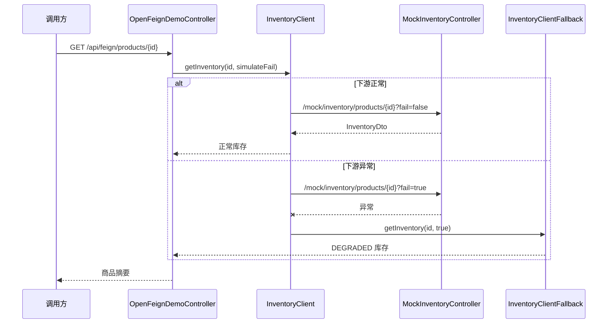

# SpringBoot OpenFeign 与降级

> 源码：`/Users/chenwei/Documents/code/java/learn-springboot/28-SpringBoot-openfeign-fallback`

## 核心思路

本模块演示用 [[OpenFeign]] 声明式调用下游库存服务，并在下游异常时结合 [[Resilience4j]] CircuitBreaker 触发 fallback，返回可控的降级结果。

## 项目结构

```text
src/main/java/com/cloud/
├── Application.java                         (@EnableFeignClients)
├── client/
│   ├── InventoryClient.java                 (Feign 客户端)
│   └── InventoryClientFallback.java         (降级实现)
├── controller/
│   ├── OpenFeignDemoController.java         (业务入口)
│   └── MockInventoryController.java         (本地 mock 下游)
├── service/ProductCatalogService.java
├── model/
│   ├── InventoryDto.java
│   └── ProductBrief.java
├── common/ApiResult.java
└── exception/GlobalExceptionHandler.java
```

## 启用 OpenFeign

```java
@EnableFeignClients
@SpringBootApplication
public class Application {
    public static void main(String[] args) {
        SpringApplication.run(Application.class, args);
    }
}
```

`@EnableFeignClients` 会扫描 `@FeignClient` 接口，并为其创建 HTTP 调用代理。

## Feign 客户端声明

```java
@FeignClient(
        name = "inventory-client",
        url = "${demo.inventory.base-url}",
        fallback = InventoryClientFallback.class
)
public interface InventoryClient {

    @GetMapping("/mock/inventory/products/{id}")
    InventoryDto getInventory(@PathVariable("id") Long productId,
                              @RequestParam(value = "fail", defaultValue = "false") boolean fail);
}
```

| 参数 | 说明 |
|------|------|
| `name` | Feign 客户端名称，也用于熔断器标识 |
| `url` | 下游服务基础地址，本模块指向当前应用的 mock 接口 |
| `fallback` | 下游失败时调用的降级实现 |

## 降级实现

```java
@Component
public class InventoryClientFallback implements InventoryClient {

    @Override
    public InventoryDto getInventory(Long productId, boolean fail) {
        return new InventoryDto(productId, -1, "fallback-warehouse", "DEGRADED", true);
    }
}
```

fallback 返回结构化的降级数据：库存数量为 `-1`，仓库为 `fallback-warehouse`，状态为 `DEGRADED`，并用标记位说明这是降级结果。

> [!important] 降级不是吞异常
> fallback 应该返回业务可识别的保守结果，让上游知道当前数据不完整或不实时，而不是伪装成正常结果。

## CircuitBreaker 配置

```yaml
spring:
  cloud:
    openfeign:
      circuitbreaker:
        enabled: true
      client:
        config:
          default:
            connectTimeout: 1500
            readTimeout: 2500

demo:
  inventory:
    base-url: http://localhost:${server.port}
```

`spring.cloud.openfeign.circuitbreaker.enabled=true` 后，OpenFeign 调用会接入 Spring Cloud CircuitBreaker，本模块使用 Resilience4j 实现。

## 调用流程



## API 接口

| 方法 | 路径 | 说明 |
|------|------|------|
| GET | `/api/feign` | 模块说明 |
| GET | `/api/feign/products/{id}` | 正常调用下游库存服务 |
| GET | `/api/feign/products/{id}?simulateFail=true` | 触发下游异常并验证 fallback |
| GET | `/mock/inventory/products/{id}?fail=true` | mock 下游库存异常 |

## 调用验证

```bash
mvn -pl 28-SpringBoot-openfeign-fallback spring-boot:run

curl "http://localhost:8108/api/feign/products/1"
curl "http://localhost:8108/api/feign/products/1?simulateFail=true"
```

## 要点总结

1. [[OpenFeign]] 用 Java 接口声明 HTTP 调用，减少手写请求代码
2. `@EnableFeignClients` 负责启用 Feign 客户端扫描
3. Feign fallback 需要实现同一个接口，并注册为 Spring Bean
4. 开启 CircuitBreaker 后，下游异常可进入 fallback 返回降级结果
5. 降级结果要显式标记，避免调用方把保守结果误认为实时真实数据
