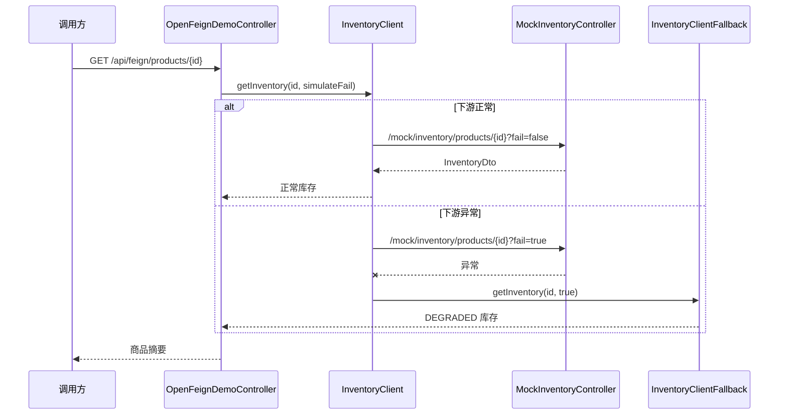

# SpringBoot OpenFeign 与降级

> 源码：`/Users/chenwei/Documents/code/java/learn-springboot/28-SpringBoot-openfeign-fallback`

## 核心思路

本模块演示用 [[OpenFeign]] 声明式调用下游库存服务，并在下游异常时结合 [[Resilience4j]] CircuitBreaker 触发 fallback，返回可控的降级结果。

## 项目结构

```text
src/main/java/com/cloud/
├── Application.java                         (@EnableFeignClients)
├── client/
│   ├── InventoryClient.java                 (Feign 客户端)
│   └── InventoryClientFallback.java         (降级实现)
├── controller/
│   ├── OpenFeignDemoController.java         (业务入口)
│   └── MockInventoryController.java         (本地 mock 下游)
├── service/ProductCatalogService.java
├── model/
│   ├── InventoryDto.java
│   └── ProductBrief.java
├── common/ApiResult.java
└── exception/GlobalExceptionHandler.java
```

## 启用 OpenFeign

```java
@EnableFeignClients
@SpringBootApplication
public class Application {
    public static void main(String[] args) {
        SpringApplication.run(Application.class, args);
    }
}
```

`@EnableFeignClients` 会扫描 `@FeignClient` 接口，并为其创建 HTTP 调用代理。

## Feign 客户端声明

```java
@FeignClient(
        name = "inventory-client",
        url = "${demo.inventory.base-url}",
        fallback = InventoryClientFallback.class
)
public interface InventoryClient {

    @GetMapping("/mock/inventory/products/{id}")
    InventoryDto getInventory(@PathVariable("id") Long productId,
                              @RequestParam(value = "fail", defaultValue = "false") boolean fail);
}
```

| 参数 | 说明 |
|------|------|
| `name` | Feign 客户端名称，也用于熔断器标识 |
| `url` | 下游服务基础地址，本模块指向当前应用的 mock 接口 |
| `fallback` | 下游失败时调用的降级实现 |

## 降级实现

```java
@Component
public class InventoryClientFallback implements InventoryClient {

    @Override
    public InventoryDto getInventory(Long productId, boolean fail) {
        return new InventoryDto(productId, -1, "fallback-warehouse", "DEGRADED", true);
    }
}
```

fallback 返回结构化的降级数据：库存数量为 `-1`，仓库为 `fallback-warehouse`，状态为 `DEGRADED`，并用标记位说明这是降级结果。

> [!important] 降级不是吞异常
> fallback 应该返回业务可识别的保守结果，让上游知道当前数据不完整或不实时，而不是伪装成正常结果。

## CircuitBreaker 配置

```yaml
spring:
  cloud:
    openfeign:
      circuitbreaker:
        enabled: true
      client:
        config:
          default:
            connectTimeout: 1500
            readTimeout: 2500

demo:
  inventory:
    base-url: http://localhost:${server.port}
```

`spring.cloud.openfeign.circuitbreaker.enabled=true` 后，OpenFeign 调用会接入 Spring Cloud CircuitBreaker，本模块使用 Resilience4j 实现。

## 调用流程



## 初学者学习路线

- 先把这个案例当成“最小可运行样例”，目标是理解 SpringBoot OpenFeign 与降级 的主流程。
- 先运行 README 里的启动命令和 curl，再带着现象回到代码里找入口。
- 每读一个类都问三件事：它由谁调用、它依赖谁、它改变了什么状态。

## 代码导读

下面的代码片段来自案例源码，并额外补了中文教学注释。阅读时先看注释理解职责，再回到完整源码核对细节。

### 接口入口：Controller 如何接收请求

源码位置：`src/main/java/com/cloud/controller/MockInventoryController.java`

Controller 是 HTTP 世界和 Java 代码世界之间的边界：路径、请求参数、返回值都在这里集中出现。

```java
// 文件：com/cloud/controller/MockInventoryController.java
// 学习重点：Controller 是 HTTP 世界和 Java 代码世界之间的边界：路径、请求参数、返回值都在这里集中出现。
// @RestController 表示这个类的返回值会直接写到 HTTP 响应体里，常用于 JSON API。
@RestController
// 类级别路径是这一组接口的共同前缀。
@RequestMapping("/mock/inventory")
public class MockInventoryController {

    private static final Map<Long, Integer> STOCK_MAP = Map.of(
            1L, 56,
            2L, 18,
            3L, 103
    );

    // 方法级别映射说明具体 HTTP 动词和子路径。
    @GetMapping("/products/{id}")
    public InventoryDto getInventory(@PathVariable Long id,
                                     @RequestParam(defaultValue = "false") boolean fail) {
        if (fail) {
            throw new IllegalStateException("inventory service temporary unavailable");
        }

        Integer stock = STOCK_MAP.get(id);
        if (stock == null) {
            throw new IllegalArgumentException("库存商品不存在");
        }

        return new InventoryDto(id, stock, "hz-main-01", "OK", false);
    }
}
```

关键点拆解：

- 先把 README 里的 curl 路径和这里的 `@RequestMapping` / `@GetMapping` / `@PostMapping` 对上。
- Controller 不应该堆复杂业务逻辑；看到它调用 Service，就说明职责分层是清楚的。
- 读完代码后，回到“生产差距”检查：安全、异常、监控、容量、测试是否都补齐。

### 接口入口：Controller 如何接收请求

源码位置：`src/main/java/com/cloud/controller/OpenFeignDemoController.java`

Controller 是 HTTP 世界和 Java 代码世界之间的边界：路径、请求参数、返回值都在这里集中出现。

```java
// 文件：com/cloud/controller/OpenFeignDemoController.java
// 学习重点：Controller 是 HTTP 世界和 Java 代码世界之间的边界：路径、请求参数、返回值都在这里集中出现。
// @RestController 表示这个类的返回值会直接写到 HTTP 响应体里，常用于 JSON API。
@RestController
// 类级别路径是这一组接口的共同前缀。
@RequestMapping("/api/feign")
public class OpenFeignDemoController {

    private final ProductCatalogService productCatalogService;
    private final InventoryClient inventoryClient;

    public OpenFeignDemoController(ProductCatalogService productCatalogService,
                                   InventoryClient inventoryClient) {
        this.productCatalogService = productCatalogService;
        this.inventoryClient = inventoryClient;
    }

    // 方法级别映射说明具体 HTTP 动词和子路径。
    @GetMapping
    public ApiResult<Map<String, Object>> moduleInfo() {
        Map<String, Object> data = new LinkedHashMap<>();
        data.put("module", "28-SpringBoot-openfeign-fallback");
        data.put("desc", "OpenFeign 调用下游服务并通过 fallback 进行降级");
        data.put("apis", new String[]{
                "GET /api/feign/products/{id}",
                "GET /api/feign/products/{id}?simulateFail=true",
                "GET /mock/inventory/products/{id}?fail=true|false"
        });
        return ApiResult.success(data);
    }

    // 方法级别映射说明具体 HTTP 动词和子路径。
    @GetMapping("/products/{id}")
    public ResponseEntity<ApiResult<Map<String, Object>>> queryProduct(@PathVariable Long id,
                                                                        @RequestParam(defaultValue = "false") boolean simulateFail) {
        Optional<ProductBrief> productOptional = productCatalogService.findById(id);
        if (productOptional.isEmpty()) {
            return ResponseEntity.status(404).body(ApiResult.fail(404, "商品不存在"));
        }

        ProductBrief product = productOptional.get();
        InventoryDto inventory = inventoryClient.getInventory(id, simulateFail);

        Map<String, Object> data = new LinkedHashMap<>();
        data.put("product", product);
        data.put("inventory", inventory);
        data.put("degraded", Boolean.TRUE.equals(inventory.getFallback()));
        return ResponseEntity.ok(ApiResult.success(data));
    }
}
```

关键点拆解：

- 先把 README 里的 curl 路径和这里的 `@RequestMapping` / `@GetMapping` / `@PostMapping` 对上。
- Controller 不应该堆复杂业务逻辑；看到它调用 Service，就说明职责分层是清楚的。
- 读完代码后，回到“生产差距”检查：安全、异常、监控、容量、测试是否都补齐。

### 业务核心：Service 如何组织规则

源码位置：`src/main/java/com/cloud/service/ProductCatalogService.java`

Service 承载业务规则，初学者要重点看它如何校验输入、调用依赖、返回结果。

```java
// 文件：com/cloud/service/ProductCatalogService.java
// 学习重点：Service 承载业务规则，初学者要重点看它如何校验输入、调用依赖、返回结果。
// @Service 表示这是业务层 Bean，会被 Spring 自动扫描并注入。
@Service
public class ProductCatalogService {

    private final Map<Long, ProductBrief> products = new ConcurrentHashMap<>();

    // 构造器注入：依赖从 Spring 容器传入，代码更容易测试，也避免隐藏依赖。
    public ProductCatalogService() {
        products.put(1L, new ProductBrief(1L, "iPhone 15", new BigDecimal("5999.00")));
        products.put(2L, new ProductBrief(2L, "MacBook Pro", new BigDecimal("13999.00")));
        products.put(3L, new ProductBrief(3L, "AirPods Pro", new BigDecimal("1899.00")));
    }

    public Optional<ProductBrief> findById(Long id) {
        return Optional.ofNullable(products.get(id));
    }
}
```

关键点拆解：

- Service 的 public 方法通常就是一个用例，例如创建、查询、刷新、投递、同步。
- 先看输入校验，再看调用了哪些依赖，最后看返回对象。
- 读完代码后，回到“生产差距”检查：安全、异常、监控、容量、测试是否都补齐。

### 关键类：InventoryClient

源码位置：`src/main/java/com/cloud/client/InventoryClient.java`

这是案例链路中的关键类，读它可以把 README 的概念落到具体代码。

```java
// 文件：com/cloud/client/InventoryClient.java
// 学习重点：这是案例链路中的关键类，读它可以把 README 的概念落到具体代码。
@FeignClient(name = "inventory-client", url = "${demo.inventory.base-url}", fallback = InventoryClientFallback.class)
public interface InventoryClient {

    // 方法级别映射说明具体 HTTP 动词和子路径。
    @GetMapping("/mock/inventory/products/{id}")
    InventoryDto getInventory(@PathVariable("id") Long productId,
                              @RequestParam(value = "fail", defaultValue = "false") boolean fail);
}
```

关键点拆解：

- 先看这个类暴露了哪些 public 方法，再看它依赖了哪些对象。
- 读完代码后，回到“生产差距”检查：安全、异常、监控、容量、测试是否都补齐。

## 运行时调用链

- 从 README 的接口或测试名称开始，先定位入口类。
- 找 Controller、Runner、Listener 或 AutoConfiguration 作为第一阅读点。
- 沿着构造器注入的依赖继续进入 Service、Repository 或扩展点类。

## 初学者常见误区

- 只把接口跑通，却没有回到代码理解 Controller、Service、Repository 的分工。
- 把内存 Map、模拟客户端、固定配置当成生产实现。
- 只看 happy path，忽略参数错误、外部系统失败、并发和重复请求。

## API 接口

| 方法 | 路径 | 说明 |
|------|------|------|
| GET | `/api/feign` | 模块说明 |
| GET | `/api/feign/products/{id}` | 正常调用下游库存服务 |
| GET | `/api/feign/products/{id}?simulateFail=true` | 触发下游异常并验证 fallback |
| GET | `/mock/inventory/products/{id}?fail=true` | mock 下游库存异常 |

## 调用验证

```bash
mvn -pl 28-SpringBoot-openfeign-fallback spring-boot:run

curl "http://localhost:8108/api/feign/products/1"
curl "http://localhost:8108/api/feign/products/1?simulateFail=true"
```

## 生产差距

这个示例适合帮助初学者理解 OpenFeign 与降级 的核心机制，但生产项目不能只停留在“能跑通”。真实落地时至少要补齐：统一鉴权、参数边界校验、异常响应、结构化日志、监控指标、自动化测试、配置隔离和容量评估。

如果模块涉及数据库、缓存、消息、网关、认证或外部服务，还要进一步考虑连接池、超时、重试、幂等、事务边界、数据一致性和故障告警。学习时可以先记住主流程，再用这些生产差距反向检查自己是否真正理解了案例。

## 要点总结

1. [[OpenFeign]] 用 Java 接口声明 HTTP 调用，减少手写请求代码
2. `@EnableFeignClients` 负责启用 Feign 客户端扫描
3. Feign fallback 需要实现同一个接口，并注册为 Spring Bean
4. 开启 CircuitBreaker 后，下游异常可进入 fallback 返回降级结果
5. 降级结果要显式标记，避免调用方把保守结果误认为实时真实数据
