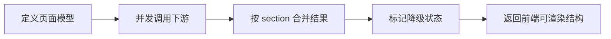

# SpringBoot BFF 聚合接口

> 源码：`/Users/chenwei/Documents/code/java/learn-springboot/30-SpringBoot-bff-aggregation`

## 核心思路

本模块演示 [[BFF]] / API 聚合层：一个商品详情接口并行聚合商品主数据、库存、促销和评论摘要；当部分下游失败或超时时，只降级对应 section，并在响应中暴露 `degradedSections`。

## 项目结构

```text
src/main/java/com/cloud/
├── controller/BffAggregationController.java
├── service/
│   ├── BffAggregationService.java            (聚合核心)
│   └── downstream/
│       ├── MockCatalogClient.java
│       ├── MockInventoryClient.java
│       ├── MockPromotionClient.java
│       └── MockReviewClient.java
├── model/
│   ├── ProductDetailView.java
│   ├── SectionResult.java
│   ├── InventorySummary.java
│   ├── PromotionSummary.java
│   ├── ReviewSummary.java
│   └── AggregationOptions.java
├── common/ApiResult.java
└── exception/GlobalExceptionHandler.java
```

## 聚合响应模型

| Section | 来源 | 是否核心 | 降级策略 |
|---------|------|----------|----------|
| product | 商品主数据 | 是 | 不存在直接 404 |
| inventory | 库存 | 否 | section 级降级 |
| promotion | 促销 | 否 | 超时或失败时降级 |
| review | 评论摘要 | 否 | section 级降级 |

主数据是页面骨架，查不到商品时没有继续聚合的意义；库存、促销、评论是附加信息，失败时可以返回部分结果。

## 并行聚合流程

```java
ProductBrief product = catalogClient.findById(productId)
        .orElseThrow(() -> new ProductNotFoundException(productId));

CompletableFuture<SectionResult<InventorySummary>> inventoryFuture = section(
        () -> inventoryClient.query(productId, options)
);
CompletableFuture<SectionResult<PromotionSummary>> promotionFuture = section(
        () -> promotionClient.query(productId, options)
);
CompletableFuture<SectionResult<ReviewSummary>> reviewFuture = section(
        () -> reviewClient.query(productId, options)
);

SectionResult<InventorySummary> inventory = inventoryFuture.join();
SectionResult<PromotionSummary> promotion = promotionFuture.join();
SectionResult<ReviewSummary> review = reviewFuture.join();
```

`CompletableFuture` 让三个独立下游并行执行，整体耗时接近最慢 section，而不是三个接口耗时相加。

## Section 级超时与降级

```java
private <T> CompletableFuture<SectionResult<T>> section(Supplier<T> supplier) {
    return CompletableFuture.supplyAsync(() -> SectionResult.ok(supplier.get()), executorService)
            .completeOnTimeout(SectionResult.degraded("TIMEOUT"), sectionTimeoutMs, TimeUnit.MILLISECONDS)
            .exceptionally(ex -> SectionResult.degraded(reasonOf(ex)));
}
```

每个 section 独立超时、独立降级：

- 正常返回：`SectionResult.ok(data)`
- 超时返回：`SectionResult.degraded("TIMEOUT")`
- 异常返回：`SectionResult.degraded("DOWNSTREAM_ERROR")`

> [!important] BFF 降级粒度
> BFF 不应该因为评论接口失败就让整个商品详情失败。更合理的方式是保留核心数据，并标记哪个 section 降级。

## 降级 section 汇总

```java
private List<String> degradedSections(SectionResult<InventorySummary> inventory,
                                      SectionResult<PromotionSummary> promotion,
                                      SectionResult<ReviewSummary> review) {
    List<String> sections = new ArrayList<>();
    if (inventory.isDegraded()) sections.add("inventory");
    if (promotion.isDegraded()) sections.add("promotion");
    if (review.isDegraded()) sections.add("review");
    return sections;
}
```

聚合响应中同时返回：

- 每个 section 的数据或降级状态
- `degraded`：整体是否存在降级
- `degradedSections`：具体哪些 section 降级

## 初学者学习路线

- 先把这个案例当成“最小可运行样例”，目标是理解 SpringBoot BFF 聚合接口 的主流程。
- 先运行 README 里的启动命令和 curl，再带着现象回到代码里找入口。
- 每读一个类都问三件事：它由谁调用、它依赖谁、它改变了什么状态。

## 代码导读

下面的代码片段来自案例源码，并额外补了中文教学注释。阅读时先看注释理解职责，再回到完整源码核对细节。

### 接口入口：Controller 如何接收请求

源码位置：`src/main/java/com/cloud/controller/BffAggregationController.java`

Controller 是 HTTP 世界和 Java 代码世界之间的边界：路径、请求参数、返回值都在这里集中出现。

```java
// 文件：com/cloud/controller/BffAggregationController.java
// 学习重点：Controller 是 HTTP 世界和 Java 代码世界之间的边界：路径、请求参数、返回值都在这里集中出现。
// @RestController 表示这个类的返回值会直接写到 HTTP 响应体里，常用于 JSON API。
@RestController
// 类级别路径是这一组接口的共同前缀。
@RequestMapping("/api/bff")
public class BffAggregationController {

    private final BffAggregationService bffAggregationService;

    // 构造器注入：依赖从 Spring 容器传入，代码更容易测试，也避免隐藏依赖。
    public BffAggregationController(BffAggregationService bffAggregationService) {
        this.bffAggregationService = bffAggregationService;
    }

    // 方法级别映射说明具体 HTTP 动词和子路径。
    @GetMapping
    public ApiResult<Map<String, Object>> moduleInfo() {
        Map<String, Object> data = new LinkedHashMap<>();
        data.put("module", "30-SpringBoot-bff-aggregation");
        data.put("desc", "BFF 聚合层：并行调用多个下游并支持部分降级");
        data.put("apis", new String[]{
                "GET /api/bff/products/{id}",
                "GET /api/bff/products/{id}?inventoryFail=true",
                "GET /api/bff/products/{id}?promotionDelayMs=800",
                "GET /api/bff/products/{id}?reviewFail=true"
        });
        return ApiResult.success(data);
    }

    // 方法级别映射说明具体 HTTP 动词和子路径。
    @GetMapping("/products/{id}")
    public ResponseEntity<ApiResult<ProductDetailView>> queryProductDetail(@PathVariable Long id,
                                                                            @RequestParam(defaultValue = "false") boolean inventoryFail,
                                                                            @RequestParam(defaultValue = "false") boolean promotionFail,
                                                                            @RequestParam(defaultValue = "false") boolean reviewFail,
                                                                            @RequestParam(defaultValue = "0") long inventoryDelayMs,
                                                                            @RequestParam(defaultValue = "0") long promotionDelayMs,
                                                                            @RequestParam(defaultValue = "0") long reviewDelayMs) {
        AggregationOptions options = AggregationOptions.builder()
                .inventoryFail(inventoryFail)
                .promotionFail(promotionFail)
                .reviewFail(reviewFail)
                .inventoryDelayMs(inventoryDelayMs)
                .promotionDelayMs(promotionDelayMs)
                .reviewDelayMs(reviewDelayMs)
                .build();
        return ResponseEntity.ok(ApiResult.success(bffAggregationService.queryProductDetail(id, options)));
    }
}
```

关键点拆解：

- 先把 README 里的 curl 路径和这里的 `@RequestMapping` / `@GetMapping` / `@PostMapping` 对上。
- Controller 不应该堆复杂业务逻辑；看到它调用 Service，就说明职责分层是清楚的。
- 读完代码后，回到“生产差距”检查：安全、异常、监控、容量、测试是否都补齐。

### 业务核心：Service 如何组织规则

源码位置：`src/main/java/com/cloud/service/BffAggregationService.java`

Service 承载业务规则，初学者要重点看它如何校验输入、调用依赖、返回结果。

```java
// 文件：com/cloud/service/BffAggregationService.java
// 学习重点：Service 承载业务规则，初学者要重点看它如何校验输入、调用依赖、返回结果。
// @Service 表示这是业务层 Bean，会被 Spring 自动扫描并注入。
@Service
public class BffAggregationService {

    private final MockCatalogClient catalogClient;
    private final MockInventoryClient inventoryClient;
    private final MockPromotionClient promotionClient;
    private final MockReviewClient reviewClient;
    private final long sectionTimeoutMs;
    private final ExecutorService executorService;

    @Autowired
    public BffAggregationService(MockCatalogClient catalogClient,
                                 MockInventoryClient inventoryClient,
                                 MockPromotionClient promotionClient,
                                 MockReviewClient reviewClient) {
        this(catalogClient, inventoryClient, promotionClient, reviewClient, 300);
    }

    public BffAggregationService(MockCatalogClient catalogClient,
                                 MockInventoryClient inventoryClient,
                                 MockPromotionClient promotionClient,
                                 MockReviewClient reviewClient,
                                 long sectionTimeoutMs) {
        this.catalogClient = catalogClient;
        this.inventoryClient = inventoryClient;
        this.promotionClient = promotionClient;
        this.reviewClient = reviewClient;
        this.sectionTimeoutMs = sectionTimeoutMs;
        this.executorService = Executors.newFixedThreadPool(6);
    }

    public ProductDetailView queryProductDetail(Long productId, AggregationOptions options) {
        if (productId == null || productId <= 0) {
            throw new IllegalArgumentException("商品 ID 必须为正数");
        }

        ProductBrief product = catalogClient.findById(productId)
                .orElseThrow(() -> new ProductNotFoundException(productId));

        CompletableFuture<SectionResult<InventorySummary>> inventoryFuture = section(
                () -> inventoryClient.query(productId, options)
        );
        CompletableFuture<SectionResult<PromotionSummary>> promotionFuture = section(
                () -> promotionClient.query(productId, options)
        );
        CompletableFuture<SectionResult<ReviewSummary>> reviewFuture = section(
                () -> reviewClient.query(productId, options)
        );

        SectionResult<InventorySummary> inventory = inventoryFuture.join();
        SectionResult<PromotionSummary> promotion = promotionFuture.join();
        SectionResult<ReviewSummary> review = reviewFuture.join();
        List<String> degradedSections = degradedSections(inventory, promotion, review);

        return new ProductDetailView(
                product,
                inventory,
                promotion,
                review,
                !degradedSections.isEmpty(),
                degradedSections
        );
    }

    public void shutdown() {
        executorService.shutdownNow();
    }

    private <T> CompletableFuture<SectionResult<T>> section(Supplier<T> supplier) {
        return CompletableFuture.supplyAsync(() -> SectionResult.ok(supplier.get()), executorService)
                .completeOnTimeout(SectionResult.degraded("TIMEOUT"), sectionTimeoutMs, TimeUnit.MILLISECONDS)
                .exceptionally(ex -> SectionResult.degraded(reasonOf(ex)));
    }

    private String reasonOf(Throwable ex) {
        Throwable current = ex instanceof CompletionException && ex.getCause() != null ? ex.getCause() : ex;
        if (current instanceof TimeoutException) {
            return "TIMEOUT";
        }
        return "DOWNSTREAM_ERROR";
    }

    private List<String> degradedSections(SectionResult<InventorySummary> inventory,
                                          SectionResult<PromotionSummary> promotion,
                                          SectionResult<ReviewSummary> review) {
        List<String> sections = new ArrayList<>();
        if (inventory.isDegraded()) {
            sections.add("inventory");
        }
        if (promotion.isDegraded()) {
            sections.add("promotion");
        }
        if (review.isDegraded()) {
            sections.add("review");
        }
        return sections;
    }

    public static class ProductNotFoundException extends RuntimeException {

        // 构造器注入：依赖从 Spring 容器传入，代码更容易测试，也避免隐藏依赖。
        public ProductNotFoundException(Long productId) {
            super("商品不存在: " + productId);
        }
    }
}
```

关键点拆解：

- Service 的 public 方法通常就是一个用例，例如创建、查询、刷新、投递、同步。
- 先看输入校验，再看调用了哪些依赖，最后看返回对象。
- 读完代码后，回到“生产差距”检查：安全、异常、监控、容量、测试是否都补齐。

### 关键类：MockCatalogClient

源码位置：`src/main/java/com/cloud/service/downstream/MockCatalogClient.java`

这是案例链路中的关键类，读它可以把 README 的概念落到具体代码。

```java
// 文件：com/cloud/service/downstream/MockCatalogClient.java
// 学习重点：这是案例链路中的关键类，读它可以把 README 的概念落到具体代码。
@Component
public class MockCatalogClient {

    private static final Map<Long, ProductBrief> PRODUCTS = Map.of(
            1L, new ProductBrief(1L, "iPhone 15", new BigDecimal("5999.00")),
            2L, new ProductBrief(2L, "MacBook Pro", new BigDecimal("13999.00")),
            3L, new ProductBrief(3L, "AirPods Pro", new BigDecimal("1899.00"))
    );

    public Optional<ProductBrief> findById(Long id) {
        return Optional.ofNullable(PRODUCTS.get(id));
    }
}
```

关键点拆解：

- 先看这个类暴露了哪些 public 方法，再看它依赖了哪些对象。
- 读完代码后，回到“生产差距”检查：安全、异常、监控、容量、测试是否都补齐。

### 关键类：MockInventoryClient

源码位置：`src/main/java/com/cloud/service/downstream/MockInventoryClient.java`

这是案例链路中的关键类，读它可以把 README 的概念落到具体代码。

```java
// 文件：com/cloud/service/downstream/MockInventoryClient.java
// 学习重点：这是案例链路中的关键类，读它可以把 README 的概念落到具体代码。
@Component
public class MockInventoryClient {

    private static final Map<Long, InventorySummary> INVENTORY = Map.of(
            1L, new InventorySummary(56, "hz-main-01"),
            2L, new InventorySummary(18, "sh-main-02"),
            3L, new InventorySummary(103, "bj-main-03")
    );

    public InventorySummary query(Long productId, AggregationOptions options) {
        sleep(options.getInventoryDelayMs());
        if (options.isInventoryFail()) {
            throw new IllegalStateException("inventory service unavailable");
        }
        return INVENTORY.getOrDefault(productId, new InventorySummary(0, "unknown"));
    }

    private void sleep(long delayMs) {
        if (delayMs <= 0L) {
            return;
        }
        try {
            Thread.sleep(delayMs);
        } catch (InterruptedException ex) {
            Thread.currentThread().interrupt();
            throw new IllegalStateException("inventory request interrupted", ex);
        }
    }
}
```

关键点拆解：

- 先看这个类暴露了哪些 public 方法，再看它依赖了哪些对象。
- 读完代码后，回到“生产差距”检查：安全、异常、监控、容量、测试是否都补齐。

## 运行时调用链

- 从 README 的接口或测试名称开始，先定位入口类。
- 找 Controller、Runner、Listener 或 AutoConfiguration 作为第一阅读点。
- 沿着构造器注入的依赖继续进入 Service、Repository 或扩展点类。

## 初学者常见误区

- 只把接口跑通，却没有回到代码理解 Controller、Service、Repository 的分工。
- 把内存 Map、模拟客户端、固定配置当成生产实现。
- 只看 happy path，忽略参数错误、外部系统失败、并发和重复请求。

## API 接口

| 方法 | 路径 | 说明 |
|------|------|------|
| GET | `/api/bff` | 模块说明 |
| GET | `/api/bff/products/{id}` | 聚合商品详情 |
| GET | `/api/bff/products/{id}?inventoryFail=true` | 库存 section 降级 |
| GET | `/api/bff/products/{id}?promotionDelayMs=800` | 促销 section 超时降级 |
| GET | `/api/bff/products/{id}?reviewFail=true` | 评论 section 降级 |
| GET | `/api/bff/products/99999` | 商品不存在返回 404 |

## 调用验证

```bash
mvn -pl 30-SpringBoot-bff-aggregation spring-boot:run

curl "http://localhost:8110/api/bff/products/1"
curl "http://localhost:8110/api/bff/products/1?inventoryFail=true"
curl "http://localhost:8110/api/bff/products/1?promotionDelayMs=800"
curl "http://localhost:8110/api/bff/products/99999"
```

## 生产差距

这个示例适合帮助初学者理解 BFF 聚合接口 的核心机制，但生产项目不能只停留在“能跑通”。真实落地时至少要补齐：统一鉴权、参数边界校验、异常响应、结构化日志、监控指标、自动化测试、配置隔离和容量评估。

如果模块涉及数据库、缓存、消息、网关、认证或外部服务，还要进一步考虑连接池、超时、重试、幂等、事务边界、数据一致性和故障告警。学习时可以先记住主流程，再用这些生产差距反向检查自己是否真正理解了案例。

## 要点总结

1. [[BFF]] 适合为特定前端页面聚合多个后端能力
2. 独立下游应并行调用，降低聚合接口总耗时
3. 核心数据失败可以整体失败，非核心 section 应尽量部分降级
4. 响应中要暴露 `degradedSections`，让前端知道哪些区域不完整
5. section 超时比全局超时更细，可以避免单个慢下游拖垮整个页面

## 实践流程



## 实践检查清单

- 是否按页面区域定义 section，而不是暴露下游服务结构。
- 每个下游是否有独立超时、错误和降级策略。
- 核心数据和非核心数据是否区分失败语义。
- 聚合响应是否明确 `degraded` 和 `degradedSections`。
- 是否记录下游耗时，便于定位慢接口。

## 案例

商品详情 BFF 中，商品主信息失败应整体失败；评论、促销、库存提示失败可以降级为空或默认值，并提示前端对应区域不完整。

## 常见误区

- BFF 承载过多业务规则，演变成新单体。
- 一个非核心下游超时导致整页失败。
- 前端不知道哪些 section 降级，展示出误导性信息。
