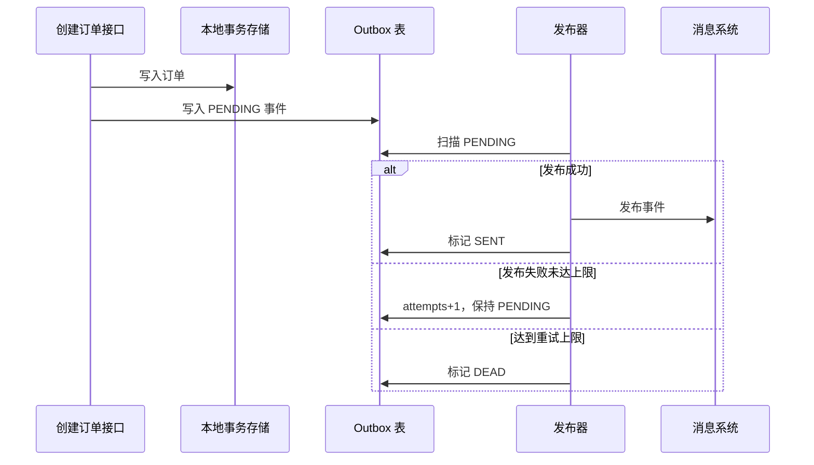

# SpringBoot 事务性发件箱

> 源码：`/Users/chenwei/Documents/code/java/learn-springboot/31-SpringBoot-transactional-outbox`

## 核心思路

本模块演示 [[Transactional Outbox]] 模式：订单业务数据和待发布事件同写到本地存储，发布器异步扫描 outbox，负责发布、重试、成功确认和死信标记，从而实现业务写入与事件发布的最终一致性。

## 项目结构

```text
src/main/java/com/cloud/
├── controller/TransactionalOutboxController.java
├── service/
│   ├── OrderApplicationService.java     (创建订单并写 outbox)
│   ├── OutboxPublisherService.java      (扫描与发布事件)
│   ├── MockEventPublisher.java
│   └── PublishSummary.java
├── repository/
│   ├── InMemoryOrderRepository.java
│   └── InMemoryOutboxRepository.java
├── model/
│   ├── OrderRecord.java
│   ├── OutboxEvent.java
│   ├── EventStatus.java
│   ├── OutboxSummary.java
│   └── CreateOrderResult.java
├── common/ApiResult.java
└── exception/GlobalExceptionHandler.java
```

## Outbox 事件状态

```java
public enum EventStatus {
    PENDING,
    SENT,
    DEAD
}
```

| 状态 | 含义 | 后续动作 |
|------|------|----------|
| `PENDING` | 已写入，等待发布或重试 | 发布器继续扫描 |
| `SENT` | 已发布成功 | 不再重复发布 |
| `DEAD` | 达到最大重试次数仍失败 | 进入人工处理或死信流程 |

## 订单与事件同写

```java
public synchronized OrderRecord createOrder(Long userId, BigDecimal amount) {
    Instant now = Instant.now();
    OrderRecord order = orderRepository.save(new OrderRecord(
            null,
            userId,
            amount,
            "CREATED",
            now
    ));
    OutboxEvent event = new OutboxEvent(
            null,
            UUID.randomUUID().toString(),
            "Order",
            order.getId(),
            "OrderCreated",
            "{\"orderId\":" + order.getId() + ",\"userId\":" + userId + ",\"amount\":" + amount + "}",
            EventStatus.PENDING,
            0,
            "",
            now,
            now
    );
    outboxRepository.save(event);
    return order;
}
```

在真实数据库中，订单表和 outbox 表应放在同一个本地事务中提交。本模块用 `synchronized` 和内存仓储模拟同写边界。

> [!important] 同写是 Outbox 的关键
> 不要先提交订单再直接发消息，也不要先发消息再提交订单。Outbox 的核心是业务数据和待发布事件共享同一个本地事务。

## 事件发布与重试

```java
public PublishSummary publishPending(boolean fail) {
    List<OutboxEvent> pendingEvents = outboxRepository.findPending();
    for (OutboxEvent event : pendingEvents) {
        try {
            eventPublisher.publish(event, fail);
            event.setStatus(EventStatus.SENT);
            event.setLastError("");
            outboxRepository.save(event);
            summary.setSent(summary.getSent() + 1);
        } catch (Exception ex) {
            event.setAttempts(event.getAttempts() + 1);
            event.setLastError(ex.getMessage());
            if (event.getAttempts() >= maxAttempts) {
                event.setStatus(EventStatus.DEAD);
                summary.setDead(summary.getDead() + 1);
            } else {
                event.setStatus(EventStatus.PENDING);
                summary.setFailed(summary.getFailed() + 1);
            }
            outboxRepository.save(event);
        }
    }
    return summary;
}
```

发布器只扫描 `PENDING` 事件：

1. 发布成功：状态改为 `SENT`
2. 发布失败但未达最大次数：状态仍为 `PENDING`，等待下次扫描
3. 发布失败且达到最大次数：状态改为 `DEAD`

## 稳定 eventId 与消费者幂等

事件创建时生成稳定的 `eventId`：

```java
UUID.randomUUID().toString()
```

发布失败后同一条 outbox 事件会被重复尝试，因此消费者侧应以 `eventId` 做 [[幂等性]] 去重，避免重复消费造成重复扣减、重复通知或重复记账。

## Outbox 流程



## 初学者学习路线

- 先把这个案例当成“最小可运行样例”，目标是理解 SpringBoot 事务性发件箱 的主流程。
- 先运行 README 里的启动命令和 curl，再带着现象回到代码里找入口。
- 每读一个类都问三件事：它由谁调用、它依赖谁、它改变了什么状态。

## 代码导读

下面的代码片段来自案例源码，并额外补了中文教学注释。阅读时先看注释理解职责，再回到完整源码核对细节。

### 接口入口：Controller 如何接收请求

源码位置：`src/main/java/com/cloud/controller/TransactionalOutboxController.java`

Controller 是 HTTP 世界和 Java 代码世界之间的边界：路径、请求参数、返回值都在这里集中出现。

```java
// 文件：com/cloud/controller/TransactionalOutboxController.java
// 学习重点：Controller 是 HTTP 世界和 Java 代码世界之间的边界：路径、请求参数、返回值都在这里集中出现。
// @RestController 表示这个类的返回值会直接写到 HTTP 响应体里，常用于 JSON API。
@RestController
// 类级别路径是这一组接口的共同前缀。
@RequestMapping("/api/outbox")
public class TransactionalOutboxController {

    private final OrderApplicationService orderApplicationService;
    private final OutboxPublisherService outboxPublisherService;

    public TransactionalOutboxController(OrderApplicationService orderApplicationService,
                                         OutboxPublisherService outboxPublisherService) {
        this.orderApplicationService = orderApplicationService;
        this.outboxPublisherService = outboxPublisherService;
    }

    // 方法级别映射说明具体 HTTP 动词和子路径。
    @GetMapping
    public ApiResult<Map<String, Object>> moduleInfo() {
        Map<String, Object> data = new LinkedHashMap<>();
        data.put("module", "31-SpringBoot-transactional-outbox");
        data.put("desc", "Transactional Outbox：业务数据与事件记录同写，异步发布并重试");
        data.put("apis", new String[]{
                "POST /api/outbox/orders?userId=1001&amount=99.90",
                "POST /api/outbox/publish?fail=false",
                "GET /api/outbox/events",
                "GET /api/outbox/summary"
        });
        return ApiResult.success(data);
    }

    // 方法级别映射说明具体 HTTP 动词和子路径。
    @PostMapping("/orders")
    public ResponseEntity<ApiResult<CreateOrderResult>> createOrder(@RequestParam Long userId,
                                                                     @RequestParam BigDecimal amount) {
        return ResponseEntity.ok(ApiResult.success(orderApplicationService.createOrderWithEvent(userId, amount)));
    }

    // 方法级别映射说明具体 HTTP 动词和子路径。
    @PostMapping("/publish")
    public ResponseEntity<ApiResult<PublishSummary>> publish(@RequestParam(defaultValue = "false") boolean fail) {
        return ResponseEntity.ok(ApiResult.success(outboxPublisherService.publishPending(fail)));
    }

    // 方法级别映射说明具体 HTTP 动词和子路径。
    @GetMapping("/events")
    public ApiResult<List<OutboxEvent>> events() {
        return ApiResult.success(outboxPublisherService.events());
    }

    // 方法级别映射说明具体 HTTP 动词和子路径。
    @GetMapping("/summary")
    public ApiResult<OutboxSummary> summary() {
        return ApiResult.success(outboxPublisherService.summary());
    }
}
```

关键点拆解：

- 先把 README 里的 curl 路径和这里的 `@RequestMapping` / `@GetMapping` / `@PostMapping` 对上。
- Controller 不应该堆复杂业务逻辑；看到它调用 Service，就说明职责分层是清楚的。
- 读完代码后，回到“生产差距”检查：安全、异常、监控、容量、测试是否都补齐。

### 业务核心：Service 如何组织规则

源码位置：`src/main/java/com/cloud/service/OrderApplicationService.java`

Service 承载业务规则，初学者要重点看它如何校验输入、调用依赖、返回结果。

```java
// 文件：com/cloud/service/OrderApplicationService.java
// 学习重点：Service 承载业务规则，初学者要重点看它如何校验输入、调用依赖、返回结果。
// @Service 表示这是业务层 Bean，会被 Spring 自动扫描并注入。
@Service
public class OrderApplicationService {

    private final InMemoryOrderRepository orderRepository;
    private final InMemoryOutboxRepository outboxRepository;

    public OrderApplicationService(InMemoryOrderRepository orderRepository,
                                   InMemoryOutboxRepository outboxRepository) {
        this.orderRepository = orderRepository;
        this.outboxRepository = outboxRepository;
    }

    public CreateOrderResult createOrderWithEvent(Long userId, BigDecimal amount) {
        OrderRecord order = createOrder(userId, amount);
        OutboxEvent event = outboxRepository.findAll().get(outboxRepository.findAll().size() - 1);
        return new CreateOrderResult(order, event);
    }

    public synchronized OrderRecord createOrder(Long userId, BigDecimal amount) {
        if (userId == null || userId <= 0) {
            throw new IllegalArgumentException("用户 ID 必须为正数");
        }
        if (amount == null || amount.compareTo(BigDecimal.ZERO) <= 0) {
            throw new IllegalArgumentException("订单金额必须大于 0");
        }

        Instant now = Instant.now();
        // save 表示状态发生变化，学习时要追踪保存前做了哪些校验。
        OrderRecord order = orderRepository.save(new OrderRecord(
                null,
                userId,
                amount,
                "CREATED",
                now
        ));
        OutboxEvent event = new OutboxEvent(
                null,
                UUID.randomUUID().toString(),
                "Order",
                order.getId(),
                "OrderCreated",
                "{\"orderId\":" + order.getId() + ",\"userId\":" + userId + ",\"amount\":" + amount + "}",
                EventStatus.PENDING,
                0,
                "",
                now,
                now
        );
        // save 表示状态发生变化，学习时要追踪保存前做了哪些校验。
        outboxRepository.save(event);
        return order;
    }
}
```

关键点拆解：

- Service 的 public 方法通常就是一个用例，例如创建、查询、刷新、投递、同步。
- 先看输入校验，再看调用了哪些依赖，最后看返回对象。
- 读完代码后，回到“生产差距”检查：安全、异常、监控、容量、测试是否都补齐。

### 业务核心：Service 如何组织规则

源码位置：`src/main/java/com/cloud/service/OutboxPublisherService.java`

Service 承载业务规则，初学者要重点看它如何校验输入、调用依赖、返回结果。

```java
// 文件：com/cloud/service/OutboxPublisherService.java
// 学习重点：Service 承载业务规则，初学者要重点看它如何校验输入、调用依赖、返回结果。
// @Service 表示这是业务层 Bean，会被 Spring 自动扫描并注入。
@Service
public class OutboxPublisherService {

    private final InMemoryOutboxRepository outboxRepository;
    private final MockEventPublisher eventPublisher;
    private final int maxAttempts;

    @Autowired
    public OutboxPublisherService(InMemoryOutboxRepository outboxRepository,
                                  MockEventPublisher eventPublisher) {
        this(outboxRepository, eventPublisher, 3);
    }

    public OutboxPublisherService(InMemoryOutboxRepository outboxRepository,
                                  MockEventPublisher eventPublisher,
                                  int maxAttempts) {
        this.outboxRepository = outboxRepository;
        this.eventPublisher = eventPublisher;
        this.maxAttempts = maxAttempts;
    }

    public PublishSummary publishPending(boolean fail) {
        List<OutboxEvent> pendingEvents = outboxRepository.findPending();
        PublishSummary summary = new PublishSummary(pendingEvents.size(), 0, 0, 0);
        for (OutboxEvent event : pendingEvents) {
            try {
                eventPublisher.publish(event, fail);
                event.setStatus(EventStatus.SENT);
                event.setLastError("");
                event.setUpdatedAt(Instant.now());
                // save 表示状态发生变化，学习时要追踪保存前做了哪些校验。
                outboxRepository.save(event);
                summary.setSent(summary.getSent() + 1);
            } catch (Exception ex) {
                event.setAttempts(event.getAttempts() + 1);
                event.setLastError(ex.getMessage());
                event.setUpdatedAt(Instant.now());
                if (event.getAttempts() >= maxAttempts) {
                    event.setStatus(EventStatus.DEAD);
                    summary.setDead(summary.getDead() + 1);
                } else {
                    event.setStatus(EventStatus.PENDING);
                    summary.setFailed(summary.getFailed() + 1);
                }
                // save 表示状态发生变化，学习时要追踪保存前做了哪些校验。
                outboxRepository.save(event);
            }
        }
        return summary;
    }

    public List<OutboxEvent> events() {
        return outboxRepository.findAll();
    }

    public OutboxSummary summary() {
        return outboxRepository.summary();
    }
}
```

关键点拆解：

- Service 的 public 方法通常就是一个用例，例如创建、查询、刷新、投递、同步。
- 先看输入校验，再看调用了哪些依赖，最后看返回对象。
- 读完代码后，回到“生产差距”检查：安全、异常、监控、容量、测试是否都补齐。

### 数据访问：示例如何保存和查询数据

源码位置：`src/main/java/com/cloud/repository/InMemoryOrderRepository.java`

Repository 隐藏存储细节，让 Service 不必关心数据怎么存。

```java
// 文件：com/cloud/repository/InMemoryOrderRepository.java
// 学习重点：Repository 隐藏存储细节，让 Service 不必关心数据怎么存。
// @Repository 表示数据访问层 Bean，真实项目通常连接数据库或外部存储。
@Repository
public class InMemoryOrderRepository {

    private final AtomicLong idGenerator = new AtomicLong(1000);
    private final ConcurrentHashMap<Long, OrderRecord> orders = new ConcurrentHashMap<>();

    public OrderRecord save(OrderRecord order) {
        if (order.getId() == null) {
            order.setId(idGenerator.incrementAndGet());
        }
        orders.put(order.getId(), order);
        return order;
    }

    public long count() {
        return orders.size();
    }

    public List<OrderRecord> findAll() {
        return new ArrayList<>(orders.values());
    }

    public void clear() {
        orders.clear();
        idGenerator.set(1000);
    }
}
```

关键点拆解：

- 示例里的 Repository 多半是内存实现；真实项目要替换成数据库、缓存或外部服务。
- 读完代码后，回到“生产差距”检查：安全、异常、监控、容量、测试是否都补齐。

## 运行时调用链

1. TransactionalOutboxController：接收 HTTP 请求并转换成 Java 方法调用
2. OrderApplicationService：执行案例的核心业务规则
3. InMemoryOrderRepository：保存或查询示例数据

## 初学者常见误区

- 只把接口跑通，却没有回到代码理解 Controller、Service、Repository 的分工。
- 把内存 Map、模拟客户端、固定配置当成生产实现。
- 只看 happy path，忽略参数错误、外部系统失败、并发和重复请求。

## API 接口

| 方法 | 路径 | 说明 |
|------|------|------|
| GET | `/api/outbox` | 模块说明 |
| POST | `/api/outbox/orders?userId=1001&amount=99.90` | 创建订单并写入 outbox 事件 |
| POST | `/api/outbox/publish?fail=false` | 触发一次发布扫描并成功发布 |
| POST | `/api/outbox/publish?fail=true` | 模拟发布失败并累计重试次数 |
| GET | `/api/outbox/events` | 查看 outbox 事件列表 |
| GET | `/api/outbox/summary` | 查看事件状态统计 |

## 调用验证

```bash
mvn -pl 31-SpringBoot-transactional-outbox spring-boot:run

curl -X POST "http://localhost:8111/api/outbox/orders?userId=1001&amount=99.90"
curl -X POST "http://localhost:8111/api/outbox/publish?fail=false"
curl "http://localhost:8111/api/outbox/summary"
```

## 生产差距

这个示例适合帮助初学者理解 事务性发件箱 的核心机制，但生产项目不能只停留在“能跑通”。真实落地时至少要补齐：统一鉴权、参数边界校验、异常响应、结构化日志、监控指标、自动化测试、配置隔离和容量评估。

如果模块涉及数据库、缓存、消息、网关、认证或外部服务，还要进一步考虑连接池、超时、重试、幂等、事务边界、数据一致性和故障告警。学习时可以先记住主流程，再用这些生产差距反向检查自己是否真正理解了案例。

## 要点总结

1. [[Transactional Outbox]] 解决业务写入成功但消息发布失败的一致性问题
2. 业务数据和 outbox 事件必须同事务写入
3. 发布器异步扫描 `PENDING` 事件，成功后标记 `SENT`
4. 发布失败要保留重试次数和错误信息，达到上限后进入 `DEAD`
5. 由于事件可能重复发布，消费者必须基于稳定 `eventId` 做 [[幂等性]]
