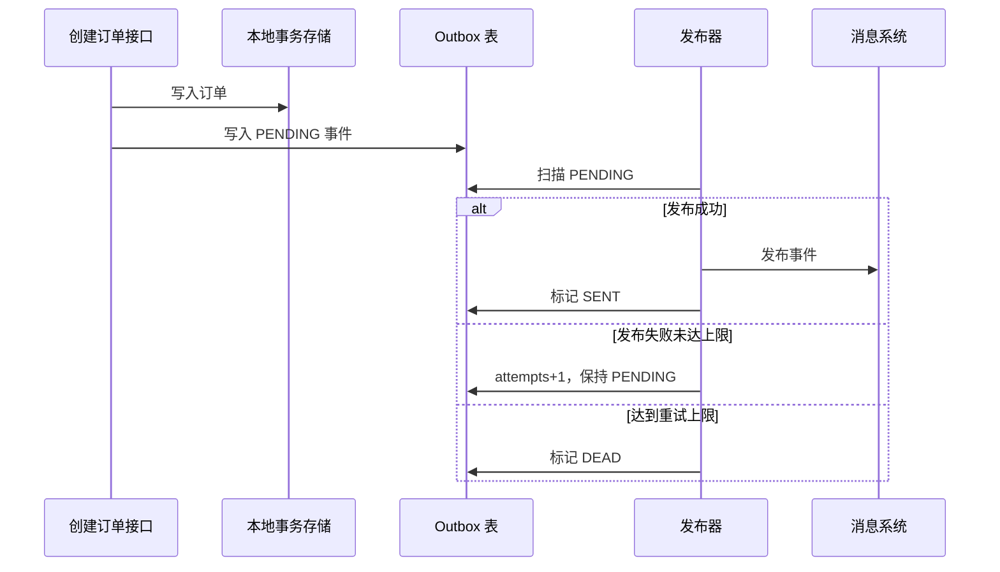

# SpringBoot 事务性发件箱

> 源码：`/Users/chenwei/Documents/code/java/learn-springboot/31-SpringBoot-transactional-outbox`

## 核心思路

本模块演示 [[Transactional Outbox]] 模式：订单业务数据和待发布事件同写到本地存储，发布器异步扫描 outbox，负责发布、重试、成功确认和死信标记，从而实现业务写入与事件发布的最终一致性。

## 项目结构

```text
src/main/java/com/cloud/
├── controller/TransactionalOutboxController.java
├── service/
│   ├── OrderApplicationService.java     (创建订单并写 outbox)
│   ├── OutboxPublisherService.java      (扫描与发布事件)
│   ├── MockEventPublisher.java
│   └── PublishSummary.java
├── repository/
│   ├── InMemoryOrderRepository.java
│   └── InMemoryOutboxRepository.java
├── model/
│   ├── OrderRecord.java
│   ├── OutboxEvent.java
│   ├── EventStatus.java
│   ├── OutboxSummary.java
│   └── CreateOrderResult.java
├── common/ApiResult.java
└── exception/GlobalExceptionHandler.java
```

## Outbox 事件状态

```java
public enum EventStatus {
    PENDING,
    SENT,
    DEAD
}
```

| 状态 | 含义 | 后续动作 |
|------|------|----------|
| `PENDING` | 已写入，等待发布或重试 | 发布器继续扫描 |
| `SENT` | 已发布成功 | 不再重复发布 |
| `DEAD` | 达到最大重试次数仍失败 | 进入人工处理或死信流程 |

## 订单与事件同写

```java
public synchronized OrderRecord createOrder(Long userId, BigDecimal amount) {
    Instant now = Instant.now();
    OrderRecord order = orderRepository.save(new OrderRecord(
            null,
            userId,
            amount,
            "CREATED",
            now
    ));
    OutboxEvent event = new OutboxEvent(
            null,
            UUID.randomUUID().toString(),
            "Order",
            order.getId(),
            "OrderCreated",
            "{\"orderId\":" + order.getId() + ",\"userId\":" + userId + ",\"amount\":" + amount + "}",
            EventStatus.PENDING,
            0,
            "",
            now,
            now
    );
    outboxRepository.save(event);
    return order;
}
```

在真实数据库中，订单表和 outbox 表应放在同一个本地事务中提交。本模块用 `synchronized` 和内存仓储模拟同写边界。

> [!important] 同写是 Outbox 的关键
> 不要先提交订单再直接发消息，也不要先发消息再提交订单。Outbox 的核心是业务数据和待发布事件共享同一个本地事务。

## 事件发布与重试

```java
public PublishSummary publishPending(boolean fail) {
    List<OutboxEvent> pendingEvents = outboxRepository.findPending();
    for (OutboxEvent event : pendingEvents) {
        try {
            eventPublisher.publish(event, fail);
            event.setStatus(EventStatus.SENT);
            event.setLastError("");
            outboxRepository.save(event);
            summary.setSent(summary.getSent() + 1);
        } catch (Exception ex) {
            event.setAttempts(event.getAttempts() + 1);
            event.setLastError(ex.getMessage());
            if (event.getAttempts() >= maxAttempts) {
                event.setStatus(EventStatus.DEAD);
                summary.setDead(summary.getDead() + 1);
            } else {
                event.setStatus(EventStatus.PENDING);
                summary.setFailed(summary.getFailed() + 1);
            }
            outboxRepository.save(event);
        }
    }
    return summary;
}
```

发布器只扫描 `PENDING` 事件：

1. 发布成功：状态改为 `SENT`
2. 发布失败但未达最大次数：状态仍为 `PENDING`，等待下次扫描
3. 发布失败且达到最大次数：状态改为 `DEAD`

## 稳定 eventId 与消费者幂等

事件创建时生成稳定的 `eventId`：

```java
UUID.randomUUID().toString()
```

发布失败后同一条 outbox 事件会被重复尝试，因此消费者侧应以 `eventId` 做 [[幂等性]] 去重，避免重复消费造成重复扣减、重复通知或重复记账。

## Outbox 流程



## API 接口

| 方法 | 路径 | 说明 |
|------|------|------|
| GET | `/api/outbox` | 模块说明 |
| POST | `/api/outbox/orders?userId=1001&amount=99.90` | 创建订单并写入 outbox 事件 |
| POST | `/api/outbox/publish?fail=false` | 触发一次发布扫描并成功发布 |
| POST | `/api/outbox/publish?fail=true` | 模拟发布失败并累计重试次数 |
| GET | `/api/outbox/events` | 查看 outbox 事件列表 |
| GET | `/api/outbox/summary` | 查看事件状态统计 |

## 调用验证

```bash
mvn -pl 31-SpringBoot-transactional-outbox spring-boot:run

curl -X POST "http://localhost:8111/api/outbox/orders?userId=1001&amount=99.90"
curl -X POST "http://localhost:8111/api/outbox/publish?fail=false"
curl "http://localhost:8111/api/outbox/summary"
```

## 要点总结

1. [[Transactional Outbox]] 解决业务写入成功但消息发布失败的一致性问题
2. 业务数据和 outbox 事件必须同事务写入
3. 发布器异步扫描 `PENDING` 事件，成功后标记 `SENT`
4. 发布失败要保留重试次数和错误信息，达到上限后进入 `DEAD`
5. 由于事件可能重复发布，消费者必须基于稳定 `eventId` 做 [[幂等性]]
