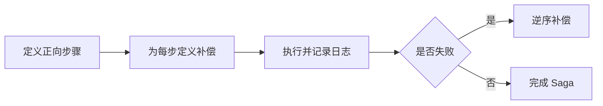

# SpringBoot Saga 补偿事务

> 源码：`/Users/chenwei/Documents/code/java/learn-springboot/32-SpringBoot-saga-compensation`

## 核心思路

本模块演示 [[Saga]] 编排式补偿事务：订单创建、库存预留、支付扣款按顺序执行；当后续步骤失败时，按照相反顺序补偿已经完成的步骤，最终让系统进入可解释的一致状态。

## 项目结构

```text
src/main/java/com/cloud/
├── controller/SagaCompensationController.java
├── service/
│   ├── SagaOrderService.java          (Saga 编排核心)
│   ├── InMemoryOrderService.java      (订单服务)
│   ├── InMemoryInventoryService.java  (库存服务)
│   └── MockPaymentService.java        (支付服务)
├── model/
│   ├── SagaOrderRequest.java
│   ├── SagaOrder.java
│   ├── SagaExecutionResult.java
│   ├── SagaStepLog.java
│   └── InventorySnapshot.java
├── common/ApiResult.java
└── exception/GlobalExceptionHandler.java
```

## Saga 正向步骤

```java
SagaOrder order = orderService.create(request);
steps.add(log("ORDER_CREATED", "SUCCESS", "订单已创建"));

inventoryService.reserve(request.getProductId(), request.getQuantity(), request.isInventoryFail());
steps.add(log("INVENTORY_RESERVED", "SUCCESS", "库存已预留"));

paymentService.charge(order, request.isPaymentFail());
steps.add(log("PAYMENT_CHARGED", "SUCCESS", "支付已扣款"));
orderService.markPaid(order);
return new SagaExecutionResult(true, "COMPLETED", "NONE", order, steps);
```

正向执行顺序：

1. 创建订单
2. 预留库存
3. 支付扣款
4. 标记订单为已支付

## 库存失败补偿

```java
try {
    inventoryService.reserve(request.getProductId(), request.getQuantity(), request.isInventoryFail());
    steps.add(log("INVENTORY_RESERVED", "SUCCESS", "库存已预留"));
} catch (Exception ex) {
    steps.add(log("INVENTORY_FAILED", "FAILED", ex.getMessage()));
    orderService.cancel(order);
    steps.add(log("ORDER_CANCELLED", "COMPENSATED", "库存失败后取消订单"));
    return new SagaExecutionResult(false, "COMPENSATED", "INVENTORY_FAILED", order, steps);
}
```

库存失败时，只有订单已经创建，因此补偿动作是取消订单。

## 支付失败补偿

```java
try {
    paymentService.charge(order, request.isPaymentFail());
    steps.add(log("PAYMENT_CHARGED", "SUCCESS", "支付已扣款"));
    orderService.markPaid(order);
} catch (Exception ex) {
    steps.add(log("PAYMENT_FAILED", "FAILED", ex.getMessage()));
    inventoryService.release(request.getProductId(), request.getQuantity());
    steps.add(log("INVENTORY_RELEASED", "COMPENSATED", "支付失败后释放库存"));
    orderService.cancel(order);
    steps.add(log("ORDER_CANCELLED", "COMPENSATED", "支付失败后取消订单"));
    return new SagaExecutionResult(false, "COMPENSATED", "PAYMENT_FAILED", order, steps);
}
```

支付失败时，订单创建和库存预留都已成功，因此按相反顺序补偿：先释放库存，再取消订单。

> [!important] 补偿不是回滚
> Saga 的补偿是新的业务动作，不是数据库事务回滚。补偿动作也可能失败，因此生产系统需要补偿重试、告警和人工处理。

## 执行日志

每一步都会写入 `SagaStepLog`：

```java
private SagaStepLog log(String step, String status, String message) {
    return new SagaStepLog(step, status, message, Instant.now());
}
```

日志状态包括：

| 状态 | 含义 |
|------|------|
| `SUCCESS` | 正向步骤成功 |
| `FAILED` | 正向步骤失败 |
| `COMPENSATED` | 已执行补偿动作 |

## API 接口

| 方法 | 路径 | 说明 |
|------|------|------|
| GET | `/api/saga` | 模块说明 |
| POST | `/api/saga/orders` | 正常执行 Saga |
| POST | `/api/saga/orders?inventoryFail=true` | 模拟库存失败 |
| POST | `/api/saga/orders?paymentFail=true` | 模拟支付失败并补偿 |
| GET | `/api/saga/orders` | 查看订单列表 |
| GET | `/api/saga/inventory` | 查看库存快照 |

## 调用验证

```bash
mvn -pl 32-SpringBoot-saga-compensation spring-boot:run

curl -X POST "http://localhost:8112/api/saga/orders?userId=1001&productId=1&quantity=1&amount=99.90"
curl -X POST "http://localhost:8112/api/saga/orders?userId=1001&productId=1&quantity=1&amount=99.90&inventoryFail=true"
curl -X POST "http://localhost:8112/api/saga/orders?userId=1001&productId=1&quantity=1&amount=99.90&paymentFail=true"
curl "http://localhost:8112/api/saga/inventory"
```

## 要点总结

1. [[Saga]] 用一组本地事务和补偿动作实现跨服务最终一致性
2. 编排式 Saga 由中心服务决定步骤顺序和补偿顺序
3. 补偿顺序通常与正向步骤相反
4. 补偿是业务动作，不等同于数据库回滚
5. 每一步日志很关键，便于排查、重试和人工修复

## 实践流程



## 实践检查清单

- 每个正向步骤是否有明确补偿动作。
- 补偿动作是否幂等，可重复执行。
- Saga 日志是否能恢复当前状态。
- 是否有补偿失败的重试、告警和人工处理入口。
- 用户界面是否能展示处理中、失败和已补偿状态。

## 案例

下单流程中订单创建成功、库存预留成功、支付失败时，系统应释放库存并取消订单，而不是期待数据库自动回滚跨服务操作。

## 常见误区

- 把补偿当作事务回滚，忽略补偿本身也会失败。
- 只设计成功路径，没有定义每一步失败后的状态。
- 补偿没有幂等，重试时造成二次扣减或释放。
