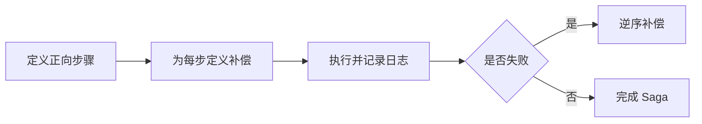

# SpringBoot Saga 补偿事务

> 源码：`/Users/chenwei/Documents/code/java/learn-springboot/32-SpringBoot-saga-compensation`

## 核心思路

本模块演示 [[Saga]] 编排式补偿事务：订单创建、库存预留、支付扣款按顺序执行；当后续步骤失败时，按照相反顺序补偿已经完成的步骤，最终让系统进入可解释的一致状态。

## 项目结构

```text
src/main/java/com/cloud/
├── controller/SagaCompensationController.java
├── service/
│   ├── SagaOrderService.java          (Saga 编排核心)
│   ├── InMemoryOrderService.java      (订单服务)
│   ├── InMemoryInventoryService.java  (库存服务)
│   └── MockPaymentService.java        (支付服务)
├── model/
│   ├── SagaOrderRequest.java
│   ├── SagaOrder.java
│   ├── SagaExecutionResult.java
│   ├── SagaStepLog.java
│   └── InventorySnapshot.java
├── common/ApiResult.java
└── exception/GlobalExceptionHandler.java
```

## Saga 正向步骤

```java
SagaOrder order = orderService.create(request);
steps.add(log("ORDER_CREATED", "SUCCESS", "订单已创建"));

inventoryService.reserve(request.getProductId(), request.getQuantity(), request.isInventoryFail());
steps.add(log("INVENTORY_RESERVED", "SUCCESS", "库存已预留"));

paymentService.charge(order, request.isPaymentFail());
steps.add(log("PAYMENT_CHARGED", "SUCCESS", "支付已扣款"));
orderService.markPaid(order);
return new SagaExecutionResult(true, "COMPLETED", "NONE", order, steps);
```

正向执行顺序：

1. 创建订单
2. 预留库存
3. 支付扣款
4. 标记订单为已支付

## 库存失败补偿

```java
try {
    inventoryService.reserve(request.getProductId(), request.getQuantity(), request.isInventoryFail());
    steps.add(log("INVENTORY_RESERVED", "SUCCESS", "库存已预留"));
} catch (Exception ex) {
    steps.add(log("INVENTORY_FAILED", "FAILED", ex.getMessage()));
    orderService.cancel(order);
    steps.add(log("ORDER_CANCELLED", "COMPENSATED", "库存失败后取消订单"));
    return new SagaExecutionResult(false, "COMPENSATED", "INVENTORY_FAILED", order, steps);
}
```

库存失败时，只有订单已经创建，因此补偿动作是取消订单。

## 支付失败补偿

```java
try {
    paymentService.charge(order, request.isPaymentFail());
    steps.add(log("PAYMENT_CHARGED", "SUCCESS", "支付已扣款"));
    orderService.markPaid(order);
} catch (Exception ex) {
    steps.add(log("PAYMENT_FAILED", "FAILED", ex.getMessage()));
    inventoryService.release(request.getProductId(), request.getQuantity());
    steps.add(log("INVENTORY_RELEASED", "COMPENSATED", "支付失败后释放库存"));
    orderService.cancel(order);
    steps.add(log("ORDER_CANCELLED", "COMPENSATED", "支付失败后取消订单"));
    return new SagaExecutionResult(false, "COMPENSATED", "PAYMENT_FAILED", order, steps);
}
```

支付失败时，订单创建和库存预留都已成功，因此按相反顺序补偿：先释放库存，再取消订单。

> [!important] 补偿不是回滚
> Saga 的补偿是新的业务动作，不是数据库事务回滚。补偿动作也可能失败，因此生产系统需要补偿重试、告警和人工处理。

## 执行日志

每一步都会写入 `SagaStepLog`：

```java
private SagaStepLog log(String step, String status, String message) {
    return new SagaStepLog(step, status, message, Instant.now());
}
```

日志状态包括：

| 状态 | 含义 |
|------|------|
| `SUCCESS` | 正向步骤成功 |
| `FAILED` | 正向步骤失败 |
| `COMPENSATED` | 已执行补偿动作 |

## 初学者学习路线

- 先把这个案例当成“最小可运行样例”，目标是理解 SpringBoot Saga 补偿事务 的主流程。
- 先运行 README 里的启动命令和 curl，再带着现象回到代码里找入口。
- 每读一个类都问三件事：它由谁调用、它依赖谁、它改变了什么状态。

## 代码导读

下面的代码片段来自案例源码，并额外补了中文教学注释。阅读时先看注释理解职责，再回到完整源码核对细节。

### 接口入口：Controller 如何接收请求

源码位置：`src/main/java/com/cloud/controller/SagaCompensationController.java`

Controller 是 HTTP 世界和 Java 代码世界之间的边界：路径、请求参数、返回值都在这里集中出现。

```java
// 文件：com/cloud/controller/SagaCompensationController.java
// 学习重点：Controller 是 HTTP 世界和 Java 代码世界之间的边界：路径、请求参数、返回值都在这里集中出现。
// @RestController 表示这个类的返回值会直接写到 HTTP 响应体里，常用于 JSON API。
@RestController
// 类级别路径是这一组接口的共同前缀。
@RequestMapping("/api/saga")
public class SagaCompensationController {

    private final SagaOrderService sagaOrderService;

    // 构造器注入：依赖从 Spring 容器传入，代码更容易测试，也避免隐藏依赖。
    public SagaCompensationController(SagaOrderService sagaOrderService) {
        this.sagaOrderService = sagaOrderService;
    }

    // 方法级别映射说明具体 HTTP 动词和子路径。
    @GetMapping
    public ApiResult<Map<String, Object>> moduleInfo() {
        Map<String, Object> data = new LinkedHashMap<>();
        data.put("module", "32-SpringBoot-saga-compensation");
        data.put("desc", "Saga 编排式补偿事务：正向步骤失败后按反向顺序补偿");
        data.put("apis", new String[]{
                "POST /api/saga/orders?userId=1001&productId=1&quantity=1&amount=99.90",
                "POST /api/saga/orders?...&inventoryFail=true",
                "POST /api/saga/orders?...&paymentFail=true",
                "GET /api/saga/orders",
                "GET /api/saga/inventory"
        });
        return ApiResult.success(data);
    }

    // 方法级别映射说明具体 HTTP 动词和子路径。
    @PostMapping("/orders")
    public ResponseEntity<ApiResult<SagaExecutionResult>> createOrder(@RequestParam Long userId,
                                                                       @RequestParam Long productId,
                                                                       @RequestParam Integer quantity,
                                                                       @RequestParam BigDecimal amount,
                                                                       @RequestParam(defaultValue = "false") boolean inventoryFail,
                                                                       @RequestParam(defaultValue = "false") boolean paymentFail) {
        SagaOrderRequest request = SagaOrderRequest.builder()
                .userId(userId)
                .productId(productId)
                .quantity(quantity)
                .amount(amount)
                .inventoryFail(inventoryFail)
                .paymentFail(paymentFail)
                .build();
        return ResponseEntity.ok(ApiResult.success(sagaOrderService.createOrder(request)));
    }

    // 方法级别映射说明具体 HTTP 动词和子路径。
    @GetMapping("/orders")
    public ApiResult<List<SagaOrder>> orders() {
        return ApiResult.success(sagaOrderService.orders());
    }

    // 方法级别映射说明具体 HTTP 动词和子路径。
    @GetMapping("/inventory")
    public ApiResult<InventorySnapshot> inventory() {
        return ApiResult.success(sagaOrderService.inventory());
    }
}
```

关键点拆解：

- 先把 README 里的 curl 路径和这里的 `@RequestMapping` / `@GetMapping` / `@PostMapping` 对上。
- Controller 不应该堆复杂业务逻辑；看到它调用 Service，就说明职责分层是清楚的。
- 读完代码后，回到“生产差距”检查：安全、异常、监控、容量、测试是否都补齐。

### 业务核心：Service 如何组织规则

源码位置：`src/main/java/com/cloud/service/InMemoryInventoryService.java`

Service 承载业务规则，初学者要重点看它如何校验输入、调用依赖、返回结果。

```java
// 文件：com/cloud/service/InMemoryInventoryService.java
// 学习重点：Service 承载业务规则，初学者要重点看它如何校验输入、调用依赖、返回结果。
// @Service 表示这是业务层 Bean，会被 Spring 自动扫描并注入。
@Service
public class InMemoryInventoryService {

    private final ConcurrentHashMap<Long, Integer> available = new ConcurrentHashMap<>();
    private final ConcurrentHashMap<Long, Integer> reserved = new ConcurrentHashMap<>();

    // 构造器注入：依赖从 Spring 容器传入，代码更容易测试，也避免隐藏依赖。
    public InMemoryInventoryService() {
        available.put(1L, 3);
        available.put(2L, 5);
        available.put(3L, 10);
    }

    public synchronized void reserve(Long productId, int quantity, boolean fail) {
        if (fail) {
            throw new IllegalStateException("inventory reserve failed");
        }
        int current = available.getOrDefault(productId, 0);
        if (current < quantity) {
            throw new IllegalStateException("inventory not enough");
        }
        available.put(productId, current - quantity);
        reserved.merge(productId, quantity, Integer::sum);
    }

    public synchronized void release(Long productId, int quantity) {
        int currentReserved = reserved.getOrDefault(productId, 0);
        int releaseQuantity = Math.min(currentReserved, quantity);
        if (releaseQuantity <= 0) {
            return;
        }
        reserved.put(productId, currentReserved - releaseQuantity);
        available.merge(productId, releaseQuantity, Integer::sum);
    }

    public InventorySnapshot snapshot() {
        return new InventorySnapshot(Map.copyOf(available), Map.copyOf(reserved));
    }
}
```

关键点拆解：

- Service 的 public 方法通常就是一个用例，例如创建、查询、刷新、投递、同步。
- 先看输入校验，再看调用了哪些依赖，最后看返回对象。
- 读完代码后，回到“生产差距”检查：安全、异常、监控、容量、测试是否都补齐。

### 业务核心：Service 如何组织规则

源码位置：`src/main/java/com/cloud/service/InMemoryOrderService.java`

Service 承载业务规则，初学者要重点看它如何校验输入、调用依赖、返回结果。

```java
// 文件：com/cloud/service/InMemoryOrderService.java
// 学习重点：Service 承载业务规则，初学者要重点看它如何校验输入、调用依赖、返回结果。
// @Service 表示这是业务层 Bean，会被 Spring 自动扫描并注入。
@Service
public class InMemoryOrderService {

    private final AtomicLong idGenerator = new AtomicLong(1000);
    private final ConcurrentHashMap<Long, SagaOrder> orders = new ConcurrentHashMap<>();

    public SagaOrder create(SagaOrderRequest request) {
        Instant now = Instant.now();
        SagaOrder order = new SagaOrder(
                idGenerator.incrementAndGet(),
                request.getUserId(),
                request.getProductId(),
                request.getQuantity(),
                request.getAmount(),
                "CREATED",
                now,
                now
        );
        orders.put(order.getId(), order);
        return order;
    }

    public SagaOrder markPaid(SagaOrder order) {
        order.setStatus("PAID");
        order.setUpdatedAt(Instant.now());
        orders.put(order.getId(), order);
        return order;
    }

    public SagaOrder cancel(SagaOrder order) {
        order.setStatus("CANCELLED");
        order.setUpdatedAt(Instant.now());
        orders.put(order.getId(), order);
        return order;
    }

    public List<SagaOrder> findAll() {
        return orders.values().stream()
                .sorted(Comparator.comparing(SagaOrder::getId))
                .toList();
    }
}
```

关键点拆解：

- Service 的 public 方法通常就是一个用例，例如创建、查询、刷新、投递、同步。
- 先看输入校验，再看调用了哪些依赖，最后看返回对象。
- 读完代码后，回到“生产差距”检查：安全、异常、监控、容量、测试是否都补齐。

### 业务核心：Service 如何组织规则

源码位置：`src/main/java/com/cloud/service/MockPaymentService.java`

Service 承载业务规则，初学者要重点看它如何校验输入、调用依赖、返回结果。

```java
// 文件：com/cloud/service/MockPaymentService.java
// 学习重点：Service 承载业务规则，初学者要重点看它如何校验输入、调用依赖、返回结果。
// @Service 表示这是业务层 Bean，会被 Spring 自动扫描并注入。
@Service
public class MockPaymentService {

    private final CopyOnWriteArrayList<Long> chargedOrders = new CopyOnWriteArrayList<>();

    public void charge(SagaOrder order, boolean fail) {
        if (fail) {
            throw new IllegalStateException("payment charge failed");
        }
        chargedOrders.add(order.getId());
    }

    public List<Long> chargedOrders() {
        return new ArrayList<>(chargedOrders);
    }
}
```

关键点拆解：

- Service 的 public 方法通常就是一个用例，例如创建、查询、刷新、投递、同步。
- 先看输入校验，再看调用了哪些依赖，最后看返回对象。
- 读完代码后，回到“生产差距”检查：安全、异常、监控、容量、测试是否都补齐。

## 运行时调用链

- 从 README 的接口或测试名称开始，先定位入口类。
- 找 Controller、Runner、Listener 或 AutoConfiguration 作为第一阅读点。
- 沿着构造器注入的依赖继续进入 Service、Repository 或扩展点类。

## 初学者常见误区

- 只把接口跑通，却没有回到代码理解 Controller、Service、Repository 的分工。
- 把内存 Map、模拟客户端、固定配置当成生产实现。
- 只看 happy path，忽略参数错误、外部系统失败、并发和重复请求。

## API 接口

| 方法 | 路径 | 说明 |
|------|------|------|
| GET | `/api/saga` | 模块说明 |
| POST | `/api/saga/orders` | 正常执行 Saga |
| POST | `/api/saga/orders?inventoryFail=true` | 模拟库存失败 |
| POST | `/api/saga/orders?paymentFail=true` | 模拟支付失败并补偿 |
| GET | `/api/saga/orders` | 查看订单列表 |
| GET | `/api/saga/inventory` | 查看库存快照 |

## 调用验证

```bash
mvn -pl 32-SpringBoot-saga-compensation spring-boot:run

curl -X POST "http://localhost:8112/api/saga/orders?userId=1001&productId=1&quantity=1&amount=99.90"
curl -X POST "http://localhost:8112/api/saga/orders?userId=1001&productId=1&quantity=1&amount=99.90&inventoryFail=true"
curl -X POST "http://localhost:8112/api/saga/orders?userId=1001&productId=1&quantity=1&amount=99.90&paymentFail=true"
curl "http://localhost:8112/api/saga/inventory"
```

## 生产差距

这个示例适合帮助初学者理解 Saga 补偿事务 的核心机制，但生产项目不能只停留在“能跑通”。真实落地时至少要补齐：统一鉴权、参数边界校验、异常响应、结构化日志、监控指标、自动化测试、配置隔离和容量评估。

如果模块涉及数据库、缓存、消息、网关、认证或外部服务，还要进一步考虑连接池、超时、重试、幂等、事务边界、数据一致性和故障告警。学习时可以先记住主流程，再用这些生产差距反向检查自己是否真正理解了案例。

## 要点总结

1. [[Saga]] 用一组本地事务和补偿动作实现跨服务最终一致性
2. 编排式 Saga 由中心服务决定步骤顺序和补偿顺序
3. 补偿顺序通常与正向步骤相反
4. 补偿是业务动作，不等同于数据库回滚
5. 每一步日志很关键，便于排查、重试和人工修复

## 实践流程



## 实践检查清单

- 每个正向步骤是否有明确补偿动作。
- 补偿动作是否幂等，可重复执行。
- Saga 日志是否能恢复当前状态。
- 是否有补偿失败的重试、告警和人工处理入口。
- 用户界面是否能展示处理中、失败和已补偿状态。

## 案例

下单流程中订单创建成功、库存预留成功、支付失败时，系统应释放库存并取消订单，而不是期待数据库自动回滚跨服务操作。

## 常见误区

- 把补偿当作事务回滚，忽略补偿本身也会失败。
- 只设计成功路径，没有定义每一步失败后的状态。
- 补偿没有幂等，重试时造成二次扣减或释放。
