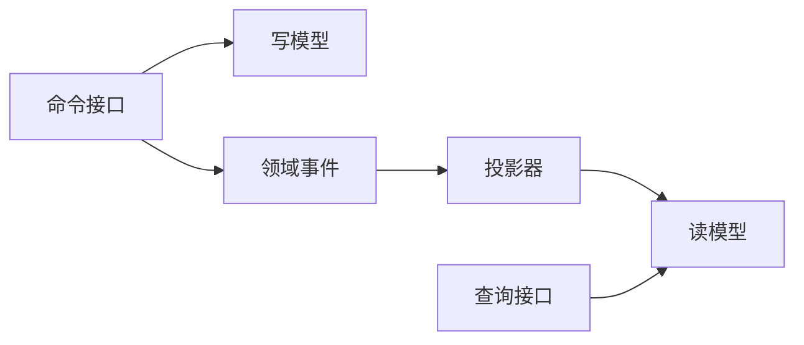

# SpringBoot CQRS 读模型

> 源码：`/Users/chenwei/Documents/code/java/learn-springboot/33-SpringBoot-cqrs-read-model`

## 核心思路

本模块演示 [[CQRS]] 读写分离：命令侧修改订单写模型并产生 [[领域事件]]，投影器消费事件生成查询友好的订单摘要读模型。写模型负责业务状态变化，读模型负责高效查询。

## 项目结构

```text
src/main/java/com/cloud/
├── controller/CqrsReadModelController.java
├── service/
│   ├── OrderCommandService.java       (命令侧：创建、支付订单)
│   ├── OrderProjectionService.java    (事件投影器)
│   └── OrderQueryService.java         (查询侧)
├── repository/
│   ├── InMemoryOrderWriteRepository.java
│   ├── InMemoryEventRepository.java
│   └── InMemoryOrderReadRepository.java
├── model/
│   ├── WriteOrder.java
│   ├── DomainEvent.java
│   ├── OrderSummaryView.java
│   └── ProjectionResult.java
├── common/ApiResult.java
└── exception/GlobalExceptionHandler.java
```

## 写模型与事件

命令侧负责处理业务动作：

- 创建订单：写入 `WriteOrder`，产生 `OrderCreated` 事件
- 支付订单：更新写模型状态，产生 `OrderPaid` 事件

读模型不会直接由命令接口修改，而是由事件投影生成。

## 增量投影

```java
public ProjectionResult projectNewEvents() {
    return project(eventRepository.findAfter(readRepository.lastProjectedEventId()));
}
```

`lastProjectedEventId` 记录读模型已经处理到哪个事件，下一次只投影新增事件，避免重复处理。

## 重建读模型

```java
public ProjectionResult rebuild() {
    readRepository.clear();
    return project(eventRepository.findAll());
}
```

读模型可以清空后从历史事件重放重建。这是 CQRS 的重要能力：读模型是可再生的查询视图。

## 投影逻辑

```java
private void apply(DomainEvent event) {
    if ("OrderCreated".equals(event.getEventType())) {
        readRepository.save(new OrderSummaryView(
                event.getAggregateId(),
                event.getUserId(),
                event.getAmount(),
                "CREATED",
                true,
                event.getOccurredAt(),
                null,
                event.getId()
        ));
        return;
    }
    if ("OrderPaid".equals(event.getEventType())) {
        OrderSummaryView view = readRepository.findById(event.getAggregateId())
                .orElseGet(() -> new OrderSummaryView(...));
        view.setStatus("PAID");
        view.setPendingPayment(false);
        view.setPaidAt(event.getOccurredAt());
        view.setLastEventId(event.getId());
        readRepository.save(view);
    }
}
```

| 事件 | 对读模型的影响 |
|------|----------------|
| `OrderCreated` | 新建订单摘要，状态为 `CREATED` |
| `OrderPaid` | 更新订单摘要，状态改为 `PAID` |

> [!important] 读模型是事件投影结果
> 查询侧不承担业务决策，只保存面向查询优化后的视图。读模型可延迟、可重建，也可能短暂落后于写模型。

## CQRS 流程



## 初学者学习路线

- 先把这个案例当成“最小可运行样例”，目标是理解 SpringBoot CQRS 读模型 的主流程。
- 先运行 README 里的启动命令和 curl，再带着现象回到代码里找入口。
- 每读一个类都问三件事：它由谁调用、它依赖谁、它改变了什么状态。

## 代码导读

下面的代码片段来自案例源码，并额外补了中文教学注释。阅读时先看注释理解职责，再回到完整源码核对细节。

### 接口入口：Controller 如何接收请求

源码位置：`src/main/java/com/cloud/controller/CqrsReadModelController.java`

Controller 是 HTTP 世界和 Java 代码世界之间的边界：路径、请求参数、返回值都在这里集中出现。

```java
// 文件：com/cloud/controller/CqrsReadModelController.java
// 学习重点：Controller 是 HTTP 世界和 Java 代码世界之间的边界：路径、请求参数、返回值都在这里集中出现。
// @RestController 表示这个类的返回值会直接写到 HTTP 响应体里，常用于 JSON API。
@RestController
// 类级别路径是这一组接口的共同前缀。
@RequestMapping("/api/cqrs")
public class CqrsReadModelController {

    private final OrderCommandService commandService;
    private final OrderProjectionService projectionService;
    private final OrderQueryService queryService;

    public CqrsReadModelController(OrderCommandService commandService,
                                   OrderProjectionService projectionService,
                                   OrderQueryService queryService) {
        this.commandService = commandService;
        this.projectionService = projectionService;
        this.queryService = queryService;
    }

    // 方法级别映射说明具体 HTTP 动词和子路径。
    @GetMapping
    public ApiResult<Map<String, Object>> moduleInfo() {
        Map<String, Object> data = new LinkedHashMap<>();
        data.put("module", "33-SpringBoot-cqrs-read-model");
        data.put("desc", "CQRS：写模型产生事件，投影器生成查询读模型");
        data.put("apis", new String[]{
                "POST /api/cqrs/orders?userId=1001&amount=99.90",
                "POST /api/cqrs/orders/{id}/pay",
                "POST /api/cqrs/projections/run",
                "POST /api/cqrs/projections/rebuild",
                "GET /api/cqrs/orders",
                "GET /api/cqrs/orders/{id}"
        });
        return ApiResult.success(data);
    }

    // 方法级别映射说明具体 HTTP 动词和子路径。
    @PostMapping("/orders")
    public ResponseEntity<ApiResult<WriteOrder>> createOrder(@RequestParam Long userId,
                                                              @RequestParam BigDecimal amount) {
        return ResponseEntity.ok(ApiResult.success(commandService.createOrder(userId, amount)));
    }

    // 方法级别映射说明具体 HTTP 动词和子路径。
    @PostMapping("/orders/{id}/pay")
    public ResponseEntity<ApiResult<WriteOrder>> payOrder(@PathVariable Long id) {
        return ResponseEntity.ok(ApiResult.success(commandService.payOrder(id)));
    }

    // 方法级别映射说明具体 HTTP 动词和子路径。
    @PostMapping("/projections/run")
    public ApiResult<ProjectionResult> runProjection() {
        return ApiResult.success(projectionService.projectNewEvents());
    }

    // 方法级别映射说明具体 HTTP 动词和子路径。
    @PostMapping("/projections/rebuild")
    public ApiResult<ProjectionResult> rebuildProjection() {
        return ApiResult.success(projectionService.rebuild());
    }

    // 方法级别映射说明具体 HTTP 动词和子路径。
    @GetMapping("/orders")
    public ApiResult<List<OrderSummaryView>> orders() {
        return ApiResult.success(queryService.findAll());
    }

    // 方法级别映射说明具体 HTTP 动词和子路径。
    @GetMapping("/orders/{id}")
    public ResponseEntity<ApiResult<OrderSummaryView>> order(@PathVariable Long id) {
        return queryService.findById(id)
                .map(view -> ResponseEntity.ok(ApiResult.success(view)))
                .orElseGet(() -> ResponseEntity.status(404).body(ApiResult.fail(404, "订单读模型不存在")));
    }
}
```

关键点拆解：

- 先把 README 里的 curl 路径和这里的 `@RequestMapping` / `@GetMapping` / `@PostMapping` 对上。
- Controller 不应该堆复杂业务逻辑；看到它调用 Service，就说明职责分层是清楚的。
- 读完代码后，回到“生产差距”检查：安全、异常、监控、容量、测试是否都补齐。

### 业务核心：Service 如何组织规则

源码位置：`src/main/java/com/cloud/service/OrderCommandService.java`

Service 承载业务规则，初学者要重点看它如何校验输入、调用依赖、返回结果。

```java
// 文件：com/cloud/service/OrderCommandService.java
// 学习重点：Service 承载业务规则，初学者要重点看它如何校验输入、调用依赖、返回结果。
// @Service 表示这是业务层 Bean，会被 Spring 自动扫描并注入。
@Service
public class OrderCommandService {

    private final InMemoryOrderWriteRepository orderRepository;
    private final InMemoryEventRepository eventRepository;

    public OrderCommandService(InMemoryOrderWriteRepository orderRepository,
                               InMemoryEventRepository eventRepository) {
        this.orderRepository = orderRepository;
        this.eventRepository = eventRepository;
    }

    public WriteOrder createOrder(Long userId, BigDecimal amount) {
        if (userId == null || userId <= 0) {
            throw new IllegalArgumentException("用户 ID 必须为正数");
        }
        if (amount == null || amount.compareTo(BigDecimal.ZERO) <= 0) {
            throw new IllegalArgumentException("订单金额必须大于 0");
        }

        Instant now = Instant.now();
        // save 表示状态发生变化，学习时要追踪保存前做了哪些校验。
        WriteOrder order = orderRepository.save(new WriteOrder(null, userId, amount, "CREATED", now, null));
        eventRepository.append(new DomainEvent(null, order.getId(), "OrderCreated", userId, amount, now));
        return order;
    }

    public WriteOrder payOrder(Long orderId) {
        WriteOrder order = orderRepository.findById(orderId)
                .orElseThrow(() -> new OrderNotFoundException(orderId));
        if ("PAID".equals(order.getStatus())) {
            throw new IllegalArgumentException("订单已支付，不能重复支付");
        }
        Instant now = Instant.now();
        order.setStatus("PAID");
        order.setPaidAt(now);
        // save 表示状态发生变化，学习时要追踪保存前做了哪些校验。
        orderRepository.save(order);
        eventRepository.append(new DomainEvent(null, order.getId(), "OrderPaid", order.getUserId(), order.getAmount(), now));
        return order;
    }

    public static class OrderNotFoundException extends RuntimeException {

        // 构造器注入：依赖从 Spring 容器传入，代码更容易测试，也避免隐藏依赖。
        public OrderNotFoundException(Long orderId) {
            super("订单不存在: " + orderId);
        }
    }
}
```

关键点拆解：

- Service 的 public 方法通常就是一个用例，例如创建、查询、刷新、投递、同步。
- 先看输入校验，再看调用了哪些依赖，最后看返回对象。
- 读完代码后，回到“生产差距”检查：安全、异常、监控、容量、测试是否都补齐。

### 业务核心：Service 如何组织规则

源码位置：`src/main/java/com/cloud/service/OrderProjectionService.java`

Service 承载业务规则，初学者要重点看它如何校验输入、调用依赖、返回结果。

```java
// 文件：com/cloud/service/OrderProjectionService.java
// 学习重点：Service 承载业务规则，初学者要重点看它如何校验输入、调用依赖、返回结果。
// @Service 表示这是业务层 Bean，会被 Spring 自动扫描并注入。
@Service
public class OrderProjectionService {

    private final InMemoryEventRepository eventRepository;
    private final InMemoryOrderReadRepository readRepository;

    public OrderProjectionService(InMemoryEventRepository eventRepository,
                                  InMemoryOrderReadRepository readRepository) {
        this.eventRepository = eventRepository;
        this.readRepository = readRepository;
    }

    public ProjectionResult projectNewEvents() {
        return project(eventRepository.findAfter(readRepository.lastProjectedEventId()));
    }

    public ProjectionResult rebuild() {
        readRepository.clear();
        return project(eventRepository.findAll());
    }

    private ProjectionResult project(List<DomainEvent> events) {
        long lastEventId = readRepository.lastProjectedEventId();
        int projected = 0;
        for (DomainEvent event : events) {
            apply(event);
            lastEventId = event.getId();
            projected++;
        }
        return new ProjectionResult(projected, lastEventId);
    }

    private void apply(DomainEvent event) {
        if ("OrderCreated".equals(event.getEventType())) {
            // save 表示状态发生变化，学习时要追踪保存前做了哪些校验。
            readRepository.save(new OrderSummaryView(
                    event.getAggregateId(),
                    event.getUserId(),
                    event.getAmount(),
                    "CREATED",
                    true,
                    event.getOccurredAt(),
                    null,
                    event.getId()
            ));
            return;
        }
        if ("OrderPaid".equals(event.getEventType())) {
            OrderSummaryView view = readRepository.findById(event.getAggregateId())
                    .orElseGet(() -> new OrderSummaryView(
                            event.getAggregateId(),
                            event.getUserId(),
                            event.getAmount(),
                            "CREATED",
                            true,
                            event.getOccurredAt(),
                            null,
                            event.getId()
                    ));
            view.setStatus("PAID");
            view.setPendingPayment(false);
            view.setPaidAt(event.getOccurredAt());
            view.setLastEventId(event.getId());
            // save 表示状态发生变化，学习时要追踪保存前做了哪些校验。
            readRepository.save(view);
        }
    }
}
```

关键点拆解：

- Service 的 public 方法通常就是一个用例，例如创建、查询、刷新、投递、同步。
- 先看输入校验，再看调用了哪些依赖，最后看返回对象。
- 读完代码后，回到“生产差距”检查：安全、异常、监控、容量、测试是否都补齐。

### 业务核心：Service 如何组织规则

源码位置：`src/main/java/com/cloud/service/OrderQueryService.java`

Service 承载业务规则，初学者要重点看它如何校验输入、调用依赖、返回结果。

```java
// 文件：com/cloud/service/OrderQueryService.java
// 学习重点：Service 承载业务规则，初学者要重点看它如何校验输入、调用依赖、返回结果。
// @Service 表示这是业务层 Bean，会被 Spring 自动扫描并注入。
@Service
public class OrderQueryService {

    private final InMemoryOrderReadRepository readRepository;

    // 构造器注入：依赖从 Spring 容器传入，代码更容易测试，也避免隐藏依赖。
    public OrderQueryService(InMemoryOrderReadRepository readRepository) {
        this.readRepository = readRepository;
    }

    public Optional<OrderSummaryView> findById(Long orderId) {
        return readRepository.findById(orderId);
    }

    public List<OrderSummaryView> findAll() {
        return readRepository.findAll();
    }
}
```

关键点拆解：

- Service 的 public 方法通常就是一个用例，例如创建、查询、刷新、投递、同步。
- 先看输入校验，再看调用了哪些依赖，最后看返回对象。
- 读完代码后，回到“生产差距”检查：安全、异常、监控、容量、测试是否都补齐。

## 运行时调用链

- 从 README 的接口或测试名称开始，先定位入口类。
- 找 Controller、Runner、Listener 或 AutoConfiguration 作为第一阅读点。
- 沿着构造器注入的依赖继续进入 Service、Repository 或扩展点类。

## 初学者常见误区

- 只把接口跑通，却没有回到代码理解 Controller、Service、Repository 的分工。
- 把内存 Map、模拟客户端、固定配置当成生产实现。
- 只看 happy path，忽略参数错误、外部系统失败、并发和重复请求。

## API 接口

| 方法 | 路径 | 说明 |
|------|------|------|
| GET | `/api/cqrs` | 模块说明 |
| POST | `/api/cqrs/orders` | 创建订单并产生 `OrderCreated` |
| POST | `/api/cqrs/orders/{id}/pay` | 支付订单并产生 `OrderPaid` |
| POST | `/api/cqrs/projections/run` | 投影未处理事件 |
| POST | `/api/cqrs/projections/rebuild` | 清空并重建读模型 |
| GET | `/api/cqrs/orders` | 查询订单摘要列表 |
| GET | `/api/cqrs/orders/{id}` | 查询单个订单摘要 |

## 调用验证

```bash
mvn -pl 33-SpringBoot-cqrs-read-model spring-boot:run

curl -X POST "http://localhost:8113/api/cqrs/orders?userId=1001&amount=99.90"
curl -X POST "http://localhost:8113/api/cqrs/projections/run"
curl "http://localhost:8113/api/cqrs/orders"
curl -X POST "http://localhost:8113/api/cqrs/orders/1001/pay"
curl -X POST "http://localhost:8113/api/cqrs/projections/rebuild"
```

## 生产差距

这个示例适合帮助初学者理解 CQRS 读模型 的核心机制，但生产项目不能只停留在“能跑通”。真实落地时至少要补齐：统一鉴权、参数边界校验、异常响应、结构化日志、监控指标、自动化测试、配置隔离和容量评估。

如果模块涉及数据库、缓存、消息、网关、认证或外部服务，还要进一步考虑连接池、超时、重试、幂等、事务边界、数据一致性和故障告警。学习时可以先记住主流程，再用这些生产差距反向检查自己是否真正理解了案例。

## 要点总结

1. [[CQRS]] 将写入命令和查询模型分离，适合读写差异明显的业务
2. 写模型关注业务约束，读模型关注查询效率和展示形态
3. 投影器通过事件构建读模型，并用 offset 避免重复处理
4. 读模型可以通过事件重放重建
5. CQRS 通常带来最终一致性，查询侧可能短暂落后
