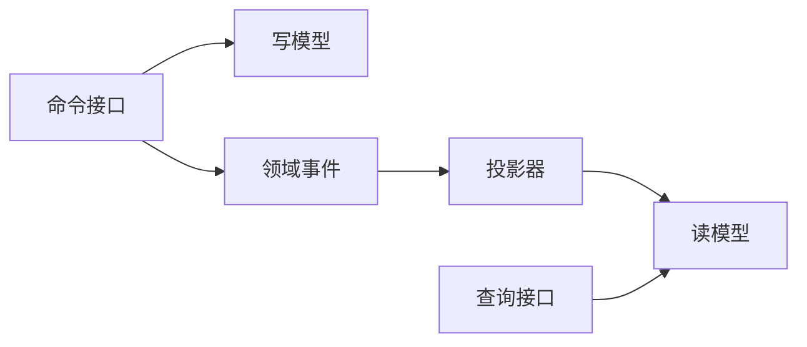

# SpringBoot CQRS 读模型

> 源码：`/Users/chenwei/Documents/code/java/learn-springboot/33-SpringBoot-cqrs-read-model`

## 核心思路

本模块演示 [[CQRS]] 读写分离：命令侧修改订单写模型并产生 [[领域事件]]，投影器消费事件生成查询友好的订单摘要读模型。写模型负责业务状态变化，读模型负责高效查询。

## 项目结构

```text
src/main/java/com/cloud/
├── controller/CqrsReadModelController.java
├── service/
│   ├── OrderCommandService.java       (命令侧：创建、支付订单)
│   ├── OrderProjectionService.java    (事件投影器)
│   └── OrderQueryService.java         (查询侧)
├── repository/
│   ├── InMemoryOrderWriteRepository.java
│   ├── InMemoryEventRepository.java
│   └── InMemoryOrderReadRepository.java
├── model/
│   ├── WriteOrder.java
│   ├── DomainEvent.java
│   ├── OrderSummaryView.java
│   └── ProjectionResult.java
├── common/ApiResult.java
└── exception/GlobalExceptionHandler.java
```

## 写模型与事件

命令侧负责处理业务动作：

- 创建订单：写入 `WriteOrder`，产生 `OrderCreated` 事件
- 支付订单：更新写模型状态，产生 `OrderPaid` 事件

读模型不会直接由命令接口修改，而是由事件投影生成。

## 增量投影

```java
public ProjectionResult projectNewEvents() {
    return project(eventRepository.findAfter(readRepository.lastProjectedEventId()));
}
```

`lastProjectedEventId` 记录读模型已经处理到哪个事件，下一次只投影新增事件，避免重复处理。

## 重建读模型

```java
public ProjectionResult rebuild() {
    readRepository.clear();
    return project(eventRepository.findAll());
}
```

读模型可以清空后从历史事件重放重建。这是 CQRS 的重要能力：读模型是可再生的查询视图。

## 投影逻辑

```java
private void apply(DomainEvent event) {
    if ("OrderCreated".equals(event.getEventType())) {
        readRepository.save(new OrderSummaryView(
                event.getAggregateId(),
                event.getUserId(),
                event.getAmount(),
                "CREATED",
                true,
                event.getOccurredAt(),
                null,
                event.getId()
        ));
        return;
    }
    if ("OrderPaid".equals(event.getEventType())) {
        OrderSummaryView view = readRepository.findById(event.getAggregateId())
                .orElseGet(() -> new OrderSummaryView(...));
        view.setStatus("PAID");
        view.setPendingPayment(false);
        view.setPaidAt(event.getOccurredAt());
        view.setLastEventId(event.getId());
        readRepository.save(view);
    }
}
```

| 事件 | 对读模型的影响 |
|------|----------------|
| `OrderCreated` | 新建订单摘要，状态为 `CREATED` |
| `OrderPaid` | 更新订单摘要，状态改为 `PAID` |

> [!important] 读模型是事件投影结果
> 查询侧不承担业务决策，只保存面向查询优化后的视图。读模型可延迟、可重建，也可能短暂落后于写模型。

## CQRS 流程



## API 接口

| 方法 | 路径 | 说明 |
|------|------|------|
| GET | `/api/cqrs` | 模块说明 |
| POST | `/api/cqrs/orders` | 创建订单并产生 `OrderCreated` |
| POST | `/api/cqrs/orders/{id}/pay` | 支付订单并产生 `OrderPaid` |
| POST | `/api/cqrs/projections/run` | 投影未处理事件 |
| POST | `/api/cqrs/projections/rebuild` | 清空并重建读模型 |
| GET | `/api/cqrs/orders` | 查询订单摘要列表 |
| GET | `/api/cqrs/orders/{id}` | 查询单个订单摘要 |

## 调用验证

```bash
mvn -pl 33-SpringBoot-cqrs-read-model spring-boot:run

curl -X POST "http://localhost:8113/api/cqrs/orders?userId=1001&amount=99.90"
curl -X POST "http://localhost:8113/api/cqrs/projections/run"
curl "http://localhost:8113/api/cqrs/orders"
curl -X POST "http://localhost:8113/api/cqrs/orders/1001/pay"
curl -X POST "http://localhost:8113/api/cqrs/projections/rebuild"
```

## 要点总结

1. [[CQRS]] 将写入命令和查询模型分离，适合读写差异明显的业务
2. 写模型关注业务约束，读模型关注查询效率和展示形态
3. 投影器通过事件构建读模型，并用 offset 避免重复处理
4. 读模型可以通过事件重放重建
5. CQRS 通常带来最终一致性，查询侧可能短暂落后
