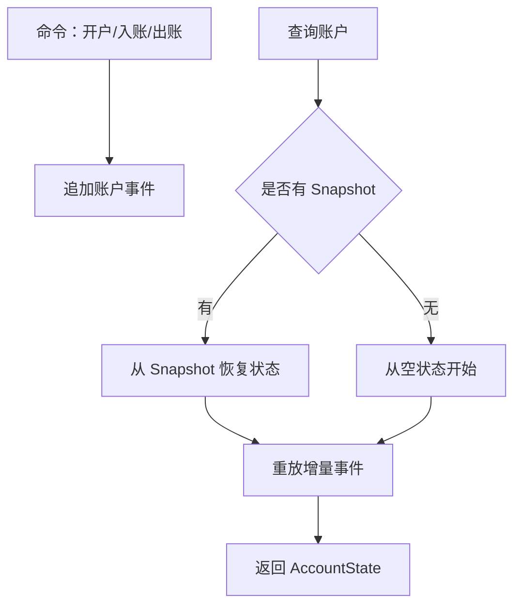

# SpringBoot 事件溯源与快照

> 源码：`/Users/chenwei/Documents/code/java/learn-springboot/34-SpringBoot-event-sourcing-snapshot`

## 核心思路

本模块演示 [[Event Sourcing]]：账户状态不直接覆盖保存，而是追加开户、入账、出账事件；查询账户时通过事件流 replay 得到账户余额。保存 [[Snapshot]] 后，可以从快照版本继续重放增量事件，减少历史事件回放成本。

## 项目结构

```text
src/main/java/com/cloud/
├── controller/EventSourcingController.java
├── service/
│   ├── AccountCommandService.java          (追加账户事件)
│   └── AccountEventSourcingService.java    (replay 与 snapshot)
├── repository/
│   ├── InMemoryAccountEventStore.java
│   └── InMemoryAccountSnapshotStore.java
├── model/
│   ├── AccountEvent.java
│   ├── AccountState.java
│   ├── AccountSnapshot.java
│   └── ReplayResult.java
├── common/ApiResult.java
└── exception/GlobalExceptionHandler.java
```

## 事件类型

| 事件 | 含义 | 对状态的影响 |
|------|------|--------------|
| `AccountOpened` | 开户 | 设置 owner、初始余额、opened=true |
| `MoneyDeposited` | 入账 | 余额增加 |
| `MoneyWithdrawn` | 出账 | 余额减少 |

事件追加后不修改历史记录，账户当前状态由事件流推导得到。

## Replay 过程

```java
public ReplayResult replay(Long accountId) {
    AccountState state = snapshotStore.findByAccountId(accountId)
            .map(snapshot -> new AccountState(
                    snapshot.getAccountId(),
                    snapshot.getOwner(),
                    snapshot.getBalance(),
                    snapshot.getVersion(),
                    true
            ))
            .orElseGet(() -> new AccountState(accountId, "", BigDecimal.ZERO, 0, false));

    int snapshotVersion = state.getVersion();
    List<AccountEvent> events = eventStore.findByAccountIdAfterVersion(accountId, snapshotVersion);
    if (!state.isOpened() && events.isEmpty()) {
        throw new AccountNotFoundException(accountId);
    }
    for (AccountEvent event : events) {
        apply(state, event);
    }
    return new ReplayResult(state, events.size(), snapshotVersion);
}
```

Replay 优先从快照恢复基础状态，再重放快照之后的增量事件。

## 事件应用逻辑

```java
private void apply(AccountState state, AccountEvent event) {
    if ("AccountOpened".equals(event.getEventType())) {
        state.setOwner(event.getOwner());
        state.setBalance(event.getAmount());
        state.setOpened(true);
    } else if ("MoneyDeposited".equals(event.getEventType())) {
        state.setBalance(state.getBalance().add(event.getAmount()));
    } else if ("MoneyWithdrawn".equals(event.getEventType())) {
        state.setBalance(state.getBalance().subtract(event.getAmount()));
    }
    state.setVersion(event.getVersion());
}
```

事件版本号用于保证聚合内顺序，最终 state 的版本等于最后应用事件的版本。

## 保存快照

```java
public AccountSnapshot saveSnapshot(Long accountId) {
    ReplayResult result = replay(accountId);
    AccountState state = result.getState();
    return snapshotStore.save(new AccountSnapshot(
            state.getAccountId(),
            state.getOwner(),
            state.getBalance(),
            state.getVersion(),
            Instant.now()
    ));
}
```

快照保存的是某一版本的账户状态。之后查询时只需要从该版本后继续重放事件。

> [!important] 快照是性能优化
> Snapshot 不是事实来源，事件流才是事实来源。快照可以丢弃后重建，但事件流不能随意修改。

## Event Sourcing 流程



## API 接口

| 方法 | 路径 | 说明 |
|------|------|------|
| GET | `/api/event-sourcing` | 模块说明 |
| POST | `/api/event-sourcing/accounts` | 开户 |
| POST | `/api/event-sourcing/accounts/{id}/deposit` | 入账 |
| POST | `/api/event-sourcing/accounts/{id}/withdraw` | 出账 |
| GET | `/api/event-sourcing/accounts/{id}` | replay 查询账户状态 |
| POST | `/api/event-sourcing/accounts/{id}/snapshot` | 保存账户快照 |
| GET | `/api/event-sourcing/accounts/{id}/events` | 查看账户事件流 |

## 调用验证

```bash
mvn -pl 34-SpringBoot-event-sourcing-snapshot spring-boot:run

curl -X POST "http://localhost:8114/api/event-sourcing/accounts?owner=alice&initialBalance=100.00"
curl -X POST "http://localhost:8114/api/event-sourcing/accounts/2001/deposit?amount=50.00"
curl -X POST "http://localhost:8114/api/event-sourcing/accounts/2001/withdraw?amount=30.00"
curl "http://localhost:8114/api/event-sourcing/accounts/2001"
curl -X POST "http://localhost:8114/api/event-sourcing/accounts/2001/snapshot"
```

## 要点总结

1. [[Event Sourcing]] 保存事件而不是覆盖当前状态
2. 当前状态通过事件流 replay 得到，天然保留审计轨迹
3. 事件版本号保证同一聚合内的事件顺序
4. [[Snapshot]] 用于减少重放历史事件数量，是性能优化而不是事实来源
5. 修改历史事件会破坏状态重建，应避免直接改写事件流
