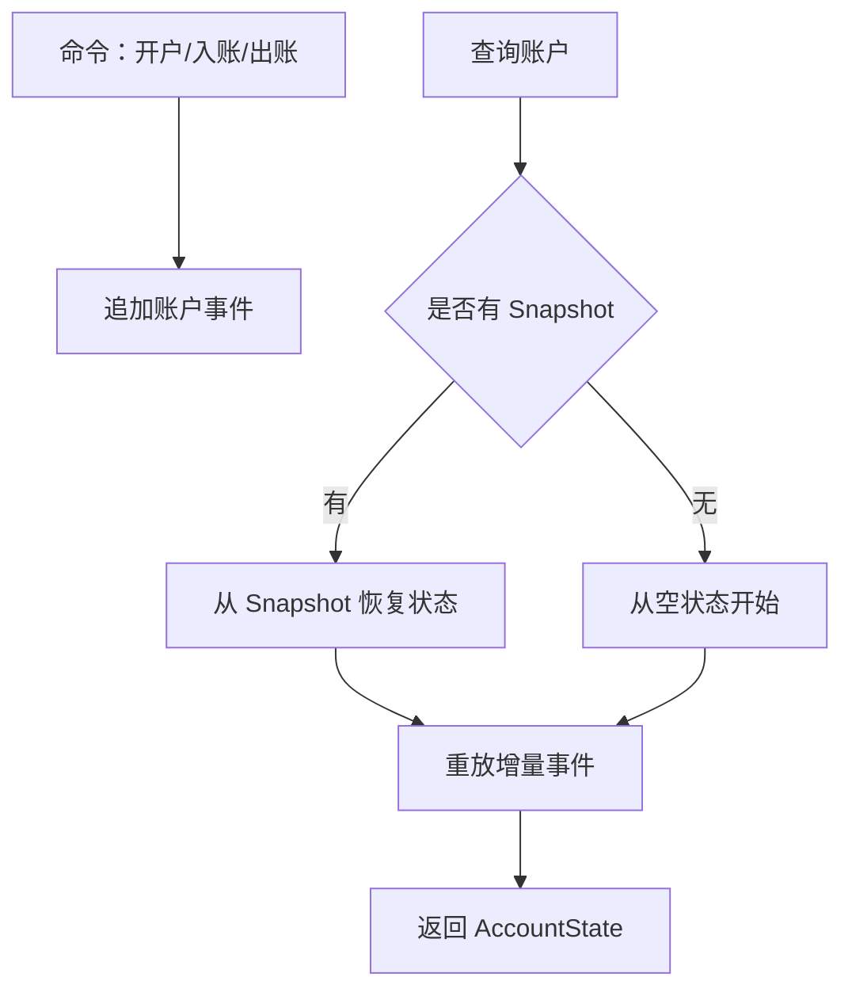

# SpringBoot 事件溯源与快照

> 源码：`/Users/chenwei/Documents/code/java/learn-springboot/34-SpringBoot-event-sourcing-snapshot`

## 核心思路

本模块演示 [[Event Sourcing]]：账户状态不直接覆盖保存，而是追加开户、入账、出账事件；查询账户时通过事件流 replay 得到账户余额。保存 [[Snapshot]] 后，可以从快照版本继续重放增量事件，减少历史事件回放成本。

## 项目结构

```text
src/main/java/com/cloud/
├── controller/EventSourcingController.java
├── service/
│   ├── AccountCommandService.java          (追加账户事件)
│   └── AccountEventSourcingService.java    (replay 与 snapshot)
├── repository/
│   ├── InMemoryAccountEventStore.java
│   └── InMemoryAccountSnapshotStore.java
├── model/
│   ├── AccountEvent.java
│   ├── AccountState.java
│   ├── AccountSnapshot.java
│   └── ReplayResult.java
├── common/ApiResult.java
└── exception/GlobalExceptionHandler.java
```

## 事件类型

| 事件 | 含义 | 对状态的影响 |
|------|------|--------------|
| `AccountOpened` | 开户 | 设置 owner、初始余额、opened=true |
| `MoneyDeposited` | 入账 | 余额增加 |
| `MoneyWithdrawn` | 出账 | 余额减少 |

事件追加后不修改历史记录，账户当前状态由事件流推导得到。

## Replay 过程

```java
public ReplayResult replay(Long accountId) {
    AccountState state = snapshotStore.findByAccountId(accountId)
            .map(snapshot -> new AccountState(
                    snapshot.getAccountId(),
                    snapshot.getOwner(),
                    snapshot.getBalance(),
                    snapshot.getVersion(),
                    true
            ))
            .orElseGet(() -> new AccountState(accountId, "", BigDecimal.ZERO, 0, false));

    int snapshotVersion = state.getVersion();
    List<AccountEvent> events = eventStore.findByAccountIdAfterVersion(accountId, snapshotVersion);
    if (!state.isOpened() && events.isEmpty()) {
        throw new AccountNotFoundException(accountId);
    }
    for (AccountEvent event : events) {
        apply(state, event);
    }
    return new ReplayResult(state, events.size(), snapshotVersion);
}
```

Replay 优先从快照恢复基础状态，再重放快照之后的增量事件。

## 事件应用逻辑

```java
private void apply(AccountState state, AccountEvent event) {
    if ("AccountOpened".equals(event.getEventType())) {
        state.setOwner(event.getOwner());
        state.setBalance(event.getAmount());
        state.setOpened(true);
    } else if ("MoneyDeposited".equals(event.getEventType())) {
        state.setBalance(state.getBalance().add(event.getAmount()));
    } else if ("MoneyWithdrawn".equals(event.getEventType())) {
        state.setBalance(state.getBalance().subtract(event.getAmount()));
    }
    state.setVersion(event.getVersion());
}
```

事件版本号用于保证聚合内顺序，最终 state 的版本等于最后应用事件的版本。

## 保存快照

```java
public AccountSnapshot saveSnapshot(Long accountId) {
    ReplayResult result = replay(accountId);
    AccountState state = result.getState();
    return snapshotStore.save(new AccountSnapshot(
            state.getAccountId(),
            state.getOwner(),
            state.getBalance(),
            state.getVersion(),
            Instant.now()
    ));
}
```

快照保存的是某一版本的账户状态。之后查询时只需要从该版本后继续重放事件。

> [!important] 快照是性能优化
> Snapshot 不是事实来源，事件流才是事实来源。快照可以丢弃后重建，但事件流不能随意修改。

## Event Sourcing 流程



## 初学者学习路线

- 先把这个案例当成“最小可运行样例”，目标是理解 SpringBoot 事件溯源与快照 的主流程。
- 先运行 README 里的启动命令和 curl，再带着现象回到代码里找入口。
- 每读一个类都问三件事：它由谁调用、它依赖谁、它改变了什么状态。

## 代码导读

下面的代码片段来自案例源码，并额外补了中文教学注释。阅读时先看注释理解职责，再回到完整源码核对细节。

### 接口入口：Controller 如何接收请求

源码位置：`src/main/java/com/cloud/controller/EventSourcingController.java`

Controller 是 HTTP 世界和 Java 代码世界之间的边界：路径、请求参数、返回值都在这里集中出现。

```java
// 文件：com/cloud/controller/EventSourcingController.java
// 学习重点：Controller 是 HTTP 世界和 Java 代码世界之间的边界：路径、请求参数、返回值都在这里集中出现。
// @RestController 表示这个类的返回值会直接写到 HTTP 响应体里，常用于 JSON API。
@RestController
// 类级别路径是这一组接口的共同前缀。
@RequestMapping("/api/event-sourcing")
public class EventSourcingController {

    private final AccountCommandService commandService;
    private final AccountEventSourcingService eventSourcingService;
    private final InMemoryAccountEventStore eventStore;

    public EventSourcingController(AccountCommandService commandService,
                                   AccountEventSourcingService eventSourcingService,
                                   InMemoryAccountEventStore eventStore) {
        this.commandService = commandService;
        this.eventSourcingService = eventSourcingService;
        this.eventStore = eventStore;
    }

    // 方法级别映射说明具体 HTTP 动词和子路径。
    @GetMapping
    public ApiResult<Map<String, Object>> moduleInfo() {
        Map<String, Object> data = new LinkedHashMap<>();
        data.put("module", "34-SpringBoot-event-sourcing-snapshot");
        data.put("desc", "Event Sourcing：保存事件流，通过 replay 和 snapshot 还原账户状态");
        data.put("apis", new String[]{
                "POST /api/event-sourcing/accounts?owner=alice&initialBalance=100.00",
                "POST /api/event-sourcing/accounts/{id}/deposit?amount=50.00",
                "POST /api/event-sourcing/accounts/{id}/withdraw?amount=30.00",
                "GET /api/event-sourcing/accounts/{id}",
                "POST /api/event-sourcing/accounts/{id}/snapshot",
                "GET /api/event-sourcing/accounts/{id}/events"
        });
        return ApiResult.success(data);
    }

    // 方法级别映射说明具体 HTTP 动词和子路径。
    @PostMapping("/accounts")
    public ResponseEntity<ApiResult<AccountState>> openAccount(@RequestParam String owner,
                                                                @RequestParam BigDecimal initialBalance) {
        return ResponseEntity.ok(ApiResult.success(commandService.openAccount(owner, initialBalance)));
    }

    // 方法级别映射说明具体 HTTP 动词和子路径。
    @PostMapping("/accounts/{id}/deposit")
    public ResponseEntity<ApiResult<AccountState>> deposit(@PathVariable Long id,
                                                           @RequestParam BigDecimal amount) {
        return ResponseEntity.ok(ApiResult.success(commandService.deposit(id, amount)));
    }

    // 方法级别映射说明具体 HTTP 动词和子路径。
    @PostMapping("/accounts/{id}/withdraw")
    public ResponseEntity<ApiResult<AccountState>> withdraw(@PathVariable Long id,
                                                            @RequestParam BigDecimal amount) {
        return ResponseEntity.ok(ApiResult.success(commandService.withdraw(id, amount)));
    }

    // 方法级别映射说明具体 HTTP 动词和子路径。
    @GetMapping("/accounts/{id}")
    public ApiResult<ReplayResult> account(@PathVariable Long id) {
        return ApiResult.success(eventSourcingService.replay(id));
    }

    // 方法级别映射说明具体 HTTP 动词和子路径。
    @PostMapping("/accounts/{id}/snapshot")
    public ApiResult<AccountSnapshot> snapshot(@PathVariable Long id) {
        return ApiResult.success(eventSourcingService.saveSnapshot(id));
    }

    // 方法级别映射说明具体 HTTP 动词和子路径。
    @GetMapping("/accounts/{id}/events")
    public ApiResult<List<AccountEvent>> events(@PathVariable Long id) {
        return ApiResult.success(eventStore.findByAccountId(id));
    }
}
```

关键点拆解：

- 先把 README 里的 curl 路径和这里的 `@RequestMapping` / `@GetMapping` / `@PostMapping` 对上。
- Controller 不应该堆复杂业务逻辑；看到它调用 Service，就说明职责分层是清楚的。
- 读完代码后，回到“生产差距”检查：安全、异常、监控、容量、测试是否都补齐。

### 业务核心：Service 如何组织规则

源码位置：`src/main/java/com/cloud/service/AccountCommandService.java`

Service 承载业务规则，初学者要重点看它如何校验输入、调用依赖、返回结果。

```java
// 文件：com/cloud/service/AccountCommandService.java
// 学习重点：Service 承载业务规则，初学者要重点看它如何校验输入、调用依赖、返回结果。
// @Service 表示这是业务层 Bean，会被 Spring 自动扫描并注入。
@Service
public class AccountCommandService {

    private final InMemoryAccountEventStore eventStore;
    private final AccountEventSourcingService eventSourcingService;

    public AccountCommandService(InMemoryAccountEventStore eventStore,
                                 AccountEventSourcingService eventSourcingService) {
        this.eventStore = eventStore;
        this.eventSourcingService = eventSourcingService;
    }

    public AccountState openAccount(String owner, BigDecimal initialBalance) {
        if (owner == null || owner.isBlank()) {
            throw new IllegalArgumentException("开户人不能为空");
        }
        if (initialBalance == null || initialBalance.compareTo(BigDecimal.ZERO) < 0) {
            throw new IllegalArgumentException("初始余额不能为负数");
        }

        Long accountId = eventStore.nextAccountId();
        eventStore.append(new AccountEvent(
                null,
                accountId,
                1,
                "AccountOpened",
                owner,
                initialBalance,
                Instant.now()
        ));
        return eventSourcingService.replay(accountId).getState();
    }

    public AccountState deposit(Long accountId, BigDecimal amount) {
        validatePositiveAmount(amount, "入账金额必须大于 0");
        AccountState current = eventSourcingService.replay(accountId).getState();
        eventStore.append(new AccountEvent(
                null,
                accountId,
                current.getVersion() + 1,
                "MoneyDeposited",
                current.getOwner(),
                amount,
                Instant.now()
        ));
        return eventSourcingService.replay(accountId).getState();
    }

    public AccountState withdraw(Long accountId, BigDecimal amount) {
        validatePositiveAmount(amount, "出账金额必须大于 0");
        AccountState current = eventSourcingService.replay(accountId).getState();
        if (current.getBalance().compareTo(amount) < 0) {
            throw new IllegalArgumentException("账户余额不足");
        }
        eventStore.append(new AccountEvent(
                null,
                accountId,
                current.getVersion() + 1,
                "MoneyWithdrawn",
                current.getOwner(),
                amount,
                Instant.now()
        ));
        return eventSourcingService.replay(accountId).getState();
    }

    private void validatePositiveAmount(BigDecimal amount, String message) {
        if (amount == null || amount.compareTo(BigDecimal.ZERO) <= 0) {
            throw new IllegalArgumentException(message);
        }
    }
}
```

关键点拆解：

- Service 的 public 方法通常就是一个用例，例如创建、查询、刷新、投递、同步。
- 先看输入校验，再看调用了哪些依赖，最后看返回对象。
- 读完代码后，回到“生产差距”检查：安全、异常、监控、容量、测试是否都补齐。

### 业务核心：Service 如何组织规则

源码位置：`src/main/java/com/cloud/service/AccountEventSourcingService.java`

Service 承载业务规则，初学者要重点看它如何校验输入、调用依赖、返回结果。

```java
// 文件：com/cloud/service/AccountEventSourcingService.java
// 学习重点：Service 承载业务规则，初学者要重点看它如何校验输入、调用依赖、返回结果。
// @Service 表示这是业务层 Bean，会被 Spring 自动扫描并注入。
@Service
public class AccountEventSourcingService {

    private final InMemoryAccountEventStore eventStore;
    private final InMemoryAccountSnapshotStore snapshotStore;

    public AccountEventSourcingService(InMemoryAccountEventStore eventStore,
                                       InMemoryAccountSnapshotStore snapshotStore) {
        this.eventStore = eventStore;
        this.snapshotStore = snapshotStore;
    }

    public ReplayResult replay(Long accountId) {
        AccountState state = snapshotStore.findByAccountId(accountId)
                .map(snapshot -> new AccountState(
                        snapshot.getAccountId(),
                        snapshot.getOwner(),
                        snapshot.getBalance(),
                        snapshot.getVersion(),
                        true
                ))
                .orElseGet(() -> new AccountState(accountId, "", BigDecimal.ZERO, 0, false));

        int snapshotVersion = state.getVersion();
        List<AccountEvent> events = eventStore.findByAccountIdAfterVersion(accountId, snapshotVersion);
        if (!state.isOpened() && events.isEmpty()) {
            throw new AccountNotFoundException(accountId);
        }
        for (AccountEvent event : events) {
            apply(state, event);
        }
        return new ReplayResult(state, events.size(), snapshotVersion);
    }

    public AccountSnapshot saveSnapshot(Long accountId) {
        ReplayResult result = replay(accountId);
        AccountState state = result.getState();
        // save 表示状态发生变化，学习时要追踪保存前做了哪些校验。
        return snapshotStore.save(new AccountSnapshot(
                state.getAccountId(),
                state.getOwner(),
                state.getBalance(),
                state.getVersion(),
                Instant.now()
        ));
    }

    private void apply(AccountState state, AccountEvent event) {
        if ("AccountOpened".equals(event.getEventType())) {
            state.setOwner(event.getOwner());
            state.setBalance(event.getAmount());
            state.setOpened(true);
        } else if ("MoneyDeposited".equals(event.getEventType())) {
            state.setBalance(state.getBalance().add(event.getAmount()));
        } else if ("MoneyWithdrawn".equals(event.getEventType())) {
            state.setBalance(state.getBalance().subtract(event.getAmount()));
        }
        state.setVersion(event.getVersion());
    }

    public static class AccountNotFoundException extends RuntimeException {

        // 构造器注入：依赖从 Spring 容器传入，代码更容易测试，也避免隐藏依赖。
        public AccountNotFoundException(Long accountId) {
            super("账户不存在: " + accountId);
        }
    }
}
```

关键点拆解：

- Service 的 public 方法通常就是一个用例，例如创建、查询、刷新、投递、同步。
- 先看输入校验，再看调用了哪些依赖，最后看返回对象。
- 读完代码后，回到“生产差距”检查：安全、异常、监控、容量、测试是否都补齐。

### 关键类：GlobalExceptionHandler

源码位置：`src/main/java/com/cloud/exception/GlobalExceptionHandler.java`

这是案例链路中的关键类，读它可以把 README 的概念落到具体代码。

```java
// 文件：com/cloud/exception/GlobalExceptionHandler.java
// 学习重点：这是案例链路中的关键类，读它可以把 README 的概念落到具体代码。
// @RestController 表示这个类的返回值会直接写到 HTTP 响应体里，常用于 JSON API。
@RestControllerAdvice
public class GlobalExceptionHandler {

    private static final Logger log = LoggerFactory.getLogger(GlobalExceptionHandler.class);

    @ExceptionHandler(AccountEventSourcingService.AccountNotFoundException.class)
    @ResponseStatus(HttpStatus.NOT_FOUND)
    public ApiResult<Void> handleAccountNotFound(AccountEventSourcingService.AccountNotFoundException ex) {
        return ApiResult.fail(404, ex.getMessage());
    }

    @ExceptionHandler(IllegalArgumentException.class)
    @ResponseStatus(HttpStatus.BAD_REQUEST)
    public ApiResult<Void> handleIllegalArgumentException(IllegalArgumentException ex) {
        return ApiResult.fail(400, ex.getMessage());
    }

    @ExceptionHandler(Exception.class)
    @ResponseStatus(HttpStatus.INTERNAL_SERVER_ERROR)
    public ApiResult<Void> handleException(Exception ex) {
        log.error("Unhandled exception", ex);
        return ApiResult.fail(500, "系统异常，请稍后重试");
    }
}
```

关键点拆解：

- 先看这个类暴露了哪些 public 方法，再看它依赖了哪些对象。
- 读完代码后，回到“生产差距”检查：安全、异常、监控、容量、测试是否都补齐。

## 运行时调用链

- 从 README 的接口或测试名称开始，先定位入口类。
- 找 Controller、Runner、Listener 或 AutoConfiguration 作为第一阅读点。
- 沿着构造器注入的依赖继续进入 Service、Repository 或扩展点类。

## 初学者常见误区

- 只把接口跑通，却没有回到代码理解 Controller、Service、Repository 的分工。
- 把内存 Map、模拟客户端、固定配置当成生产实现。
- 只看 happy path，忽略参数错误、外部系统失败、并发和重复请求。

## API 接口

| 方法 | 路径 | 说明 |
|------|------|------|
| GET | `/api/event-sourcing` | 模块说明 |
| POST | `/api/event-sourcing/accounts` | 开户 |
| POST | `/api/event-sourcing/accounts/{id}/deposit` | 入账 |
| POST | `/api/event-sourcing/accounts/{id}/withdraw` | 出账 |
| GET | `/api/event-sourcing/accounts/{id}` | replay 查询账户状态 |
| POST | `/api/event-sourcing/accounts/{id}/snapshot` | 保存账户快照 |
| GET | `/api/event-sourcing/accounts/{id}/events` | 查看账户事件流 |

## 调用验证

```bash
mvn -pl 34-SpringBoot-event-sourcing-snapshot spring-boot:run

curl -X POST "http://localhost:8114/api/event-sourcing/accounts?owner=alice&initialBalance=100.00"
curl -X POST "http://localhost:8114/api/event-sourcing/accounts/2001/deposit?amount=50.00"
curl -X POST "http://localhost:8114/api/event-sourcing/accounts/2001/withdraw?amount=30.00"
curl "http://localhost:8114/api/event-sourcing/accounts/2001"
curl -X POST "http://localhost:8114/api/event-sourcing/accounts/2001/snapshot"
```

## 生产差距

这个示例适合帮助初学者理解 事件溯源与快照 的核心机制，但生产项目不能只停留在“能跑通”。真实落地时至少要补齐：统一鉴权、参数边界校验、异常响应、结构化日志、监控指标、自动化测试、配置隔离和容量评估。

如果模块涉及数据库、缓存、消息、网关、认证或外部服务，还要进一步考虑连接池、超时、重试、幂等、事务边界、数据一致性和故障告警。学习时可以先记住主流程，再用这些生产差距反向检查自己是否真正理解了案例。

## 要点总结

1. [[Event Sourcing]] 保存事件而不是覆盖当前状态
2. 当前状态通过事件流 replay 得到，天然保留审计轨迹
3. 事件版本号保证同一聚合内的事件顺序
4. [[Snapshot]] 用于减少重放历史事件数量，是性能优化而不是事实来源
5. 修改历史事件会破坏状态重建，应避免直接改写事件流
