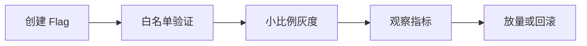

# SpringBoot Feature Flag 与灰度发布

> 源码：`/Users/chenwei/Documents/code/java/learn-springboot/35-SpringBoot-feature-flag-gray-release`

## 核心思路

本模块演示 [[Feature Flag]] 与 [[灰度发布]]：通过运行时配置控制功能是否开放，支持全局开关、白名单优先命中、稳定哈希百分比灰度，并在业务接口中根据 flag 选择新旧路径。

## 项目结构

```text
src/main/java/com/cloud/
├── controller/FeatureFlagController.java
├── service/
│   ├── FeatureFlagService.java       (配置更新、评估和业务示例)
│   └── FeatureFlagEvaluator.java     (命中规则计算)
├── repository/InMemoryFeatureFlagRepository.java
├── model/
│   ├── FeatureFlagConfig.java
│   ├── FeatureFlagUpdateRequest.java
│   ├── FeatureFlagEvaluation.java
│   └── CheckoutResponse.java
├── common/ApiResult.java
└── exception/GlobalExceptionHandler.java
```

## Feature Flag 配置模型

```java
public class FeatureFlagConfig {
    private String key;
    private boolean enabled;
    private int rolloutPercent;
    private Set<String> allowlist;
    private Instant updatedAt;
}
```

| 字段 | 含义 |
|------|------|
| `key` | 功能开关标识，例如 `new-checkout` |
| `enabled` | 全局是否启用 |
| `rolloutPercent` | 百分比灰度比例，范围 0-100 |
| `allowlist` | 白名单用户集合，优先于百分比灰度 |
| `updatedAt` | 更新时间 |

## 更新与校验

```java
public FeatureFlagConfig update(String key, FeatureFlagUpdateRequest request) {
    validateKey(key);
    if (request.getRolloutPercent() < 0 || request.getRolloutPercent() > 100) {
        throw new IllegalArgumentException("rolloutPercent 必须在 0 到 100 之间");
    }
    return repository.save(new FeatureFlagConfig(
            key,
            request.isEnabled(),
            request.getRolloutPercent(),
            request.getAllowlist() == null ? new LinkedHashSet<>() : new LinkedHashSet<>(request.getAllowlist()),
            Instant.now()
    ));
}
```

`rolloutPercent` 必须限制在 0 到 100，白名单为空时使用空集合，避免后续评估时空指针。

## 评估规则

```java
public FeatureFlagEvaluation evaluate(FeatureFlagConfig config, String userId) {
    int bucket = bucket(config.getKey(), userId);
    if (!config.isEnabled()) {
        return result(config, userId, false, "DISABLED", bucket);
    }
    if (config.getAllowlist().contains(userId)) {
        return result(config, userId, true, "ALLOWLIST", bucket);
    }
    if (config.getRolloutPercent() >= 100) {
        return result(config, userId, true, "FULL_ROLLOUT", bucket);
    }
    if (config.getRolloutPercent() <= 0) {
        return result(config, userId, false, "NOT_IN_ROLLOUT", bucket);
    }
    boolean enabled = bucket < config.getRolloutPercent();
    return result(config, userId, enabled, enabled ? "PERCENTAGE_ROLLOUT" : "NOT_IN_ROLLOUT", bucket);
}
```

优先级：

1. 全局关闭：直接不命中
2. 白名单：优先命中
3. 100%：全量命中
4. 0%：非白名单不命中
5. 百分比灰度：通过稳定 hash bucket 判断

## 稳定哈希分桶

```java
private int bucket(String key, String userId) {
    CRC32 crc32 = new CRC32();
    crc32.update((key + ":" + userId).getBytes(StandardCharsets.UTF_8));
    return (int) (crc32.getValue() % 100);
}
```

同一个 `key + userId` 会得到稳定 bucket，因此同一用户在灰度比例不变时不会一会儿进新版、一会儿回旧版。

> [!important] 灰度稳定性
> 百分比灰度必须使用稳定分桶，而不是每次随机。随机会导致用户体验抖动，也会让问题排查变困难。

## 业务接口选择新旧路径

```java
public CheckoutResponse checkout(String userId) {
    FeatureFlagEvaluation evaluation = evaluate("new-checkout", userId);
    return new CheckoutResponse(
            userId,
            evaluation.isEnabled() ? "NEW_CHECKOUT" : "LEGACY_CHECKOUT",
            evaluation.isEnabled(),
            evaluation.getReason(),
            evaluation.getBucket()
    );
}
```

业务接口不直接读取配置细节，只依赖评估结果选择新旧路径，并把命中原因和 bucket 返回，方便调试。

## 初学者学习路线

- 先把这个案例当成“最小可运行样例”，目标是理解 SpringBoot Feature Flag 与灰度发布 的主流程。
- 先运行 README 里的启动命令和 curl，再带着现象回到代码里找入口。
- 每读一个类都问三件事：它由谁调用、它依赖谁、它改变了什么状态。

## 代码导读

下面的代码片段来自案例源码，并额外补了中文教学注释。阅读时先看注释理解职责，再回到完整源码核对细节。

### 接口入口：Controller 如何接收请求

源码位置：`src/main/java/com/cloud/controller/FeatureFlagController.java`

Controller 是 HTTP 世界和 Java 代码世界之间的边界：路径、请求参数、返回值都在这里集中出现。

```java
// 文件：com/cloud/controller/FeatureFlagController.java
// 学习重点：Controller 是 HTTP 世界和 Java 代码世界之间的边界：路径、请求参数、返回值都在这里集中出现。
// @RestController 表示这个类的返回值会直接写到 HTTP 响应体里，常用于 JSON API。
@RestController
// 类级别路径是这一组接口的共同前缀。
@RequestMapping("/api/flags")
public class FeatureFlagController {

    private final FeatureFlagService featureFlagService;

    // 构造器注入：依赖从 Spring 容器传入，代码更容易测试，也避免隐藏依赖。
    public FeatureFlagController(FeatureFlagService featureFlagService) {
        this.featureFlagService = featureFlagService;
    }

    // 方法级别映射说明具体 HTTP 动词和子路径。
    @GetMapping
    public ApiResult<Map<String, Object>> moduleInfo() {
        Map<String, Object> data = new LinkedHashMap<>();
        data.put("module", "35-SpringBoot-feature-flag-gray-release");
        data.put("desc", "Feature Flag 与灰度发布：disabled、allowlist、百分比灰度和稳定哈希");
        data.put("apis", new String[]{
                "PUT /api/flags/{key}",
                "GET /api/flags/{key}",
                "GET /api/flags/{key}/evaluate?userId=1001",
                "GET /api/flags/checkout?userId=1001"
        });
        return ApiResult.success(data);
    }

    // 方法级别映射说明具体 HTTP 动词和子路径。
    @PutMapping("/{key}")
    public ResponseEntity<ApiResult<FeatureFlagConfig>> update(@PathVariable String key,
                                                                @RequestBody FeatureFlagUpdateRequest request) {
        return ResponseEntity.ok(ApiResult.success(featureFlagService.update(key, request)));
    }

    // 方法级别映射说明具体 HTTP 动词和子路径。
    @GetMapping("/{key}")
    public ApiResult<FeatureFlagConfig> get(@PathVariable String key) {
        return ApiResult.success(featureFlagService.get(key));
    }

    // 方法级别映射说明具体 HTTP 动词和子路径。
    @GetMapping("/{key}/evaluate")
    public ApiResult<FeatureFlagEvaluation> evaluate(@PathVariable String key,
                                                     @RequestParam String userId) {
        return ApiResult.success(featureFlagService.evaluate(key, userId));
    }

    // 方法级别映射说明具体 HTTP 动词和子路径。
    @GetMapping("/checkout")
    public ApiResult<CheckoutResponse> checkout(@RequestParam String userId) {
        return ApiResult.success(featureFlagService.checkout(userId));
    }
}
```

关键点拆解：

- 先把 README 里的 curl 路径和这里的 `@RequestMapping` / `@GetMapping` / `@PostMapping` 对上。
- Controller 不应该堆复杂业务逻辑；看到它调用 Service，就说明职责分层是清楚的。
- 读完代码后，回到“生产差距”检查：安全、异常、监控、容量、测试是否都补齐。

### 配置类：Spring 如何注册基础设施

源码位置：`src/main/java/com/cloud/model/FeatureFlagConfig.java`

配置类负责把基础设施对象注册到 Spring 容器，后续请求或启动流程才会用到它们。

```java
// 文件：com/cloud/model/FeatureFlagConfig.java
// 学习重点：配置类负责把基础设施对象注册到 Spring 容器，后续请求或启动流程才会用到它们。
@Data
@NoArgsConstructor
@AllArgsConstructor
public class FeatureFlagConfig {

    private String key;
    private boolean enabled;
    private int rolloutPercent;
    private Set<String> allowlist;
    private Instant updatedAt;

    public FeatureFlagConfig copy() {
        return new FeatureFlagConfig(key, enabled, rolloutPercent, new LinkedHashSet<>(allowlist), updatedAt);
    }
}
```

关键点拆解：

- 配置类的重点不是业务规则，而是“把谁注册到容器、在什么条件下注册”。
- 读完代码后，回到“生产差距”检查：安全、异常、监控、容量、测试是否都补齐。

### 业务核心：Service 如何组织规则

源码位置：`src/main/java/com/cloud/service/FeatureFlagService.java`

Service 承载业务规则，初学者要重点看它如何校验输入、调用依赖、返回结果。

```java
// 文件：com/cloud/service/FeatureFlagService.java
// 学习重点：Service 承载业务规则，初学者要重点看它如何校验输入、调用依赖、返回结果。
// @Service 表示这是业务层 Bean，会被 Spring 自动扫描并注入。
@Service
public class FeatureFlagService {

    private final InMemoryFeatureFlagRepository repository;
    private final FeatureFlagEvaluator evaluator;

    public FeatureFlagService(InMemoryFeatureFlagRepository repository,
                              FeatureFlagEvaluator evaluator) {
        this.repository = repository;
        this.evaluator = evaluator;
    }

    public FeatureFlagConfig update(String key, FeatureFlagUpdateRequest request) {
        validateKey(key);
        if (request.getRolloutPercent() < 0 || request.getRolloutPercent() > 100) {
            throw new IllegalArgumentException("rolloutPercent 必须在 0 到 100 之间");
        }
        // save 表示状态发生变化，学习时要追踪保存前做了哪些校验。
        return repository.save(new FeatureFlagConfig(
                key,
                request.isEnabled(),
                request.getRolloutPercent(),
                request.getAllowlist() == null ? new LinkedHashSet<>() : new LinkedHashSet<>(request.getAllowlist()),
                Instant.now()
        ));
    }

    public FeatureFlagConfig get(String key) {
        validateKey(key);
        return repository.findByKey(key)
                .orElseThrow(() -> new FeatureFlagNotFoundException(key));
    }

    public FeatureFlagEvaluation evaluate(String key, String userId) {
        validateKey(key);
        validateUserId(userId);
        FeatureFlagConfig config = repository.findByKey(key)
                .orElse(new FeatureFlagConfig(key, false, 0, new LinkedHashSet<>(), Instant.now()));
        return evaluator.evaluate(config, userId);
    }

    public CheckoutResponse checkout(String userId) {
        FeatureFlagEvaluation evaluation = evaluate("new-checkout", userId);
        return new CheckoutResponse(
                userId,
                evaluation.isEnabled() ? "NEW_CHECKOUT" : "LEGACY_CHECKOUT",
                evaluation.isEnabled(),
                evaluation.getReason(),
                evaluation.getBucket()
        );
    }

    private void validateKey(String key) {
        if (key == null || key.isBlank()) {
            throw new IllegalArgumentException("flag key 不能为空");
        }
    }

    private void validateUserId(String userId) {
        if (userId == null || userId.isBlank()) {
            throw new IllegalArgumentException("userId 不能为空");
        }
    }

    public static class FeatureFlagNotFoundException extends RuntimeException {

        // 构造器注入：依赖从 Spring 容器传入，代码更容易测试，也避免隐藏依赖。
        public FeatureFlagNotFoundException(String key) {
            super("flag 不存在: " + key);
        }
    }
}
```

关键点拆解：

- Service 的 public 方法通常就是一个用例，例如创建、查询、刷新、投递、同步。
- 先看输入校验，再看调用了哪些依赖，最后看返回对象。
- 读完代码后，回到“生产差距”检查：安全、异常、监控、容量、测试是否都补齐。

### 数据访问：示例如何保存和查询数据

源码位置：`src/main/java/com/cloud/repository/InMemoryFeatureFlagRepository.java`

Repository 隐藏存储细节，让 Service 不必关心数据怎么存。

```java
// 文件：com/cloud/repository/InMemoryFeatureFlagRepository.java
// 学习重点：Repository 隐藏存储细节，让 Service 不必关心数据怎么存。
// @Repository 表示数据访问层 Bean，真实项目通常连接数据库或外部存储。
@Repository
public class InMemoryFeatureFlagRepository {

    private final ConcurrentHashMap<String, FeatureFlagConfig> flags = new ConcurrentHashMap<>();

    // 构造器注入：依赖从 Spring 容器传入，代码更容易测试，也避免隐藏依赖。
    public InMemoryFeatureFlagRepository() {
        save(new FeatureFlagConfig("new-checkout", false, 0, new LinkedHashSet<>(), Instant.now()));
    }

    public FeatureFlagConfig save(FeatureFlagConfig config) {
        flags.put(config.getKey(), config.copy());
        return config.copy();
    }

    public Optional<FeatureFlagConfig> findByKey(String key) {
        FeatureFlagConfig config = flags.get(key);
        return config == null ? Optional.empty() : Optional.of(config.copy());
    }
}
```

关键点拆解：

- 示例里的 Repository 多半是内存实现；真实项目要替换成数据库、缓存或外部服务。
- 读完代码后，回到“生产差距”检查：安全、异常、监控、容量、测试是否都补齐。

## 运行时调用链

1. FeatureFlagConfig：启动时注册配置、Bean 或扩展点
2. FeatureFlagController：接收 HTTP 请求并转换成 Java 方法调用
3. FeatureFlagService：执行案例的核心业务规则
4. InMemoryFeatureFlagRepository：保存或查询示例数据

## 初学者常见误区

- 只把接口跑通，却没有回到代码理解 Controller、Service、Repository 的分工。
- 把内存 Map、模拟客户端、固定配置当成生产实现。
- 只看 happy path，忽略参数错误、外部系统失败、并发和重复请求。

## API 接口

| 方法 | 路径 | 说明 |
|------|------|------|
| GET | `/api/flags` | 模块说明 |
| PUT | `/api/flags/{key}` | 更新 flag 配置 |
| GET | `/api/flags/{key}` | 查询 flag 配置 |
| GET | `/api/flags/{key}/evaluate?userId=1001` | 评估用户是否命中 |
| GET | `/api/flags/checkout?userId=1001` | 结账业务示例 |

## 调用验证

```bash
mvn -pl 35-SpringBoot-feature-flag-gray-release spring-boot:run

curl -X PUT "http://localhost:8115/api/flags/new-checkout" \
  -H "Content-Type: application/json" \
  -d '{"enabled":true,"rolloutPercent":0,"allowlist":["1001"]}'

curl "http://localhost:8115/api/flags/new-checkout/evaluate?userId=1001"
curl "http://localhost:8115/api/flags/checkout?userId=2001"
```

## 生产差距

这个示例适合帮助初学者理解 Feature Flag 与灰度发布 的核心机制，但生产项目不能只停留在“能跑通”。真实落地时至少要补齐：统一鉴权、参数边界校验、异常响应、结构化日志、监控指标、自动化测试、配置隔离和容量评估。

如果模块涉及数据库、缓存、消息、网关、认证或外部服务，还要进一步考虑连接池、超时、重试、幂等、事务边界、数据一致性和故障告警。学习时可以先记住主流程，再用这些生产差距反向检查自己是否真正理解了案例。

## 要点总结

1. [[Feature Flag]] 让功能发布和代码部署解耦
2. 灰度发布应支持全局开关、白名单和百分比分桶
3. 白名单通常优先于百分比灰度，便于内部测试或定向开放
4. 稳定哈希保证同一用户命中结果一致
5. 业务响应中暴露 reason 和 bucket，有助于灰度排查

## 实践流程



## 实践检查清单

- Flag 是否有负责人、过期时间和清理计划。
- 分桶是否稳定，避免同一用户频繁切换体验。
- 是否有错误率、延迟和业务指标作为放量依据。
- 回滚是否只需改配置，而不需要重新发布。
- 灰度命中原因是否可追踪。

## 案例

新结账流程先对白名单用户开放，再 5%、20%、50% 分批放量。若支付失败率升高，立即关闭 Flag，用户回到旧流程。

## 常见误区

- Feature Flag 长期不清理，代码里遗留大量分支。
- 每次请求随机分组，导致体验抖动。
- 只看功能可用，不看护栏指标。
