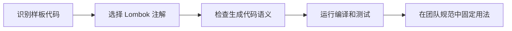

# Lombok 注解详解

Lombok 是一个 Java 库，通过注解在编译期自动生成样板代码（getter/setter/构造器等），减少代码冗余。

---

## 核心注解

### @Data — 全能注解

```java
@Data
public class User {
    private Long id;
    private String name;
    private String email;
}
```

**等价于**：`@Getter` + `@Setter` + `@ToString` + `@EqualsAndHashCode` + `@RequiredArgsConstructor`

---

## 构造器注解

| 注解 | 作用 | 使用场景 |
|------|------|----------|
| `@NoArgsConstructor` | 生成无参构造器 | 反序列化（JSON/XML）、框架要求 |
| `@AllArgsConstructor` | 生成全参构造器 | 需要一次性初始化所有字段 |
| `@RequiredArgsConstructor` | 生成必需参数构造器 | 只包含 `final` 和 `@NonNull` 字段，常用于依赖注入 |

```java
@RequiredArgsConstructor
@Service
public class UserService {
    private final UserRepository userRepo;  // 会被包含
    private final EmailSender emailSender;  // 会被包含
    private String config;                   // 不会被包含
}
```

---

## @Builder — 建造者模式

```java
@Data
@Builder
@NoArgsConstructor
@AllArgsConstructor
public class User {
    private Long id;
    private String name;
    private Integer age;
}

// 使用方式
User user = User.builder()
    .id(1L)
    .name("张三")
    .age(20)
    .build();
```

> 注意：`@Builder` 会生成全参构造器，如果需要无参构造器，必须显式添加 `@NoArgsConstructor` 和 `@AllArgsConstructor`

### Builder 默认值

```java
@Data
@Builder
public class Config {
    @Builder.Default
    private int timeout = 30;

    @Builder.Default
    private boolean enabled = true;
}
```

---

## 其他常用注解

### 日志相关

```java
@Slf4j  // 自动生成：private static final Logger log = LoggerFactory.getLogger(Xxx.class);
@Service
public class OrderService {
    public void create() {
        log.info("创建订单");
    }
}
```

其他日志注解：`@Log` (java.util.logging)、`@Log4j`、`@Log4j2`、`@CommonsLog`

### 不可变对象

```java
@Value
public class Point {
    private final int x;
    private final int y;
}
// 等价于：final class + @Getter + @ToString + @EqualsAndHashCode + @RequiredArgsConstructor
```

### 单独方法注解

```java
@Getter              // 生成 getter（可用于类或字段）
@Setter              // 生成 setter
@ToString            // toString() 方法
@EqualsAndHashCode   // equals() 和 hashCode()
```

---

## 高级配置

### 排除字段

```java
@Data
@ToString(exclude = "password")
@EqualsAndHashCode(exclude = {"createTime", "updateTime"})
public class User {
    private String password;
    private LocalDateTime createTime;
    private LocalDateTime updateTime;
}
```

### 访问控制

```java
@Data
public class Config {
    @Setter(AccessLevel.PRIVATE)   // 私有 setter
    private String internalId;

    @Getter(AccessLevel.NONE)       // 不生成 getter
    private String tempField;
}
```

### 链式调用（setter 返回 this）

```java
@Data
@Accessors(chain = true)
public class User {
    private String name;
    private Integer age;
}

// 使用
user.setName("张三").setAge(20);
```

### 字段级注解

```java
public class User {
    @Getter @Setter
    private String name;

    @Getter(AccessLevel.PROTECTED)
    private String internalCode;
}
```

---

## 实用组合

### DTO 常用组合

```java
@Data
@Builder
@NoArgsConstructor
@AllArgsConstructor
public class UserDTO {
    private Long id;
    private String name;
    private String email;
}
```

### Entity 常用组合

```java
@Data
@NoArgsConstructor
@AllArgsConstructor
@Entity
@Table(name = "user")
public class User {
    @Id
    @GeneratedValue(strategy = GenerationType.IDENTITY)
    private Long id;

    private String name;
    private String email;
}
```

### Spring Service 常用组合

```java
@Slf4j
@RequiredArgsConstructor
@Service
public class UserService {
    private final UserRepository userRepository;
    private final EmailService emailService;
}
```

---

## 注意事项

1. **IDE 支持**：需要安装 Lombok 插件并启用 Annotation Processing
2. **反射兼容**：生成的代码在运行时与手写代码无区别
3. **调试困难**：生成的代码在源码中不可见，调试时可能定位不准
4. **@Builder 陷阱**：`@Builder` 会覆盖默认构造器，需要显式添加 `@NoArgsConstructor`

---

## 相关链接

- [[Java_开发规范]]
- [[Spring_Boot_常用配置]]

## 实践流程



## 实践检查清单

- Entity、DTO、Service 是否使用不同注解组合。
- 是否避免在 JPA Entity 上滥用 `@Data` 导致 equals/toString 问题。
- 构造器注入是否优先使用 `@RequiredArgsConstructor`。
- Builder 是否和无参构造、序列化框架兼容。
- IDE 和 CI 是否都启用 annotation processing。

## 案例

Spring Service 中使用 `@RequiredArgsConstructor` 注入 `final` 依赖，比字段注入更清晰，也方便测试替换依赖。

## 常见误区

- 在所有类上无脑使用 `@Data`。
- 调试时不知道方法由 Lombok 生成。
- 本地 IDE 可编译，CI 未启用注解处理导致失败。

## 实践流程


## 实践检查清单

- Entity、DTO、Service 是否使用不同注解组合。
- 是否避免在 JPA Entity 上滥用 `@Data` 导致 equals/toString 问题。
- 构造器注入是否优先使用 `@RequiredArgsConstructor`。
- Builder 是否和无参构造、序列化框架兼容。
- IDE 和 CI 是否都启用 annotation processing。

## 案例

Spring Service 中使用 `@RequiredArgsConstructor` 注入 `final` 依赖，比字段注入更清晰，也方便测试替换依赖。

## 常见误区

- 在所有类上无脑使用 `@Data`。
- 调试时不知道方法由 Lombok 生成。
- 本地 IDE 可编译，CI 未启用注解处理导致失败。
