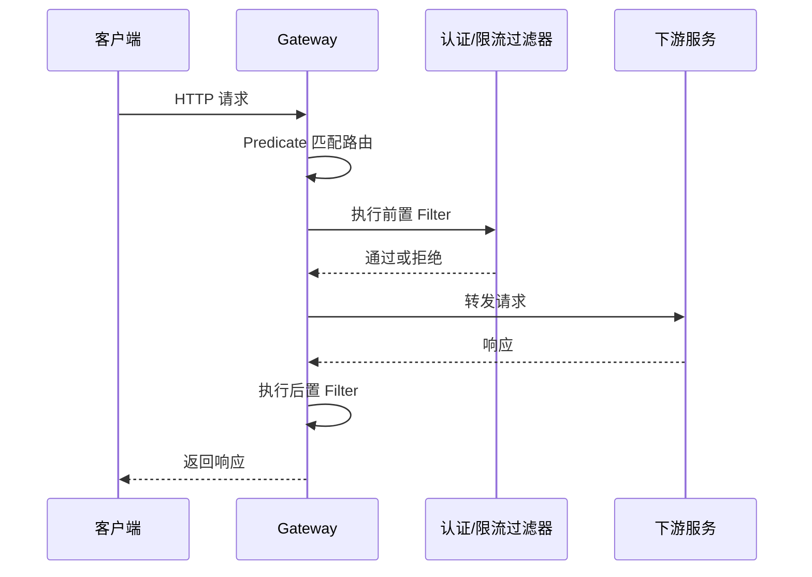

# Spring Cloud Gateway

## 定义

Spring Cloud Gateway 是 Spring Cloud 生态中的 API 网关，用于路由转发、过滤、认证、限流、灰度路由和统一横切处理。

## 要点

- Predicate 决定请求是否命中路由。
- Filter 在转发前后修改请求或响应。
- 可接入 TraceId、鉴权、限流、熔断和灰度发布。
- 网关应保持轻量，避免承载过多业务编排。

## 请求链路



Gateway 适合放统一横切能力，例如认证、限流、Trace ID、跨域、灰度路由；不适合放复杂业务聚合，复杂页面聚合更适合 [[BFF]]。

## 配置示例

```yaml
spring:
  cloud:
    gateway:
      routes:
        - id: order-service
          uri: http://order-service:8080
          predicates:
            - Path=/api/orders/**
          filters:
            - StripPrefix=1
```

这里 `Predicate` 决定 `/api/orders/**` 是否命中订单服务路由，`Filter` 负责转发前后的处理。

## 检查清单

- 路由规则是否清晰，避免多个路由互相覆盖。
- 认证、限流、跨域和 Trace ID 是否在统一过滤器中处理。
- 网关是否避免执行业务聚合和数据库访问。
- 下游服务不可用时是否有超时、熔断或降级策略。
- 灰度路由是否可按 Header、Cookie、用户或版本控制。

## 相关概念

- [[SpringBoot/27-SpringBoot-Gateway路由]]
- [[限流]]
- [[灰度发布]]
- [[BFF]]
