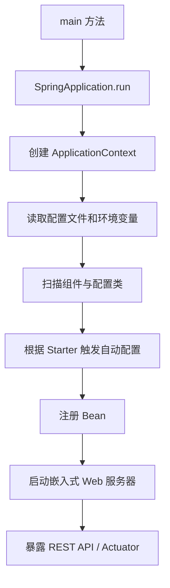

# SpringBoot

## 定义

SpringBoot 是 Spring 生态的应用开发框架，通过自动配置、约定优于配置和嵌入式服务器降低 Java 后端服务搭建成本。

它不是替代 Spring，而是把常见 Spring 应用的依赖组合、配置默认值、启动流程和运维入口封装起来，让开发者更快搭出可运行、可观测、可发布的后端服务。

## 要点

- 自动配置根据依赖和配置推断 Bean。
- Starter 统一封装常见能力依赖。
- Actuator 提供健康检查和运行时观测入口。
- 适合构建 REST API、后台任务、消息消费者和微服务应用。

## 启动与自动配置流程



理解这个流程后，排查问题会更清楚：依赖缺失、配置没生效、Bean 没注册、端口冲突、健康检查失败，分别处在不同环节。

## 典型项目结构

```text
src/main/java/com/example/demo
├── DemoApplication.java
├── controller
│   └── OrderController.java
├── service
│   └── OrderService.java
├── repository
│   └── OrderRepository.java
├── model
│   ├── entity
│   └── dto
└── config
    └── SecurityConfig.java
```

常见分层不是为了形式整齐，而是为了隔离职责：

- Controller 处理 HTTP 入参、响应和状态码。
- Service 承载业务规则、事务边界和外部服务编排。
- Repository 负责数据库访问。
- DTO 定义接口输入输出，避免直接暴露数据库实体。
- Config 放认证、跨域、序列化、线程池等基础配置。

## 最小 REST API 示例

```java
@RestController
@RequestMapping("/api/orders")
class OrderController {
    private final OrderService orderService;

    OrderController(OrderService orderService) {
        this.orderService = orderService;
    }

    @GetMapping("/{id}")
    OrderDetailResponse detail(@PathVariable Long id) {
        return orderService.getDetail(id);
    }
}
```

这个例子看起来很小，但已经包含了 SpringBoot 的核心工作方式：框架创建 Controller Bean，自动注入 Service，根据路由映射 HTTP 请求，再把返回对象序列化为 JSON。

## 学习路径

1. 项目初始化、配置文件、Profile 和常用 Starter。
2. Controller、参数校验、统一异常处理和 [[RESTful API 设计]]。
3. 数据库访问、事务、缓存和消息队列。
4. [[认证授权总览：Session、JWT、OAuth2 与 OIDC]] 与 [[Spring Security 入门]]。
5. [[Spring Boot Actuator]]、日志、指标和链路追踪。
6. Docker 镜像、[[Kubernetes 部署 SpringBoot 应用]] 和 [[CI-CD 流水线]]。

## 常见误区

- **Controller 写业务逻辑**：会让接口层难以测试，也难以复用业务规则。
- **直接返回 Entity**：容易泄露内部字段，并让数据库结构绑死接口契约。
- **所有 Bean 都手写配置**：没有先理解自动配置，容易和框架默认行为冲突。
- **忽略运行时观测**：服务能启动不等于能生产运行，健康检查、日志、指标都要补齐。
- **滥用全局事务**：事务边界应围绕一致性需求设计，跨服务场景要理解 [[分布式事务]]。

## 相关概念

- [[SpringBoot/SpringBoot 学习计划]]
- [[Spring Boot Actuator]]
- [[SpringBoot Actuator 监控实践]]
- [[Spring Cloud Gateway]]
- [[Spring Security 入门]]
- [[Docker]]
