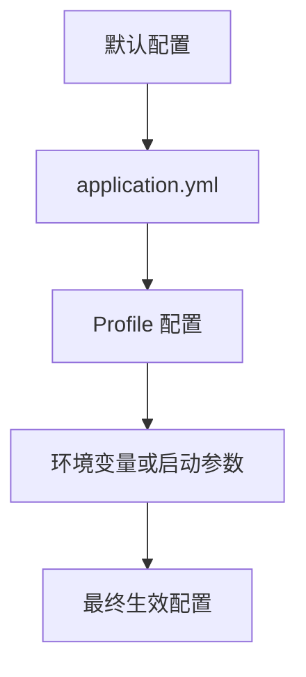

# Spring_Boot_常用配置

Spring Boot 常用配置包括端口、数据源、日志、Actuator、缓存、序列化、跨域和环境 Profile。

## 相关概念

- [[SpringBoot]]
- [[Spring Boot Actuator]]
- [[SpringBoot/SpringBoot 学习计划]]

## 配置分类

- 运行配置：端口、上下文路径、线程池、超时。
- 数据配置：数据源、连接池、事务、迁移脚本。
- Web 配置：跨域、序列化、上传大小、错误处理。
- 运维配置：日志级别、Actuator、健康检查、优雅停机。
- 环境配置：`dev`、`test`、`prod` 的 Profile 和外部化变量。

## 配置加载流程

## 实践检查清单

- 生产环境敏感信息是否来自环境变量或配置中心，而不是提交到仓库。
- 本地、测试、生产 Profile 是否只覆盖差异项。
- 超时、连接池、线程池是否有明确数值，避免依赖隐式默认。
- Actuator 是否限制暴露端点，健康检查是否区分存活和就绪。
- 日志级别是否能按包名临时调整，便于排查线上问题。

## 常见误区

- 在多个 Profile 中复制完整配置，后续修改容易漏改。
- 把配置当作常量写进代码，导致发布和环境绑定。
- 只配置功能开关，不记录为什么这样配以及何时复盘。
