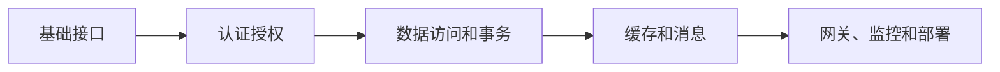

# learn-springboot

learn-springboot 是 SpringBoot 学习与示例项目集合，用于沉淀接口、认证、缓存、消息、网关、可观测性和分布式模式练习。

## 相关概念

- [[SpringBoot/SpringBoot 学习计划]]
- [[SpringBoot]]

## 学习流程

## 实践检查清单

- 每个示例是否有 README、接口说明和启动方式。
- 是否覆盖成功、失败和边界请求。
- 是否把示例和真实工程最佳实践区分开。
- 是否记录关键设计取舍，例如为什么用 Redis 或消息队列。
- 学完一个模块后是否沉淀为原子知识笔记。

## 案例

Header Token 登录模块适合学习拦截器和服务端 Token 存储，但生产环境需要补 Redis、过期时间、刷新策略和审计日志。

## 学习边界

示例项目的价值在于隔离概念，而不是模拟完整生产系统。学习时可以先让每个模块保持小而清楚：一个模块验证一种机制，例如拦截器、事务、缓存、消息或链路追踪。等理解机制后，再把多个模块组合成更接近真实项目的端到端示例。

每个示例都应补“生产差距”说明：缺少哪些安全、性能、监控、测试和部署要素。这样复习时不会把教学代码误当最佳实践。

建议每完成一个示例，就补一条对应知识库笔记，把“怎么跑通”升级为“为什么这样设计、何时不该这样用”。

## 常见误区

- 只把示例跑通，不总结适用场景和限制。
- 示例代码逐渐堆成大杂烩，没有模块边界。
- 忽略测试和异常路径，只演示 happy path。

## 复盘问题

- 这个示例对应的生产差距是什么。
- 学完后是否沉淀到 SpringBoot 知识点或项目实践中。
