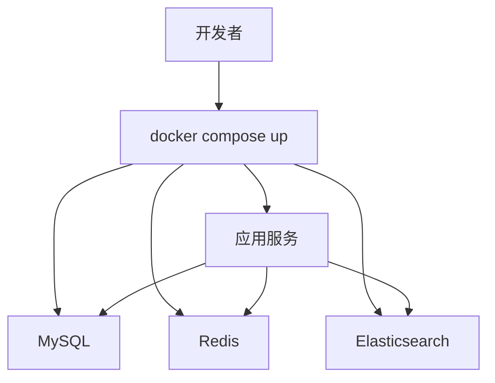

# Docker Compose 搭建本地开发环境

## 定义

Docker Compose 搭建本地开发环境是用一个 Compose 文件启动应用依赖的数据库、缓存、消息队列和搜索服务，让团队本地环境更一致。

## 要点

- 服务名可以作为容器间访问主机名。
- 数据卷保存数据库和缓存数据。
- `.env` 管理本地配置，但密钥不要提交仓库。
- 初始化脚本可以固化表结构和测试数据。

## 环境拓扑



Compose 适合把“应用依赖”固定下来，让新人拉代码后能快速启动一致的本地环境。

## 示例

```yaml
services:
  mysql:
    image: mysql:8
    environment:
      MYSQL_ROOT_PASSWORD: root
      MYSQL_DATABASE: app
    volumes:
      - mysql-data:/var/lib/mysql

  redis:
    image: redis:7

volumes:
  mysql-data:
```

## 检查清单

- 是否把数据库数据放在 volume 中。
- 是否提供 `.env.example`，避免真实密钥进入仓库。
- 初始化脚本是否可重复执行。
- 服务健康检查是否能判断依赖已准备好。
- 本地端口是否避免和常用服务冲突。

## 相关概念

- [[Docker]]
- [[docker-compose]]
- [[云原生部署总览：Docker、Kubernetes 与 CI-CD]]
