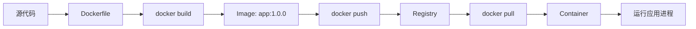

# Docker

## 定义

Docker 是容器化工具，用镜像打包应用及其运行依赖，用容器在隔离环境中运行应用。

它解决的核心问题是“我的机器可以运行，为什么线上不行”：把运行时、系统库、环境变量、启动命令和应用制品一起标准化，让开发、测试、CI 和生产环境尽量一致。

## 要点

- Image 是不可变交付物，Container 是镜像运行实例。
- Dockerfile 描述镜像构建步骤。
- Compose 可编排本地多服务开发环境。
- 生产部署要关注镜像体积、漏洞、日志、配置和健康检查。

## 核心对象

- **Dockerfile**：镜像构建说明书，定义基础镜像、依赖安装、复制文件、暴露端口和启动命令。
- **Image**：分层、只读、可推送的交付物，适合固定版本发布。
- **Container**：镜像运行后的进程隔离实例，有自己的文件系统、网络命名空间和资源限制。
- **Volume**：容器外的数据持久化位置，适合数据库数据、上传文件和开发缓存。
- **Network**：容器之间互相发现和访问的网络边界。
- **Registry**：镜像仓库，用于发布、拉取和回滚镜像版本。

## 镜像到容器的流程



这个流程的关键是把“构建”和“运行”分开：CI 负责构建不可变镜像，运行环境只拉取指定版本并启动容器。

## 本地开发案例

一个后端项目通常需要应用、数据库、缓存三类服务。用 [[Docker Compose 搭建本地开发环境]] 可以把它们固定成一条命令启动：

```yaml
services:
  app:
    build: .
    ports:
      - "8080:8080"
    environment:
      SPRING_DATASOURCE_URL: jdbc:mysql://mysql:3306/demo
    depends_on:
      - mysql
      - redis

  mysql:
    image: mysql:8
    environment:
      MYSQL_ROOT_PASSWORD: root
      MYSQL_DATABASE: demo

  redis:
    image: redis:7
```

这里的服务名 `mysql`、`redis` 也是容器网络里的主机名，应用不应该再写本机 `localhost` 访问它们。

## 生产检查清单

- 镜像使用明确版本标签，不用 `latest` 作为生产发布依据。
- 使用多阶段构建，避免把编译工具、源码和临时文件带进运行镜像。
- 容器内应用把日志输出到标准输出，由平台统一采集。
- 配置、密钥和镜像分离，敏感信息不要写入 Dockerfile。
- 增加健康检查，让 [[Kubernetes 基础对象：Pod、Deployment、Service]] 或发布平台能判断实例是否可接流量。
- 设置 CPU、内存限制，避免单个容器拖垮宿主机。
- 发布前扫描基础镜像漏洞，并定期升级基础镜像。

## 常见误区

- **把 Docker 当虚拟机**：容器通常只运行一个主进程，不适合在里面手工维护一整套系统。
- **在容器内保存关键数据**：容器删除后写入层会丢失，数据库和上传文件要使用 Volume 或外部存储。
- **构建时写死环境配置**：同一个镜像应该能在开发、测试、生产环境通过配置切换行为。
- **只会本地运行，不考虑发布链路**：Docker 的价值要和 [[CI-CD 流水线]]、镜像仓库、健康检查和回滚策略一起看。

## 相关概念

- [[云原生部署总览：Docker、Kubernetes 与 CI-CD]]
- [[docker-compose]]
- [[Docker Compose 搭建本地开发环境]]
- [[Docker常用命令]]
- [[CI-CD 流水线]]
