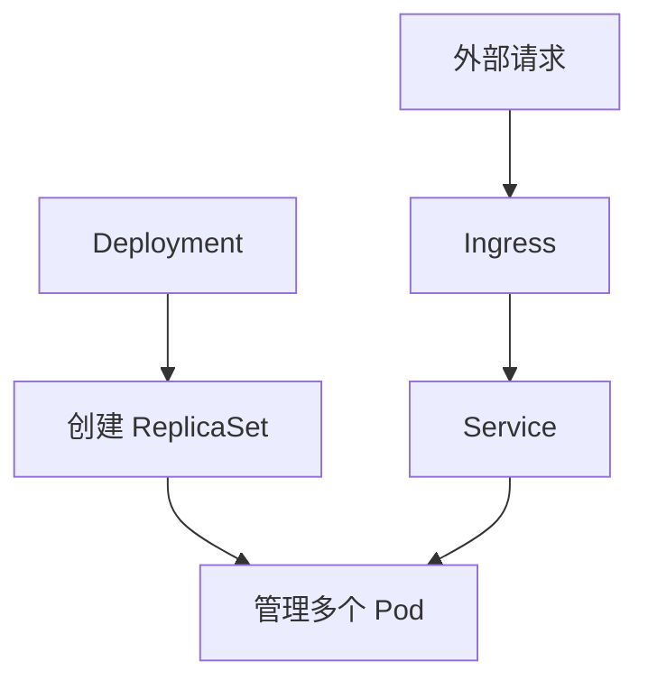

# Kubernetes 基础对象：Pod、Deployment、Service

## 定义

Pod、Deployment、Service 是 Kubernetes 部署应用的基础对象：Pod 承载容器，Deployment 管理副本和滚动更新，Service 提供稳定访问入口。

## 要点

- Pod 是最小调度单元。
- Deployment 声明期望副本数和更新策略。
- Service 通过标签选择后端 Pod。
- Ingress 通常负责 HTTP 外部入口。

## 访问流程

## 实践检查清单

- Pod 是否只承载紧密耦合的容器。
- Deployment 是否配置副本数、滚动更新和资源限制。
- Service selector 是否能正确匹配 Pod label。
- 探针是否能反映应用真实健康状态。
- Ingress、Service、Pod 三层访问路径是否能说清。

## 案例

一个 SpringBoot 服务通常用 Deployment 管理 2-3 个副本，用 Service 暴露集群内稳定地址，再通过 Ingress 暴露 HTTP 域名。Pod 重建后 IP 会变，但 Service 地址保持稳定。

## 常见误区

- 直接访问 Pod IP，把临时地址当作稳定入口。
- Service selector 和 Pod label 不匹配，导致无后端实例。
- 没有 readiness 探针，未就绪应用提前接收流量。
- Deployment 副本数和资源限制没有结合容量评估。

## 相关概念

- [[云原生部署总览：Docker、Kubernetes 与 CI-CD]]
- [[Kubernetes 部署 SpringBoot 应用]]
