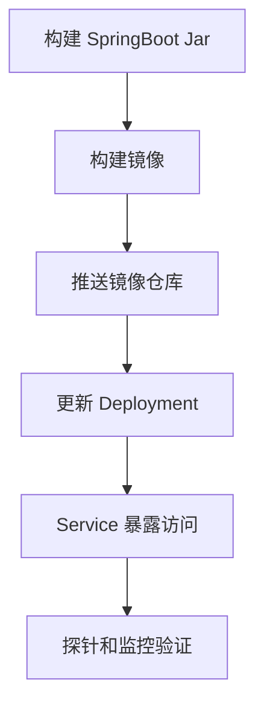

# Kubernetes 部署 SpringBoot 应用

## 定义

Kubernetes 部署 SpringBoot 应用是把 SpringBoot 服务打包为容器镜像，再通过 Deployment、Service、ConfigMap、Secret 和探针运行在集群中。

## 要点

- 镜像应包含明确版本标签。
- 健康检查可接入 Spring Boot Actuator。
- 配置和密钥应与镜像分离。
- 滚动发布前要有回滚策略和监控指标。

## 部署流程

## 实践检查清单

- 镜像 tag 是否可追踪到 Git commit 或版本。
- ConfigMap 和 Secret 是否与镜像分离。
- readiness/liveness 探针是否接入 Actuator。
- CPU、内存 request/limit 是否配置。
- 发布失败是否能回滚到上一版本。

## 案例

部署订单服务时，可将数据库地址放入 ConfigMap，密码放入 Secret，镜像只包含应用代码。滚动更新后先观察 readiness 探针和接口错误率，再扩大流量。

## 常见误区

- 把配置和密钥打进镜像，导致不同环境无法复用。
- 只配置 liveness，不配置 readiness，流量过早进入未就绪实例。
- 没有资源限制，异常实例影响同节点其他服务。
- 发布后不观察指标，无法及时发现滚动更新问题。

## 相关概念

- [[SpringBoot]]
- [[Spring Boot Actuator]]
- [[Kubernetes 基础对象：Pod、Deployment、Service]]
