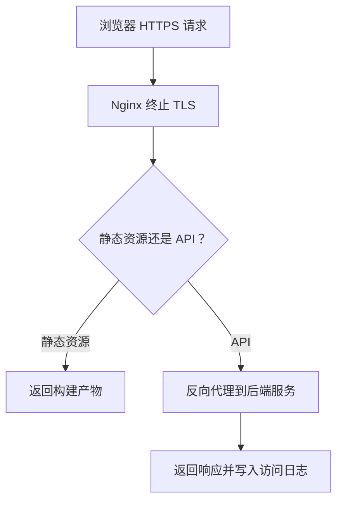

# Nginx 反向代理与 HTTPS 配置

## 定义

Nginx 反向代理与 HTTPS 配置用于把外部请求转发到内部前端静态资源或后端服务，并通过 TLS 保护传输安全。

## 要点

- 静态资源可由 Nginx 直接托管。
- API 请求通过 `proxy_pass` 转发到后端服务。
- HTTPS 需要证书、私钥、安全协议和自动续期。
- 前端路由需要配置 fallback 到入口 HTML。

## 请求流程

## 案例

单页应用部署时，`/assets/*` 可直接返回静态文件，`/api/*` 转发到后端服务，其他前端路由 fallback 到 `index.html`。证书可使用自动续期工具管理，同时保留 HTTP 到 HTTPS 的跳转。

## 检查清单

- 是否区分静态资源、API 和前端路由 fallback。
- HTTPS 证书是否自动续期并监控过期时间。
- 反向代理是否正确传递 Host、真实 IP 和协议头。
- 是否配置压缩、缓存和上传大小限制。
- 访问日志和错误日志是否便于排查。

## 常见误区

- history 路由没有 fallback 到 `index.html`，刷新页面 404。
- 反向代理缺少真实 IP 和协议头，后端日志和回调地址错误。
- 证书续期没有监控，直到过期才被用户发现。
- 静态资源缓存过长但文件名未带 hash，发布后用户仍拿到旧文件。

## 相关概念

- [[前后端项目部署方案详解]]
- [[Nginx 多前端项目部署]]
- [[云原生部署总览：Docker、Kubernetes 与 CI-CD]]
