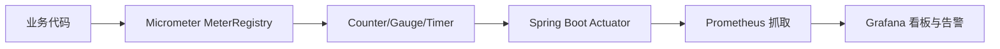

# Micrometer

## 定义

Micrometer 是 JVM 应用的指标门面，提供统一 API 记录 Counter、Gauge、Timer 等指标，并适配 Prometheus、Datadog、Graphite 等后端。

## 要点

- Counter 表示只增不减的事件计数。
- Gauge 表示当前状态值。
- Timer 表示耗时分布和调用次数。
- 标签维度要控制基数，避免指标系统膨胀。

## 指标流向



Micrometer 本身不负责存储指标，它提供统一记录接口，再把数据适配给具体监控系统。

## 指标类型选择

| 类型 | 含义 | 示例 |
|---|---|---|
| Counter | 单调递增事件次数 | 下单次数、登录失败次数 |
| Gauge | 当前瞬时值 | 队列长度、在线用户数 |
| Timer | 耗时分布和次数 | HTTP 请求耗时、外部接口耗时 |
| DistributionSummary | 数值分布 | 响应体大小、订单金额分布 |

## 示例

```java
class OrderMetrics {
    private final Counter orderCreatedCounter;
    private final Timer paymentTimer;

    OrderMetrics(MeterRegistry registry) {
        this.orderCreatedCounter = Counter.builder("order.created.total")
                .description("订单创建总数")
                .register(registry);
        this.paymentTimer = Timer.builder("payment.request.duration")
                .description("支付请求耗时")
                .register(registry);
    }
}
```

业务指标命名要稳定，标签要克制。`userId`、`orderId` 这类高基数字段不适合作为标签，否则会让监控系统膨胀。

## 检查清单

- 指标是否能回答业务和稳定性问题，而不是只记录技术细节。
- 标签维度是否低基数，例如 `status`、`method`、`region`。
- 是否避免把用户 ID、订单 ID、Trace ID 放进指标标签。
- 指标是否通过 [[Spring Boot Actuator]] 暴露，并被 [[Prometheus]] 抓取。
- 告警是否结合错误率、延迟、吞吐和业务量变化。

## 相关概念

- [[SpringBoot/23-SpringBoot-可观测性与业务指标]]
- [[Spring Boot Actuator]]
- [[Prometheus]]
- [[可观测性总览：日志、指标与链路追踪]]
