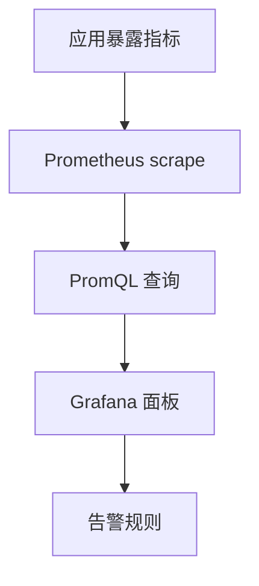

# Prometheus 与 Grafana 入门

## 定义

Prometheus 负责采集和查询指标，Grafana 负责可视化仪表盘和告警展示，二者常组成服务监控基础栈。

## 要点

- Prometheus 通过 scrape 拉取指标。
- Grafana 使用数据源查询指标并展示面板。
- 面板应围绕延迟、错误率、吞吐、饱和度和业务指标设计。

## 接入流程

## 实践检查清单

- 应用是否暴露 Prometheus 格式指标。
- scrape interval 是否符合业务观察粒度。
- 面板是否覆盖 RED 或 USE 指标。
- 告警是否区分症状和原因。
- 是否保留业务指标，例如订单量、失败率、队列积压。

## 案例

后端服务面板至少应展示请求量、错误率、P95 延迟、CPU、内存和数据库连接池。若只看机器资源，接口变慢但资源正常时就难以及时定位。

## 常见误区

- 面板堆满指标，但没有围绕用户影响组织。
- 告警过多且不分级，最终被团队忽略。
- 只监控基础设施，不监控业务成功率和队列积压。
- 指标命名和标签不规范，导致 PromQL 难维护。

## 复盘提示

一次故障后应检查面板是否能提前暴露问题、告警是否准确触发、指标是否能支撑定位。可观测性不是画图，而是缩短发现、定位和恢复时间。

## 设计边界

Grafana 面板应服务排障路径。首页展示症状指标，二级面板再展开依赖、资源和业务细节，避免所有信息混在一屏。

## 掘金文章补充

掘金文章《使用 Prometheus & Grafana 监控你的 Spring Boot 应用》给出了一条最小接入链路：Spring Boot 引入 Actuator 和 `micrometer-registry-prometheus`，应用暴露 `/actuator/prometheus`，Prometheus 配置 `scrape_configs` 定时抓取，Grafana 添加 Prometheus 数据源后创建 Dashboard。

落地时要特别关注标签：`application`、`instance`、`env` 这类标签要稳定，否则面板和告警很难复用。Dashboard 可以先复用社区模板，再逐步加入业务指标，例如订单成功率、支付回调耗时、队列积压和错误码分布。

来源：[使用 Prometheus & Grafana 监控你的 Spring Boot 应用](https://juejin.cn/post/6844904033493188621)

## 相关概念

- [[Prometheus]]
- [[Micrometer]]
- [[可观测性总览：日志、指标与链路追踪]]
