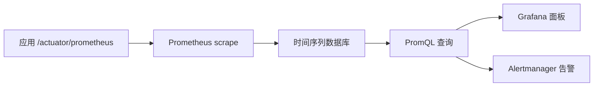

# Prometheus

## 定义

Prometheus 是以时间序列为核心的开源监控系统，通过拉取方式采集指标，并使用 PromQL 进行查询、聚合和告警。

## 要点

- 适合采集服务指标、业务指标和基础设施指标。
- 标签用于区分维度，但高基数标签会显著增加存储成本。
- 常与 Grafana 展示面板、Alertmanager 告警配合使用。

## 采集链路



Prometheus 默认采用拉取模型：它按配置定期访问目标端点，把指标样本按时间序列保存。

## 核心概念

- **Metric**：指标名称，例如 `http_server_requests_seconds_count`。
- **Label**：指标维度，例如 `method="GET"`、`status="200"`。
- **Sample**：某个时间点的指标值。
- **Scrape**：Prometheus 定时拉取目标指标。
- **PromQL**：查询和聚合时间序列的语言。
- **Alert Rule**：基于 PromQL 的告警规则。

## 示例 PromQL

```promql
sum(rate(http_server_requests_seconds_count{status=~"5.."}[5m]))
/
sum(rate(http_server_requests_seconds_count[5m]))
```

这个查询可用于计算 5 分钟 HTTP 5xx 错误率。实际告警还应结合请求量，避免低流量时误报。

## 检查清单

- 指标端点是否只暴露给监控网络或受控网关。
- 标签是否控制基数，避免使用用户 ID、订单 ID、Trace ID。
- 告警是否覆盖错误率、延迟、饱和度和业务异常。
- 面板是否区分服务、实例、接口和状态码。
- 是否为关键发布记录版本号，方便定位变更引发的指标波动。

## 相关概念

- [[Micrometer]]
- [[Spring Boot Actuator]]
- [[Prometheus 与 Grafana 入门]]
- [[可观测性总览：日志、指标与链路追踪]]
