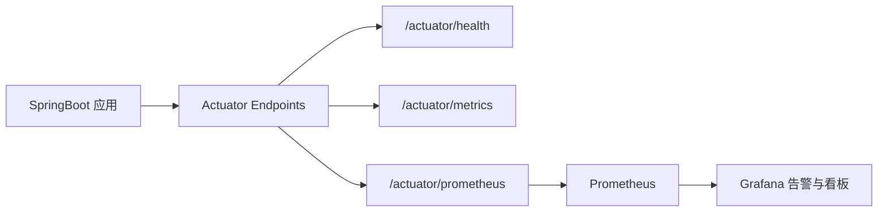

# Spring Boot Actuator

## 定义

Spring Boot Actuator 是 SpringBoot 的生产级运维端点模块，提供健康检查、指标、环境信息、线程、日志级别和 Prometheus 暴露等能力。

## 要点

- 常用端点包括 `health`、`info`、`metrics`、`prometheus`。
- 生产环境必须控制端点暴露范围和访问权限。
- 健康检查可用于 Kubernetes 探针和负载均衡摘除。

## 观测链路



Actuator 是应用暴露运行状态的入口，[[Micrometer]] 负责指标抽象，[[Prometheus]] 负责抓取和存储指标。三者组合后才能形成生产可观测闭环。

## 常用端点

- `health`：应用健康状态，适合负载均衡和 Kubernetes 探针。
- `info`：版本、构建信息、Git 提交等发布元数据。
- `metrics`：JVM、HTTP、线程池、连接池等指标。
- `prometheus`：以 Prometheus 格式暴露指标。
- `loggers`：查看或调整日志级别，生产环境要严格限制权限。

## 配置示例

```yaml
management:
  endpoints:
    web:
      exposure:
        include: health,info,metrics,prometheus
  endpoint:
    health:
      probes:
        enabled: true
      show-details: never
```

生产环境不要直接暴露所有端点，尤其是 `env`、`beans`、`heapdump` 等可能泄露内部信息或造成性能压力的端点。

## 检查清单

- 端点是否只在内网、管理网关或受保护路径暴露。
- 健康检查是否区分存活探针和就绪探针。
- 指标是否包含 HTTP 延迟、错误率、JVM、数据库连接池和业务指标。
- 发布信息是否包含版本号和 Git 提交，方便回溯。
- 告警是否基于趋势和 SLO，而不是只看服务是否存活。

## 相关概念

- [[SpringBoot]]
- [[Micrometer]]
- [[Prometheus]]
- [[SpringBoot Actuator 监控实践]]
