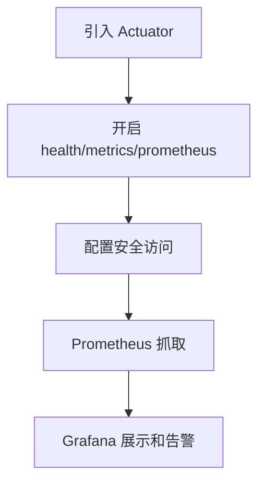

# SpringBoot Actuator 监控实践

## 定义

SpringBoot Actuator 监控实践是通过 Actuator 端点暴露健康状态、指标和 Prometheus 数据，并把它接入监控告警系统。

## 要点

- 暴露 `health` 给负载均衡和 Kubernetes 探针。
- 暴露 `prometheus` 给 Prometheus 抓取。
- 生产环境需要保护敏感端点。
- 自定义业务指标通过 [[Micrometer]] 注册。

## 接入流程

## 实践检查清单

- 生产环境是否只暴露必要端点。
- health 是否区分存活和就绪。
- prometheus 端点是否能被 Prometheus 抓取。
- 是否补充业务指标，而不只看 JVM 指标。
- 告警是否围绕错误率、延迟和资源饱和度设计。

## 案例

订单服务可以通过 Micrometer 记录下单成功数、失败数和支付回调耗时，再在 Grafana 中按业务维度观察。这样比只看 CPU 和内存更接近真实用户影响。

## 安全边界

Actuator 端点可能暴露环境、配置、线程、健康细节等敏感信息。生产环境应最小化暴露端点，并通过内网、认证或网关策略限制访问。

## 掘金文章补充

掘金文章《使用 Prometheus & Grafana 监控你的 Spring Boot 应用》中的关键配置是只暴露 Prometheus 端点，例如 `management.endpoints.web.exposure.include=prometheus`，再通过 Micrometer 把 JVM、HTTP、线程、进程等指标输出成 Prometheus 格式。Prometheus 侧需要配置抓取路径、抓取间隔、超时时间和目标地址。

这个流程适合本地或测试环境快速验证，但生产环境不能直接照搬：端点访问要走内网或鉴权，抓取间隔要结合指标量和存储成本，Grafana 面板要从“能看到指标”升级为“能解释用户影响”。

来源：[使用 Prometheus & Grafana 监控你的 Spring Boot 应用](https://juejin.cn/post/6844904033493188621)

## 相关概念

- [[Spring Boot Actuator]]
- [[Prometheus 与 Grafana 入门]]
- [[SpringBoot/23-SpringBoot-可观测性与业务指标]]
