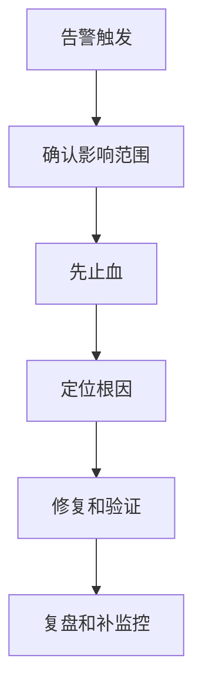

# 告警规则与故障排查流程

## 定义

告警规则与故障排查流程是把异常指标转化为可行动信号，并指导定位、止血、修复和复盘的运维机制。

## 要点

- 告警应关注用户影响，如错误率、延迟、可用性和核心业务指标。
- 规则要避免噪音，设置持续时间和分级。
- 排查先止血，再定位根因。
- 复盘要沉淀监控、自动化和流程改进。

## 相关概念

- [[可观测性总览：日志、指标与链路追踪]]
- [[降级]]
- [[熔断器]]

## 排查流程

## 实践检查清单

- 告警是否按业务影响分级，而不是所有异常同级。
- 是否设置持续时间、抑制和聚合，减少噪音。
- 告警消息是否包含服务、指标、阈值、时间和排查入口。
- 是否有明确值班人、升级路径和止血手段。
- 复盘是否补充缺失的指标、日志或自动化动作。

## 案例

接口错误率超过 5% 持续 5 分钟触发 P1 告警。值班人先通过降级关闭非核心推荐接口，再用链路追踪定位到下游超时，最后补充下游延迟告警。

## 常见误区

- 只告警机器 CPU，不关注用户请求错误和业务失败。
- 告警过多，团队逐渐忽略所有通知。
- 复盘只写事故经过，不沉淀监控和流程改进。
