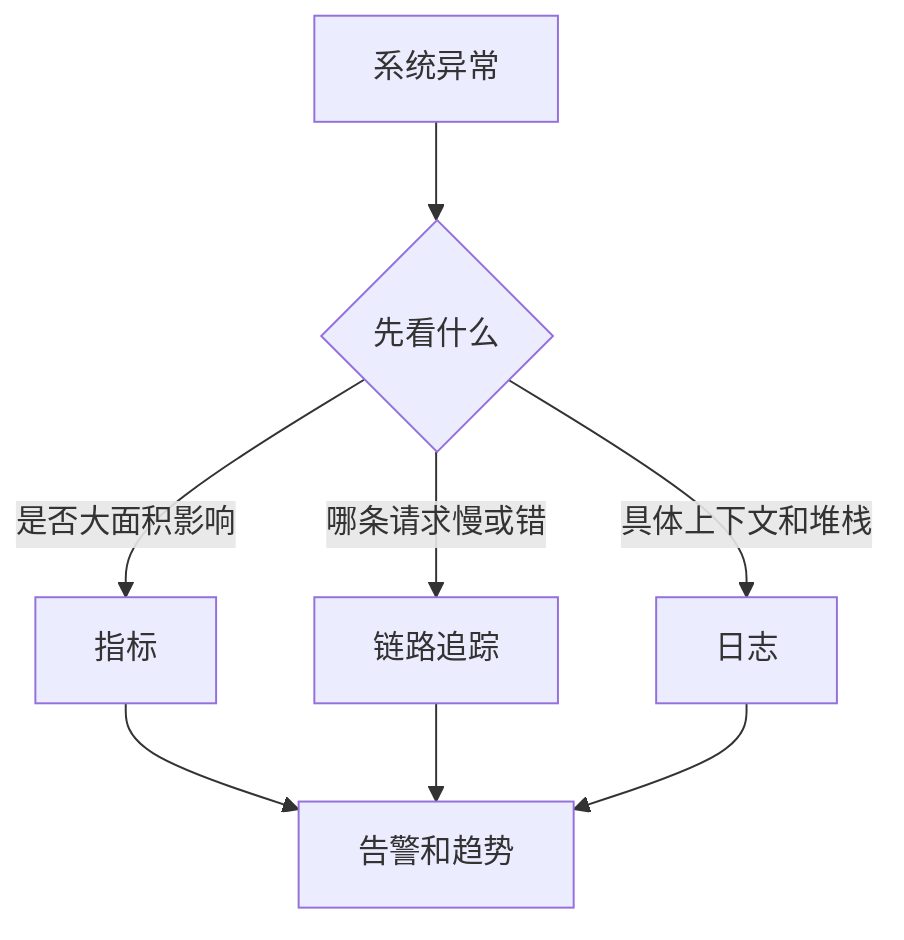

# 日志、指标、链路追踪三件套

## 定义

日志、指标、链路追踪是可观测性的三类基础信号：日志描述离散事件，指标描述聚合状态，链路追踪描述请求路径。

## 要点

- 日志适合查上下文和异常细节。
- 指标适合看趋势、告警和容量。
- 链路追踪适合定位跨服务慢调用和错误传播。
- 三者需要通过 TraceId、业务 ID 等字段关联。

## 相关概念

- [[可观测性总览：日志、指标与链路追踪]]
- [[OpenTelemetry 链路追踪]]
- [[Prometheus]]

## 分工方式

## 实践检查清单

- 指标是否覆盖延迟、流量、错误率和资源饱和度。
- 日志是否包含请求 ID、用户 ID、业务 ID、TraceId 和错误码。
- 链路追踪是否覆盖跨服务、数据库、缓存和消息队列调用。
- 告警是否基于用户影响，而不是单纯主机 CPU 瞬时波动。
- 故障复盘是否补充缺失的日志字段、指标和 Span。

## 案例

接口错误率升高时，先用指标判断影响范围；再用链路追踪定位到支付服务返回异常；最后查对应 TraceId 的日志，确认是第三方网关超时并触发了重试风暴。

## 常见误区

- 只有日志，没有指标和链路，导致故障发现依赖用户反馈。
- 指标过多但没有告警语义，没人知道应该响应什么。
- 三套系统字段不统一，排查时无法串联同一次请求。
