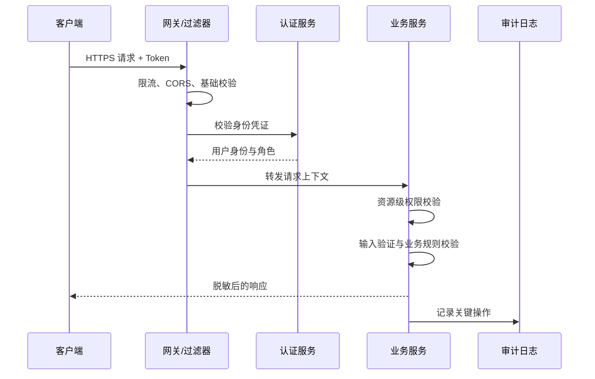

# API 安全基础

## 定义

API 安全基础是保护接口免受未授权访问、数据泄露、参数攻击、滥用和供应链风险的最小工程集合。它覆盖身份认证、权限校验、输入验证、输出脱敏、传输加密、限流、审计和安全响应。

## 核心措施

- 所有敏感接口必须经过 [[认证授权总览：Session、JWT、OAuth2 与 OIDC]]。
- 权限校验以服务端结果为准，前端隐藏按钮只能改善体验，不能替代授权。
- 输入验证同时覆盖类型、范围、长度、格式和业务状态。
- 输出需要按角色脱敏，避免直接返回内部字段或调试信息。
- 对登录、验证码、支付、导出等高风险接口加入限流和审计。

## 请求安全链路



API 安全不是单个注解能完成的事。入口层负责挡住明显滥用，认证层确认“你是谁”，业务层必须继续确认“你能不能操作这个具体资源”。

## 常见风险

- 越权访问：用户能读取或修改不属于自己的资源。
- 重放请求：旧请求被重复提交造成资产或状态变化。
- 参数污染：客户端传入服务端不该信任的字段。
- 错误泄露：异常信息暴露栈、SQL、密钥或内部路径。

## 越权案例

错误做法：接口只检查用户已登录，然后直接读取路径参数里的订单 ID。

```http
GET /api/orders/10086
Authorization: Bearer user-a-token
```

如果订单 `10086` 属于用户 B，服务端仍然返回数据，就发生了水平越权。正确做法是查询订单后继续校验 `order.userId == currentUser.id`，或者在查询条件里直接带上当前用户身份：

```sql
select * from orders where id = ? and user_id = ?
```

管理员、商家、普通用户等角色还要区分垂直权限，不能只依赖“是否登录”。

## 安全检查清单

- 所有写接口是否都校验身份、权限和业务状态。
- 查询详情、下载文件、导出数据是否存在水平越权风险。
- 服务端是否忽略客户端不该提交的字段，例如价格、角色、用户 ID。
- 登录、验证码、支付、短信、导出接口是否有限流和审计。
- 错误响应是否避免泄露堆栈、SQL、内部路径和密钥名称。
- Token、Cookie、跨域、CSRF 策略是否与 [[前端安全总览：XSS、CSRF 与 CSP]] 一起设计。
- 涉及资金、库存、订单状态变更的接口是否结合 [[幂等性]] 防重复提交。

## 工程实践

- 在 [[Spring Security 入门]] 或网关层做统一认证，在业务服务做资源级授权。
- DTO 白名单接收参数，避免直接绑定数据库实体。
- 日志记录用户 ID、资源 ID、操作类型、结果和 Trace ID，但不要记录明文密码、Token 或完整身份证号。
- 对外响应使用统一错误结构，与 [[前后端接口契约]] 保持一致。
- 高风险操作加入二次确认、短期凭证或操作冷却时间。

## 相关概念

- [[RESTful API 设计]]
- [[SpringBoot/18-SpringBoot-接口幂等性|接口幂等性]]
- [[幂等性]]
- [[限流]]
- [[Spring Security 入门]]
- [[熔断器]]
- [[前端安全总览：XSS、CSRF 与 CSP]]
- [[灰度发布]]
