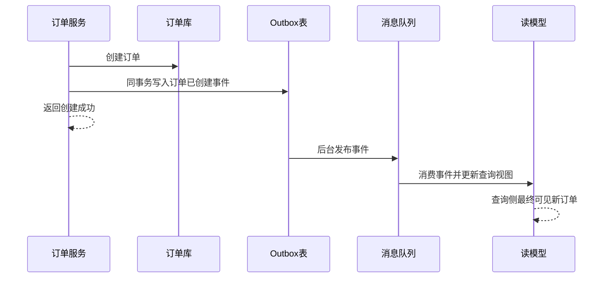
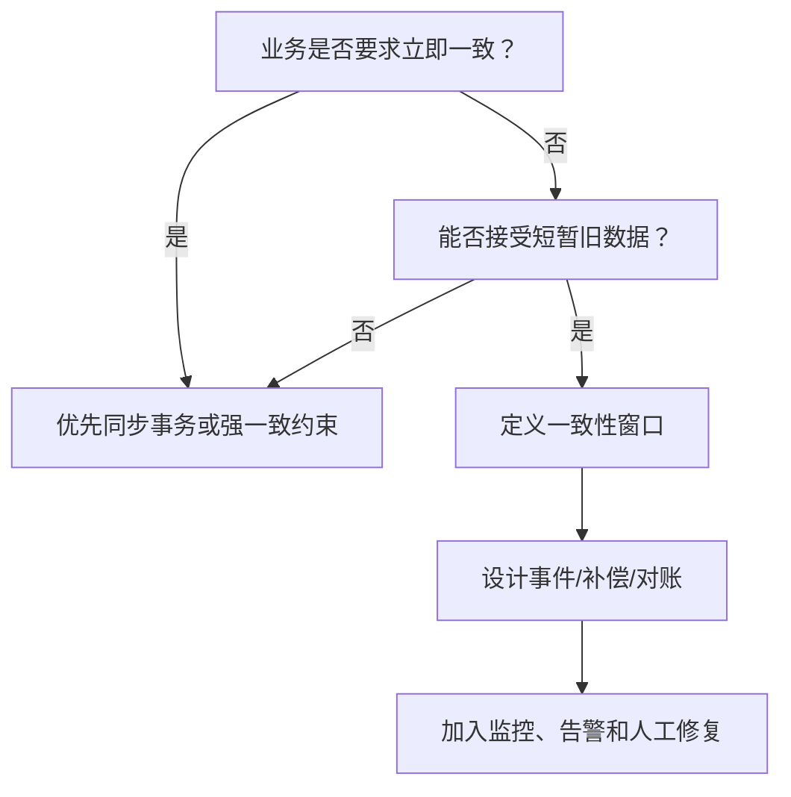

# 最终一致性

## 定义

最终一致性是一种分布式系统一致性模型：系统不要求所有节点、服务或读写模型在每个瞬间都完全一致，但在没有新的更新并经过一段时间后，会收敛到一致状态。

## 解决的问题

- 跨服务、跨数据库或跨消息系统无法低成本获得同步强一致。
- 系统更重视可用性、吞吐和解耦，而不是每次读取都立即看到最新状态。
- 业务允许短暂不一致，但要求最终可恢复、可观测、可修复。

## 要点

- 适合跨服务、跨数据库、异步消息和读写分离场景。
- 通常用事件、补偿、重试、投影等机制实现状态收敛。
- 查询侧可能短暂读到旧数据，业务需要能接受一致性窗口。
- 需要可观测性、重试、告警和人工修复机制兜底。
- 常见模式包括[[Saga]]、[[Transactional Outbox]]、[[CQRS]]。
- 最终一致性不是“不一致也没关系”，而是要定义收敛路径和失败兜底。

## 示例

订单创建成功后，outbox 事件稍后发布，读模型稍后投影更新。在投影完成前，查询侧可能暂时看不到最新状态，但最终会收敛。

这个过程里，写入成功和查询可见之间存在时间差。系统必须让用户界面、客服后台、运营报表理解这个时间差，而不是假设所有读模型立刻同步。

## 适用场景

- 订单、库存、支付等跨服务流程中的异步状态同步。
- 读模型、搜索索引、缓存、报表等可重建数据。
- 高可用优先、允许短暂延迟的业务链路。

## 设计要素

- **一致性窗口**：定义从写入成功到各个读侧可见的目标时间，例如 5 秒内同步到订单列表。
- **收敛机制**：通过事件、定时补偿、重试、对账或重建索引让数据最终到达正确状态。
- **失败可观测**：记录事件积压、消费失败、重试次数、死信数量和数据差异。
- **用户体验兜底**：在一致性窗口内展示“处理中”“刷新中”或从写库读取关键状态。
- **人工修复入口**：对账发现异常后，可以重放事件、补发消息或手动修正状态。

## 判断流程

最终一致性适合“可以迟一点正确”的数据，不适合“必须马上阻止错误发生”的核心约束。例如防止库存超卖通常需要在扣减点保证强约束，而搜索索引、订单列表、报表可以最终一致。

## 易错点

- 没有定义可接受的一致性窗口。
- 缺少失败重试、死信、告警和人工修复入口。
- 把最终一致性用于必须同步确认的强约束场景，例如不能超卖的核心扣减点。
- 只设计正常事件流，没有设计重复消息、乱序消息和消费失败。
- 用户界面没有表达“处理中”，导致用户误以为操作失败而重复提交。

## 相关概念

- [[Saga]]
- [[Transactional Outbox]]
- [[CQRS]]
- [[领域事件]]
- [[Event Sourcing]]
- [[幂等性]]
