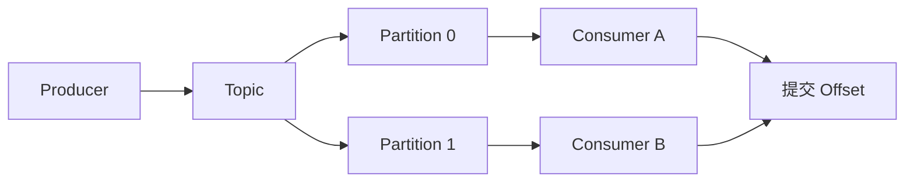

# Kafka 核心概念与 Consumer Group

## 定义

Kafka 是分布式事件流平台，核心概念包括 Topic、Partition、Producer、Consumer、Consumer Group 和 Offset。

## 要点

- Topic 被拆成多个 Partition 以提升吞吐。
- 同一 Consumer Group 内一个分区同一时刻只被一个消费者消费。
- Offset 表示消费进度。
- 同一 Key 的消息通常进入同一分区以保持局部顺序。

## 相关概念

- [[消息队列总览：RabbitMQ、Kafka 与可靠消息]]
- [[消息幂等与顺序消费]]

## 消费模型

## 实践检查清单

- Topic 分区数是否根据吞吐、并行度和顺序要求设计。
- Key 是否能保证同一业务实体进入同一分区。
- Offset 提交时机是否和业务处理成功绑定。
- 消费者是否支持幂等处理，能承受重复消息。
- Rebalance 是否会影响处理中的消息，是否有优雅关闭策略。

## 案例

订单事件按 `order_id` 作为 Key 发送，可以保证同一订单的创建、支付、取消事件在同一分区内保持顺序。但不同订单之间不保证全局顺序，业务设计不能依赖这一点。

## 常见误区

- 认为 Consumer Group 里的消费者越多吞吐越高，忽略消费者数量超过分区数后会空闲。
- 自动提交 Offset 后业务处理失败，导致消息丢失语义。
- 为追求全局顺序只用一个分区，牺牲了吞吐和扩展性。
